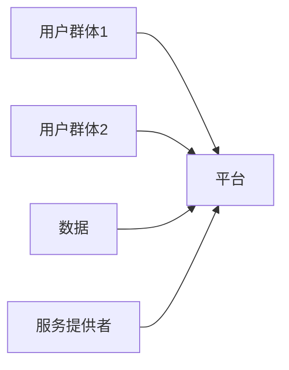
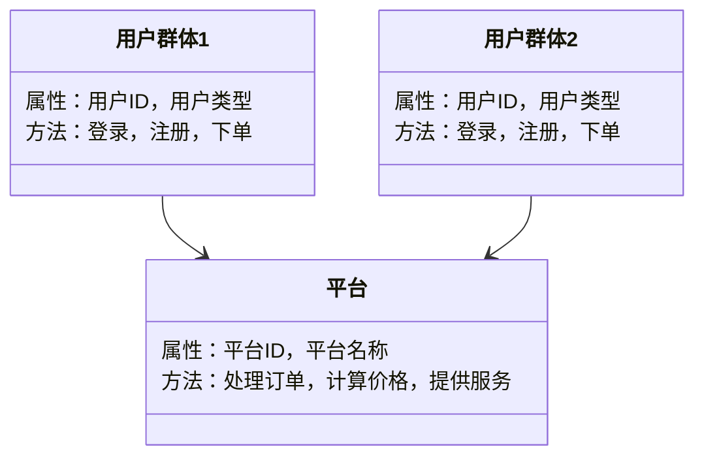
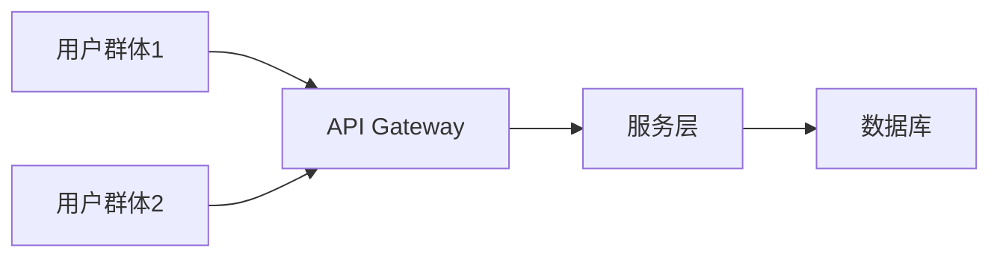
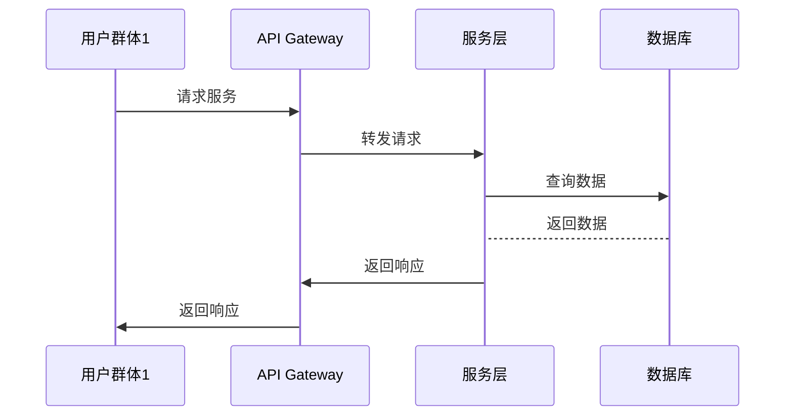

                 


# 如何识别企业的平台战略优势

> 关键词：平台战略，企业优势，网络效应，双边市场，平台经济，战略分析

> 摘要：本文旨在帮助读者理解如何识别企业的平台战略优势。通过分析平台战略的核心概念、算法原理、系统架构、项目实战和最佳实践，文章详细阐述了如何通过平台模式构建和优化企业竞争优势。

---

# 第一部分: 企业平台战略优势的背景与概念

## 第1章: 平台战略与企业竞争优势概述

### 1.1 平台战略的基本概念

#### 1.1.1 什么是平台战略
平台战略是一种通过构建双边或多边市场，连接不同用户群体，提供价值并从中获取收益的商业模式。与传统线性商业模式不同，平台战略依赖于网络效应和双边市场的特性，能够快速扩展并形成强大的市场影响力。

#### 1.1.2 平台战略的核心要素
平台战略的核心要素包括：
- **用户群体**：平台需要吸引并服务两个或多个不同的用户群体。
- **价值主张**：平台必须为每个用户群体提供独特的价值。
- **网络效应**：用户数量的增加会增强平台的整体价值。
- **技术架构**：平台需要高效的技术架构来支持双边或多边市场的运作。

#### 1.1.3 平台战略与传统业务模式的区别
| 属性       | 平台战略                   | 传统业务模式               |
|------------|---------------------------|---------------------------|
| 价值来源   | 网络效应和双边市场         | 单一产品或服务的价值       |
| 用户群体   | 多边用户                   | 单一用户群体               |
| 扩展性     | 高度可扩展                 | 较低可扩展                 |

### 1.2 平台经济的特点与优势

#### 1.2.1 平台经济的定义与特征
平台经济是一种通过数字平台连接供需双方，降低交易成本，提高市场效率的经济模式。其特点包括：
- **双边市场**：平台连接两个或多个用户群体。
- **网络效应**：用户数量的增加会增强平台的价值。
- **数据驱动**：通过数据优化匹配和决策。

#### 1.2.2 平台经济的网络效应
网络效应是平台经济的核心驱动力。当用户数量增加时，平台的价值也会随之增加，从而吸引更多用户加入。

#### 1.2.3 平台经济的双边市场机制
双边市场机制是指平台同时为两个不同的用户群体提供价值，并通过交叉补贴或其他方式实现盈利。

### 1.3 平台战略对企业竞争优势的影响

#### 1.3.1 平台战略如何创造价值
平台战略通过构建双边市场、提供高效服务和利用网络效应，为企业创造更大的价值。

#### 1.3.2 平台战略与企业核心竞争力
平台战略能够增强企业的核心竞争力，通过数据和网络效应构建长期竞争优势。

#### 1.3.3 平台战略的长期与短期效益
- **短期效益**：快速用户增长和市场扩展。
- **长期效益**：网络效应带来的持续收益和市场主导地位。

### 1.4 本章小结
本章介绍了平台战略的基本概念、特点与优势，以及其对企业竞争优势的影响。理解这些内容是进一步分析平台战略的关键基础。

---

# 第二部分: 平台战略的核心概念与联系

## 第2章: 平台战略的核心要素分析

### 2.1 平台战略的核心要素

#### 2.1.1 用户群体
平台战略的核心是连接两个或多个用户群体，每个群体都有其独特的价值需求。

#### 2.1.2 价值主张
平台必须为每个用户群体提供独特的价值，才能吸引并留住用户。

#### 2.1.3 业务模式
平台的业务模式需要考虑如何通过双边市场实现盈利，例如通过佣金、订阅或广告等方式。

#### 2.1.4 技术架构
高效的技术架构是平台战略成功的关键，需要支持高并发、低延迟和数据驱动的决策。

### 2.2 平台战略的核心概念对比

#### 2.2.1 平台战略与企业战略的对比
| 属性       | 平台战略                   | 企业战略                   |
|------------|---------------------------|---------------------------|
| 聚焦点     | 双边市场和网络效应         | 企业整体发展和资源分配     |
| 目标       | 构建网络效应和双边市场     | 提升企业竞争力和市场份额   |

#### 2.2.2 平台战略与商业模式的对比
| 属性       | 平台战略                   | 传统商业模式               |
|------------|---------------------------|---------------------------|
| 价值来源   | 网络效应和双边市场         | 单一产品或服务的价值       |
| 用户群体   | 多边用户                   | 单一用户群体               |

#### 2.2.3 平台战略与技术创新的对比
| 属性       | 平台战略                   | 技术创新                   |
|------------|---------------------------|---------------------------|
| 核心驱动力 | 网络效应和用户增长         | 新技术的应用和推广         |
| 影响范围   | 平台用户和市场             | 企业内部和行业             |

### 2.3 平台战略的实体关系图



### 2.4 本章小结
本章详细分析了平台战略的核心要素，并通过对比和实体关系图，展示了平台战略的独特性和复杂性。

---

# 第三部分: 平台战略的算法原理与数学模型

## 第3章: 平台战略的算法原理

### 3.1 平台战略的双边市场定价算法

#### 3.1.1 双边市场的定价模型
双边市场的定价模型需要考虑两个用户群体的需求和价值，通常采用差异定价或动态定价策略。

#### 3.1.2 网络效应的数学表达
$$网络效应 = k \cdot n^{α}$$
其中，$k$ 是一个常数，$n$ 是用户数量，$α$ 是网络效应的指数。

#### 3.1.3 算法实现步骤
1. 收集用户需求和价值数据。
2. 确定用户群体的划分。
3. 应用定价模型计算价格。
4. 验证网络效应的指数。

### 3.2 平台战略的用户增长算法

#### 3.2.1 用户增长的AARRR模型
AARRR模型包括 Acquisition（获取）、Activation（激活）、Retention（留存）、Referral（推荐）和 Revenue（收入）五个阶段。

#### 3.2.2 用户分群算法
用户分群算法通过聚类分析将用户分为不同的群体，以便制定精准的营销策略。

#### 3.2.3 用户留存算法
用户留存算法通过分析用户行为数据，识别高留存用户的特征，并制定相应的策略。

### 3.3 平台战略的数学模型与公式

#### 3.3.1 网络效应的数学公式
$$网络效应 = k \cdot n^{α}$$

#### 3.3.2 双边市场的定价公式
$$P = a + b \cdot Q$$
其中，$P$ 是价格，$Q$ 是用户数量，$a$ 和 $b$ 是常数。

### 3.4 本章小结
本章通过算法原理和数学模型，详细阐述了平台战略在定价和用户增长方面的实现方法。

---

# 第四部分: 平台战略的系统分析与架构设计

## 第4章: 平台战略的系统分析与架构设计

### 4.1 系统功能设计

#### 4.1.1 领域模型


#### 4.1.2 功能模块
- 用户管理模块
- 订单处理模块
- 价格计算模块
- 数据分析模块

### 4.2 系统架构设计

#### 4.2.1 架构图


#### 4.2.2 接口设计
- API接口：用于用户认证、数据查询和订单处理。
- 数据接口：用于数据采集、分析和展示。

#### 4.2.3 交互设计


### 4.3 本章小结
本章通过系统分析与架构设计，展示了平台战略在实际应用中的具体实现方法。

---

# 第五部分: 平台战略的项目实战

## 第5章: 平台战略的项目实战

### 5.1 环境安装与配置

#### 5.1.1 技术选型
- 后端：Python/Django
- 前端：React
- 数据库：MySQL
- 云服务：AWS

#### 5.1.2 安装步骤
1. 安装Python和Django。
2. 安装React和相关依赖。
3. 配置数据库和云服务。

### 5.2 系统核心实现

#### 5.2.1 核心代码实现
```python
# Django模型
from django.db import models

class UserGroup1(models.Model):
    user_id = models.CharField(max_length=100)
    user_type = models.CharField(max_length=50)

class UserGroup2(models.Model):
    user_id = models.CharField(max_length=100)
    user_type = models.CharField(max_length=50)

# 价格计算逻辑
def calculate_price(user_count):
    a = 10
    b = 2
    return a + b * user_count
```

#### 5.2.2 代码应用解读
通过上述代码，我们可以看到平台战略在实际项目中的具体实现，包括用户管理和服务定价。

### 5.3 实际案例分析

#### 5.3.1 案例介绍
以某互联网企业为例，分析其平台战略的实施过程。

#### 5.3.2 案例分析
- 平台战略的核心要素：双边市场、网络效应。
- 实施步骤：用户群体划分、价值主张设计、技术架构搭建。

### 5.4 本章小结
本章通过项目实战，展示了平台战略在实际应用中的具体实施步骤和方法。

---

# 第六部分: 平台战略的最佳实践

## 第6章: 平台战略的最佳实践

### 6.1 小结

#### 6.1.1 平台战略的核心要点
- 构建双边市场
- 利用网络效应
- 数据驱动决策

### 6.2 注意事项

#### 6.2.1 平台战略的挑战
- 用户获取成本高
- 网络效应的不确定性
- 数据安全和隐私问题

#### 6.2.2 平台战略的风险
- 市场竞争风险
- 技术实现风险
- 用户流失风险

### 6.3 拓展阅读

#### 6.3.1 推荐书籍
- 《平台革命》
- 《网络效应》

#### 6.3.2 推荐文章
- 如何构建成功的平台
- 网络效应的数学模型

### 6.4 本章小结
本章总结了平台战略的最佳实践，并提供了相关的注意事项和拓展阅读建议。

---

# 作者

作者：AI天才研究院/AI Genius Institute & 禅与计算机程序设计艺术 /Zen And The Art of Computer Programming

---

通过以上目录，读者可以系统地学习如何识别和构建企业的平台战略优势，从理论到实践，逐步掌握相关知识。

