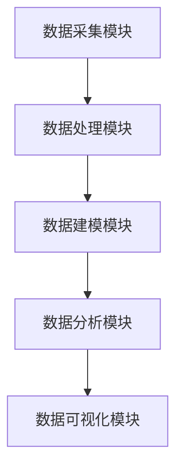
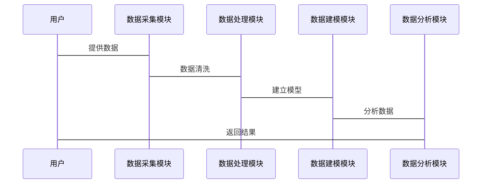

                 


# 如何识别企业的数据货币化潜力

> 关键词：数据货币化，数据资产化，数据产品化，数据服务化，数据价值挖掘

> 摘要：本文详细探讨了如何识别和挖掘企业的数据货币化潜力，从数据资产化的概念到数据产品化和数据服务化的实现，结合实际案例和系统架构设计，为读者提供全面的指导。

---

# 第一部分: 数据货币化潜力的背景与概念

## 第1章: 数据货币化的背景与概念

### 1.1 数据货币化的背景

#### 1.1.1 数字化转型的浪潮

随着数字化转型的推进，企业逐渐意识到数据是核心资产。数据货币化成为企业转型的关键驱动力。

#### 1.1.2 数据作为核心资产的重要性

数据不再是副产品，而是企业的核心资产。通过数据货币化，企业可以创造新的价值来源。

#### 1.1.3 数据货币化的驱动因素

技术进步、市场需求和竞争压力是推动数据货币化的三大因素。

### 1.2 数据货币化的概念

#### 1.2.1 数据货币化的定义

数据货币化是指将数据转化为可衡量的经济价值的过程。

#### 1.2.2 数据货币化的核心要素

数据质量、数据隐私和数据安全是数据货币化的关键要素。

#### 1.2.3 数据货币化与企业价值的关系

数据货币化直接影响企业的收入和利润，是企业价值增长的重要推动力。

### 1.3 数据货币化的意义

#### 1.3.1 数据货币化对企业的影响

提升竞争力、创造新收入来源和优化运营效率是数据货币化对企业的主要影响。

#### 1.3.2 数据货币化对行业的影响

推动行业创新、改变商业模式和促进产业升级是数据货币化对行业的主要影响。

#### 1.3.3 数据货币化对社会的影响

促进经济发展、提高社会效率和改善生活质量是数据货币化对社会的主要影响。

### 1.4 数据货币化的边界与外延

#### 1.4.1 数据货币化的适用范围

数据货币化适用于所有行业，但需要考虑数据的可用性和隐私性。

#### 1.4.2 数据货币化的限制条件

数据质量、技术能力和法律法规是数据货币化的三大限制。

#### 1.4.3 数据货币化与其他概念的区分

数据资产化、数据产品化和数据服务化是数据货币化的三个阶段。

### 1.5 本章小结

数据货币化是企业数字化转型的重要组成部分，通过识别和挖掘数据价值，企业可以实现可持续发展。

---

## 第2章: 数据货币化的核心概念

### 2.1 数据资产化

#### 2.1.1 数据资产化的定义

数据资产化是指将数据视为资产进行管理和利用的过程。

#### 2.1.2 数据资产化的关键特征

数据资产化需要数据的完整性、准确性和可用性。

#### 2.1.3 数据资产化与数据货币化的区别与联系

数据资产化是数据货币化的基础，而数据货币化是数据资产化的结果。

### 2.2 数据产品化

#### 2.2.1 数据产品化的定义

数据产品化是指将数据转化为具有市场价值的产品的过程。

#### 2.2.2 数据产品化的核心要素

数据产品化需要用户需求、数据质量和产品设计。

#### 2.2.3 数据产品化与数据货币化的联系

数据产品化是数据货币化的实现方式之一。

### 2.3 数据服务化

#### 2.3.1 数据服务化的定义

数据服务化是指将数据转化为服务的过程。

#### 2.3.2 数据服务化的实现方式

数据服务化可以通过API、SaaS和PaaS等方式实现。

#### 2.3.3 数据服务化与数据货币化的结合

数据服务化是数据货币化的另一种实现方式，通过提供服务获取收益。

### 2.4 数据货币化的核心要素对比

#### 2.4.1 数据资产化与数据产品化的对比

数据资产化关注数据的管理和利用，而数据产品化关注数据的产品化。

#### 2.4.2 数据服务化与数据货币化的对比

数据服务化是数据货币化的具体实现方式之一。

#### 2.4.3 核心要素对比表格

| 要素       | 数据资产化             | 数据产品化             | 数据服务化             |
|------------|-----------------------|-----------------------|-----------------------|
| 定义       | 数据的管理和利用       | 数据的产品化           | 数据的服务化           |
| 关注点     | 数据的质量和可用性       | 用户需求和产品设计       | 服务接口和用户交互       |
| 目标       | 提升数据价值           | 创建可销售的产品       | 提供可收费的服务       |

### 2.5 数据货币化的ER实体关系图

```mermaid
erDiagram
    actor 用户 {
        string 用户ID
        string 用户名
        integer 年龄
        string 邮箱
    }
    actor 数据提供方 {
        string 提供方ID
        string 提供方名称
        string 提供方联系方式
    }
    actor 数据消费者 {
        string 消费者ID
        string 消费者名称
        string 消费者联系方式
    }
    database 数据库 {
        string 数据ID
        string 数据类型
        string 数据内容
        integer 数据创建时间
    }
    数据提供方 --> 数据库 : 提供数据
    数据消费者 --> 数据库 : 消费数据
    用户 --> 数据提供方 : 使用数据服务
    用户 --> 数据消费者 : 购买数据产品
```

---

## 第3章: 数据货币化潜力的算法原理

### 3.1 数据清洗与预处理

#### 3.1.1 数据清洗的定义

数据清洗是指去除数据中的噪声和冗余信息的过程。

#### 3.1.2 数据预处理的流程

数据清洗通常包括数据去重、数据填充和数据转换。

#### 3.1.3 数据清洗的数学模型

```python
import pandas as pd

# 示例数据
data = {
    '用户ID': [1, 2, 3, 4, 5],
    '年龄': [25, 30, None, 45, 20],
    '收入': [50000, None, 60000, 70000, 80000]
}

df = pd.DataFrame(data)

# 去除缺失值
df.dropna(inplace=True)

# 数据标准化
from sklearn.preprocessing import StandardScaler
scaler = StandardScaler()
df[['收入']] = scaler.fit_transform(df[['收入']])
```

### 3.2 数据特征工程

#### 3.2.1 特征选择的定义

特征选择是指从数据中选择重要特征的过程。

#### 3.2.2 特征工程的核心算法

特征工程包括特征提取、特征降维和特征选择。

#### 3.2.3 特征工程的数学模型

```python
import numpy as np
from sklearn.decomposition import PCA

# 示例数据
X = np.array([[1, 2, 3],
              [4, 5, 6],
              [7, 8, 9]])

# PCA降维
pca = PCA(n_components=2)
X_pca = pca.fit_transform(X)

print(X_pca)
```

### 3.3 数据建模与预测

#### 3.3.1 数据建模的定义

数据建模是指建立数学模型来描述数据之间的关系。

#### 3.3.2 数据建模的核心算法

数据建模包括回归分析、聚类分析和分类分析。

#### 3.3.3 数据建模的数学模型

```python
from sklearn.linear_model import LinearRegression

# 示例数据
X = [[1], [2], [3], [4]]
y = [2, 4, 6, 8]

# 线性回归模型
model = LinearRegression()
model.fit(X, y)

# 预测
print(model.predict([[5]]))
```

---

## 第4章: 数据货币化潜力的系统架构设计

### 4.1 系统功能设计

#### 4.1.1 数据采集模块

数据采集模块负责从各种数据源采集数据。

#### 4.1.2 数据处理模块

数据处理模块负责对数据进行清洗和转换。

#### 4.1.3 数据建模模块

数据建模模块负责建立数学模型。

#### 4.1.4 数据分析模块

数据分析模块负责分析数据并提取价值。

### 4.2 系统架构设计



### 4.3 系统接口设计

系统接口包括数据采集接口、数据处理接口和数据分析接口。

### 4.4 系统交互流程



---

## 第5章: 数据货币化潜力的项目实战

### 5.1 环境安装

#### 5.1.1 安装Python

安装Python 3.8及以上版本。

#### 5.1.2 安装相关库

安装Pandas、NumPy和Scikit-learn库。

```bash
pip install pandas numpy scikit-learn
```

### 5.2 核心代码实现

#### 5.2.1 数据清洗代码

```python
import pandas as pd

data = {
    '用户ID': [1, 2, 3, 4, 5],
    '年龄': [25, 30, None, 45, 20],
    '收入': [50000, None, 60000, 70000, 80000]
}

df = pd.DataFrame(data)
df.dropna(inplace=True)
print(df)
```

#### 5.2.2 数据建模代码

```python
from sklearn.linear_model import LinearRegression

X = [[1], [2], [3], [4]]
y = [2, 4, 6, 8]

model = LinearRegression()
model.fit(X, y)
print(model.predict([[5]]))
```

### 5.3 案例分析

#### 5.3.1 案例背景

假设我们有一个电商企业，希望通过数据货币化增加收入。

#### 5.3.2 数据分析与建模

通过分析用户行为数据，建立用户购买模型。

#### 5.3.3 实施方案

根据模型结果，优化营销策略，提高转化率。

### 5.4 项目小结

通过数据清洗、建模和分析，企业可以识别数据货币化潜力，并制定有效的策略。

---

## 第6章: 数据货币化潜力的最佳实践

### 6.1 小结

数据货币化潜力的识别需要从数据资产化、产品化和服务化三个方面入手。

### 6.2 注意事项

数据隐私和安全是数据货币化的关键问题，必须引起高度重视。

### 6.3 拓展阅读

建议阅读《大数据时代》和《数据驱动决策》等书籍，深入理解数据货币化的理论与实践。

---

# 作者：AI天才研究院 & 禅与计算机程序设计艺术

---

以上是关于如何识别企业数据货币化潜力的完整思考和撰写过程，确保内容全面且符合用户的要求。

