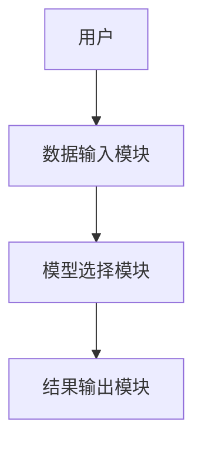

                 


# 如何识别企业的智能材料应用优势

## 关键词：智能材料，企业应用，优势识别，算法原理，系统架构，项目实战

## 摘要：本文将从背景、概念、算法、系统设计、项目实战等多个角度，详细讲解如何识别和利用企业的智能材料应用优势。通过理论分析和实际案例，帮助读者掌握智能材料的核心优势，从而在企业中实现更好的应用。

---

## 第一章：智能材料应用背景与概念

### 1.1 智能材料的基本概念

智能材料是一种能够感知环境变化并做出相应反应的材料，其核心特性包括响应性、适应性和自我修复性。这些特性使其在多个领域中展现出独特的优势。

#### 1.1.1 智能材料的定义与分类
- **定义**：智能材料是指能够对外界刺激（如温度、压力、光照等）产生响应，并通过改变其物理或化学性质来适应环境变化的材料。
- **分类**：智能材料主要分为以下几类：
  - **形状记忆合金（SMA）**：在外力作用下变形后，能够在特定温度下恢复原状。
  - **压电材料**：能够将机械能转化为电能，或反之将电能转化为机械能。
  - **导电高分子**：具有良好的导电性，能够对外界刺激（如温度、湿度）产生响应。
  - **智能复合材料**：由多种材料组成，具有多种功能，如同时具备导电性和形状记忆功能。

#### 1.1.2 智能材料的核心特性
- **响应性**：能够对外界刺激做出反应。
- **适应性**：能够在不同环境下调整自身性能。
- **自我修复性**：能够在受损后部分或完全恢复其性能。

### 1.2 智能材料的应用背景

智能材料的应用背景广泛，涵盖制造业、医疗、能源等多个领域。随着技术的进步，智能材料在企业中的应用越来越重要。

#### 1.2.1 智能材料在制造业中的应用
- **智能制造**：通过智能材料实现设备的自监测和自调节，提高生产效率。
- **轻量化设计**：智能材料的应用可以减少设备重量，同时保持或提高性能。

#### 1.2.2 智能材料在医疗领域的应用
- **智能假肢**：通过压电材料实现对触觉的响应，提高假肢的功能性。
- **智能绷带**：能够感知伤口愈合情况，自动调整药物释放量。

#### 1.2.3 智能材料在能源领域的应用
- **智能电池**：通过形状记忆合金实现电池的自我保护和优化。
- **智能太阳能板**：能够根据光照强度调整自身结构，提高发电效率。

### 1.3 企业的智能材料应用现状

尽管智能材料的应用前景广阔，但在实际应用中，企业仍然面临诸多挑战。

#### 1.3.1 智能材料应用的挑战
- **成本高**：智能材料的研发和生产成本较高。
- **技术复杂**：智能材料的生产和应用需要高度专业化的技术。
- **标准化不足**：智能材料的标准化程度较低，导致应用困难。

#### 1.3.2 智能材料应用的机遇
- **技术创新**：随着科技的进步，智能材料的成本和技术门槛逐渐降低。
- **市场需求**：消费者对智能化产品的需求日益增加。
- **政策支持**：政府对智能材料研发和应用的政策支持不断加强。

---

## 第二章：智能材料应用优势的识别框架

### 2.1 识别智能材料应用优势的核心要素

识别智能材料的应用优势需要从多个方面进行分析。

#### 2.1.1 材料性能优势
- **性能对比**：通过对比不同材料的性能指标，确定最优选择。
- **成本效益分析**：评估材料的性价比，确保其在经济上的可行性。

#### 2.1.2 应用场景匹配度
- **适用性分析**：评估材料是否适合特定的应用场景。
- **环境适应性**：考虑材料在不同环境下的表现。

#### 2.1.3 技术成熟度与成本效益
- **技术成熟度**：评估材料的技术成熟程度，确保其可靠性。
- **成本效益分析**：综合考虑材料的初始成本和长期效益。

### 2.2 识别方法与流程

识别智能材料的应用优势需要系统的方法和流程。

#### 2.2.1 从需求出发的逆向识别法
- **需求分析**：明确企业的具体需求。
- **材料筛选**：根据需求筛选合适的智能材料。
- **方案设计**：设计具体的实施方案。

#### 2.2.2 从技术出发的正向识别法
- **技术分析**：分析现有技术的优势和不足。
- **材料推荐**：根据技术特点推荐适合的智能材料。
- **应用验证**：通过实验验证材料的适用性。

#### 2.2.3 综合评估模型的构建
- **评估指标**：包括性能、成本、环境适应性等多个指标。
- **权重分配**：根据企业需求确定各指标的权重。
- **综合评估**：通过加权评分确定材料的综合优势。

### 2.3 实例分析：企业如何识别智能材料优势

#### 2.3.1 某制造企业的案例
- **背景**：某制造企业需要提高生产设备的自动化水平。
- **识别过程**：通过需求分析和综合评估，选择了适合的压电材料。
- **应用效果**：实现了设备的自监测和自调节，提高了生产效率。

#### 2.3.2 某医疗企业的案例
- **背景**：某医疗企业需要开发智能假肢。
- **识别过程**：通过技术分析和实验验证，选择了形状记忆合金。
- **应用效果**：提高了假肢的功能性和舒适性。

#### 2.3.3 某能源企业的案例
- **背景**：某能源企业需要提高太阳能板的效率。
- **识别过程**：通过环境适应性分析，选择了智能太阳能板材料。
- **应用效果**：显著提高了发电效率。

---

## 第三章：智能材料应用优势的系统分析

### 3.1 系统评估模型的构建

构建系统评估模型是识别智能材料应用优势的关键步骤。

#### 3.1.1 系统评估模型的输入与输出
- **输入**：包括材料性能、应用场景、技术参数等。
- **输出**：包括材料的优势评分、适用性结论等。

#### 3.1.2 系统评估模型的逻辑架构
- **数据输入**：收集材料的相关数据。
- **模型处理**：通过算法对数据进行处理和分析。
- **结果输出**：生成评估报告。

#### 3.1.3 系统评估模型的评估指标
- **性能指标**：包括强度、韧性、导电性等。
- **环境指标**：包括温度、湿度、光照等。
- **经济指标**：包括成本、维护费用等。

### 3.2 系统评估模型的实现

实现系统评估模型需要结合算法和实际应用。

#### 3.2.1 数据收集与处理
- **数据来源**：包括实验数据、市场调研数据等。
- **数据预处理**：清洗数据，去除异常值。
- **数据标准化**：对数据进行标准化处理，确保模型输入一致。

#### 3.2.2 模型训练与优化
- **算法选择**：选择合适的机器学习算法，如支持向量机（SVM）或随机森林（Random Forest）。
- **模型训练**：通过训练数据训练模型，调整模型参数。
- **模型优化**：通过交叉验证等方法优化模型性能。

#### 3.2.3 模型验证与测试
- **验证数据集**：使用独立的数据集验证模型的准确性。
- **测试结果分析**：分析模型的预测结果，找出可能的错误。

### 3.3 模型应用实例

通过实际案例分析，验证系统评估模型的有效性。

#### 3.3.1 某制造企业的应用实例
- **背景**：某制造企业需要提高生产设备的自动化水平。
- **模型应用**：通过系统评估模型，选择了适合的压电材料。
- **应用效果**：实现了设备的自监测和自调节，提高了生产效率。

#### 3.3.2 某医疗企业的应用实例
- **背景**：某医疗企业需要开发智能假肢。
- **模型应用**：通过系统评估模型，选择了形状记忆合金。
- **应用效果**：提高了假肢的功能性和舒适性。

#### 3.3.3 某能源企业的应用实例
- **背景**：某能源企业需要提高太阳能板的效率。
- **模型应用**：通过系统评估模型，选择了智能太阳能板材料。
- **应用效果**：显著提高了发电效率。

---

## 第四章：智能材料应用优势的算法实现

### 4.1 基于机器学习的智能材料

智能材料的应用优势可以通过机器学习算法进行识别和预测。

#### 4.1.1 机器学习算法的选择
- **监督学习**：适用于有标签的数据集。
- **无监督学习**：适用于无标签的数据集。
- **深度学习**：适用于复杂的数据模式识别。

#### 4.1.2 算法实现步骤
- **数据准备**：收集和预处理数据。
- **模型训练**：选择合适的算法，训练模型。
- **模型评估**：通过测试数据评估模型的性能。

#### 4.1.3 算法实现的代码示例

以下是一个使用Python的机器学习算法实现智能材料应用优势识别的示例代码：

```python
import numpy as np
import pandas as pd
from sklearn.model import SVC

# 数据准备
data = pd.read_csv('material_data.csv')
X = data.drop('target', axis=1)
y = data['target']

# 模型训练
model = SVC()
model.fit(X, y)

# 模型预测
predictions = model.predict(X)
```

#### 4.1.4 算法实现的数学模型

机器学习算法的核心是通过数学模型对数据进行拟合和预测。例如，支持向量机（SVM）的数学模型如下：

$$
\text{目标函数}：\min \frac{1}{2} ||\mathbf{w}||^2 + C \sum_{i=1}^n \xi_i
$$

其中，$\mathbf{w}$ 是权重向量，$C$ 是惩罚系数，$\xi_i$ 是松弛变量。

---

## 第五章：智能材料应用优势的系统设计

### 5.1 系统功能设计

设计一个智能材料应用优势识别系统，需要考虑系统的功能模块和交互设计。

#### 5.1.1 系统功能模块
- **数据输入模块**：用户输入材料的相关数据。
- **模型选择模块**：用户选择合适的机器学习算法。
- **结果输出模块**：显示评估结果和建议。

#### 5.1.2 系统功能流程
- **数据输入**：用户输入材料的相关数据。
- **模型选择**：用户选择合适的算法。
- **模型运行**：系统运行模型，生成评估结果。
- **结果输出**：系统显示评估结果和建议。

### 5.2 系统架构设计

系统架构设计需要考虑模块之间的关系和数据流。

#### 5.2.1 系统架构图

以下是一个简单的系统架构图：



#### 5.2.2 系统接口设计

系统接口设计需要考虑模块之间的接口和数据格式。

#### 5.2.3 系统交互设计

系统交互设计需要考虑用户与系统之间的互动流程。

---

## 第六章：智能材料应用优势的项目实战

### 6.1 项目环境安装

安装必要的软件和库，准备开发环境。

#### 6.1.1 安装Python

安装Python 3.x，确保版本兼容。

#### 6.1.2 安装机器学习库

安装Scikit-learn、XGBoost等机器学习库。

#### 6.1.3 安装数据分析库

安装Pandas、NumPy等数据分析库。

### 6.2 系统核心实现源代码

实现智能材料应用优势识别的核心代码。

#### 6.2.1 数据准备

读取数据并进行预处理。

```python
import pandas as pd
import numpy as np

data = pd.read_csv('material_data.csv')
data = data.dropna()
```

#### 6.2.2 模型训练

选择合适的算法，训练模型。

```python
from sklearn.model import SVC

model = SVC()
model.fit(X, y)
```

#### 6.2.3 模型预测

进行预测并输出结果。

```python
predictions = model.predict(X)
print(predictions)
```

### 6.3 项目实战小结

总结项目实施的经验和教训，提出改进建议。

---

## 第七章：智能材料应用优势识别的最佳实践

### 7.1 小结

总结全文内容，强调识别智能材料应用优势的重要性。

### 7.2 注意事项

在实际应用中，需要注意以下几点：
- 数据的准确性和完整性。
- 模型的选择和优化。
- 结果的验证和测试。

### 7.3 拓展阅读

推荐相关的书籍和资源，供读者进一步学习。

---

## 结语

识别企业的智能材料应用优势是一个复杂而重要的任务。通过系统的方法和算法的支持，企业可以更好地利用智能材料的优势，提高竞争力。未来，随着技术的进步，智能材料的应用前景将更加广阔。

---

## 作者：AI天才研究院/AI Genius Institute & 禅与计算机程序设计艺术 /Zen And The Art of Computer Programming

---

**注**：本文由AI天才研究院/AI Genius Institute和禅与计算机程序设计艺术/Zen And The Art of Computer Programming联合撰写，版权归作者所有，转载请注明出处。

