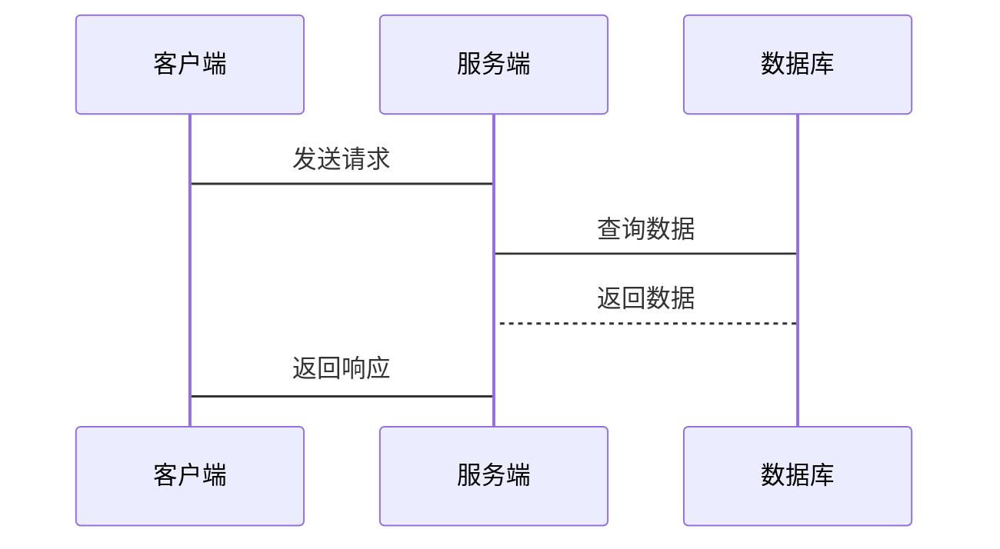

                 


# 如何识别企业的核心技术优势

> 关键词：核心技术优势，企业竞争力，技术评估，战略分析，竞争优势

> 摘要：企业核心技术优势是企业在市场竞争中保持领先地位的关键因素。本文从背景介绍、核心概念、分析方法、系统架构、项目实战等多方面详细阐述如何识别企业核心技术优势，结合实际案例分析，帮助读者系统地掌握这一关键能力。

---

# 第一部分：企业核心技术优势的背景与概念

# 第1章：企业核心技术优势的背景与重要性

## 1.1 核心技术优势的定义与内涵

### 1.1.1 核心技术的定义

核心技术是指企业在其产品或服务中所依赖的关键技术，这些技术具有较高的技术门槛和独特性，难以被竞争对手复制或替代。核心技术是企业竞争优势的核心来源。

### 1.1.2 核心技术优势的内涵

核心技术优势是指企业在核心技术的开发、应用和保护方面所拥有的独特优势，包括技术的先进性、独特性、可靠性和可持续性。这些优势使企业能够在市场竞争中占据主导地位。

### 1.1.3 核心技术优势与企业竞争力的关系

核心技术优势是企业竞争力的核心驱动力。拥有强大的核心技术优势，企业能够更好地满足客户需求，提供差异化的产品和服务，从而在市场中获得更高的市场份额和利润率。

## 1.2 核心技术优势的重要性

### 1.2.1 企业发展的核心驱动力

核心技术优势是企业发展的核心驱动力。它是企业创新和发展的源泉，能够推动企业在技术和市场上不断前进。

### 1.2.2 核心技术优势对企业战略的意义

核心技术优势是企业战略的重要组成部分。它不仅影响企业的短期目标，还决定了企业的长期发展方向和战略选择。

### 1.2.3 核心技术优势在行业竞争中的作用

在行业竞争中，核心技术优势是企业脱颖而出的关键。它能够帮助企业在价格战、产品功能和质量等方面占据优势，从而赢得客户和市场份额。

## 1.3 核心技术优势的识别边界

### 1.3.1 核心技术与非核心技术的区分

核心技术与非核心技术的主要区别在于技术的门槛和独特性。核心技术具有较高的技术门槛和独特性，而非核心技术则相对通用和易于替代。

### 1.3.2 核心技术优势的外延与限制

核心技术优势的外延包括技术的先进性、独特性、可靠性和可持续性。然而，核心技术优势也有其局限性，例如技术的更新换代和竞争对手的技术追赶。

### 1.3.3 核心技术优势与企业资源的关系

核心技术优势与企业资源密切相关。企业需要投入大量的人力、物力和财力资源来开发和维护核心技术优势。

## 1.4 核心技术优势的结构与要素

### 1.4.1 核心技术优势的构成要素

核心技术优势的构成要素包括技术的先进性、独特性、技术门槛、技术可持续性和技术保护能力。

### 1.4.2 核心技术与企业能力的关联

核心技术与企业能力密切相关。核心技术是企业能力的重要组成部分，能够提升企业的创新能力和市场竞争力。

### 1.4.3 核心技术优势的动态变化

核心技术优势是一个动态变化的过程。随着技术的发展和市场的变化，企业需要不断更新和提升其核心技术优势。

## 1.5 本章小结

本章从核心概念、重要性、识别边界和结构要素四个方面详细介绍了企业核心技术优势的背景与概念。理解这些内容对于后续分析和识别企业核心技术优势具有重要意义。

---

# 第2章：企业核心技术优势的识别方法论

## 2.1 核心技术优势识别的框架

### 2.1.1 识别框架的构建

识别企业核心技术优势的框架通常包括以下几个步骤：明确企业目标、分析市场需求、评估技术现状、识别技术差距、制定技术战略。

### 2.1.2 核心技术优势识别的关键步骤

（1）明确企业目标：了解企业的战略目标和市场定位，明确核心技术在企业中的作用。

（2）分析市场需求：研究市场趋势和客户需求，识别市场的技术需求和竞争态势。

（3）评估技术现状：评估企业当前的技术水平和竞争对手的技术状况，找出技术差距和优势。

（4）识别技术差距：分析企业在技术上的优势和劣势，识别核心技术的关键点。

（5）制定技术战略：根据技术评估结果，制定技术发展和创新的战略，巩固和提升核心技术优势。

### 2.1.3 核心技术优势识别的工具与方法

常用工具包括PEST分析、SWOT分析、技术生命周期分析和标杆分析等。这些工具可以帮助企业系统地评估技术优势和劣势。

## 2.2 核心技术优势识别的核心要素

### 2.2.1 技术领先性

技术领先性是指企业核心技术在技术性能、功能和创新方面优于竞争对手的能力。

### 2.2.2 技术独特性

技术独特性是指企业核心技术具有独特的特点和差异化的能力，难以被竞争对手复制。

### 2.2.3 技术可持续性

技术可持续性是指核心技术能够在较长的时间内保持优势，适应市场和技术的变化。

## 2.3 核心技术优势识别的维度分析

### 2.3.1 技术复杂度

技术复杂度是指核心技术的复杂性和技术门槛。技术复杂度越高，技术门槛越高，竞争对手越难复制。

### 2.3.2 技术门槛

技术门槛是指企业核心技术的专有性和独特性。高技术门槛意味着竞争对手难以快速复制或替代。

### 2.3.3 技术替代

技术替代是指核心技术被其他技术替代的可能性。技术替代性低的核心技术具有更强的市场竞争力。

---

# 第3章：企业核心技术优势的系统分析

## 3.1 问题场景介绍

假设我们正在分析一家制造企业，该企业希望识别其核心技术优势，以提升市场竞争力。

## 3.2 项目介绍

本项目旨在通过系统分析，识别该制造企业的核心技术优势，制定技术战略，巩固和提升核心技术竞争力。

## 3.3 系统功能设计

### 3.3.1 领域模型设计

以下是该制造企业的领域模型设计：

```mermaid
classDiagram
    class 技术优势识别系统 {
        - 技术评估指标
        - 技术差距分析
        - 技术战略制定
    }
    class 企业技术现状 {
        - 技术水平评估
        - 竞争对手分析
        - 市场需求分析
    }
    class 技术优势识别系统
        --> 企业技术现状
    class 技术战略 {
        - 核心技术优势
        - 技术创新计划
        - 技术保护措施
    }
    技术优势识别系统 --> 技术战略
```

### 3.3.2 系统架构设计

以下是该制造企业的系统架构设计：

```mermaid
architecturalDiagram
    title 制造企业核心技术优势识别系统架构
    Client --> Server: HTTP请求
    Server --> Database: 数据库查询
    Server --> Service: 业务逻辑处理
    Service --> Database: 数据库更新
    Client <-- Cache: 数据缓存
```

## 3.4 接口设计

### 3.4.1 系统接口设计

以下是系统接口设计的示例：

```plaintext
+-------------------+       +-------------------+
|                   |       |                   |
|    客户端          |       |     服务端         |
|                   |       |                   |
+-------------------+       +-------------------+
         ^                   ^
         |                   |
         |                   |
         v                   v

+-------------------+       +-------------------+
|                   |       |                   |
|     数据库         |       |     缓存           |
|                   |       |                   |
+-------------------+       +-------------------+
```

### 3.4.2 系统交互设计

以下是系统交互设计的示例：



---

# 第4章：项目实战

## 4.1 环境安装

### 4.1.1 开发环境

- 操作系统：Linux/Windows/MacOS
- 开发工具：IDE（如IntelliJ IDEA、Eclipse）
- 语言：Python/Java
- 开发库：numpy、pandas、matplotlib等

### 4.1.2 数据库安装

- 数据库选择：MySQL/PostgreSQL
- 数据库连接：JDBC/ODBC

## 4.2 核心系统实现

### 4.2.1 核心代码实现

以下是核心技术识别系统的Python实现示例：

```python
import numpy as np
import pandas as pd

# 数据预处理
data = pd.read_csv('technology.csv')
data_clean = data.dropna()

# 技术差距分析
def calculate_technology_gap(data):
    # 假设competitor_technology是竞争对手的技术指标
    technology_gap = data['technology_level'] - competitor_technology
    return technology_gap.mean()

technology_gap = calculate_technology_gap(data_clean)
print(f"技术差距平均值为：{technology_gap}")
```

### 4.2.2 系统功能实现

以下是系统功能实现的详细步骤：

1. 数据清洗：处理缺失值、重复值和异常值。
2. 技术评估：评估企业当前技术水平和竞争对手的技术水平。
3. 技术差距分析：计算技术差距，识别技术优势和劣势。
4. 技术战略制定：根据技术差距分析结果，制定技术创新计划和保护措施。

## 4.3 实际案例分析

### 4.3.1 案例背景

假设我们正在分析一家制造企业的核心技术优势识别项目。该企业主要生产高端电子产品，面临来自国内外竞争对手的技术压力。

### 4.3.2 系统解读

通过系统分析，我们识别出该企业在核心技术上的优势在于其自主研发的芯片技术，但在制造工艺和供应链管理方面存在技术差距。

### 4.3.3 项目小结

本项目通过系统分析，帮助企业识别了核心技术优势和劣势，为后续的技术创新和战略制定提供了有力支持。

---

# 第5章：案例分析

## 5.1 案例背景

我们以一家成功的科技企业为例，分析其如何通过识别核心技术优势实现市场领先地位。

## 5.2 案例分析

### 5.2.1 核心技术优势识别

通过PEST分析和SWOT分析，我们识别出该企业的核心技术优势在于其创新的算法和独特的硬件设计。

### 5.2.2 经验总结

该企业的成功经验在于：（1）持续的技术创新；（2）强有力的技术保护措施；（3）高效的技术团队管理。

## 5.3 关键点总结

识别核心技术优势需要结合企业的实际情况，制定科学的技术战略，并持续优化和提升。

---

# 第6章：总结与建议

## 6.1 本章总结

本章从理论到实践，详细阐述了如何识别企业核心技术优势。通过系统分析和实际案例分析，我们得出识别核心技术优势是企业在市场竞争中保持领先地位的关键。

## 6.2 实际操作中的注意事项

- 确保技术评估的准确性和全面性
- 加强技术团队的建设
- 建立强有力的技术保护机制

## 6.3 未来发展趋势

随着技术的快速发展，企业需要不断优化其核心技术优势识别方法，采用先进的技术和工具，提升技术评估的效率和准确性。

---

# 作者：AI天才研究院 & 禅与计算机程序设计艺术

---

以上是《如何识别企业的核心技术优势》的完整目录和文章内容。

