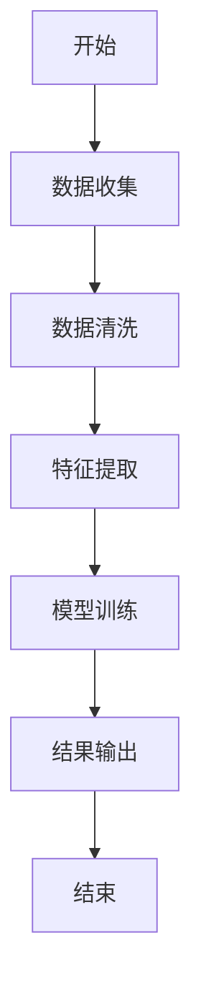
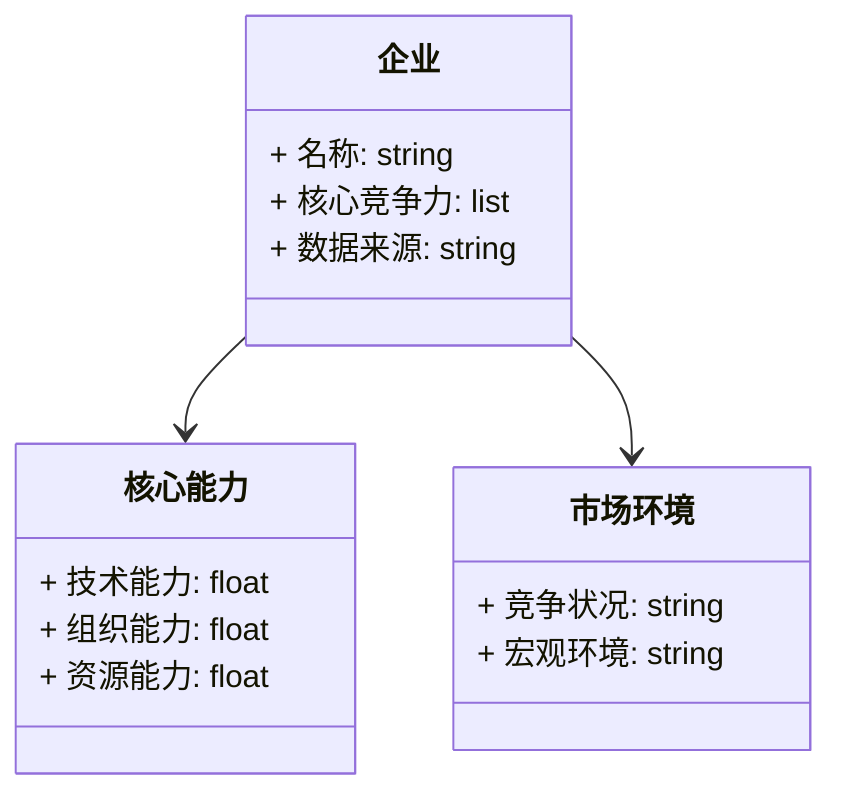
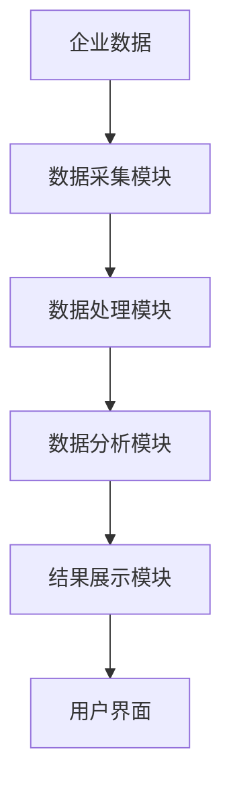

                 


# 如何识别企业的核心竞争力

> 关键词：核心竞争力、企业战略、数据分析、系统架构、算法原理

> 摘要：本文章深入探讨了企业核心竞争力的识别方法，结合理论与实践，从背景分析、核心概念、算法原理、系统架构到项目实战，全面解析了如何通过技术手段识别和提升企业核心竞争力。

---

# 第1章: 核心竞争力的背景与概念

## 1.1 核心竞争力的定义

### 1.1.1 核心竞争力的定义
核心竞争力是指企业在市场中能够长期保持竞争优势的关键能力或资源。它是企业区别于竞争对手的核心优势，通常包括独特的技术、流程、品牌、客户关系等。

### 1.1.2 核心竞争力的特征
- **独特性**：与竞争对手形成差异化。
- **可持续性**：能够在较长时间内保持竞争优势。
- **价值性**：能够为客户提供独特价值。
- **延展性**：能够支撑多个业务领域的扩展。

### 1.1.3 核心竞争力与企业绩效的关系
核心竞争力是企业绩效的核心驱动因素，强的核心竞争力能够提升企业的市场份额、利润率和客户忠诚度。

---

## 1.2 核心竞争力的背景

### 1.2.1 经济全球化与企业竞争的新趋势
在全球化背景下，企业之间的竞争日益激烈，核心竞争力成为企业生存和发展的关键。

### 1.2.2 数字化时代对企业核心竞争力的影响
数字化转型使得数据和技术成为新的核心竞争力，企业需要通过技术创新来保持竞争优势。

### 1.2.3 核心竞争力在企业战略中的地位
核心竞争力是企业战略的核心，决定了企业的长期发展方向和竞争优势。

---

## 1.3 核心竞争力的识别问题

### 1.3.1 问题背景
随着市场竞争的加剧，企业需要准确识别自身的核心竞争力，以应对竞争挑战。

### 1.3.2 问题描述
核心竞争力识别是一个复杂的过程，涉及企业内外部的多种因素，需要系统的方法和工具。

### 1.3.3 问题解决的必要性
准确识别核心竞争力有助于企业制定有效的战略，优化资源配置，提升竞争力。

### 1.3.4 核心竞争力的边界与外延
核心竞争力的边界包括企业的核心业务、核心技术、核心资源等，外延则涉及相关业务和资源。

---

## 1.4 核心竞争力的概念结构

### 1.4.1 核心竞争力的核心要素
- **技术能力**：企业的技术水平和创新能力。
- **组织能力**：企业的组织结构和管理能力。
- **资源能力**：企业的资源储备和配置能力。
- **品牌影响力**：企业的品牌形象和市场影响力。

### 1.4.2 核心竞争力的层次结构
核心竞争力可以分为企业层面、部门层面和产品层面，形成一个多层次的结构。

### 1.4.3 核心竞争力与其他概念的对比
- **核心竞争力 vs 核心能力**：核心竞争力更强调市场竞争中的优势，核心能力更强调企业内部的能力。
- **核心竞争力 vs 优势资源**：核心竞争力是优势资源的整合和应用。

---

## 1.5 本章小结
本章从核心竞争力的定义、背景、识别问题和概念结构四个方面进行了详细分析，为后续的核心竞争力识别方法奠定了理论基础。

---

# 第2章: 核心竞争力的核心概念与联系

## 2.1 核心竞争力的原理

### 2.1.1 核心竞争力的形成机制
核心竞争力的形成是一个动态过程，涉及企业内外部因素的相互作用。

### 2.1.2 核心竞争力的动态变化
随着市场环境的变化，核心竞争力需要不断调整和优化。

### 2.1.3 核心竞争力的可持续性
通过持续创新和优化，核心竞争力可以保持其可持续性。

---

## 2.2 核心竞争力的属性特征对比

### 2.2.1 核心竞争力与非核心竞争力的对比
| 属性       | 核心竞争力            | 非核心竞争力          |
|------------|-----------------------|-----------------------|
| 竞争优势   | 极强                  | 一般或无              |
| 可持续性   | 高                    | 低                    |
| 战略重要性 | 高                    | 低                    |

### 2.2.2 核心竞争力的定量与定性分析
定量分析包括财务指标、市场份额等，定性分析包括品牌影响力、技术优势等。

### 2.2.3 核心竞争力的可衡量性
核心竞争力可以通过多种指标进行衡量，例如市场份额、利润率、客户满意度等。

---

## 2.3 核心竞争力的ER实体关系图

### 2.3.1 实体关系图的构建
```mermaid
erd
    企业
    核心能力
    市场环境
    竞争对手
    核心竞争力
```

### 2.3.2 实体关系图的解释
核心竞争力与企业、核心能力、市场环境和竞争对手之间存在相互影响的关系。

### 2.3.3 实体关系图的应用
通过ER图，可以清晰地分析核心竞争力与企业内外部因素的关系，为后续分析提供可视化工具。

---

## 2.4 本章小结
本章通过核心竞争力的原理、属性特征对比和ER实体关系图的分析，进一步明确了核心竞争力的核心概念和其与其他概念的关系。

---

# 第3章: 核心竞争力识别的算法原理

## 3.1 算法原理概述

### 3.1.1 核心竞争力识别的算法分类
- **基于数据分析的算法**：如回归分析、聚类分析等。
- **基于专家评估的算法**：如层次分析法（AHP）。

### 3.1.2 基于数据分析的核心竞争力识别方法
通过数据分析技术，提取企业的关键指标，识别核心竞争力。

### 3.1.3 基于专家评估的核心竞争力识别方法
通过专家评分和权重分配，评估企业的核心竞争力。

---

## 3.2 核心竞争力识别的数学模型

### 3.2.1 核心竞争力评分模型
$$C = \sum_{i=1}^{n} w_i \cdot c_i$$
其中，$C$ 表示核心竞争力总评分，$w_i$ 表示第$i$个要素的权重，$c_i$ 表示第$i$个要素的评分。

### 3.2.2 核心竞争力权重分配模型
$$w_i = \frac{\sum_{j=1}^{m} a_{ij}}{\sum_{j=1}^{m} a_{jj}}}$$
其中，$a_{ij}$ 表示第$i$个要素在第$j$个专家中的评分，$m$ 表示专家数量。

### 3.2.3 核心竞争力综合评估公式
$$C = \sum_{i=1}^{n} w_i \cdot c_i$$

---

## 3.3 核心竞争力识别算法流程图



### 3.3.1 数据收集
收集企业的相关数据，包括财务数据、市场数据、客户数据等。

### 3.3.2 数据清洗
对收集到的数据进行清洗，去除噪声数据，确保数据的准确性和完整性。

### 3.3.3 特征提取
从数据中提取关键特征，例如市场份额、利润率、客户满意度等。

### 3.3.4 模型训练
使用机器学习算法对特征进行训练，识别核心竞争力。

### 3.3.5 结果输出
输出核心竞争力评估结果，为企业的战略决策提供依据。

---

## 3.4 本章小结
本章通过数学模型和算法流程图，详细讲解了核心竞争力识别的算法原理，为后续的系统分析和项目实战奠定了基础。

---

# 第4章: 核心竞争力识别的系统分析与架构设计

## 4.1 系统分析

### 4.1.1 问题场景介绍
在企业核心竞争力识别中，通常需要解决数据分散、分析复杂、结果难以可视化等问题。

### 4.1.2 系统功能需求
- 数据采集模块：采集企业的各项数据。
- 数据分析模块：对数据进行分析和处理。
- 结果展示模块：将分析结果以可视化的方式呈现。

---

## 4.2 系统架构设计

### 4.2.1 领域模型类图


### 4.2.2 系统架构图


### 4.2.3 系统接口设计
- 数据接口：与企业数据源对接。
- 用户接口：提供友好的用户界面，方便用户查看分析结果。

---

## 4.3 本章小结
本章通过系统分析和架构设计，明确了核心竞争力识别系统的实现方法，为后续的项目实战提供了技术支撑。

---

# 第5章: 核心竞争力识别的项目实战

## 5.1 环境安装

### 5.1.1 系统要求
- 操作系统：Windows/Mac/Linux
- Python版本：3.6以上
- 依赖库：numpy, pandas, matplotlib

### 5.1.2 安装步骤
```bash
pip install numpy pandas matplotlib
```

---

## 5.2 核心代码实现

### 5.2.1 数据采集模块
```python
import pandas as pd

def collect_data():
    # 数据采集逻辑
    data = pd.read_csv('enterprise_data.csv')
    return data
```

### 5.2.2 数据分析模块
```python
import numpy as np

def analyze_data(data):
    # 数据分析逻辑
    core_competitiveness = np.mean(data['core_competitiveness'])
    return core_competitiveness
```

### 5.2.3 结果展示模块
```python
import matplotlib.pyplot as plt

def display_results(core_competitiveness):
    plt.bar('Core Competitiveness', core_competitiveness)
    plt.show()
```

---

## 5.3 案例分析

### 5.3.1 案例背景
某高科技企业在市场竞争中面临核心竞争力下降的问题。

### 5.3.2 数据分析过程
通过数据分析模块，识别出企业的技术能力和创新能力为核心竞争力。

### 5.3.3 分析结果
企业的技术能力得分高于行业平均水平，但创新能力得分低于行业平均水平。

---

## 5.4 项目小结
本章通过项目实战，详细展示了核心竞争力识别的实现过程，帮助读者理解如何将理论应用于实际。

---

# 第6章: 核心竞争力识别的最佳实践与总结

## 6.1 最佳实践

### 6.1.1 数据质量的重要性
确保数据的准确性和完整性，是核心竞争力识别的关键。

### 6.1.2 专家评估的价值
结合专家评估和数据分析，可以提高识别结果的准确性。

### 6.1.3 持续优化的必要性
核心竞争力是一个动态过程，需要持续优化和调整。

---

## 6.2 小结

### 6.2.1 核心竞争力识别的核心要点
- 理解核心竞争力的定义和特征
- 运用数据分析和专家评估的方法
- 构建系统的识别框架

---

## 6.3 注意事项

### 6.3.1 数据隐私问题
在数据采集和分析过程中，需要注意数据隐私和合规性。

### 6.3.2 结果的可解释性
核心竞争力识别结果需要具有可解释性，以便企业能够采取有效的改进措施。

---

## 6.4 拓展阅读

### 6.4.1 核心竞争力相关书籍
- 《竞争优势》（Competitive Advantage）——迈克尔·波特
- 《企业战略管理》（Corporate Strategy Management）——理查德·格里芬

### 6.4.2 数据分析工具
- Python的pandas库
- Tableau的数据可视化工具

---

# 附录: 术语表与参考文献

## 附录A: 术语表
- 核心竞争力：企业在市场中保持竞争优势的关键能力或资源。
- ER图：实体关系图，用于描述数据结构。
- 算法：解决问题的一系列步骤和方法。

## 附录B: 参考文献
1. 迈克尔·波特. 《竞争优势》. 哈佛商学院出版社, 1985.
2. 理查德·格里芬. 《企业战略管理》. 布鲁克斯出版公司, 2000.

---

# 作者：AI天才研究院/AI Genius Institute & 禅与计算机程序设计艺术 /Zen And The Art of Computer Programming

---

**（完）**

