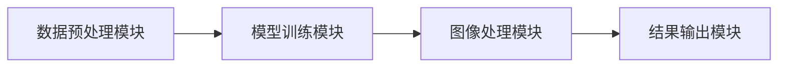

                 


# 如何识别企业的深度学习图像超分辨率优势

## 关键词：深度学习，图像超分辨率，计算机视觉，人工智能，图像处理

## 摘要：深度学习在图像超分辨率领域的应用为企业带来了显著优势。本文从核心概念、算法原理、系统架构到项目实战，详细解析如何识别和最大化这些优势。通过案例分析和最佳实践，为企业在图像处理和AI技术应用中提供有价值的指导。

---

## 第一部分: 深度学习图像超分辨率的背景与核心概念

## 第1章: 图像超分辨率的基本概念

### 1.1 图像超分辨率的定义与问题背景

#### 1.1.1 图像分辨率的基本概念
图像分辨率是衡量图像清晰度的重要指标，通常分为空间分辨率和光谱分辨率。空间分辨率决定了图像中最小可区分的物体大小，而光谱分辨率则涉及图像的颜色信息。高分辨率图像能够提供更丰富的细节信息，但在实际应用中，由于存储、传输等因素的限制，图像分辨率往往较低。

#### 1.1.2 图像分辨率低的原因与影响
低分辨率图像的产生原因包括：
1. **图像采集设备的限制**：如手机摄像头、扫描仪等设备的物理限制。
2. **压缩技术**：如JPEG、MP4等格式在压缩过程中会导致细节丢失。
3. **网络传输**：在图像传输过程中，为了减少带宽占用，通常会对图像进行压缩，导致分辨率降低。

低分辨率图像的影响主要体现在以下几个方面：
- **信息丢失**：低分辨率图像无法提供足够的细节信息，影响后续分析和处理。
- **显示效果差**：在高分辨率显示屏上，低分辨率图像会显得模糊，影响用户体验。
- **应用场景受限**：在医学图像处理、卫星图像分析等领域，低分辨率图像可能导致误诊或错误决策。

#### 1.1.3 图像超分辨率的目标与意义
图像超分辨率的目标是通过技术手段，将低分辨率图像恢复为高分辨率图像，同时保留或恢复原始图像的细节信息。其意义在于：
- **提升图像质量**：使低分辨率图像在视觉上更加清晰，提升用户体验。
- **扩展数据集**：通过生成高分辨率图像，扩展可用数据集，支持更多应用场景。
- **支持AI技术**：高分辨率图像能够为后续的图像识别、目标检测等任务提供更高质量的数据支持。

---

### 1.2 深度学习与图像超分辨率的结合

#### 1.2.1 深度学习的基本概念
深度学习是一种基于人工神经网络的机器学习方法，通过多层非线性变换，从数据中学习特征表示。与传统机器学习方法相比，深度学习能够自动提取数据的高层次特征，适用于复杂模式的识别和处理。

#### 1.2.2 深度学习在图像处理中的优势
深度学习在图像处理中的优势体现在以下几个方面：
- **自动特征提取**：深度学习模型能够自动学习图像的特征，无需手动设计特征提取器。
- **端到端训练**：深度学习模型可以通过端到端的方式进行训练，直接从输入图像到输出图像，简化了传统方法的多步骤处理流程。
- **处理复杂模式**：深度学习模型能够处理复杂的图像模式，如模糊、噪声等，具有较强的鲁棒性。

#### 1.2.3 图像超分辨率的深度学习方法
深度学习在图像超分辨率中的应用主要分为两类：
1. **基于卷积神经网络（CNN）的方法**：如SRCNN、VDSR等，通过多层卷积操作，逐步恢复图像的细节信息。
2. **基于生成对抗网络（GAN）的方法**：如ESRGAN、SRGAN等，通过生成器和判别器的对抗训练，生成逼真且高质量的图像。

---

### 1.3 深度学习图像超分辨率的核心要素

#### 1.3.1 数据集的构建与选择
高质量的数据集是图像超分辨率算法的核心。数据集的选择和构建需要考虑以下几个方面：
- **数据多样性**：数据集应包含多种场景、光照条件和图像类型，以提高算法的泛化能力。
- **数据标注**：对于有监督学习任务，需要对高分辨率图像进行标注，以便模型能够学习到真实的图像特征。
- **数据预处理**：包括图像的缩放、噪声添加等操作，模拟低分辨率图像的生成过程。

#### 1.3.2 模型的选择与优化
模型的选择和优化是图像超分辨率算法成功的关键。需要考虑以下几点：
- **模型结构**：选择适合任务的模型结构，如SRCNN、ESRGAN等。
- **模型参数**：通过调参优化模型的性能，如学习率、批量大小、 epochs 等。
- **模型训练**：采用合适的训练策略，如数据增强、正则化等，防止过拟合。

#### 1.3.3 评价指标的定义与应用
评价指标是衡量图像超分辨率算法性能的重要依据。常用的评价指标包括：
- **峰值信噪比（PSNR）**：衡量生成图像与真实图像之间的相似性，值越高，图像质量越好。
- **结构相似性（SSIM）**：衡量生成图像与真实图像在结构上的相似性，值越高，图像质量越好。
- **感知相似性（PS）**：基于人类感知的相似性评估指标，更符合人类视觉特性。

---

## 第2章: 深度学习图像超分辨率的核心算法

### 2.1 基于卷积神经网络的图像超分辨率算法

#### 2.1.1 SRCNN模型
SRCNN（Selective Convolutional Neural Network）是一种经典的基于CNN的图像超分辨率算法。其模型结构包括三个卷积层：
- **特征提取层**：提取低分辨率图像的特征。
- **插值层**：对特征图进行上采样，恢复图像的尺寸。
- **重建层**：通过反卷积操作，生成高分辨率图像。

#### 2.1.2 VDSR模型
VDSR（Very Deep Super-Resolution）是一种基于深度卷积神经网络的图像超分辨率算法。其模型结构包括多个卷积层，通过深层网络提取丰富的特征信息。

#### 2.1.3 模型结构与原理分析
以下是SRCNN和VDSR模型的Mermaid流程图：

```mermaid
graph LR
    A[Input (Low-res Image)] --> B[Feature Extraction]
    B --> C[Interpolation]
    C --> D[Reconstruction]
    D --> E[Output (High-res Image)]
```

---

### 2.2 基于生成对抗网络的图像超分辨率算法

#### 2.2.1 ESRGAN模型
ESRGAN（Enhanced Super-Resolution GAN）是一种基于生成对抗网络的图像超分辨率算法。其模型结构包括生成器和判别器两部分：
- **生成器**：通过多层卷积操作，生成高分辨率图像。
- **判别器**：用于判别生成图像与真实图像的相似性，指导生成器优化生成图像。

#### 2.2.2 模型结构与训练过程
以下是ESRGAN模型的Mermaid流程图：

```mermaid
graph LR
    A[Input (Low-res Image)] --> B[Generator]
    B --> C[High-res Image]
    C --> D[Discriminator]
    D --> E[Prediction]
```

---

### 2.3 深度学习图像超分辨率的数学模型与公式

#### 2.3.1 SRCNN的数学模型
SRCNN的损失函数如下：

$$ L = \frac{1}{N}\sum_{i=1}^{N} (y_i - \hat{y}_i)^2 $$

其中，\( y_i \) 表示真实图像的像素值，\( \hat{y}_i \) 表示生成图像的像素值，\( N \) 表示图像的像素数量。

#### 2.3.2 ESRGAN的数学模型
ESRGAN的损失函数如下：

$$ L_{\text{total}} = \lambda L_{\text{adv}} + L_{\text{pixel}} $$

其中，\( L_{\text{adv}} \) 表示对抗损失，\( L_{\text{pixel}} \) 表示像素损失，\( \lambda \) 表示超参数，用于平衡两部分损失。

---

## 第3章: 深度学习图像超分辨率的系统分析与架构设计

### 3.1 系统需求分析

#### 3.1.1 问题场景介绍
在企业应用中，图像超分辨率技术可以用于以下场景：
- **图像增强**：提升低分辨率图像的视觉效果。
- **图像识别**：通过提高图像分辨率，增强图像识别的准确性。
- **图像重建**：从低分辨率图像中重建高质量图像，支持后续的图像分析任务。

#### 3.1.2 系统功能需求
系统需要实现以下功能：
- **图像输入**：接收低分辨率图像。
- **模型选择**：根据需求选择合适的超分辨率算法。
- **图像处理**：生成高分辨率图像。
- **结果输出**：输出处理后的高分辨率图像。

---

### 3.2 系统架构设计

#### 3.2.1 系统模块划分
系统架构包括以下几个模块：
- **数据预处理模块**：负责对输入的低分辨率图像进行预处理，如归一化、噪声去除等。
- **模型训练模块**：负责训练和优化超分辨率模型。
- **图像处理模块**：负责将低分辨率图像输入模型，生成高分辨率图像。
- **结果输出模块**：负责输出生成的高分辨率图像，并进行质量评估。

#### 3.2.2 模块之间的关系与交互
以下是系统架构的Mermaid图：



---

## 第4章: 项目实战

### 4.1 环境配置与代码实现

#### 4.1.1 环境配置
- **Python版本**：3.7及以上
- **深度学习框架**：TensorFlow或Keras
- **图像处理库**：OpenCV、PIL
- **数据集**：使用公开的图像超分辨率数据集，如DIV2K、BSDS

#### 4.1.2 核心代码实现
以下是基于SRCNN的图像超分辨率算法的Python代码示例：

```python
import tensorflow as tf
from tensorflow.keras import layers

def build_model():
    model = tf.keras.Sequential()
    model.add(layers.Conv2D(64, (3,3), padding='same', activation='relu', input_shape=(None, None, 3)))
    model.add(layers.Conv2DTranspose(64, (3,3), strides=(2,2), padding='same'))
    model.add(layers.Conv2D(3, (3,3), padding='same', activation='relu'))
    return model

model = build_model()
model.compile(optimizer='adam', loss='mse')
model.summary()
```

---

## 第5章: 最佳实践与总结

### 5.1 最佳实践 tips

#### 5.1.1 数据质量的重要性
数据质量是图像超分辨率算法成功的关键。建议企业在选择数据集时，优先选择高质量、多样化的数据集，并进行适当的数据增强和预处理。

#### 5.1.2 模型调参技巧
在模型训练过程中，可以通过调整学习率、批量大小、 epochs 等参数，优化模型的性能。此外，还可以采用早停法（Early Stopping）等技术，防止过拟合。

#### 5.1.3 模型部署与优化
在实际应用中，可以将训练好的模型部署到边缘设备或云端，通过优化模型的计算效率，提升图像处理的速度。

---

## 作者：AI天才研究院/AI Genius Institute & 禅与计算机程序设计艺术 /Zen And The Art of Computer Programming

---

### 总结
通过本文的详细讲解，读者可以全面了解深度学习图像超分辨率的核心概念、算法原理、系统架构和项目实战。企业可以通过合理选择和优化模型，充分发挥深度学习在图像超分辨率中的优势，提升图像处理的效率和质量，为企业的业务发展提供强有力的技术支持。

