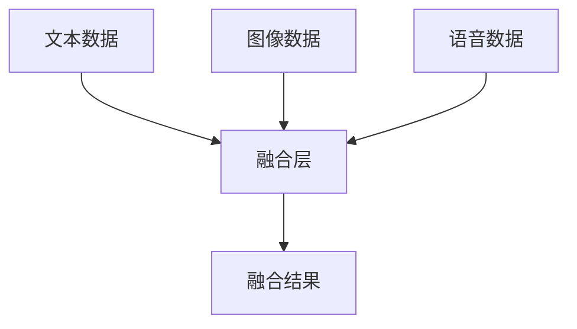
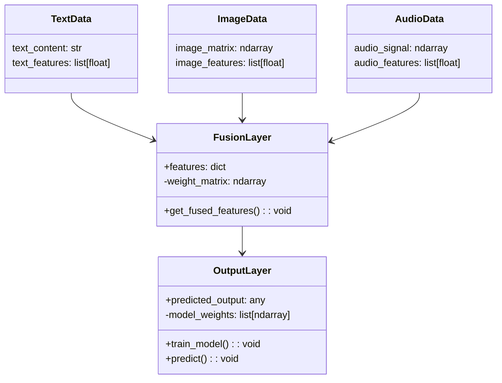
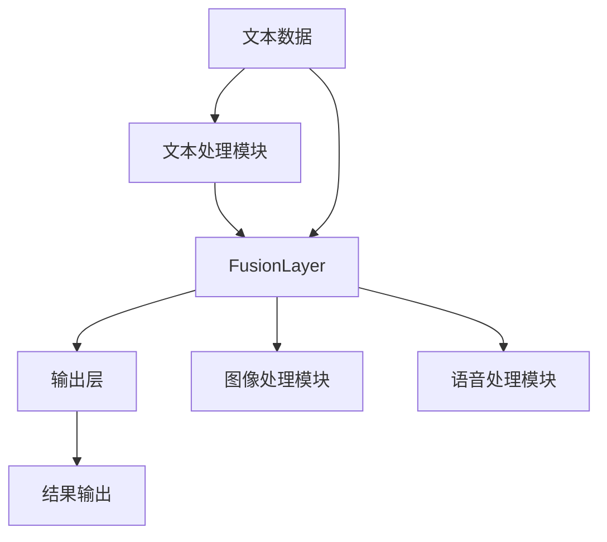
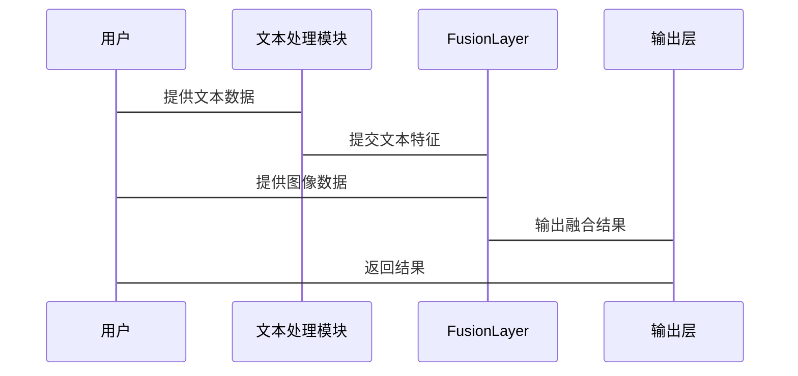

                 


# 如何识别企业的深度学习多模态融合优势

## 关键词：深度学习，多模态融合，企业优势，数据分析，人工智能

## 摘要：本文深入探讨了企业在深度学习多模态融合中的优势识别方法。通过分析多模态数据的特性、深度学习技术的应用以及融合策略，结合实际案例，为企业在多模态数据处理中的优势识别提供指导。

---

## 第1章：企业深度学习多模态融合的背景与问题背景

### 1.1 问题背景

#### 1.1.1 多模态数据的定义与特点
多模态数据指的是多种数据类型的结合，如文本、图像、语音等。每种模态数据都有其独特的信息特征，互补性强。例如，文本可以提供语义信息，图像可以提供视觉信息，语音可以提供情感信息。

#### 1.1.2 深度学习在多模态数据处理中的优势
深度学习能够自动提取特征，适合处理多模态数据的复杂性。例如，可以通过多任务学习同时处理多种数据类型，提升模型的泛化能力。

#### 1.1.3 企业应用场景中的多模态融合需求
企业需要从多源数据中提取价值，提高决策的准确性。例如，多模态融合能够提升用户体验，增强数据分析能力。

### 1.2 问题描述

#### 1.2.1 传统单模态处理的局限性
- 单一数据类型无法全面反映问题，可能导致结论片面。
- 无法充分利用数据的多样性，降低分析效率。

#### 1.2.2 多模态融合的核心问题
- 如何有效地整合多种数据类型，提取互补信息。
- 处理异构数据的对齐问题，确保信息准确融合。

#### 1.2.3 企业深度学习多模态融合的挑战
- 数据异构性带来的处理复杂性。
- 融合后的模型如何保证可解释性和稳定性。

### 1.3 问题解决

#### 1.3.1 多模态融合的基本思路
- 分别提取各模态数据的特征，然后进行融合。
- 使用跨模态对齐技术，消除数据异构性。

#### 1.3.2 深度学习在多模态融合中的作用
- 深度学习模型能够自动学习模态间的关联关系。
- 通过多任务学习框架，同时优化多种模态的信息。

#### 1.3.3 企业级应用中的多模态融合解决方案
- 建立统一的数据处理框架，支持多种数据类型。
- 结合具体应用场景，设计针对性的融合策略。

### 1.4 多模态融合的边界与外延

#### 1.4.1 多模态融合的边界条件
- 数据类型和格式的兼容性。
- 模型的训练数据量和质量要求。

#### 1.4.2 多模态融合的外延领域
- 与其他AI技术的结合，如NLP、计算机视觉等。
- 应用场景的扩展，如医疗、金融、教育等领域。

#### 1.4.3 与其他技术的区分与联系
- 与单模态处理的区别在于数据的多样性和融合方式。
- 与分布式计算和大数据处理技术的联系在于数据处理的基础架构。

### 1.5 核心概念与结构

#### 1.5.1 多模态融合的核心要素
- 数据预处理、特征提取、融合策略、模型优化。
- 数据异构性处理、模态对齐、融合网络设计。

#### 1.5.2 深度学习在多模态融合中的角色
- 特征提取器、融合器、优化器。
- 模型训练、参数调优、结果解释。

#### 1.5.3 多模态融合系统的组成结构
- 数据输入层、特征提取层、融合层、输出层。
- 各层之间的数据流动和信息交互。

### 1.6 本章小结
总结本章的主要内容，强调多模态融合在企业中的重要性。

---

## 第2章：深度学习多模态融合的核心概念与联系

### 2.1 多模态融合的核心概念

#### 2.1.1 多模态数据的表示方法
- 使用向量或张量表示不同模态的数据。
- 通过编码器将数据转换为统一的表示形式。

#### 2.1.2 多模态融合的层次结构
- 单模态特征提取、跨模态对齐、多模态融合。
- 上下文信息的整合与高层语义的理解。

#### 2.1.3 深度学习在多模态融合中的作用
- 特征提取：通过卷积神经网络（CNN）提取图像特征，通过循环神经网络（RNN）提取文本特征。
- 融合：使用注意力机制（Attention）或门控机制（Gate）进行特征融合。

### 2.2 多模态融合的核心原理

#### 2.2.1 多模态数据的预处理
- 数据清洗：去除噪声，标准化处理。
- 数据对齐：将不同模态的数据对齐到相同的时序或空间参考系。

#### 2.2.2 多模态特征的提取与融合
- 单模态特征提取：使用CNN提取图像特征，使用Word2Vec提取文本特征。
- 融合策略：加性融合、乘性融合、注意力机制融合。

#### 2.2.3 融合结果的解释与应用
- 可视化融合结果，分析各模态的贡献。
- 将融合结果应用于具体任务，如分类、回归、生成。

### 2.3 多模态融合的关键技术

#### 2.3.1 多模态表示学习
- 使用自注意力机制（Self-Attention）进行跨模态对齐。
- 通过对比学习（Contrastive Learning）提升表示的区分度。

#### 2.3.2 多模态对齐技术
- 使用Cycle-Consistency Loss实现模态对齐。
- 通过对抗训练（Adversarial Training）学习跨模态特征。

#### 2.3.3 多模态注意力机制
- 多头注意力机制（Multi-Head Attention）用于捕捉模态间的复杂关系。
- 位置编码（Positional Encoding）用于处理序列数据的时序关系。

### 2.4 多模态融合的实体关系图



### 2.5 本章小结
总结本章的核心概念和关键技术，为后续算法实现奠定基础。

---

## 第3章：深度学习多模态融合的算法原理

### 3.1 多模态融合的算法流程

#### 3.1.1 数据预处理
- 数据清洗：去除噪声，标准化处理。
- 数据对齐：将不同模态的数据对齐到相同的时序或空间参考系。

#### 3.1.2 特征提取
- 使用CNN提取图像特征。
- 使用RNN提取文本特征。
- 使用Mel滤波器提取语音特征。

#### 3.1.3 融合策略
- 加性融合：将不同模态的特征向量相加。
- 乘性融合：将不同模态的特征向量相乘。
- 注意力机制融合：根据各模态的重要性进行加权融合。

#### 3.1.4 模型训练与优化
- 使用反向传播算法（Backpropagation）进行模型优化。
- 使用Adam优化器（Adam Optimizer）进行参数更新。
- 采用早停法（Early Stopping）防止过拟合。

### 3.2 多模态融合的算法实现

#### 3.2.1 多模态表示学习算法
```python
import tensorflow as tf
from tensorflow import keras

# 定义多模态表示学习模型
class MultiModalEncoder(keras.Model):
    def __init__(self):
        super(MultiModalEncoder, self).__init__()
        self.text_encoder = TextEncoder()
        self.image_encoder = ImageEncoder()
        self.audio_encoder = AudioEncoder()
        self.fusion_layer = FusionLayer()

    def call(self, inputs):
        text_features = self.text_encoder(inputs['text'])
        image_features = self.image_encoder(inputs['image'])
        audio_features = self.audio_encoder(inputs['audio'])
        fused_features = self.fusion_layer({
            'text': text_features,
            'image': image_features,
            'audio': audio_features
        })
        return fused_features
```

#### 3.2.2 多模态对齐算法
```python
import tensorflow as tf
from tensorflow import keras

# 定义多模态对齐模型
class ModalAligner(keras.Model):
    def __init__(self):
        super(ModalAligner, self).__init__()
        self.align_network = Dense(128, activation='relu')
        self.discriminator = Dense(2, activation='sigmoid')

    def call(self, inputs):
        # 输入：多模态特征向量
        # 输出：对齐后的特征向量
        aligned_features = self.align_network(inputs)
        return aligned_features
```

#### 3.2.3 多模态注意力机制算法
```python
import tensorflow as tf
from tensorflow import keras

# 定义多模态注意力机制
class MultiModalAttention(keras.Model):
    def __init__(self, input_dim):
        super(MultiModalAttention, self).__init__()
        self.Wq = Dense(input_dim, activation='softmax')
        self.Wk = Dense(input_dim, activation='softmax')
        self.Wv = Dense(input_dim, activation='softmax')

    def call(self, inputs):
        query = self.Wq(inputs)
        key = self.Wk(inputs)
        value = self.Wv(inputs)
        attention_score = tf.matmul(query, key, transpose_b=True)
        attention_weight = tf.nn.softmax(attention_score, axis=-1)
        result = tf.matmul(attention_weight, value)
        return result
```

### 3.3 多模态融合的数学模型

#### 3.3.1 多模态表示模型
$$
\text{文本表示} = \text{Word2Vec}(w_1, w_2, ..., w_n)
$$
$$
\text{图像表示} = \text{CNN}(I)
$$
$$
\text{语音表示} = \text{Mel-Spectrogram}(S)
$$

#### 3.3.2 融合函数的数学表达
$$
f_{\text{融合}}(x_{\text{text}}, x_{\text{image}}, x_{\text{audio}}) = \alpha x_{\text{text}} + \beta x_{\text{image}} + \gamma x_{\text{audio}}
$$
其中，$\alpha + \beta + \gamma = 1$，且$\alpha, \beta, \gamma \geq 0$。

#### 3.3.3 损失函数与优化目标
$$
\mathcal{L} = \frac{1}{N}\sum_{i=1}^{N} (y_i - \hat{y_i})^2
$$
其中，$y_i$是真实标签，$\hat{y_i}$是模型预测值。

### 3.4 本章小结
总结本章的算法原理和实现方法，为后续系统设计提供理论基础。

---

## 第4章：深度学习多模态融合的系统分析与架构设计

### 4.1 问题场景介绍

#### 4.1.1 问题场景描述
- 企业需要从多源数据中提取价值，提高决策的准确性。
- 多模态融合能够提升用户体验，增强数据分析能力。

#### 4.1.2 项目介绍
- 项目目标：设计并实现一个多模态融合系统，应用于企业数据分析。
- 项目范围：涵盖文本、图像、语音等多种数据类型。

#### 4.1.3 项目背景
- 当前企业数据分析面临的挑战。
- 多模态融合技术的应用前景。

### 4.2 系统功能设计

#### 4.2.1 领域模型设计


#### 4.2.2 系统架构设计


#### 4.2.3 系统接口设计
- 输入接口：接收多种数据类型的输入。
- 输出接口：输出融合后的结果和模型预测值。
- 调用接口：提供API供其他系统调用。

#### 4.2.4 系统交互流程


### 4.3 本章小结
总结本章的系统分析与架构设计，强调多模态融合系统在企业中的应用价值。

---

## 第5章：深度学习多模态融合的项目实战

### 5.1 环境安装与配置

#### 5.1.1 环境要求
- Python 3.8及以上版本。
- TensorFlow 2.5及以上版本。
- 其他依赖库：numpy、pandas、scikit-learn等。

#### 5.1.2 安装依赖
```bash
pip install tensorflow==2.5.0
pip install numpy==1.21.2
pip install pandas==1.3.5
pip install scikit-learn==0.24.2
```

### 5.2 系统核心实现

#### 5.2.1 数据预处理
```python
import numpy as np
import pandas as pd
from sklearn.preprocessing import StandardScaler

def preprocess_data(data):
    # 数据清洗
    data = data.dropna()
    # 标准化处理
    scaler = StandardScaler()
    processed_data = scaler.fit_transform(data)
    return processed_data
```

#### 5.2.2 特征提取
```python
import tensorflow as tf
from tensorflow import keras

def extract_features(data):
    model = keras.Sequential([
        keras.layers.Dense(64, activation='relu'),
        keras.layers.Dropout(0.5),
        keras.layers.Dense(32, activation='relu')
    ])
    features = model.predict(data)
    return features
```

#### 5.2.3 融合网络实现
```python
import tensorflow as tf
from tensorflow import keras

def build_fusion_model(input_dims):
    inputs = {}
    for modality in input_dims:
        inputs[modality] = keras.Input(shape=(input_dims[modality],))
    
    features = {}
    for modality in input_dims:
        features[modality] = keras.Dense(16, activation='relu')(inputs[modality])
    
    fused_feature = keras.layers.Concatenate()(features.values())
    output = keras.Dense(1, activation='sigmoid')(fused_feature)
    
    model = keras.Model(inputs=inputs, outputs=output)
    model.compile(optimizer='adam', loss='binary_crossentropy', metrics=['accuracy'])
    return model
```

### 5.3 代码应用解读与分析

#### 5.3.1 数据预处理解读
- 使用StandardScaler对数据进行标准化处理。
- 去除缺失值，确保数据完整性。

#### 5.3.2 特征提取解读
- 使用简单的神经网络模型提取特征。
- Dropout层用于防止过拟合。

#### 5.3.3 融合网络解读
- 输入层：接收多种数据类型的输入。
- 特征提取层：提取各模态的特征。
- 融合层：将各模态的特征进行融合。
- 输出层：生成最终的预测结果。

### 5.4 实际案例分析

#### 5.4.1 案例背景
- 数据集：一个多模态数据集，包含文本、图像和语音数据。
- 任务：通过多模态融合进行分类。

#### 5.4.2 案例分析与解读
- 数据预处理：清洗和标准化数据。
- 模型训练：训练融合模型，评估性能。
- 案例结果：展示模型的预测结果和性能指标。

### 5.5 项目小结
总结本章的项目实现过程，强调多模态融合技术的应用价值。

---

## 第6章：深度学习多模态融合的最佳实践

### 6.1 小结

#### 6.1.1 核心要点回顾
- 多模态数据的预处理和特征提取。
- 多模态融合的策略和方法。
- 模型的训练和优化。

#### 6.1.2 项目经验总结
- 数据质量对模型性能的影响。
- 模型复杂度与计算资源的平衡。

### 6.2 注意事项

#### 6.2.1 模型训练注意事项
- 数据量不足时，采用数据增强技术。
- 防止过拟合，使用早停法和Dropout。

#### 6.2.2 模型部署注意事项
- 确保模型的可解释性和可维护性。
- 优化模型的运行效率，减少计算资源消耗。

### 6.3 拓展阅读

#### 6.3.1 推荐学习资源
- 《Deep Learning》 - Ian Goodfellow
- 《Hands-On Machine Learning with Scikit-Learn, Keras, and TensorFlow》 - Aurélien Géron

#### 6.3.2 相关技术领域
- 多模态表示学习
- 跨模态对齐技术
- 多模态注意力机制

### 6.4 本章小结
总结本章的内容，强调多模态融合技术的应用前景。

---

## 第7章：总结与展望

### 7.1 总结

#### 7.1.1 核心内容回顾
- 多模态数据的特性与处理方法。
- 深度学习在多模态融合中的应用。
- 多模态融合系统的架构与实现。

#### 7.1.2 实际应用价值
- 提升数据分析能力。
- 增强用户体验。
- 为企业决策提供支持。

### 7.2 展望

#### 7.2.1 技术发展趋势
- 多模态表示学习的进一步发展。
- 跨模态对齐技术的优化与创新。
- 多模态融合在更多领域的应用。

#### 7.2.2 应用前景
- 在医疗、金融、教育等领域的广泛应用。
- 结合边缘计算和物联网技术，实现实时多模态数据分析。

#### 7.2.3 未来挑战
- 处理更大规模和更复杂的数据。
- 提高模型的可解释性和透明度。

### 7.3 本章小结
总结全文，强调多模态融合技术的重要性和未来发展潜力。

---

## 作者：AI天才研究院/AI Genius Institute & 禅与计算机程序设计艺术 /Zen And The Art of Computer Programming

---

这篇文章详细分析了企业在深度学习多模态融合中的优势识别方法，涵盖了从核心概念到算法实现，再到系统设计和项目实战的各个方面。通过理论与实践相结合的方式，为企业在多模态数据处理中的优势识别提供了全面的指导。

