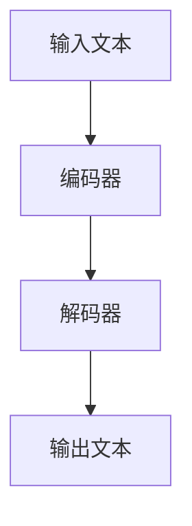

                 


# 如何识别企业的深度学习自然语言生成技术优势

## 关键词：深度学习，自然语言生成，NLP，企业应用，技术优势

## 摘要：深度学习驱动的自然语言生成技术在企业中的应用日益广泛，本文通过详细分析其核心概念、算法原理、系统架构以及实际案例，揭示其技术优势，并为企业识别和选择合适的技术方案提供指导。

---

## 第1章 深度学习与自然语言生成技术概述

### 1.1 深度学习的背景与重要性
- **1.1.1 深度学习的起源与发展**
  - 深度学习起源于人工神经网络的研究，经过卷积神经网络（CNN）和循环神经网络（RNN）的发展，逐步成为机器学习领域的主流技术。
  - 深度学习的优势在于其强大的特征提取能力和自动学习能力，能够在处理复杂任务时表现出色。

- **1.1.2 深度学习在NLP中的应用**
  - 深度学习在自然语言处理中的应用包括文本分类、情感分析、机器翻译等。
  - 通过深度学习模型，计算机能够更准确地理解和生成人类语言。

- **1.1.3 深度学习的核心优势**
  - 数据驱动：深度学习模型能够从大量数据中自动提取特征，减少人工特征工程的需求。
  - 鲁棒性：深度学习模型在处理复杂模式时表现出色，能够适应不同的数据分布。

### 1.2 自然语言生成技术的定义与特点
- **1.2.1 自然语言生成的定义**
  - 自然语言生成（NLG）是将结构化数据转换为自然语言文本的过程，涉及文本规划、内容生成和语言生成三个阶段。
  - 生成的内容需在语义和语法上符合人类语言的规范。

- **1.2.2 自然语言生成的核心特点**
  - 生成性：能够自动生成新的文本内容，而不是简单地从现有数据中检索信息。
  - 灵活性：能够根据上下文生成多样化的表达方式。
  - 实时性：在某些应用中，生成过程需要快速响应。

- **1.2.3 自然语言生成与传统NLP的区别**
  - 传统NLP主要关注信息的理解和提取，而自然语言生成关注信息的生成和表达。
  - 自然语言生成需要结合语义理解和生成技术，而传统NLP更多依赖于模式匹配。

### 1.3 企业级应用中的自然语言生成技术
- **1.3.1 企业级应用的定义与特点**
  - 企业级应用通常涉及高可用性、高可靠性和高性能，需要在复杂环境下稳定运行。
  - 企业级应用强调数据的安全性和系统的可扩展性。

- **1.3.2 自然语言生成技术在企业中的应用场景**
  - 客户服务：智能客服系统通过自然语言生成技术为客户提供个性化的回复。
  - 业务报告：自动生成财务报告、销售报告等，节省时间和成本。
  - 内容营销：生成营销文案，提升品牌曝光率。

- **1.3.3 企业级自然语言生成技术的优势**
  - 提高效率：自动化生成文本，减少人工干预。
  - 降低成本：降低人力资源的投入，提高生产力。
  - 增强用户体验：提供个性化和实时的互动体验。

### 1.4 本章小结
本章主要介绍了深度学习和自然语言生成技术的基本概念及其在企业中的应用。通过分析深度学习的核心优势和自然语言生成的特点，为后续章节的理解奠定了基础。

---

## 第2章 自然语言生成技术的核心概念与联系

### 2.1 深度学习与自然语言生成的关系
- **2.1.1 深度学习在NLP中的应用**
  - 深度学习模型如LSTM、Transformer等在自然语言生成中发挥了重要作用。
  - 通过深度学习，模型能够捕捉到文本中的上下文信息，生成连贯的语句。

- **2.1.2 自然语言生成技术的实现原理**
  - 基于编码器-解码器结构，将输入文本编码为向量，再解码为输出文本。
  - 使用注意力机制，提高生成文本的质量和相关性。

- **2.1.3 深度学习与自然语言生成的结合**
  - 深度学习为自然语言生成提供了强大的模型训练和特征提取能力。
  - 自然语言生成技术在深度学习的推动下，取得了显著的进步。

### 2.2 自然语言生成技术的核心要素
- **2.2.1 数据输入与处理**
  - 数据预处理：包括分词、去停用词、词干提取等步骤。
  - 数据格式化：将文本数据转化为模型能够处理的形式，如词向量或字符向量。

- **2.2.2 模型结构与训练**
  - 编码器结构：将输入文本转化为上下文向量。
  - 解码器结构：根据上下文向量生成输出文本。
  - 模型训练：使用大规模数据进行监督学习，优化生成模型的参数。

- **2.2.3 输出生成与优化**
  - 生成策略：包括贪心搜索、采样等方法。
  - 模型优化：通过调整超参数和优化算法，提高生成文本的质量。

### 2.3 自然语言生成技术的实体关系图


### 2.4 本章小结
本章详细探讨了深度学习与自然语言生成技术的关系，分析了其核心要素，并通过实体关系图展示了技术架构。这为后续章节的算法原理和系统设计提供了理论基础。

---

## 第3章 自然语言生成算法的流程与实现

### 3.1 自然语言生成算法的流程
- **3.1.1 数据预处理**
  - 分词：将文本分割成单词或短语。
  - 去停用词：去除常见的无意义词汇，如“的”、“是”等。
  - 词干提取：将单词还原为基本形式，便于模型处理。

- **3.1.2 模型编码**
  - 使用编码器将输入文本转化为向量表示。
  - 编码器可以是基于RNN或Transformer的结构。

- **3.1.3 模型解码**
  - 使用解码器根据编码后的向量生成输出文本。
  - 解码器通常采用自注意力机制，以捕捉文本的长距离依赖关系。

- **3.1.4 损失计算与优化**
  - 使用交叉熵损失函数衡量生成结果与真实结果的差异。
  - 采用优化算法如Adam优化器，更新模型参数以最小化损失。

### 3.2 自然语言生成算法的实现
- **3.2.1 编码器实现**
  ```python
  class Encoder:
      def __init__(self, vocab_size, embedding_dim, hidden_size):
          self.vocab_size = vocab_size
          self.embedding_dim = embedding_dim
          self.hidden_size = hidden_size
          self.embedding = nn.Embedding(vocab_size, embedding_dim)
          self.lstm = nn.LSTM(embedding_dim, hidden_size)
  ```

- **3.2.2 解码器实现**
  ```python
  class Decoder:
      def __init__(self, vocab_size, embedding_dim, hidden_size):
          self.vocab_size = vocab_size
          self.embedding_dim = embedding_dim
          self.hidden_size = hidden_size
          self.embedding = nn.Embedding(vocab_size, embedding_dim)
          self.lstm = nn.LSTM(embedding_dim, hidden_size)
          self.fc = nn.Linear(hidden_size, vocab_size)
  ```

- **3.2.3 损失函数与优化器**
  ```python
  criterion = nn.CrossEntropyLoss()
  optimizer = optim.Adam(model.parameters(), lr=0.001)
  ```

### 3.3 自然语言生成算法的数学模型
- **3.3.1 编码器-解码器模型**
  - 编码器将输入序列转换为隐藏状态向量。
  - 解码器根据隐藏状态向量生成输出序列。

- **3.3.2 注意力机制**
  - 注意力机制通过计算输入序列中每个位置的重要性，生成加权的上下文向量。
  - 注意力权重计算公式：
    $$\alpha_i = \frac{\exp(e_i)}{\sum_{j} \exp(e_j)}$$
    其中，$e_i$是第i个位置的注意力得分。

- **3.3.3 概率生成模型**
  - 生成模型基于条件概率$P(y|x)$，计算每个生成词的概率。
  - 使用交叉熵损失函数进行优化：
    $$\mathcal{L} = -\sum_{i=1}^{n} \log P(y_i|x)$$

### 3.4 自然语言生成算法的代码实现
- **3.4.1 数据预处理代码**
  ```python
  def preprocess(data):
      tokens = data.split()
      return tokens
  ```

- **3.4.2 模型构建代码**
  ```python
  class NGTModel(nn.Module):
      def __init__(self, vocab_size, embedding_dim, hidden_size):
          super(NGTModel, self).__init__()
          self.encoder = Encoder(vocab_size, embedding_dim, hidden_size)
          self.decoder = Decoder(vocab_size, embedding_dim, hidden_size)
      def forward(self, input, target):
          enc_output, enc_hidden = self.encoder(input)
          dec_output, dec_hidden = self.decoder(enc_output, target)
          return dec_output
  ```

- **3.4.3 模型训练代码**
  ```python
  def train(model, optimizer, criterion, data_loader, epochs):
      for epoch in range(epochs):
          for batch in data_loader:
              input, target = batch
              outputs = model(input, target)
              loss = criterion(outputs, target)
              optimizer.zero_grad()
              loss.backward()
              optimizer.step()
  ```

### 3.5 本章小结
本章详细讲解了自然语言生成算法的流程、实现和数学模型。通过代码和公式展示了如何构建和训练生成模型，为后续章节的系统设计提供了技术基础。

---

## 第4章 自然语言生成系统的架构设计

### 4.1 系统功能设计
- **4.1.1 输入处理模块**
  - 接收用户输入，进行预处理和解析。
  - 支持多种输入格式，如文本、语音等。

- **4.1.2 模型调用模块**
  - 调用预训练的自然语言生成模型，生成输出文本。
  - 支持多种生成策略，如贪心搜索、蒙特卡洛采样等。

- **4.1.3 输出展示模块**
  - 将生成的文本展示给用户，支持多种输出格式。
  - 提供生成结果的反馈机制，优化模型性能。

### 4.2 系统架构设计
- **4.2.1 分层架构**
  ```mermaid
  graph TD
  A[用户] --> B[输入处理模块]
  B --> C[模型调用模块]
  C --> D[输出展示模块]
  D --> E[用户]
  ```

- **4.2.2 组件协作**
  - 用户输入经过输入处理模块解析后，传递给模型调用模块。
  - 模型生成结果返回给输出展示模块，最终展示给用户。

### 4.3 接口与交互设计
- **4.3.1 系统接口**
  - 提供API接口，方便其他系统调用自然语言生成服务。
  - 支持RESTful API，便于集成到企业现有系统中。

- **4.3.2 交互流程**
  ```mermaid
  sequenceDiagram
  participant 用户
  participant 系统
  用户->系统: 发送请求
  系统->用户: 返回生成文本
  ```

### 4.4 本章小结
本章详细设计了自然语言生成系统的架构，包括功能模块、系统架构和交互流程。通过分层设计和组件协作，确保系统的高效性和可扩展性。

---

## 第5章 项目实战：自然语言生成系统实现

### 5.1 环境安装与配置
- 安装Python和必要的库：
  ```bash
  pip install torch numpy matplotlib
  ```

- 配置开发环境，如PyCharm或VS Code。

### 5.2 系统核心实现
- **数据预处理**
  ```python
  def preprocess(data):
      tokens = data.split()
      return tokens
  ```

- **模型构建**
  ```python
  class NGTModel(nn.Module):
      def __init__(self, vocab_size, embedding_dim, hidden_size):
          super(NGTModel, self).__init__()
          self.encoder = Encoder(vocab_size, embedding_dim, hidden_size)
          self.decoder = Decoder(vocab_size, embedding_dim, hidden_size)
      def forward(self, input, target):
          enc_output, enc_hidden = self.encoder(input)
          dec_output, dec_hidden = self.decoder(enc_output, target)
          return dec_output
  ```

- **模型训练**
  ```python
  def train(model, optimizer, criterion, data_loader, epochs):
      for epoch in range(epochs):
          for batch in data_loader:
              input, target = batch
              outputs = model(input, target)
              loss = criterion(outputs, target)
              optimizer.zero_grad()
              loss.backward()
              optimizer.step()
  ```

### 5.3 代码实现与解读
- **数据预处理**
  - 将输入文本分割成单词或短语，便于模型处理。

- **模型构建**
  - 使用编码器和解码器结构，分别处理输入和生成输出。
  - 采用LSTM作为基本结构，结合注意力机制，提高生成质量。

- **模型训练**
  - 使用交叉熵损失函数进行优化。
  - 通过反向传播和梯度下降，更新模型参数。

### 5.4 实际案例分析
- **案例背景**
  - 某企业希望利用自然语言生成技术，自动生成销售报告。

- **数据准备**
  - 收集销售数据，包括销售额、时间、产品类别等。

- **模型训练**
  - 使用历史销售数据训练模型，生成符合格式的销售报告。

### 5.5 项目小结
本章通过实际项目展示了自然语言生成系统的实现过程，从环境配置到代码实现，再到实际案例分析，为读者提供了 hands-on 的实践经验。

---

## 第6章 自然语言生成技术的最佳实践与注意事项

### 6.1 技术选型建议
- **选择合适的模型架构**
  - 根据任务需求选择适合的模型，如RNN、Transformer或GPT等。

- **数据质量的重要性**
  - 使用高质量的训练数据，避免噪声干扰。
  - 数据清洗和预处理是关键步骤。

- **模型优化技巧**
  - 使用早停法防止过拟合。
  - 调整学习率和优化器参数，提高训练效率。

### 6.2 系统设计注意事项
- **系统的可扩展性**
  - 设计模块化的系统架构，方便功能扩展和性能优化。
  - 支持多语言和多领域生成，满足企业多样化需求。

- **系统的安全性**
  - 确保生成内容的合规性，避免生成敏感或有害信息。
  - 数据存储和传输过程中的安全性是重点。

### 6.3 部署与监控
- **部署建议**
  - 使用容器化技术（如Docker）部署模型，确保环境一致性。
  - 部署到云平台，利用弹性计算资源。

- **监控与维护**
  - 实时监控系统性能，及时发现和解决问题。
  - 定期更新模型，保持生成内容的时效性和准确性。

### 6.4 本章小结
本章总结了自然语言生成技术的最佳实践，包括技术选型、系统设计和部署监控等方面，为企业应用提供了宝贵的指导和建议。

---

## 作者：AI天才研究院/AI Genius Institute & 禅与计算机程序设计艺术 /Zen And The Art of Computer Programming

---

通过以上详细结构，文章系统地介绍了如何识别企业的深度学习自然语言生成技术优势，从理论到实践，从算法到系统，全面覆盖了相关知识，为企业和技术人员提供了深入的指导和参考。

