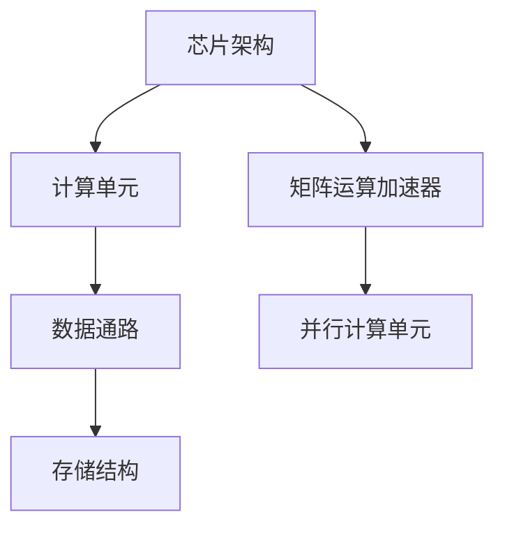
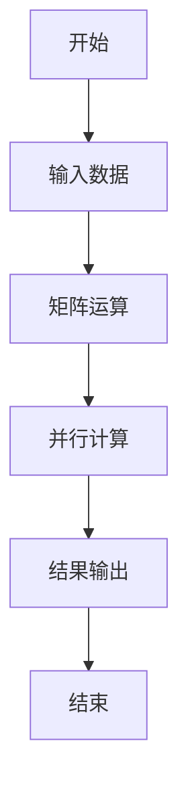

                 


# 如何识别企业的深度学习芯片设计优势

> 关键词：深度学习芯片，企业设计优势，芯片架构，计算性能，能效优化，AI加速，技术分析

> 摘要：本文深入分析了企业在设计深度学习芯片时的优势识别方法，从背景介绍到算法原理，再到系统架构和项目实战，详细探讨了如何优化芯片性能和能效，助力企业在AI领域占据竞争优势。

---

## 第1章：深度学习芯片设计背景

### 1.1 深度学习芯片的基本概念
深度学习芯片是一种专为加速深度学习算法设计的硬件，通过并行计算和高效的矩阵运算能力，显著提升AI模型的训练和推理效率。

### 1.2 深度学习芯片的发展背景
随着AI技术的迅速发展，企业对高效计算硬件的需求激增，深度学习芯片应运而生，成为推动AI应用的重要工具。

### 1.3 企业深度学习芯片的应用场景
企业利用深度学习芯片优化图像识别、自然语言处理和推荐系统等任务，提升产品竞争力。

---

## 第2章：深度学习芯片设计的核心概念

### 2.1 深度学习芯片的设计原理
深度学习芯片采用矩阵运算加速和并行计算技术，专注于高效处理AI模型中的大量数据。

### 2.2 深度学习芯片的核心技术
矩阵运算加速技术、并行计算技术和能效优化技术是提升芯片性能的关键。

### 2.3 深度学习芯片的设计挑战
算法与芯片的协同设计、可扩展性问题和成本与性能平衡是设计中的主要挑战。

---

## 第3章：深度学习芯片设计的核心概念与联系

### 3.1 深度学习芯片的核心概念原理
矩阵运算的加速原理、并行计算的实现方式和能效优化的技术路径是芯片设计的核心。

### 3.2 深度学习芯片的核心概念属性对比
通过对比矩阵运算加速器的性能、并行计算效率和能效优化技术的优劣，帮助企业识别设计优势。

### 3.3 深度学习芯片的ER实体关系图


---

## 第4章：深度学习芯片的算法原理

### 4.1 深度学习芯片的算法原理概述
矩阵运算的数学模型、并行计算的算法流程和能效优化的策略是算法设计的重点。

### 4.2 深度学习芯片的算法流程图


### 4.3 矩阵运算的数学模型
矩阵乘法是深度学习的核心运算，公式如下：
$$ C = A \times B $$

### 4.4 并行计算的实现方式
通过多线程或GPU并行处理，提升计算效率。例如，使用Python的numpy库进行并行矩阵运算：
```python
import numpy as np
A = np.random.randn(100, 100)
B = np.random.randn(100, 100)
C = np.dot(A, B)
print(C)
```

### 4.5 能效优化的策略
优化数据通路和存储结构，减少数据移动，提升能效。例如，采用压缩算法减少数据传输量。

---

## 第5章：深度学习芯片的系统分析与架构设计

### 5.1 系统功能设计
深度学习芯片系统包括数据输入、计算单元、存储模块和控制单元。```mermaid
classDiagram
    class 芯片架构 {
        - 计算单元
        - 数据通路
        - 存储结构
    }
    class 矩阵运算加速器 {
        + 加速矩阵乘法
        + 并行计算
    }
```

### 5.2 系统架构设计
采用高效的流水线架构和层次化设计，优化整体性能。例如，使用Mermaid架构图展示模块结构。

### 5.3 系统接口设计
定义清晰的API接口，便于与其他系统集成，确保高效的数据交互。

### 5.4 系统交互流程
详细描述芯片与外部系统的交互过程，使用Mermaid序列图展示。

---

## 第6章：深度学习芯片的项目实战

### 6.1 环境安装
安装必要的开发工具和库，如Python、numpy和TensorFlow。

### 6.2 核心功能实现
实现矩阵运算和并行计算的核心功能，优化代码性能。

### 6.3 案例分析
通过具体案例分析芯片设计的优势，如优化后的能效提升和计算速度加快。

---

## 第7章：最佳实践与小结

### 7.1 项目经验总结
总结项目中的关键点和经验教训，强调理论与实践的结合。

### 7.2 注意事项
提醒读者关注能效优化和算法与芯片的协同设计。

### 7.3 拓展阅读
推荐相关书籍和技术文章，供读者深入学习。

---

作者：AI天才研究院 & 禅与计算机程序设计艺术

---

通过以上结构，文章详细讲解了企业深度学习芯片设计的优势识别方法，从理论到实践，帮助读者全面理解并应用于实际工作中。

