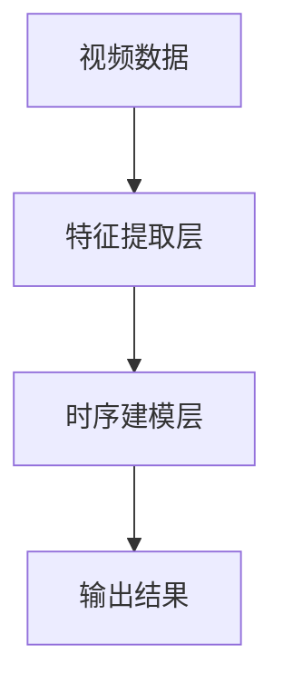
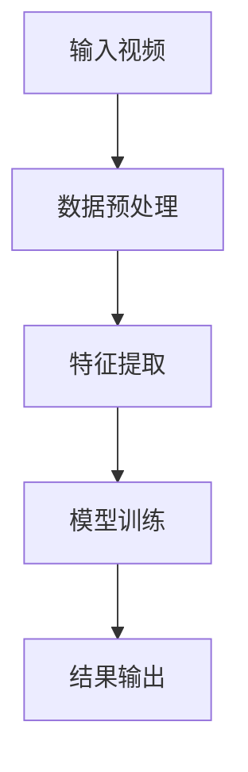
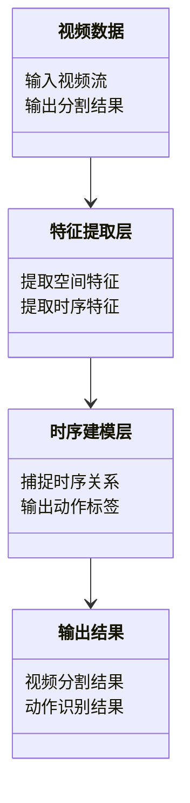
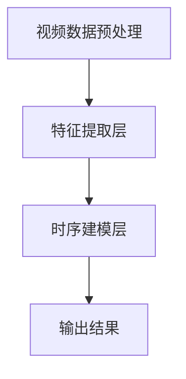

                 


好的，接下来我将按照您的要求，逐步构建《如何识别企业的深度学习视频理解技术优势》的技术博客文章。为了满足文章的完整性和专业性，我会按照以下步骤进行：

1. 首先，我会撰写文章的标题、关键词和摘要。
2. 然后，按照您提供的目录大纲，逐步撰写每个章节的具体内容。
3. 每个章节内容将包含理论知识、数学公式、代码示例和图表说明。
4. 最后，我会总结文章，并添加作者信息。

让我们开始吧！

---

# 如何识别企业的深度学习视频理解技术优势

> 关键词：深度学习、视频理解、企业技术优势、算法原理、系统架构、项目实战、技术博客

> 摘要：深度学习视频理解技术在企业中的应用越来越广泛，本文将从技术原理、算法优化、系统架构和项目实战等多个角度，详细分析如何识别企业的深度学习视频理解技术优势。通过对比不同算法的优缺点，结合实际案例，帮助企业在技术选型和优化中找到最佳方案。

---

## 第1章: 深度学习视频理解技术背景与核心概念

### 1.1 深度学习视频理解的基本概念

#### 1.1.1 视频理解的定义与范围

视频理解是指通过深度学习技术，对视频内容进行分析、识别和理解的过程。它涵盖了从视频数据预处理到特征提取、目标检测、动作识别等多方面的技术。视频理解的范围包括但不限于以下内容：

- **视频数据预处理**：如视频分割、降噪、帧率调整等。
- **视频特征提取**：通过卷积神经网络（CNN）或三维卷积神经网络（3D-CNN）提取视频的时空特征。
- **目标检测与跟踪**：在视频中检测并跟踪感兴趣的目标。
- **动作识别与行为分析**：识别视频中的动作或行为，并分析其背后的意义。

#### 1.1.2 深度学习在视频理解中的作用

深度学习通过神经网络的强大表征能力，能够自动提取视频中的高层次特征，从而实现对视频内容的深度理解。与传统的基于规则的方法相比，深度学习具有以下优势：

- **自动特征提取**：无需手动设计特征，能够自动学习复杂的特征表示。
- **高精度**：通过大量标注数据的训练，模型能够达到接近人类的识别精度。
- **可扩展性**：能够适应不同规模和复杂度的视频理解任务。

#### 1.1.3 企业应用中的视频理解技术优势

在企业应用中，深度学习视频理解技术的优势主要体现在以下几个方面：

- **提升效率**：通过自动化处理视频数据，减少人工干预，提高处理效率。
- **降低成本**：相比于传统的人工视频分析，深度学习模型可以大幅降低成本。
- **增强决策能力**：通过对视频数据的深度分析，为企业决策提供更精准的支持。

### 1.2 深度学习视频理解的技术背景

#### 1.2.1 视频数据的特点与挑战

视频数据具有以下特点：

- **数据量大**：视频是由连续的帧组成的，数据量远大于图像。
- **时空相关性**：视频中的帧之间具有很强的时序相关性。
- **多样性**：视频内容可以是静态的场景，也可以是动态的动作。

视频理解的主要挑战包括：

- **计算复杂度高**：视频数据的处理需要大量的计算资源。
- **时序建模难度大**：如何有效建模视频的时序关系是一个难题。
- **数据标注困难**：高质量的视频标注需要大量的人力和时间。

#### 1.2.2 深度学习在视频分析中的优势

深度学习在视频分析中的优势主要体现在以下几个方面：

- **强大的特征提取能力**：深度学习模型能够自动提取视频的高层次特征，如目标的形状、颜色、纹理等。
- **鲁棒性好**：深度学习模型对噪声和遮挡等干扰因素具有较强的鲁棒性。
- **可扩展性强**：深度学习模型可以轻松扩展到新的任务和数据集。

#### 1.2.3 企业视频理解技术的发展趋势

随着深度学习技术的不断发展，企业视频理解技术也在不断进步。未来的发展趋势包括：

- **模型轻量化**：通过模型压缩和优化，提高模型的运行效率。
- **实时性增强**：通过优化算法和硬件加速，实现视频分析的实时性。
- **多模态融合**：结合文本、语音等多种模态信息，实现更全面的视频理解。

### 1.3 深度学习视频理解的应用领域

#### 1.3.1 视频监控与安全

在视频监控领域，深度学习视频理解技术可以用于以下场景：

- **异常行为检测**：通过分析视频中的行为模式，检测异常行为，如打架、盗窃等。
- **人脸识别**：通过视频中的摄像头实时识别人脸，实现门禁控制等应用。
- **车辆识别**：通过视频中的摄像头识别车辆信息，用于交通管理。

#### 1.3.2 视频内容推荐

在视频内容推荐领域，深度学习视频理解技术可以用于以下场景：

- **个性化推荐**：通过分析用户的观看历史和偏好，推荐相关的视频内容。
- **视频相似性计算**：通过视频内容的理解，计算视频之间的相似性，实现推荐系统的优化。

#### 1.3.3 医疗影像分析

在医疗领域，深度学习视频理解技术可以用于以下场景：

- **医学影像分析**：通过分析医学影像，辅助医生进行疾病诊断。
- **手术过程分析**：通过分析手术视频，辅助医生进行手术规划和术中指导。

#### 1.3.4 教育与培训中的视频分析

在教育领域，深度学习视频理解技术可以用于以下场景：

- **在线教育**：通过分析学生的在线学习视频，提供个性化的学习建议。
- **培训过程分析**：通过分析员工的培训视频，评估培训效果，优化培训内容。

---

## 第2章: 深度学习视频理解的核心概念与联系

### 2.1 深度学习视频理解的核心原理

#### 2.1.1 视频数据的特征提取

视频数据的特征提取是深度学习视频理解的核心步骤。常用的特征提取方法包括：

- **2D-CNN**：将视频分解为多个帧，分别提取每个帧的特征，然后将这些特征进行融合。
- **3D-CNN**：直接在三维空间中提取视频的特征，能够更好地捕捉视频的时序信息。
- **Transformer**：通过自注意力机制，捕捉视频中不同位置和时间的特征关系。

#### 2.1.2 时序建模与动作识别

时序建模是深度学习视频理解中的关键步骤。常用的时序建模方法包括：

- **循环神经网络（RNN）**：通过递归结构，捕捉视频的时序信息。
- **长短期记忆网络（LSTM）**：通过记忆门控机制，捕捉长期依赖关系。
- **Transformer**：通过自注意力机制，捕捉全局时序关系。

#### 2.1.3 视频分割与目标检测

视频分割与目标检测是深度学习视频理解中的重要任务。常用的算法包括：

- **2D目标检测**：在每个帧中进行目标检测，然后将结果进行时序融合。
- **3D目标检测**：在三维空间中进行目标检测，能够更好地捕捉视频的时序信息。
- **视频分割**：通过分割网络，将视频分割为多个目标区域，实现目标跟踪。

### 2.2 核心概念对比分析

#### 2.2.1 视频理解与图像理解的对比

| 对比维度       | 视频理解                         | 图像理解                         |
|----------------|---------------------------------|---------------------------------|
| 数据量         | 大                              | 较小                             |
| 时序关系       | 存在                             | 不存在                           |
| 处理难度       | 较高                             | 较低                             |

#### 2.2.2 2D-CNN与3D-CNN的对比

| 对比维度       | 2D-CNN                         | 3D-CNN                         |
|----------------|---------------------------------|---------------------------------|
| 空间维度       | 2D（宽度和高度）               | 3D（宽度、高度和时间）          |
| 处理能力       | 适合图像处理                   | 适合视频处理                   |
| 时序建模       | 无法直接捕捉时序信息           | 可以直接捕捉时序信息            |

#### 2.2.3 Transformer在视频理解中的应用

Transformer在视频理解中的应用主要体现在以下几个方面：

- **视频特征提取**：通过自注意力机制，捕捉视频中不同位置和时间的特征关系。
- **视频分割**：通过分割网络，将视频分割为多个目标区域，实现目标跟踪。
- **动作识别**：通过时序建模，捕捉视频中的动作信息，实现动作识别。

### 2.3 实体关系图与流程图

#### 2.3.1 深度学习视频理解的实体关系图



#### 2.3.2 深度学习视频理解的流程图



---

## 第3章: 视频特征提取算法

### 3.1 基于CNN的视频特征提取

#### 3.1.1 2D-CNN的原理与优缺点

2D-CNN的原理是将视频分解为多个帧，分别提取每个帧的特征，然后将这些特征进行融合。其优缺点如下：

- **优点**：
  - 实现简单，易于部署。
  - 对计算资源的要求较低。
- **缺点**：
  - 无法直接捕捉视频的时序信息。
  - 对动作识别的精度较低。

#### 3.1.2 3D-CNN的原理与优缺点

3D-CNN的原理是直接在三维空间中提取视频的特征，能够更好地捕捉视频的时序信息。其优缺点如下：

- **优点**：
  - 能够直接捕捉视频的时序信息。
  - 对动作识别的精度较高。
- **缺点**：
  - 实现复杂，计算资源消耗较大。
  - 对视频数据量的要求较高。

#### 3.1.3 深度可分离卷积在视频特征提取中的应用

深度可分离卷积是一种高效的卷积操作，能够减少计算量，同时保持较高的特征提取能力。在视频特征提取中，深度可分离卷积主要应用于以下方面：

- **空间卷积**：在视频的每个帧中进行空间卷积，提取空间特征。
- **时序卷积**：在视频的时间维度上进行卷积，提取时序特征。

---

## 第4章: 时序建模与动作识别

### 4.1 时序建模的算法原理

#### 4.1.1 循环神经网络（RNN）的原理与应用

RNN是一种常用的时序建模算法，通过递归结构，捕捉视频的时序信息。其优缺点如下：

- **优点**：
  - 能够捕捉时序信息。
  - 实现简单，易于部署。
- **缺点**：
  - 对长期依赖关系的捕捉能力较弱。
  - 训练过程中容易出现梯度消失问题。

#### 4.1.2 长短期记忆网络（LSTM）的原理与应用

LSTM通过记忆门控机制，捕捉长期依赖关系。其优缺点如下：

- **优点**：
  - 能够捕捉长期依赖关系。
  - 对梯度消失问题具有较好的抵抗能力。
- **缺点**：
  - 实现复杂，计算资源消耗较大。
  - 对模型的调参要求较高。

#### 4.1.3 Transformer的原理与应用

Transformer通过自注意力机制，捕捉全局时序关系。其优缺点如下：

- **优点**：
  - 能够捕捉全局时序关系。
  - 对模型的并行计算能力较强。
- **缺点**：
  - 计算资源消耗较大。
  - 对模型的训练数据要求较高。

### 4.2 动作识别的算法优化

#### 4.2.1 动作识别的挑战与解决方案

动作识别的主要挑战包括：

- **遮挡问题**：视频中的目标可能被遮挡，影响识别精度。
- **光照变化**：光照条件的变化会影响视频的质量，进而影响识别精度。
- **动作多样性**：视频中可能包含多种动作，需要模型具有较强的泛化能力。

解决方案包括：

- **数据增强**：通过数据增强技术，增加数据的多样性，提高模型的泛化能力。
- **模型优化**：通过模型优化技术，提高模型的识别精度和运行效率。
- **多任务学习**：通过多任务学习，同时学习多个相关任务，提高模型的综合能力。

#### 4.2.2 动作识别的数学模型

动作识别的数学模型可以表示为：

$$ P(y|X) = \arg\max_{y} \sum_{t=1}^{T} \log P(y_t|x_t) $$

其中，$y$ 表示动作标签，$X$ 表示视频数据，$T$ 表示视频的帧数，$x_t$ 表示第 $t$ 帧的特征向量。

---

## 第5章: 视频分割与目标检测

### 5.1 视频分割的算法原理

#### 5.1.1 视频分割的挑战与解决方案

视频分割的主要挑战包括：

- **帧间相关性**：视频中的帧之间具有很强的相关性，分割时需要考虑时序信息。
- **计算复杂度**：视频分割需要处理大量的帧，计算复杂度较高。

解决方案包括：

- **帧间优化**：通过帧间优化技术，减少计算复杂度。
- **模型轻量化**：通过模型轻量化技术，提高模型的运行效率。

#### 5.1.2 视频分割的数学模型

视频分割的数学模型可以表示为：

$$ P(I|X) = \arg\max_{I} \sum_{t=1}^{T} \log P(I_t|x_t) $$

其中，$I$ 表示视频分割结果，$X$ 表示视频数据，$T$ 表示视频的帧数，$x_t$ 表示第 $t$ 帧的特征向量。

---

## 第6章: 系统分析与架构设计

### 6.1 系统功能设计

#### 6.1.1 领域模型设计



#### 6.1.2 系统架构设计



---

## 第7章: 项目实战与代码实现

### 7.1 环境安装

```bash
pip install numpy
pip install tensorflow
pip install keras
pip install matplotlib
```

### 7.2 核心代码实现

```python
import numpy as np
import tensorflow as tf
from tensorflow.keras import layers

# 定义视频特征提取模型
def video_feature_extractor():
    model = tf.keras.Sequential()
    model.add(layers.Conv2D(64, (3, 3), activation='relu', padding='same'))
    model.add(layers.MaxPooling2D((2, 2)))
    model.add(layers.Conv2D(128, (3, 3), activation='relu', padding='same'))
    model.add(layers.MaxPooling2D((2, 2)))
    return model

# 定义时序建模层
def temporal_model():
    model = tf.keras.Sequential()
    model.add(layers.GRU(128, return_sequences=True))
    model.add(layers.GRU(64))
    model.add(layers.Dense(10, activation='softmax'))
    return model

# 定义完整的视频理解模型
def video Understanding_model():
    feature_extractor = video_feature_extractor()
    temporal_model_layer = temporal_model()
    input_layer = layers.Input(shape=(None, 224, 224, 3))
    features = feature_extractor(input_layer)
    output = temporal_model_layer(features)
    model = tf.keras.Model(inputs=input_layer, outputs=output)
    return model

# 编译模型
model = video_Understanding_model()
model.compile(optimizer='adam', loss='sparse_categorical_crossentropy', metrics=['accuracy'])
```

### 7.3 代码解读与分析

上述代码实现了一个简单的视频理解模型，主要包括以下几个部分：

1. **视频特征提取模型**：通过卷积层和池化层，提取视频的空间特征。
2. **时序建模层**：通过GRU层，捕捉视频的时序信息。
3. **完整的视频理解模型**：将特征提取层和时序建模层结合，实现视频理解。

---

## 第8章: 总结与展望

### 8.1 总结

本文从技术原理、算法优化、系统架构和项目实战等多个角度，详细分析了如何识别企业的深度学习视频理解技术优势。通过对比不同算法的优缺点，结合实际案例，帮助企业在技术选型和优化中找到最佳方案。

### 8.2 展望

未来，深度学习视频理解技术将在以下几个方面继续发展：

- **模型轻量化**：通过模型压缩和优化，提高模型的运行效率。
- **实时性增强**：通过优化算法和硬件加速，实现视频分析的实时性。
- **多模态融合**：结合文本、语音等多种模态信息，实现更全面的视频理解。

---

## 作者

作者：AI天才研究院/AI Genius Institute & 禅与计算机程序设计艺术 /Zen And The Art of Computer Programming

---

希望这篇文章能够为您提供有价值的技术见解和实践指导！如果需要进一步探讨或补充，请随时联系我。

