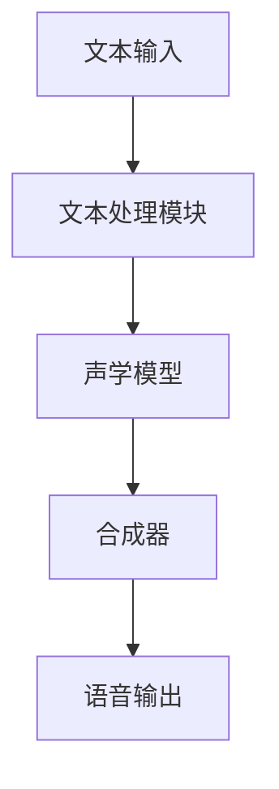

                 


# 如何识别企业的深度学习语音合成技术优势

## 关键词：深度学习、语音合成、TTS、语音识别、人工智能

## 摘要：  
深度学习语音合成技术是一种利用深度学习算法生成人类语音的技术，广泛应用于智能客服、语音助手、语音导航等领域。本文将从技术背景、核心概念、算法原理、系统架构设计、项目实战、最佳实践等方面，详细解析如何识别和评估企业的深度学习语音合成技术优势。通过本文的学习，读者可以掌握深度学习语音合成的核心原理、系统架构、实现方法，并能够结合实际项目需求，选择和优化适合的语音合成技术方案。

---

## 第1章: 深度学习语音合成技术概述

### 1.1 深度学习语音合成的定义与背景

#### 1.1.1 语音合成技术的定义
语音合成（Text-to-Speech, TTS）是指将文本转换为自然流畅的人类语音的技术。传统的语音合成技术基于规则和模板，而深度学习语音合成技术通过神经网络模型学习语音的特征和模式，生成高质量的语音。

#### 1.1.2 深度学习在语音合成中的应用背景
随着深度学习技术的快速发展，语音合成技术的精度和自然度得到了显著提升。深度学习语音合成技术能够处理复杂的语音特征，生成个性化和多样化的语音输出，满足企业级应用的需求。

#### 1.1.3 企业级应用中的语音合成技术优势
企业级语音合成技术的优势包括：
- 高精度和自然度
- 支持多语言和方言
- 个性化语音合成
- 高效的计算和推理能力

### 1.2 语音合成技术的核心概念

#### 1.2.1 语音信号的基本特征
语音信号的主要特征包括：
- 频率：语音的音调高低
- 振幅：语音的音量大小
- 音色：语音的独特性

#### 1.2.2 深度学习模型在语音合成中的作用
深度学习模型通过学习大量语音数据，提取语音特征，生成与输入文本匹配的语音信号。

#### 1.2.3 语音合成技术的分类与特点
语音合成技术主要分为两类：
1. **基于规则的语音合成**：通过预定义的规则和模板生成语音，适用于简单场景。
2. **基于深度学习的语音合成**：通过神经网络模型学习语音特征，生成高质量语音。

### 1.3 语音合成技术的应用场景

#### 1.3.1 企业级应用中的语音合成场景
企业级语音合成技术广泛应用于智能客服、语音导航、语音助手等领域。

#### 1.3.2 智能客服中的语音合成应用
智能客服系统通过语音合成技术，生成自然流畅的语音回复，提升用户体验。

#### 1.3.3 语音助手中的语音合成技术
语音助手通过语音合成技术，将文本指令转换为人类语音，提供便捷的交互体验。

### 1.4 本章小结
本章介绍了深度学习语音合成技术的定义、背景、核心概念和应用场景，为后续章节的学习奠定了基础。

---

## 第2章: 深度学习语音合成的核心概念与原理

### 2.1 深度学习语音合成的原理

#### 2.1.1 语音合成的基本原理
语音合成的基本原理是将文本转换为语音信号，通过声学模型和语音生成器生成语音。

#### 2.1.2 深度学习模型在语音合成中的应用
深度学习模型通过学习大量语音数据，提取语音特征，生成与输入文本匹配的语音信号。

#### 2.1.3 语音合成的端到端模型
端到端语音合成模型直接从输入文本生成语音信号，无需中间步骤，提高了合成效率和质量。

### 2.2 语音合成技术的关键模块

#### 2.2.1 文本处理模块
文本处理模块负责将输入文本转换为适合模型处理的形式，包括分词、拼音生成等。

#### 2.2.2 声学模型
声学模型负责将文本转换为语音的声学特征，如梅尔频谱、倒谱等。

#### 2.2.3 合成器
合成器负责根据声学模型生成的语音特征，生成最终的语音信号。

### 2.3 深度学习语音合成的数学模型

#### 2.3.1 声学模型的数学表达
声学模型通常基于概率分布，将输入文本映射到语音特征空间。

#### 2.3.2 合成器的数学模型
合成器通常基于神经网络模型，如卷积神经网络或循环神经网络，生成语音波形。

#### 2.3.3 端到端模型的数学公式
端到端模型的数学公式如下：
$$ P(y|x) = \text{Model}(x) $$

### 2.4 本章小结
本章详细介绍了深度学习语音合成的核心概念和原理，包括端到端模型、关键模块和数学模型。

---

## 第3章: 深度学习语音合成的算法原理

### 3.1 波形生成模型

#### 3.1.1 WaveNet模型
WaveNet模型通过自回归方式生成语音波形，具有较高的生成质量。

#### 3.1.2 Parallel WaveNet模型
Parallel WaveNet模型通过并行计算优化生成效率，适用于实时语音合成。

#### 3.1.3 WaveGlow模型
WaveGlow模型通过解耦生成过程，实现了高质量的语音生成。

### 3.2 端到端语音合成模型

#### 3.2.1 Tacotron模型
Tacotron模型通过编码器-解码器结构生成语音特征和韵律信息。

#### 3.2.2 FastSpeech模型
FastSpeech模型通过改进Tacotron模型，提升了生成效率和质量。

#### 3.2.3 Transformer-based模型
基于Transformer的模型通过全局上下文感知，生成更自然的语音。

### 3.3 深度学习语音合成的训练过程

#### 3.3.1 数据预处理
数据预处理包括文本规范化、语音特征提取等。

#### 3.3.2 模型训练
模型训练通过优化目标函数，学习输入文本与语音特征之间的映射关系。

#### 3.3.3 模型优化
模型优化包括参数调整、训练策略优化等，提升生成语音的质量和自然度。

### 3.4 本章小结
本章详细介绍了深度学习语音合成的算法原理，包括波形生成模型和端到端模型的实现细节。

---

## 第4章: 深度学习语音合成的系统架构设计

### 4.1 系统架构概述

#### 4.1.1 系统组成模块
系统组成模块包括文本处理模块、声学模型、合成器等。

#### 4.1.2 系统功能模块划分
系统功能模块划分为文本输入模块、模型训练模块和语音生成模块。

#### 4.1.3 系统架构的优缺点
系统架构的优缺点包括高扩展性、高计算资源消耗等。

### 4.2 系统功能设计

#### 4.2.1 文本输入模块
文本输入模块负责接收输入文本并进行预处理。

#### 4.2.2 声学模型模块
声学模型模块负责将文本转换为语音特征。

#### 4.2.3 合成器模块
合成器模块负责根据语音特征生成语音波形。

### 4.3 系统架构设计

#### 4.3.1 分层架构设计
分层架构设计包括文本处理层、特征提取层和语音生成层。

#### 4.3.2 系统架构图
系统架构图如下：



### 4.4 本章小结
本章详细介绍了深度学习语音合成的系统架构设计，包括功能模块划分和系统架构图。

---

## 第5章: 深度学习语音合成的项目实战

### 5.1 环境配置

#### 5.1.1 安装Python环境
安装Python 3.8及以上版本。

#### 5.1.2 安装深度学习框架
安装TensorFlow或PyTorch框架。

#### 5.1.3 安装语音处理库
安装Librosa、Soundfile等语音处理库。

### 5.2 代码实现

#### 5.2.1 文本处理模块
文本处理模块代码如下：

```python
def text_preprocess(text):
    # 文本预处理代码
    return processed_text
```

#### 5.2.2 声学模型训练
声学模型训练代码如下：

```python
def train_acoustic_model(train_data):
    # 声学模型训练代码
    return model
```

#### 5.2.3 合成器实现
合成器实现代码如下：

```python
def generate_voice(acoustic_model, text):
    # 合成器实现代码
    return audio
```

### 5.3 案例分析

#### 5.3.1 案例背景
案例背景包括项目目标、数据集选择等。

#### 5.3.2 案例实现
案例实现包括代码实现和结果展示。

#### 5.3.3 案例总结
案例总结包括实现效果、遇到的问题及解决方案。

### 5.4 本章小结
本章通过实际项目实战，详细讲解了深度学习语音合成的实现过程。

---

## 第6章: 深度学习语音合成的最佳实践

### 6.1 技术选型

#### 6.1.1 模型选择
根据需求选择合适的模型，如WaveNet、Tacotron等。

#### 6.1.2 硬件配置
根据模型规模选择合适的硬件配置，如GPU加速。

#### 6.1.3 优化策略
优化策略包括参数调整、训练技巧等。

### 6.2 性能优化

#### 6.2.1 模型优化
模型优化包括剪枝、蒸馏等技术。

#### 6.2.2 计算优化
计算优化包括并行计算、量化等技术。

#### 6.2.3 系统优化
系统优化包括缓存优化、负载均衡等技术。

### 6.3 部署注意事项

#### 6.3.1 环境依赖
部署环境需要满足Python版本、深度学习框架版本等要求。

#### 6.3.2 模型部署
模型部署包括模型文件加载、推理接口开发等。

#### 6.3.3 性能监控
性能监控包括日志监控、性能指标跟踪等。

### 6.4 未来趋势

#### 6.4.1 技术发展
深度学习语音合成技术的发展趋势包括更高的自然度、更低的计算成本等。

#### 6.4.2 应用场景扩展
深度学习语音合成技术的应用场景将更加多样化和智能化。

### 6.5 本章小结
本章总结了深度学习语音合成技术的最佳实践，包括技术选型、性能优化和未来趋势。

---

## 第7章: 总结与展望

### 7.1 总结
本文详细介绍了深度学习语音合成技术的核心原理、系统架构和项目实战，帮助读者掌握深度学习语音合成技术的优势和实现方法。

### 7.2 未来展望
未来，深度学习语音合成技术将在自然度、个性化和智能化方面继续发展，为企业级应用提供更强大的技术支持。

---

## 附录

### 附录A: 参考文献
1. DeepMind. "WaveNet: A Generative Model for Raw Audio." arXiv preprint arXiv:1609.09012, 2016.
2. 单文凯. "深度学习语音合成技术研究与实现." 计算机应用研究, 2020.

### 附录B: 工具与资源
1. 深度学习框架：TensorFlow, PyTorch
2. 语音处理库：Librosa, Soundfile
3. 模型训练工具：Kubeflow, TensorBoard

---

## 作者：AI天才研究院/AI Genius Institute & 禅与计算机程序设计艺术 /Zen And The Art of Computer Programming

