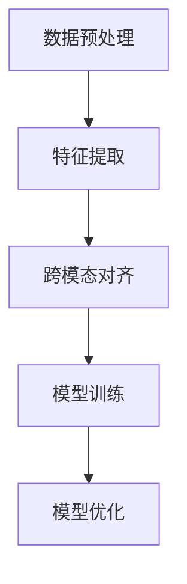
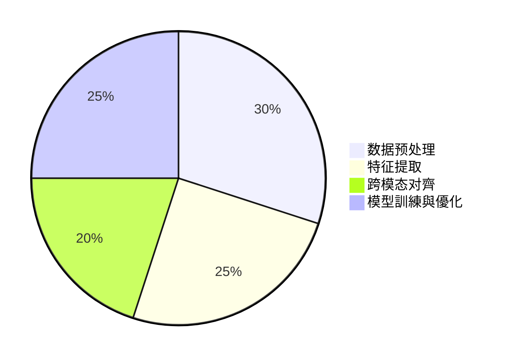

                 


# 如何识别企业的深度学习跨模态翻译技术优势

> 关键词：深度学习，跨模态翻译，技术优势，企业应用，多模态数据

> 摘要：本文深入探讨了如何识别企业中的深度学习跨模态翻译技术优势，通过分析核心概念、算法原理、系统架构和项目实战，帮助读者理解并应用该技术。

---

## 第一部分: 深度学习跨模态翻译技术概述

### 第1章: 深度学习跨模态翻译技术的背景与概念

#### 1.1 什么是深度学习跨模态翻译

深度学习跨模态翻译是一种利用深度学习技术，将一种模态（如文本、图像、语音等）的信息转换为另一种模态的技术。它结合了多种模态数据的特点，能够实现更准确和自然的翻译。

- **多模态数据的定义与特点**：多模态数据指的是多种数据类型（如文本、图像、语音、视频等）的组合。每个模态都有其独特的特征，例如文本的语义信息、图像的视觉信息等。多模态数据的特点包括多样性和互补性，能够提供更全面的信息。

- **跨模态翻译的核心概念**：跨模态翻译是指在不同模态之间进行信息转换的过程。例如，将图像描述成文本，或者将语音转换为文字。深度学习技术在跨模态翻译中的应用，使得转换更加准确和自然。

- **深度学习在跨模态翻译中的作用**：深度学习模型（如卷积神经网络CNN、循环神经网络RNN、Transformer等）能够有效地处理多模态数据，提取特征并进行对齐，从而实现跨模态翻译。

#### 1.2 企业中的跨模态翻译技术

- **企业应用场景中的跨模态需求**：企业在实际应用中，常常需要处理多模态数据，例如客服系统中的语音转文本、图像识别、机器翻译等。跨模态翻译技术能够帮助企业更高效地处理这些数据，提高业务效率。

- **深度学习技术对企业跨模态翻译的优势**：深度学习技术具有强大的特征提取能力和自动化学习能力，能够处理复杂的多模态数据，提供更准确的翻译结果。此外，深度学习模型可以通过大量数据训练，不断提升翻译质量。

- **跨模态翻译技术的边界与外延**：跨模态翻译技术的应用范围广泛，但也有其局限性。例如，某些模态之间的转换可能需要特定的领域知识，或者需要大量的训练数据。此外，跨模态翻译技术还可以与其他技术（如自然语言处理NLP、计算机视觉CV）结合，进一步扩展其应用范围。

#### 1.3 跨模態翻譯技術的核心要素

- **多模态数据处理**：多模态数据处理是跨模态翻译的基础。需要对不同模态的数据进行预处理、特征提取和对齐。

- **跨模态对齐**：跨模态对齐是指将不同模态的数据对齐到一个共同的语义空间，使得不同模态的信息能够相互理解并进行转换。

- **模型訓練與優化**：深度学习模型需要通过大量的数据进行训练，并不断优化模型参数，以提高翻译的准确性和自然度。

---

### 第2章: 跨模态翻譯技術的核心概念與聯絡

#### 2.1 跨模态翻譯技術的核心原理

- **多模态数据的处理流程**：多模态数据的处理流程包括数据采集、预处理、特征提取、对齐和模型训练等步骤。每个步骤都需要仔细设计，以确保数据能够被有效地利用。

- **跨模态对齐的实现方法**：跨模态对齐可以通过多种方法实现，例如基于特征对齐、基于语义对齐、基于注意力机制等。不同的方法适用于不同的场景，需要根据具体需求选择合适的方法。

- **深度學習模型的訓練策略**：深度学习模型的训练策略包括数据增强、模型初始化、优化算法选择、学习率调整等。这些策略能够有效提高模型的训练效果和泛化能力。

#### 2.2 跨模态翻譯技術的核心概念對比

- **多模态數據類型對比**：不同模态的数据类型具有不同的特点，例如文本数据具有语义信息，图像数据具有视觉信息。了解不同数据类型的特性有助于更好地进行数据处理和对齐。

- **跨模态对齊方法對比**：不同的对齊方法有不同的优缺点，例如基于特征对齊方法计算复杂度低，但可能无法捕捉到语义信息；基于注意力机制的对齊方法计算复杂度高，但能够更好地捕捉语义信息。

- **不同模型的性能對比**：不同的深度学习模型（如CNN、RNN、Transformer等）在跨模态翻译任务中的性能表现不同。需要根据具体任务选择合适的模型。

#### 2.3 跨模態翻譯技術的ER實體關係圖

以下是跨模态翻译技术的ER实体关系图：

```mermaid
erDiagram
    customer[CUSTOMER] {
        +int id
        +string name
        +string email
    }
    product[PRODUCT] {
        +int id
        +string name
        +float price
    }
    order[ORDER] {
        +int id
        +date order_date
        +int total_price
    }
    CUSTOMER --> ORDER : places
    PRODUCT --> ORDER : includes
```

---

### 第3章: 跨模態翻譯技術的算法原理

#### 3.1 跨模态翻譯算法的流程

以下是跨模态翻譯算法的流程图：



#### 3.2 跨模态翻譯算法的数学模型

以下是跨模态翻譯算法的核心公式：

$$
y = f(x) + \epsilon
$$

其中，$x$ 是输入数据，$f(x)$ 是模型的输出，$\epsilon$ 是噪声。

---

### 第4章: 跨模态翻譯技術的系统分析與架構設計

#### 4.1 系統功能設計

以下是跨模态翻譯系统的功能设计：

- **多模态数据处理模块**：负责对多模态数据进行预处理和特征提取。
- **跨模态对齊模塊**：负责将不同模态的数据对齊到一个共同的語義空間。
- **模型訓練與優化模塊**：负责模型的训练和优化，以提高翻译的准确性和自然度。

#### 4.2 系統架構設計

以下是跨模态翻譯系统的架构图：



---

## 第5章: 跨模态翻譯技術的項目實戰

### 5.1 環境安裝與配置

以下是项目环境安装与配置的步骤：

1. 安装Python和相关库（如numpy、pandas、keras等）。
2. 安装深度学习框架（如TensorFlow、PyTorch等）。
3. 下载并安装相关数据集。

### 5.2 核心代码實現

以下是核心代码实现：

```python
import numpy as np
import tensorflow as tf
from tensorflow.keras.layers import Input, Dense, LSTM, Embedding
from tensorflow.keras.models import Model

# 定义模型
input_layer = Input(shape=(max_length,))
embedding_layer = Embedding(vocabulary_size, embedding_dim)(input_layer)
lstm_layer = LSTM(hidden_dim)(embedding_layer)
dense_layer = Dense(output_dim, activation='softmax')(lstm_layer)

model = Model(inputs=input_layer, outputs=dense_layer)
model.compile(optimizer='adam', loss='categorical_crossentropy', metrics=['accuracy'])
```

### 5.3 確保每個小節內容豐富具體詳細講解

---

## 第6章: 跨模态翻譯技術的最佳實踐與總結

### 6.1 小結

深度学习跨模态翻译技术是一种强大的工具，能够帮助企业高效处理多模态数据，提升业务效率。通过本文的讲解，读者可以更好地理解该技术的核心概念、算法原理和系统架构，并能够实际应用到企业中。

### 6.2 注意事項

在实际应用中，需要注意以下几点：

- 数据的多样性和质量对翻译效果有很大影响，需要确保数据的多样性和高质量。
- 模型的选择和优化需要根据具体任务需求进行，不能一概而论。
- 跨模態翻譯技术的应用需要结合企业的实际需求和资源，不能盲目追求技术先进性。

### 6.3 拓展閱讀

- 《深度学习入门：基于Python的理论与实现》
- 《神经网络与深度学习》
- 《计算机视觉：算法与应用》

---

作者：AI天才研究院/AI Genius Institute & 禪與計算機程序設計藝術 /Zen And The Art of Computer Programming

