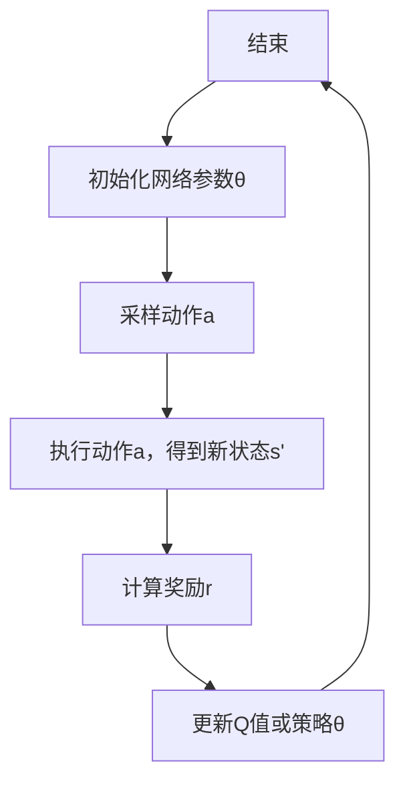
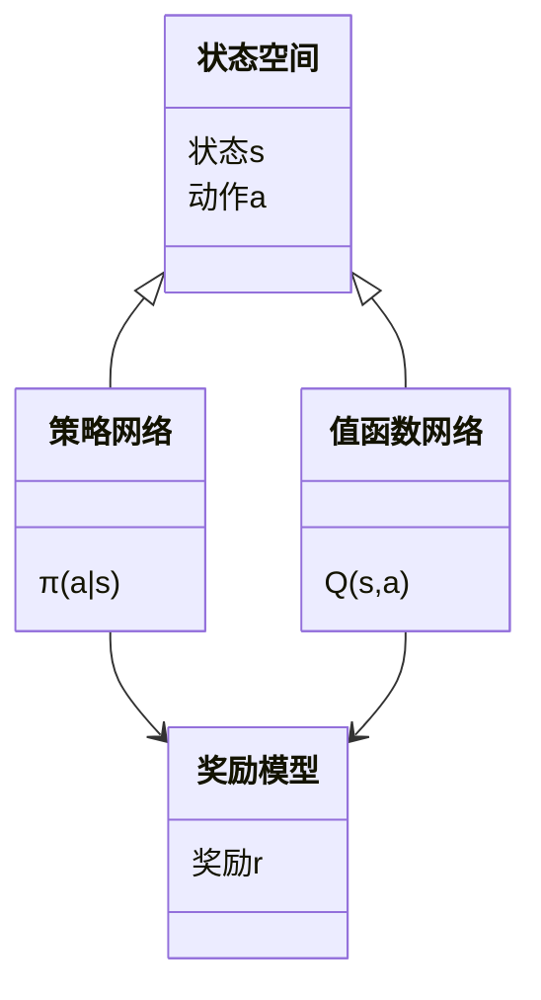
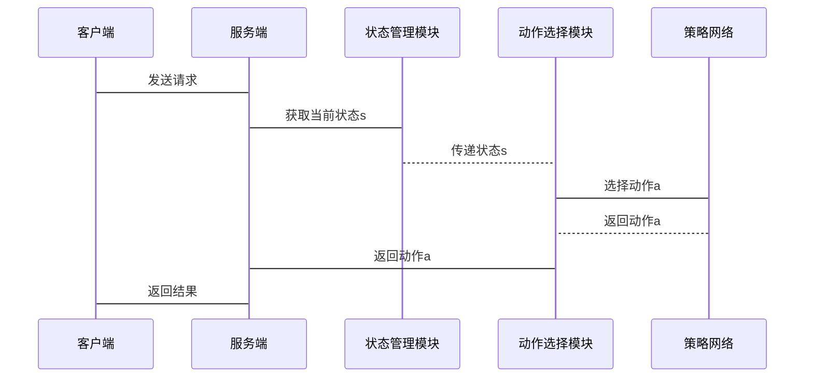

                 


# 如何识别企业的深度强化学习技术优势

> 关键词：深度强化学习，企业技术优势，算法原理，系统架构，项目实战

> 摘要：本文将从深度强化学习的基本概念出发，逐步分析其核心算法原理、系统架构设计、项目实战案例以及在企业中的应用优势。通过详细解读深度强化学习的核心概念、算法实现、系统设计和实际应用案例，帮助读者全面理解如何识别和提升企业在深度强化学习技术上的优势。

---

## 第一部分：引言

### 第1章：深度强化学习技术概述

#### 1.1 深度强化学习的核心概念
- 什么是深度强化学习
- 深度强化学习与传统机器学习的区别
- 深度强化学习的主要应用场景

#### 1.2 深度强化学习的背景与重要性
- 深度强化学习的起源与发展
- 深度强化学习在企业中的应用价值
- 深度强化学习对企业技术优势的影响

#### 1.3 本文的目的与结构
- 本文的目标
- 本文的主要内容结构
- 本文的适用读者群体

---

## 第二部分：深度强化学习的核心概念与算法原理

### 第2章：深度强化学习的核心概念

#### 2.1 强化学习的基本原理
- 状态（State）、动作（Action）、奖励（Reward）的定义
- 马尔可夫决策过程（MDP）的数学模型
- 探索（Exploration）与利用（Exploitation）的平衡

#### 2.2 深度强化学习的特点
- 深度神经网络在强化学习中的作用
- 持续性与离散性动作空间的处理
- 深度强化学习的样本效率与计算效率

#### 2.3 深度强化学习的核心算法
- Q-learning算法
- DQN（Deep Q-Network）算法
- Policy Gradient Methods

### 第3章：深度强化学习的数学模型与公式

#### 3.1 Q-learning的数学模型
- Q-learning的更新公式：
  $$ Q(s,a) = Q(s,a) + \alpha (r + \max Q(s',a') - Q(s,a)) $$
- Q-learning的收敛性分析

#### 3.2 DQN算法的数学模型
- DQN的网络结构：输入层、隐藏层、输出层
- DQN的损失函数：
  $$ \mathcal{L} = \mathbb{E}[ (r + \gamma Q(s',a') - Q(s,a))^2 ] $$
- DQN的策略网络与值网络的关系

#### 3.3 Policy Gradient Methods的数学模型
- Policy Gradient的梯度计算公式：
  $$ \nabla \theta = \mathbb{E}[ \nabla \log \pi_\theta(a|s) \cdot Q(s,a) ] $$
- Policy Gradient的优化目标：
  $$ \mathcal{J} = \mathbb{E}[ Q(s,a) \log \pi_\theta(a|s) ] $$

#### 3.4 算法流程图（使用mermaid）


---

## 第三部分：深度强化学习的系统分析与架构设计

### 第4章：系统分析与架构设计

#### 4.1 项目背景与目标
- 项目背景介绍
- 项目目标
- 项目范围与边界

#### 4.2 系统功能设计
- 领域模型设计（使用mermaid类图）


#### 4.3 系统架构设计
- 系统架构图（使用mermaid架构图）


#### 4.4 系统接口设计
- 系统接口描述
- 接口交互流程

#### 4.5 系统交互设计
- 系统交互流程图（使用mermaid序列图）


---

## 第四部分：深度强化学习的项目实战

### 第5章：项目实战

#### 5.1 环境安装与配置
- 安装Python环境
- 安装必要的库（如TensorFlow、Keras、OpenAI Gym）

#### 5.2 核心代码实现
- Q-learning算法实现
  ```python
  import numpy as np

  class QLearning:
      def __init__(self, state_space, action_space, learning_rate=0.1, gamma=0.9):
          self.q_table = np.zeros((state_space, action_space))
          self.learning_rate = learning_rate
          self.gamma = gamma

      def choose_action(self, state):
          return np.argmax(self.q_table[state])

      def learn(self, state, action, reward, next_state):
          self.q_table[state, action] += self.learning_rate * (reward + self.gamma * np.max(self.q_table[next_state]) - self.q_table[state, action])
  ```

- DQN算法实现
  ```python
  import tensorflow as tf
  import numpy as np

  class DQN:
      def __init__(self, input_dim, output_dim, learning_rate=0.001):
          self.model = tf.keras.Sequential([
              tf.keras.layers.Dense(24, activation='relu', input_shape=(input_dim,)),
              tf.keras.layers.Dense(24, activation='relu'),
              tf.keras.layers.Dense(output_dim)
          ])
          self.optimizer = tf.keras.optimizers.Adam(learning_rate)
          self.loss_fn = tf.keras.losses.mean_squared_error

      def call(self, x):
          return self.model(x)

      def train_step(self, states, actions, rewards, next_states, gamma=0.99):
          with tf.GradientTape() as tape:
              current_q = self.call(states)
              next_q = self.call(next_states)
              target = rewards + gamma * np.max(next_q, axis=1)
              target = tf.stop_gradient(target)
              loss = self.loss_fn(target, current_q[:, actions])
          gradients = tape.gradient(loss, self.model.trainable_weights)
          self.optimizer.apply_gradients(zip(gradients, self.model.trainable_weights))
  ```

#### 5.3 案例分析与代码解读
- 案例背景
- 代码实现细节
- 实验结果与分析

#### 5.4 项目总结
- 项目成果
- 经验与教训
- 改进方向

---

## 第五部分：深度强化学习的最佳实践与总结

### 第6章：最佳实践

#### 6.1 深度强化学习的常见问题与解决方案
- 数据不足的问题与解决方案
- 算法收敛性的问题与解决方案
- 计算资源不足的问题与解决方案

#### 6.2 深度强化学习的优化技巧
- 网络结构优化
- 超参数调整
- 奖励函数设计

#### 6.3 深度强化学习的注意事项
- 数据预处理的重要性
- 模型的泛化能力
- 系统的可扩展性

### 第7章：总结与展望

#### 7.1 全文总结
- 本文的核心内容回顾
- 深度强化学习的优势与挑战

#### 7.2 未来展望
- 深度强化学习的发展方向
- 深度强化学习在企业中的潜在应用

---

## 作者：AI天才研究院/AI Genius Institute & 禅与计算机程序设计艺术 /Zen And The Art of Computer Programming

