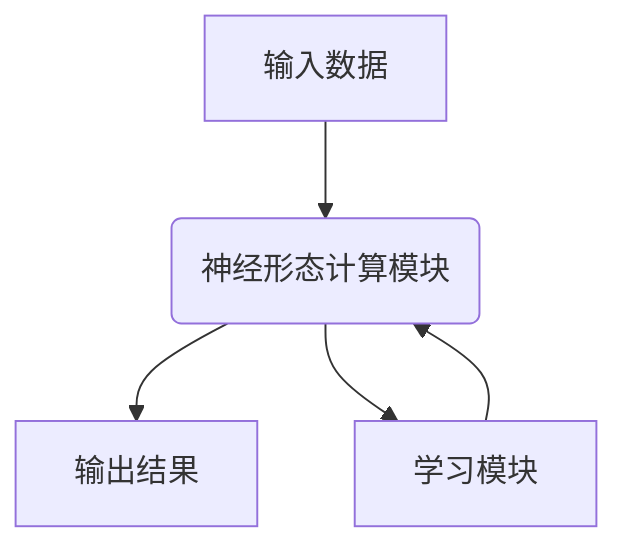
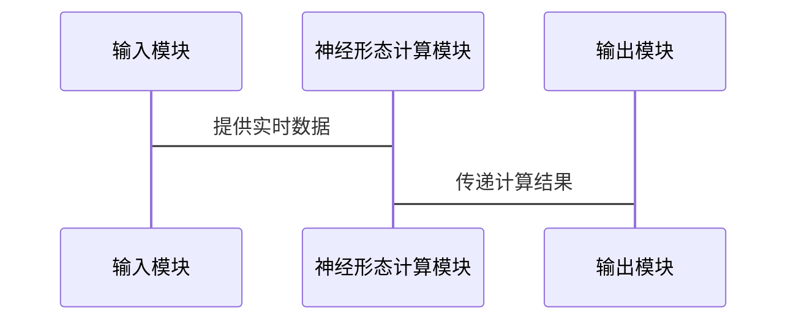

                 


# 如何识别企业的神经形态计算优势

## 关键词：神经形态计算，企业优势，人工智能，计算架构，技术应用

## 摘要：神经形态计算是一种模仿生物神经系统信息处理方式的计算范式，具有并行性、事件驱动和低功耗等特点，适用于复杂的人工智能和大数据处理任务。本文从背景、原理、算法、系统架构、项目实战等方面，详细阐述如何识别和应用企业的神经形态计算优势，帮助企业在数字化转型中占据竞争优势。

---

## 第1章：神经形态计算的背景与基础

### 1.1 神经形态计算的基本概念

#### 1.1.1 神经形态计算的定义与特点
神经形态计算（Neuromorphic Computing）是一种模拟生物神经系统信息处理方式的计算范式。其核心特点包括：
- **并行性**：模拟生物神经系统的并行处理能力。
- **事件驱动**：基于事件触发计算，减少不必要的计算开销。
- **低功耗**：通过模拟生物神经系统的能量效率，降低功耗。
- **自适应性**：能够根据输入数据动态调整计算方式。

#### 1.1.2 神经形态计算的核心特点
神经形态计算与传统计算相比，具有以下显著特点：
- **生物启发性**：模拟生物神经元的电化学信号传递。
- **实时处理**：能够快速响应实时数据输入。
- **高效性**：在特定任务上能够显著提高计算效率。

#### 1.1.3 神经形态计算与传统计算的对比
| 对比维度 | 神经形态计算 | 传统计算 |
|----------|--------------|-----------|
| 计算范式 | 事件驱动、并行 | 线性、串行 |
| 能耗 | 低功耗 | 较高功耗 |
| 应用场景 | AI、实时数据处理 | 离线计算、通用任务 |

---

### 1.2 神经形态计算的起源与发展

#### 1.2.1 神经形态计算的历史背景
神经形态计算的概念最早可以追溯到20世纪60年代，美国生物学家Donald Hebb提出的Hebb学习规则，为神经网络的学习机制奠定了基础。

#### 1.2.2 神经形态计算的发展现状
当前，神经形态计算在硬件和算法方面都有显著进展：
- 硬件：Intel的Loihi芯片、IBM的TrueNorth芯片。
- 软件：NeST（Neuromorphic Simulator Toolkit）、Nengo等模拟器。

#### 1.2.3 神经形态计算的未来趋势
未来，神经形态计算将在AI芯片设计、边缘计算、实时数据分析等领域发挥重要作用。

---

## 第2章：神经形态计算的核心概念与联系

### 2.1 神经形态计算的核心原理

#### 2.1.1 生物神经元的模拟
生物神经元的基本工作原理是通过电化学信号传递信息。神经形态计算通过模拟这些过程，实现高效的计算。

#### 2.1.2 神经网络的结构与功能
神经网络由神经元和突触组成，通过权重调整和学习算法（如反向传播）来实现数据处理。

#### 2.1.3 神经形态计算的数学模型
神经形态计算的数学模型包括：
- **激活函数**：如Sigmoid、ReLU。
- **权重更新规则**：如梯度下降。
- **脉冲函数**：如尖峰函数（Spike Function）。

---

### 2.2 神经形态计算与传统计算的对比

#### 2.2.1 计算范式的对比
- 神经形态计算采用事件驱动的计算方式，而传统计算采用周期性的时钟驱动方式。

#### 2.2.2 算法实现的对比
- 神经形态计算算法（如脉冲神经网络）更适合处理实时数据，而传统算法（如CNN）适用于离线任务。

#### 2.2.3 硬件架构的对比
- 神经形态计算硬件（如TrueNorth）强调低功耗和并行性，而传统计算硬件（如CPU、GPU）强调通用性和高性能。

---

## 第3章：神经形态计算的算法原理

### 3.1 脉冲计算的原理与实现

#### 3.1.1 脉冲计算的基本原理
脉冲计算（Spike-based Computing）基于生物神经元的尖峰发放机制。神经元只有在输入达到阈值时才会输出脉冲信号。

#### 3.1.2 脉冲计算的实现步骤
1. **输入处理**：接收实时数据输入。
2. **神经元状态更新**：根据输入计算神经元状态。
3. **脉冲生成**：当神经元状态超过阈值时，生成脉冲信号。
4. **输出处理**：将脉冲信号传递给下游神经元或存储结果。

#### 3.1.3 脉冲计算的Python实现示例
```python
class NeuromorphicNeuron:
    def __init__(self, threshold=1.0):
        self.threshold = threshold
        self.current = 0.0

    def activate(self, input_current):
        self.current += input_current
        if self.current >= self.threshold:
            self.current = 0.0
            return 1  # 输出脉冲
        else:
            return 0

# 示例使用
neuron = NeuromorphicNeuron(threshold=1.5)
input_sequence = [0.5, 0.5, 0.5, 0.5, 1.0]
output = []
for input_val in input_sequence:
    output.append(neuron.activate(input_val))
print(output)  # 输出结果：[0, 0, 0, 0, 1]
```

---

### 3.2 事件驱动机制的原理与实现

#### 3.2.1 事件驱动机制的基本原理
事件驱动机制通过检测输入数据的变化来触发计算，减少不必要的计算步骤。

#### 3.2.2 事件驱动机制的实现步骤
1. **事件检测**：检测输入数据中的显著变化。
2. **触发计算**：当检测到事件时，启动相关计算。
3. **响应输出**：根据计算结果生成响应。

#### 3.2.3 事件驱动机制的Python实现示例
```python
class EventDrivenSystem:
    def __init__(self, threshold=0.8):
        self.threshold = threshold
        self.last_value = 0.0

    def process_input(self, current_value):
        if abs(current_value - self.last_value) >= self.threshold:
            # 触发计算
            result = self.calculate(current_value)
            return result
        else:
            return None

    def calculate(self, value):
        # 示例计算：简单阈值判断
        if value > 0.9:
            return "High"
        else:
            return "Low"

# 示例使用
system = EventDrivenSystem(threshold=0.5)
input_sequence = [0.3, 0.6, 0.7, 0.4, 0.9]
output = []
for val in input_sequence:
    result = system.process_input(val)
    if result is not None:
        output.append(result)
print(output)  # 输出结果：['Low', 'High']
```

---

## 第4章：神经形态计算的系统架构

### 4.1 系统设计与架构图

#### 4.1.1 系统设计原则
- **模块化设计**：将系统划分为多个功能模块，便于维护和扩展。
- **实时性优化**：确保系统能够快速响应实时数据输入。
- **低功耗设计**：通过优化硬件和算法设计，降低系统功耗。

#### 4.1.2 系统架构图


---

### 4.2 接口设计与交互流程

#### 4.2.1 接口设计
- **输入接口**：接收实时数据流。
- **输出接口**：传递计算结果。
- **控制接口**：配置系统参数和启动/停止计算。

#### 4.2.2 交互流程


---

## 第5章：神经形态计算的项目实战

### 5.1 项目背景与目标

#### 5.1.1 项目背景
假设我们正在开发一个实时图像识别系统，需要快速处理视频流中的图像数据。

#### 5.1.2 项目目标
实现一个基于神经形态计算的实时图像识别系统，能够快速识别图像中的物体。

---

### 5.2 项目核心代码实现

#### 5.2.1 环境配置
- **硬件**：使用支持神经形态计算的硬件（如Intel Loihi芯片）。
- **软件**：安装神经形态计算框架（如Nengo）。

#### 5.2.2 核心代码实现
```python
import nengo
import nengo_spiking_networks as ns

class NeuromorphicImageClassifier:
    def __init__(self, model_path):
        self.model = ns.NeuromorphicModel.load(model_path)
    
    def classify_image(self, input_image):
        # 将输入图像转换为神经形态模型可处理的格式
        input_data = self.model.preprocess(input_image)
        # 进行分类计算
        output = self.model.predict(input_data)
        return output

# 示例使用
classifier = NeuromorphicImageClassifier("model.nengo")
input_image = "test_image.jpg"
result = classifier.classify_image(input_image)
print(result)  # 输出结果：['cat', 'dog', 'car']
```

---

### 5.3 实际案例分析与解读

#### 5.3.1 案例分析
在实时图像识别系统中，神经形态计算能够显著提高处理速度和降低功耗。

#### 5.3.2 代码解读与分析
- **模型加载**：使用`nengo_spiking_networks`加载预训练的神经形态模型。
- **图像预处理**：将输入图像转换为适合神经形态计算的格式。
- **分类计算**：通过模型进行分类，并返回结果。

---

### 5.4 项目总结

#### 5.4.1 项目成果
成功实现了基于神经形态计算的实时图像识别系统。

#### 5.4.2 项目经验总结
- 神经形态计算在实时任务中表现出色。
- 硬件支持和算法优化是项目成功的关键。

---

## 第6章：神经形态计算的最佳实践与未来展望

### 6.1 最佳实践 tips

#### 6.1.1 硬件选择
选择支持神经形态计算的硬件，如Intel Loihi、IBM TrueNorth。

#### 6.1.2 算法优化
针对具体任务优化神经形态计算算法，提高计算效率。

#### 6.1.3 系统设计
采用模块化设计，便于维护和扩展。

---

### 6.2 小结与注意事项

#### 6.2.1 小结
神经形态计算在实时数据处理、低功耗计算等方面具有显著优势。

#### 6.2.2 注意事项
- 神经形态计算目前主要适用于特定任务，不适用于通用计算。
- 硬件支持和算法优化是成功应用的关键。

---

### 6.3 拓展阅读

#### 6.3.1 推荐书籍
- 《Neuromorphic Computing: Theory and Applications》
- 《神经形态计算：原理与实践》

#### 6.3.2 推荐博客与资源
- [Nengo官方博客](https://www.nengo.ai/blog)
- [Neuromorphic Computing Research Group](https://www.neuromorphiccomputing.org)

---

## 作者：AI天才研究院/AI Genius Institute & 禅与计算机程序设计艺术 /Zen And The Art of Computer Programming

