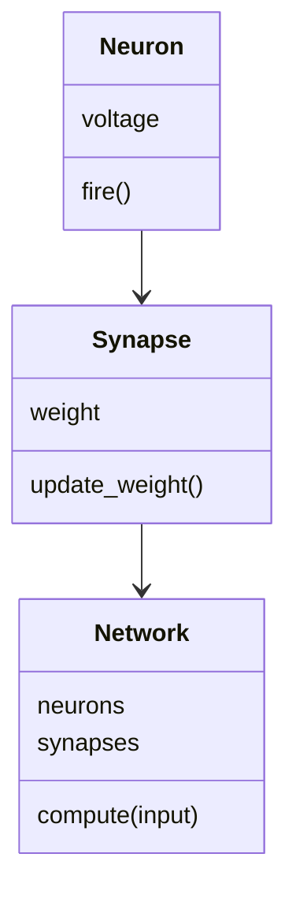
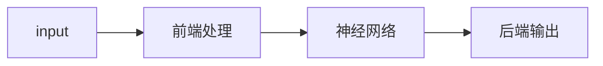

                 


# 如何识别企业的神经形态计算芯片优势

## 关键词：神经形态芯片，企业优势识别，AI计算，能效优化，硬件加速，边缘计算，生物启发计算

## 摘要：神经形态计算芯片是一种模拟生物神经系统的计算芯片，具有高效能比和强大的并行计算能力。本文将详细探讨神经形态芯片的核心概念、算法原理、系统架构设计以及在企业中的应用案例，帮助读者识别和理解其优势，为企业在AI和边缘计算领域的技术选型提供参考。

---

## 第一部分：神经形态计算芯片的背景与概述

### 第1章：神经形态计算芯片概述

#### 1.1 神经形态计算芯片的定义与背景
神经形态计算芯片是一种模拟生物神经系统结构和功能的计算芯片，旨在通过模拟人脑的神经元和突触来实现高效的信息处理。与传统冯·诺依曼架构的计算机相比，神经形态芯片在处理复杂任务时表现出更高的能效和并行计算能力。随着AI技术的快速发展，神经形态芯片在机器学习、模式识别和边缘计算等领域展现出巨大潜力。

#### 1.2 神经形态计算芯片的优势
- **高能效比**：神经形态芯片通过模拟生物神经系统，大幅降低了计算的能量消耗，特别适合边缘计算场景。
- **强大的并行计算能力**：基于神经网络的并行处理能力，神经形态芯片在处理复杂任务时表现出色。
- **适用于AI和边缘计算**：神经形态芯片在AI推理和边缘计算中的应用，能够显著提升计算效率和降低延迟。

#### 1.3 企业应用神经形态芯片的必要性
- **提升企业AI能力**：通过引入神经形态芯片，企业可以更高效地处理AI任务，提升整体竞争力。
- **降低计算成本**：高能效比的神经形态芯片能够显著降低企业的运营成本。
- **未来的行业应用前景**：随着技术的成熟，神经形态芯片将在更多领域得到广泛应用。

---

### 第2章：神经形态计算芯片的核心概念与联系

#### 2.1 生物神经元模型
生物神经元是神经系统的基本单元，主要由树突、胞体和轴突组成。神经元通过电化学信号传递信息，其电活动模型（如LIF模型）是神经形态芯片设计的基础。

#### 2.2 脉冲神经网络（SNN）
脉冲神经网络是一种基于脉冲的计算模型，其特点是在时间维度上处理信息，能够实现动态信息处理。脉冲编码与解码是SNN设计中的关键步骤。

#### 2.3 神经形态芯片的结构与功能
神经形态芯片通常包含神经元电路和突触模型，模拟生物神经元和突触的功能。其结构设计使得芯片能够在硬件级别高效地实现神经网络计算。

#### 2.4 核心概念对比表
以下表格对比了生物神经元和神经形态芯片的关键特性：

| 概念       | 生物神经元特性 | 神经形态芯片特性 |
|------------|----------------|-----------------|
| 结构       | 复杂            | 简化但高效      |
| 信号传递   | 化学信号        | 电脉冲信号      |
| 计算方式   | 并行处理        | 并行处理         |

#### 2.5 实体关系图
以下为生物神经元、突触和神经网络之间的关系图：


---

## 第二部分：神经形态计算芯片的算法原理

### 第3章：神经形态计算芯片的算法原理

#### 3.1 生物神经元模型
生物神经元模型是神经形态芯片设计的基础。常用的模型包括Leaky Integrate-and-Fire（LIF）模型，其数学表达式为：

$$
\frac{dv}{dt} = \frac{v_{\text{rest}} - v}{\tau} + I(t)
$$

其中，$v$是膜电位，$v_{\text{rest}}$是静息电位，$\tau$是时间常数，$I(t)$是输入电流。

#### 3.2 脉冲编码与解码
脉冲编码是将连续信号转换为离散脉冲序列的过程，而脉冲解码则是将脉冲序列还原为原始信号。以下为一种简单的脉冲编码算法示例：

```python
def encode_spike(signal, threshold):
    spike = []
    for s in signal:
        if s >= threshold:
            spike.append(1)
        else:
            spike.append(0)
    return spike
```

#### 3.3 神经网络训练方法
神经网络训练方法包括监督学习和无监督学习。以下为一个简单的监督学习算法示例：

```python
def train_network(network, input_data, target_output, learning_rate):
    output = network.predict(input_data)
    error = target_output - output
    network.update_weights(error, learning_rate)
    return network
```

---

### 第4章：神经形态计算芯片的系统分析与架构设计

#### 4.1 系统功能设计
神经形态计算系统的设计需要考虑系统的输入、处理和输出。以下为系统功能设计的类图：



#### 4.2 系统架构设计
神经形态计算系统的架构设计通常包括前端输入、神经网络处理和后端输出。以下为系统架构的示意图：



---

## 第三部分：神经形态计算芯片的项目实战

### 第5章：项目实战

#### 5.1 环境安装
以下是安装神经形态计算芯片开发环境的步骤：

```bash
pip install numpy
pip install matplotlib
```

#### 5.2 核心代码实现
以下是神经形态芯片的核心代码实现：

```python
import numpy as np

def create_neuron(v_rest, tau):
    def neuron_model(v, I):
        dv = (v_rest - v) / tau + I
        return dv
    return neuron_model

neuron = create_neuron(-70, 10)
v = -70
I = np.random.randn(100)
for i in I:
    dv = neuron(v, i)
    v += dv * 0.1
    if v > -50:
        print("Fired!")
        v = -70
```

#### 5.3 案例分析
通过上述代码实现的神经形态芯片能够模拟神经元的电活动，实现简单的脉冲生成。这为企业在AI和边缘计算中的应用提供了基础。

---

## 第四部分：神经形态计算芯片的最佳实践

### 第6章：最佳实践

#### 6.1 实用建议
- 在选择神经形态芯片时，需考虑企业的具体需求和应用场景。
- 确保开发团队具备相关的专业知识和技能。
- 及时关注技术的最新发展，保持技术的先进性。

#### 6.2 注意事项
- 神经形态芯片的开发具有较高的技术门槛，需谨慎评估项目可行性。
- 确保数据的安全性和隐私性，避免潜在的合规风险。

#### 6.3 拓展阅读
推荐以下书籍和资源：
- 《神经形态计算：原理与应用》
- IEEE神经形态计算期刊
- Google学术搜索关键词：神经形态芯片、脉冲神经网络

---

## 作者：AI天才研究院（AI Genius Institute） & 禅与计算机程序设计艺术（Zen And The Art of Computer Programming）

通过本文的详细分析，读者能够全面了解神经形态计算芯片的优势，并在实际的企业应用中识别和利用这些优势，为企业在AI和边缘计算领域的发展提供有力支持。

