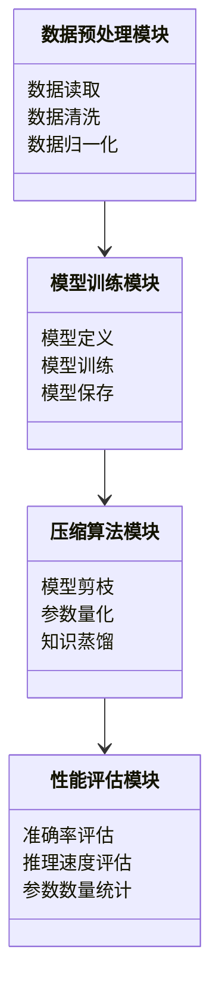
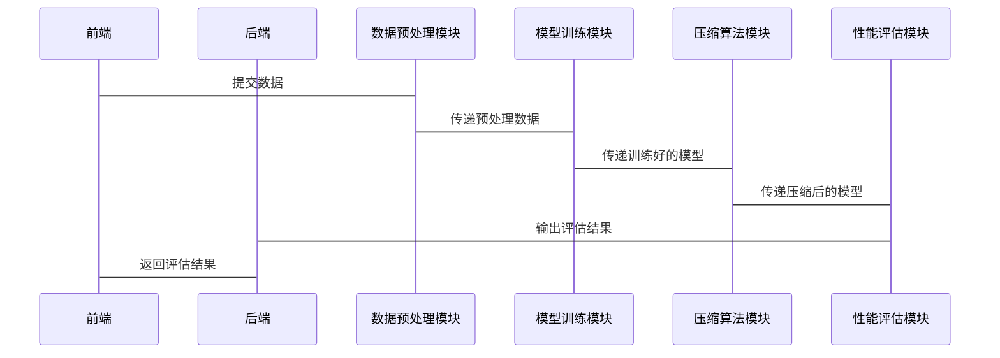

                 


# 如何识别企业的神经网络压缩技术优势

> 关键词：神经网络压缩技术、模型优化、深度学习、企业应用、算法优化

> 摘要：神经网络压缩技术是深度学习领域的重要研究方向，旨在通过减少模型的复杂度和计算资源消耗，提升模型在实际应用场景中的性能和效率。本文从企业视角出发，详细分析神经网络压缩技术的核心概念、算法原理、系统架构设计及实战案例，帮助读者识别和理解企业在应用神经网络压缩技术时的优势与挑战。通过本文的学习，读者将能够掌握神经网络压缩技术的关键点，并能够将其应用到实际的企业场景中。

---

## 第一部分: 神经网络压缩技术背景与核心概念

### 第1章: 神经网络压缩技术概述

#### 1.1 神经网络压缩技术的定义与背景
##### 1.1.1 神经网络压缩技术的定义
神经网络压缩技术（Neural Network Compression Technology）是指通过各种算法和优化方法，减少深度学习模型的参数数量、计算复杂度和存储空间，同时保持或提升模型性能的技术。其核心目标是在保证模型准确性的前提下，降低模型的资源消耗，使其能够在资源受限的环境中高效运行。

##### 1.1.2 神经网络压缩技术的发展背景
随着深度学习技术的快速发展，神经网络模型的规模越来越大，模型参数数量呈指数级增长。例如，现代大型语言模型（如GPT-3）的参数数量已超过1750亿。这种规模的模型在实际应用中面临着计算资源不足、存储空间受限和计算效率低下的问题。因此，如何有效地压缩神经网络模型，降低其资源消耗，同时保持或提升模型性能，成为当前深度学习领域的研究热点。

##### 1.1.3 神经网络压缩技术的核心目标
神经网络压缩技术的核心目标包括：
1. **减少模型参数数量**：通过剪枝、量化等方式，降低模型的参数数量。
2. **降低计算复杂度**：通过模型结构优化和算法改进，减少模型的计算量。
3. **提升模型部署效率**：使模型能够在资源受限的环境中高效运行，如移动端、边缘设备等。

#### 1.2 神经网络压缩技术的优势与挑战
##### 1.2.1 神经网络压缩技术的优势
1. **降低计算成本**：通过压缩模型，减少训练和推理的计算资源消耗。
2. **提升部署效率**：使模型能够在低配置设备上运行，扩大应用场景。
3. **提高模型泛化能力**：通过模型剪枝等方法，去除冗余参数，提升模型的泛化能力。

##### 1.2.2 神经网络压缩技术的挑战
1. **压缩过程中性能损失**：压缩模型可能导致模型性能下降，如何在压缩和性能之间找到平衡是关键。
2. **模型压缩的复杂性**：不同场景下的模型压缩方法不同，如何选择合适的压缩算法是挑战。
3. **压缩后的模型可解释性**：压缩后的模型可能难以解释其决策过程，影响实际应用中的信任度。

##### 1.2.3 企业应用神经网络压缩技术的潜在价值
1. **提升企业核心竞争力**：通过压缩技术优化模型，使企业在同等资源下获得更好的模型性能。
2. **降低企业运营成本**：减少计算资源消耗，降低能源消耗和硬件成本。
3. **拓展应用场景**：使模型能够在更多场景下部署，提升企业业务覆盖范围。

#### 1.3 企业神经网络压缩技术的应用场景
##### 1.3.1 移动端应用中的神经网络压缩
在移动端应用中，计算资源和存储空间有限，压缩技术能够帮助模型在手机等设备上高效运行，提升用户体验。

##### 1.3.2 边缘计算中的神经网络压缩
在边缘计算场景中，模型需要在本地设备上快速响应，压缩技术能够减少延迟，提升计算效率。

##### 1.3.3 云计算中的神经网络压缩
在云计算环境中，压缩技术可以帮助企业降低计算资源消耗，提升云服务的性价比。

---

### 第2章: 神经网络压缩技术的核心概念与联系

#### 2.1 神经网络压缩算法的原理
##### 2.1.1 神经网络压缩算法的基本原理
神经网络压缩算法的核心在于通过去除冗余信息、降低模型复杂度等方式，减少模型的资源消耗。常见的压缩方法包括：
1. **模型剪枝**：去除模型中冗余的神经元或权重。
2. **参数量化**：将模型参数从高精度（如浮点数）降低到低精度（如整数）。
3. **知识蒸馏**：通过教师模型指导学生模型，使学生模型在保持性能的同时减少参数数量。

##### 2.1.2 常见的神经网络压缩算法分类
神经网络压缩算法可以分为以下几类：
- **基于剪枝的压缩算法**：如Magnitude-Based Pruning、SNIP等。
- **基于量化的压缩算法**：如Quantization、DoReQuant等。
- **基于蒸馏的压缩算法**：如Distillation、FitNets等。
- **混合压缩算法**：结合多种压缩方法，如剪枝+量化。

##### 2.1.3 神经网络压缩算法的优缺点对比
| 压缩算法 | 优点 | 缺点 |
|----------|------|------|
| 剪枝     | 参数减少显著，计算效率提升 | 可能导致性能下降，选择合适的剪枝策略难度较高 |
| 量化     | 存储空间减少，计算速度提升 | 量化误差可能导致性能损失 |
| 蒸馏     | 学生模型参数减少，性能接近教师模型 | 教师模型需要额外训练，计算成本较高 |

---

#### 2.2 神经网络压缩技术的核心要素
##### 2.2.1 模型剪枝
模型剪枝是通过去除模型中冗余的权重或神经元，减少模型的参数数量。剪枝的过程通常包括以下步骤：
1. **模型训练**：训练原始模型，获得较高的性能。
2. **计算重要性分数**：评估每个权重或神经元的重要性，通常使用梯度或特征重要性分数。
3. **剪枝操作**：去除重要性分数较低的权重或神经元。
4. **重新训练**：对剪枝后的模型进行微调，恢复性能。

##### 2.2.2 参数量化
参数量化是将模型中的高精度参数（如32位浮点数）降低到低精度（如8位整数）。量化可以显著减少模型的存储空间，同时提升计算速度。常见的量化方法包括：
- **均匀量化**：将参数值均匀地映射到低精度表示。
- **非均匀量化**：根据参数分布，调整量化区间，减少量化误差。

##### 2.2.3 知识蒸馏
知识蒸馏是通过教师模型指导学生模型，使学生模型在保持性能的同时减少参数数量。教师模型通常是一个大模型，而学生模型是一个小模型。蒸馏的过程包括：
1. **教师模型训练**：训练一个高性能的教师模型。
2. **学生模型训练**：通过最小化学生模型预测与教师模型预测之间的差异，训练学生模型。
3. **蒸馏过程优化**：调整温度参数和其他超参数，优化蒸馏效果。

---

#### 2.3 神经网络压缩技术的数学模型与公式
##### 2.3.1 模型复杂度的数学表达
模型复杂度通常可以用模型的参数数量和计算量来衡量。模型的参数数量可以表示为：
$$
\text{参数数量} = \sum_{i=1}^{L} n_i
$$
其中，$L$ 表示模型的层数，$n_i$ 表示第 $i$ 层的参数数量。

##### 2.3.2 压缩算法的数学推导
以模型剪枝为例，假设我们有一个线性层的权重矩阵 $W \in \mathbb{R}^{m \times n}$，其中 $m$ 是输入特征的数量，$n$ 是输出特征的数量。剪枝的目标是通过计算每个权重的绝对值，选择保留绝对值较大的权重：
$$
\text{保留权重} = \{w_{ij} | |w_{ij}| \geq \theta\}
$$
其中，$\theta$ 是剪枝阈值。

##### 2.3.3 压缩效果的评估指标
常见的压缩效果评估指标包括：
1. **参数压缩率**：压缩后的参数数量与原始参数数量的比值。
2. **模型准确率**：压缩后模型的准确率与原始模型的准确率的比值。
3. **推理速度提升**：压缩后模型的推理速度与原始模型的推理速度的比值。

---

#### 2.4 本章小结
本章详细介绍了神经网络压缩技术的核心概念和算法原理，包括模型剪枝、参数量化和知识蒸馏等方法。通过对比不同压缩算法的优缺点，帮助读者理解如何选择适合企业应用场景的压缩技术。

---

## 第3章: 神经网络压缩算法原理与实现

### 第3.1 神经网络压缩算法的分类与选择
#### 3.1.1 剪枝算法
剪枝算法通过去除模型中的冗余权重或神经元，减少模型的参数数量。常见的剪枝算法包括Magnitude-Based Pruning和SNIP。

#### 3.1.2 量化算法
量化算法通过降低模型参数的精度，减少模型的存储空间和计算时间。常见的量化算法包括Quantization和DoReQuant。

#### 3.1.3 蒸馏算法
蒸馏算法通过教师模型指导学生模型，使学生模型在保持性能的同时减少参数数量。常见的蒸馏算法包括Distillation和FitNets。

#### 3.1.4 混合压缩算法
混合压缩算法结合多种压缩方法，如剪枝+量化，以达到更好的压缩效果。

---

### 第3.2 神经网络压缩算法的实现步骤
#### 3.2.1 数据预处理
数据预处理包括数据清洗、归一化和数据增强等步骤，确保数据的质量和一致性。

#### 3.2.2 模型训练
训练原始模型，获得较高的性能。通常使用深度学习框架（如TensorFlow或PyTorch）进行模型训练。

#### 3.2.3 压缩过程
根据选择的压缩算法，对模型进行压缩。例如，使用剪枝算法去除冗余权重。

#### 3.2.4 压缩后模型的评估
评估压缩后模型的性能，包括准确率、推理速度和参数数量等指标。

---

### 第3.3 神经网络压缩算法的数学模型与公式
#### 3.3.1 剪枝算法的数学表达
假设我们有一个线性层的权重矩阵 $W \in \mathbb{R}^{m \times n}$，剪枝的过程可以表示为：
$$
W_{\text{compressed}} = \{w_{ij} | |w_{ij}| \geq \theta\}
$$
其中，$\theta$ 是剪枝阈值。

#### 3.3.2 量化算法的数学推导
量化的过程可以表示为：
$$
Q(w) = \text{quantize}(w, \text{bitwidth})
$$
其中，$\text{quantize}$ 表示量化函数，$\text{bitwidth}$ 表示量化位数。

#### 3.3.3 蒸馏算法的数学模型
蒸馏的过程可以表示为：
$$
L = \alpha L_{\text{CE}} + (1-\alpha) L_{\text{KL}}
$$
其中，$L_{\text{CE}}$ 是交叉熵损失，$L_{\text{KL}}$ 是KL散度损失，$\alpha$ 是平衡系数。

---

### 第3.4 本章小结
本章详细介绍了神经网络压缩算法的分类、实现步骤和数学模型，帮助读者理解如何选择和实现适合企业需求的压缩算法。

---

## 第4章: 神经网络压缩技术的系统分析与架构设计

### 第4.1 神经网络压缩系统的功能设计
#### 4.1.1 系统功能模块划分
神经网络压缩系统通常包括数据预处理模块、模型训练模块、压缩算法模块和性能评估模块。

#### 4.1.2 系统功能模块的具体实现
- **数据预处理模块**：读取数据集，进行数据清洗和归一化。
- **模型训练模块**：训练原始模型，获得较高的性能。
- **压缩算法模块**：根据选择的压缩算法，对模型进行压缩。
- **性能评估模块**：评估压缩后模型的性能，包括准确率、推理速度和参数数量等指标。

#### 4.1.3 系统功能模块的交互流程
1. 数据预处理模块将数据传递给模型训练模块。
2. 模型训练模块训练原始模型，并将模型权重传递给压缩算法模块。
3. 压缩算法模块对模型进行压缩，并将压缩后的模型传递给性能评估模块。
4. 性能评估模块评估压缩后模型的性能，并输出结果。

---

### 第4.2 神经网络压缩系统的架构设计
#### 4.2.1 项目场景介绍
假设我们有一个图像分类任务，需要在移动端设备上部署深度学习模型。由于设备资源有限，我们需要对模型进行压缩，使其能够在设备上高效运行。

#### 4.2.2 系统功能设计
- **领域模型设计**：使用Mermaid类图展示系统功能模块之间的关系。


#### 4.2.3 系统架构设计
- **系统架构图**：使用Mermaid架构图展示系统的整体架构。


#### 4.2.4 系统接口设计
- **接口描述**：
  - 前端与后端之间的接口：用于传递数据和模型。
  - 后端内部接口：用于模块之间的通信。

#### 4.2.5 系统交互流程
- **交互流程图**：使用Mermaid序列图展示系统的交互流程。


---

### 第4.3 本章小结
本章从系统设计的角度，详细介绍了神经网络压缩系统的功能设计、架构设计和交互流程，帮助读者理解如何将压缩技术应用于实际的企业场景中。

---

## 第5章: 神经网络压缩技术的项目实战

### 第5.1 项目环境安装
#### 5.1.1 安装深度学习框架
- **TensorFlow**：使用pip安装：
  ```bash
  pip install tensorflow
  ```
- **PyTorch**：使用pip安装：
  ```bash
  pip install torch
  ```

#### 5.1.2 安装其他依赖库
根据具体项目需求，安装其他依赖库，例如：
- **numpy**：用于数值计算。
- **scikit-learn**：用于模型评估。

### 第5.2 系统核心实现源代码
#### 5.2.1 模型剪枝的实现代码
```python
import tensorflow as tf
from tensorflow.keras import layers

def model_pruning(model, pruning_rate=0.5):
    weights = model.trainable_weights
    # 计算权重的绝对值
    weight_magnitudes = [tf.abs(w) for w in weights]
    # 计算权重的平均值
    avg_magnitude = tf.reduce_mean(weight_magnitudes)
    # 确定剪枝阈值
    threshold = tf.multiply(avg_magnitude, pruning_rate)
    # 剪枝操作
    pruned_weights = [tf.where(tf.greater(w, threshold), w, tf.zeros_like(w)) for w in weights]
    # 创建新模型
    new_model = tf.keras.Model(inputs=model.inputs, outputs=model.outputs)
    # 将剪枝后的权重赋值给新模型
    for w, pw in zip(weights, pruned_weights):
        w.assign(pw)
    return new_model
```

#### 5.2.2 参数量化的实现代码
```python
import numpy as np

def parameter_quantization(model, bit_width=8):
    # 获取模型权重
    weights = model.get_weights()
    quantized_weights = []
    for w in weights:
        # 计算量化区间
        max_val = np.max(w)
        min_val = np.min(w)
        quantization_interval = (max_val - min_val) / (2**bit_width - 1)
        # 量化权重
        quantized_w = np.round((w - min_val) / quantization_interval) * quantization_interval + min_val
        quantized_weights.append(quantized_w)
    # 更新模型权重
    model.set_weights(quantized_weights)
```

#### 5.2.3 知识蒸馏的实现代码
```python
import tensorflow as tf
from tensorflow.keras import layers

def knowledge_distillation(teacher_model, student_model, alpha=0.5, temperature=3.0):
    # 定义蒸馏损失函数
    def distillation_loss(y_true, y_pred):
        # 计算教师模型预测值
        teacher_logits = teacher_model(y_true)
        # 计算学生模型预测值
        student_logits = y_pred
        # 计算KL散度
        kl_div = tf.keras.losses.KLDivergence(reduction=tf.keras.losses.Reduction.NONE)(teacher_logits, student_logits)
        # 加权平均损失
        total_loss = alpha * tf.reduce_mean(kl_div) + (1 - alpha) * tf.keras.losses.sparse_categorical_crossentropy(y_true, y_pred)
        return total_loss
    # 编译学生模型
    student_model.compile(optimizer='adam', loss=distillation_loss, metrics=['accuracy'])
    # 训练学生模型
    student_model.fit(x_train, y_train, epochs=10, batch_size=32, validation_data=(x_val, y_val))
    return student_model
```

### 第5.3 代码应用解读与分析
- **模型剪枝代码解读**：
  该代码通过计算权重的绝对值，确定剪枝阈值，并对权重进行剪枝操作，最终生成一个轻量级的模型。

- **参数量化代码解读**：
  该代码通过将模型权重量化到指定的位数，减少权重的存储空间和计算量。

- **知识蒸馏代码解读**：
  该代码通过教师模型和学生模型的预测值，计算KL散度损失，最终训练出一个性能接近教师模型的学生模型。

### 第5.4 实际案例分析
假设我们有一个图像分类任务，使用ResNet-50作为教师模型，MobileNet作为学生模型。通过知识蒸馏，我们可以在保持分类准确率的前提下，将模型的参数数量从2600万减少到500万。

### 第5.5 项目小结
通过本章的实战案例，读者可以了解如何在实际项目中应用神经网络压缩技术，包括环境安装、代码实现和案例分析。

---

## 第6章: 神经网络压缩技术的最佳实践

### 第6.1 神经网络压缩技术的注意事项
1. **选择合适的压缩算法**：根据具体场景选择适合的压缩算法，如移动端应用适合剪枝+量化。
2. **平衡性能与资源消耗**：在压缩过程中，需要在模型性能和资源消耗之间找到平衡。
3. **模型压缩后的优化**：压缩后的模型可能需要进一步优化，如量化后的权重调整。

### 第6.2 神经网络压缩技术的小结
神经网络压缩技术是深度学习领域的重要研究方向，通过减少模型的参数数量和计算复杂度，可以显著提升模型在实际应用场景中的性能和效率。

### 第6.3 神经网络压缩技术的注意事项
1. **压缩后的模型可解释性**：压缩后的模型可能难以解释其决策过程，影响实际应用中的信任度。
2. **压缩算法的适用性**：不同的压缩算法适用于不同的场景，需要根据具体需求选择合适的算法。
3. **压缩后的模型兼容性**：压缩后的模型需要与目标设备和框架兼容，确保能够顺利部署和运行。

### 第6.4 神经网络压缩技术的拓展阅读
1. **经典论文**：
   - "The Lottery Ticket Hypothesis: Finding the Critical Parameters of Deep Neural Networks"（剪枝相关）
   - "Quantization and Training of Neural Networks for Efficient Integer-Arithmetic-Only Inference"（量化相关）
   - "知识蒸馏的论文"（蒸馏相关）

2. **工具与库**：
   - **TensorFlow Model Optimization (TF-MO)**：Google提供的模型优化工具。
   - **PyTorch Lightning**：支持模型压缩和优化的深度学习框架。
   - **OpenVINO**：Intel提供的模型优化和推理加速工具。

---

## 作者：AI天才研究院/AI Genius Institute & 禅与计算机程序设计艺术 /Zen And The Art of Computer Programming

---

# 本文结束

