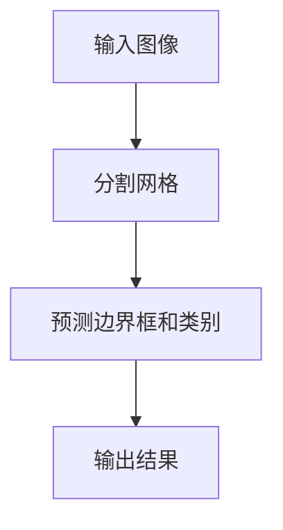
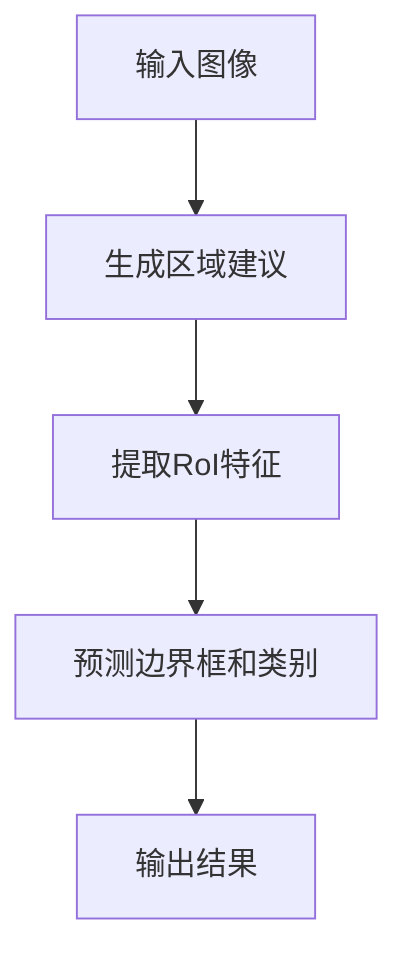
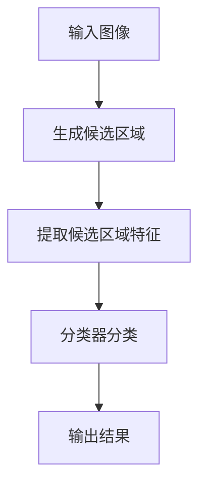
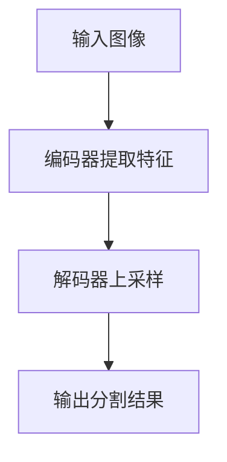
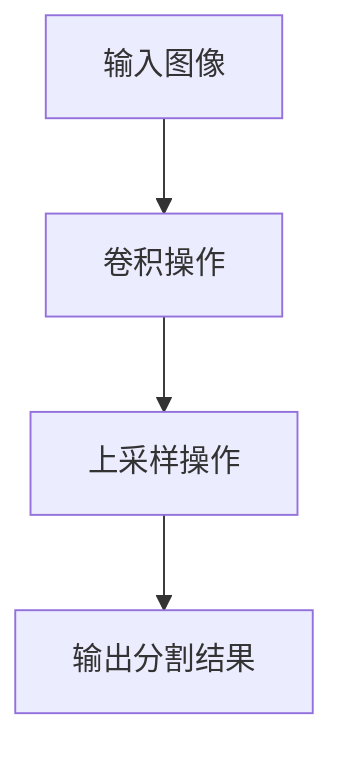
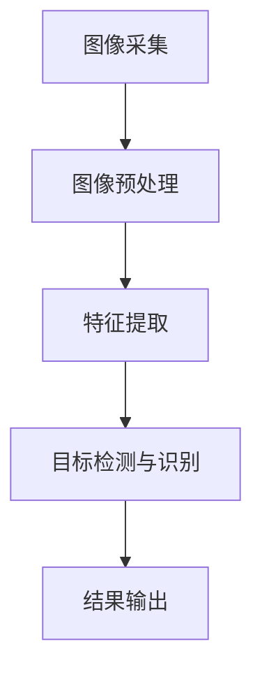
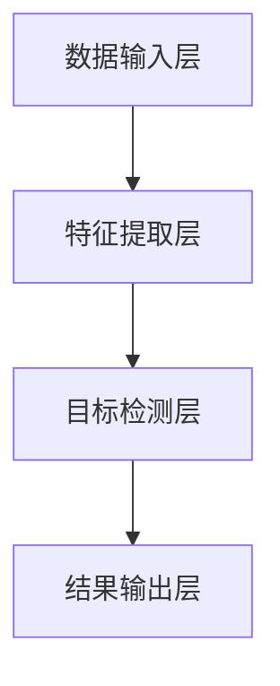

                 


# 如何识别企业的计算机视觉技术优势

## 关键词：计算机视觉，技术优势，图像处理，目标检测，深度学习，系统架构

## 摘要：本文深入分析了计算机视觉技术的核心概念、算法原理及其在企业中的应用优势。通过详细的技术解析和实际案例，展示了如何识别和利用计算机视觉技术为企业创造价值。

---

## 第一部分: 引言

### 1. 计算机视觉的定义与重要性

计算机视觉（Computer Vision）是人工智能领域中的一个重要分支，致力于让计算机能够“看懂”图像和视频。通过分析图像中的像素信息，计算机视觉技术能够识别、理解和处理视觉信息，从而实现自动化决策和操作。

在企业中，计算机视觉技术的应用可以帮助提高生产效率、优化产品质量、降低成本，并在多个行业（如制造业、医疗、零售等）中创造巨大价值。然而，许多企业在实施计算机视觉技术时会面临技术选型、系统设计和实际应用等方面的挑战。因此，识别和理解企业的计算机视觉技术优势是成功应用的关键。

---

## 第二部分: 计算机视觉技术概述

### 2.1 计算机视觉的核心技术

计算机视觉技术的核心在于图像处理和模式识别。以下是计算机视觉的几个关键组成部分：

1. **图像处理**：包括图像的采集、增强、分割和特征提取等操作。
2. **目标检测与识别**：通过算法检测图像中的目标物体，并进行分类和识别。
3. **图像分割**：将图像分割成多个区域，每个区域代表不同的物体或背景。
4. **深度学习**：基于神经网络的深度学习算法（如CNN、R-CNN等）在计算机视觉任务中表现出色。

#### 2.1.1 图像处理技术

图像处理是计算机视觉的基础，主要包括以下步骤：

1. **图像采集**：通过摄像头或传感器获取图像数据。
2. **图像增强**：对图像进行噪声去除、对比度调整等操作，以提高图像质量。
3. **图像分割**：将图像分割成多个区域，每个区域代表不同的物体或背景。
4. **特征提取**：从图像中提取有助于目标识别的关键特征。

#### 2.1.2 目标检测与识别

目标检测和识别是计算机视觉的核心任务之一。目标检测不仅需要定位目标的位置，还需要识别目标的类别。深度学习算法（如YOLO、Faster R-CNN等）在目标检测任务中表现优异。

#### 2.1.3 深度学习与计算机视觉

深度学习（Deep Learning）是计算机视觉领域的革命性技术。基于卷积神经网络（CNN）的深度学习模型能够自动提取图像特征，并在目标检测、图像分割等任务中表现出色。

---

## 第三部分: 计算机视觉的核心算法解析

### 3.1 基于CNN的目标检测算法

卷积神经网络（CNN）是计算机视觉领域的重要工具。以下是几种经典的基于CNN的目标检测算法：

#### 3.1.1 YOLO算法

YOLO（You Only Look Once）是一种基于深度学习的目标检测算法，以其高效性和实时性著称。YOLO将图像分为多个网格，每个网格负责检测特定的目标。

##### YOLO算法流程图



#### 3.1.2 Faster R-CNN算法

Faster R-CNN是一种经典的两阶段目标检测算法，主要包括区域建议网络（RPN）和目标检测网络两个部分。

##### Faster R-CNN算法流程图



#### 3.1.3 R-CNN算法

R-CNN是一种基于区域的卷积神经网络，主要应用于目标检测任务。R-CNN算法包括以下步骤：

##### R-CNN算法流程图



### 3.2 图像分割算法

图像分割是将图像分割成多个区域，每个区域代表不同的物体或背景。以下是几种经典的图像分割算法：

#### 3.2.1 U-Net网络

U-Net是一种经典的图像分割网络，广泛应用于医学图像分割任务。U-Net网络由编码器和解码器两部分组成，编码器提取图像特征，解码器将特征映射回原始图像尺寸。

##### U-Net网络结构图



#### 3.2.2 FCN网络

FCN（Fully Convolutional Networks）是一种全卷积网络，主要用于图像分割任务。FCN通过将卷积操作应用于整个图像，实现端到端的图像分割。

##### FCN网络结构图



---

## 第四部分: 计算机视觉系统的架构设计

### 4.1 系统功能设计

计算机视觉系统的功能设计包括以下几个方面：

1. **图像采集**：通过摄像头或传感器获取图像数据。
2. **图像预处理**：对图像进行增强、归一化等处理。
3. **特征提取**：使用CNN等算法提取图像特征。
4. **目标检测与识别**：基于提取的特征进行目标检测和分类。
5. **结果输出**：输出检测结果或分割结果。

#### 4.1.1 系统功能设计图



### 4.2 系统架构设计

计算机视觉系统的架构设计包括以下几个部分：

1. **数据输入层**：接收图像数据。
2. **特征提取层**：使用CNN等算法提取图像特征。
3. **目标检测层**：基于提取的特征进行目标检测和分类。
4. **结果输出层**：输出检测结果或分割结果。

#### 4.2.1 系统架构设计图



---

## 第五部分: 项目实战

### 5.1 环境安装

在进行计算机视觉项目之前，需要安装以下环境：

1. **Python**：推荐使用Python 3.6及以上版本。
2. **深度学习框架**：如TensorFlow、Keras、PyTorch等。
3. **图像处理库**：如OpenCV、 Pillow等。
4. **深度学习模型库**：如YOLO、Faster R-CNN等。

### 5.2 核心代码实现

以下是基于YOLO算法的目标检测代码示例：

#### 5.2.1 YOLO目标检测代码

```python
import cv2
import numpy as np

# 加载YOLO模型
net = cv2.dnn.readNet("yolov3.weights", "yolov3.cfg")
layers = net.getLayerNames()
outputlayers = [layers[i] for i in [net.getUnconnectedOutLayers()[0]-1, net.getUnconnectedOutLayers()[1]-1]]

# 读取输入图像
img = cv2.imread("input.jpg")
height, width = img.shape[:2]

# 剩余部分的代码实现...
```

#### 5.2.2 图像分割代码

以下是基于U-Net网络的图像分割代码示例：

```python
import tensorflow as tf
from tensorflow.keras import layers

# 定义U-Net网络
def unet_model(input_shape):
    inputs = layers.Input(shape=input_shape)
    conv1 = layers.Conv2D(64, 3, padding='same', activation='relu')(inputs)
    conv2 = layers.Conv2D(64, 3, padding='same', activation='relu')(conv1)
    pool1 = layers.MaxPooling2D(pool_size=(2, 2))(conv2)
    # 剩余部分的代码实现...
```

### 5.3 案例分析

#### 5.3.1 零售业中的应用

在零售业中，计算机视觉技术可以用于商品识别和库存管理。通过安装摄像头，系统可以自动识别货架上的商品，并实时更新库存信息。

#### 5.3.2 医疗健康领域的应用

在医疗健康领域，计算机视觉技术可以用于医学图像分析，如肿瘤检测、器官分割等。通过深度学习算法，系统可以辅助医生进行诊断和治疗计划。

---

## 第六部分: 总结与展望

### 6.1 总结

本文深入分析了计算机视觉技术的核心概念、算法原理及其在企业中的应用优势。通过详细的技术解析和实际案例，展示了如何识别和利用计算机视觉技术为企业创造价值。

### 6.2 未来展望

随着深度学习和人工智能技术的不断发展，计算机视觉技术将在更多领域得到应用。未来的研究方向包括提高算法的实时性和准确性，探索新的应用场景，以及优化系统的硬件性能。

---

## 作者信息

作者：AI天才研究院/AI Genius Institute & 禅与计算机程序设计艺术 /Zen And The Art of Computer Programming

---

以上是《如何识别企业的计算机视觉技术优势》的完整目录和文章内容。通过本文，读者可以全面了解计算机视觉技术的核心概念、算法原理及其在企业中的应用优势，并通过实际案例和项目实战，掌握如何识别和利用计算机视觉技术为企业创造价值。

