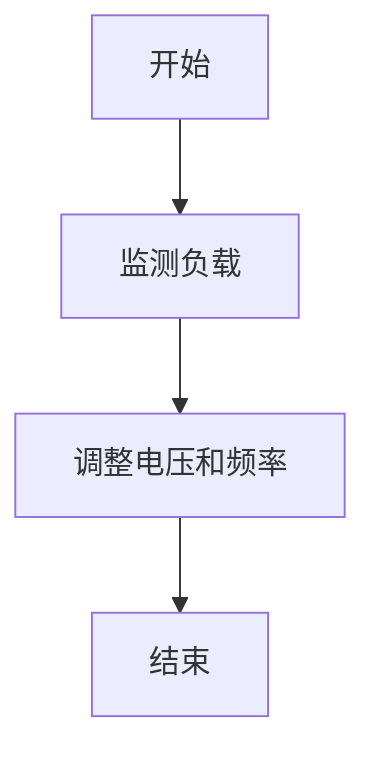
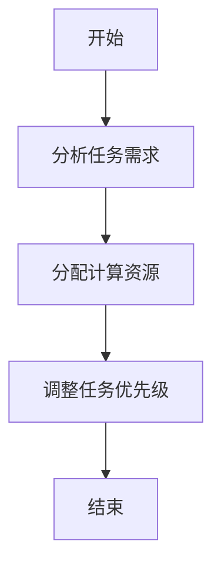
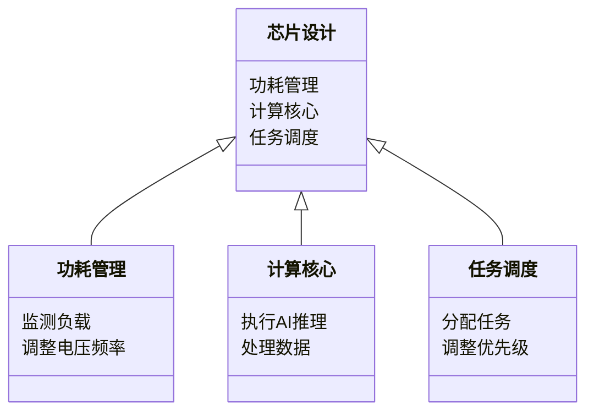
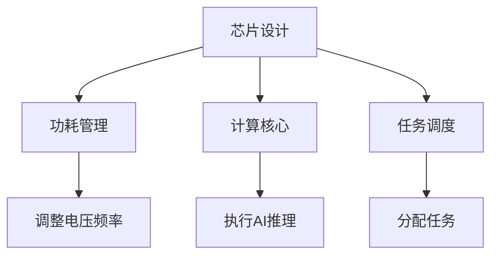
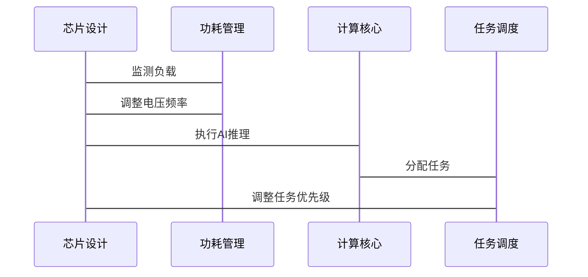

                 


# 如何识别企业的边缘AI芯片低功耗设计优势

> 关键词：边缘AI芯片，低功耗设计，系统架构，算法优化，项目实战

> 摘要：本文将深入探讨边缘AI芯片低功耗设计的优势，通过系统化的分析和实际案例，帮助读者理解如何识别和优化边缘AI芯片的低功耗设计。文章将从背景介绍、核心概念、算法原理、系统架构、项目实战等多个方面展开，结合丰富的图表和代码示例，为读者提供全面的技术指导。

---

# 第一部分: 边缘AI芯片低功耗设计背景与概念

## 第1章: 边缘计算与AI芯片概述

### 1.1 边缘计算的发展历程

#### 1.1.1 边缘计算的定义与特点
- 边缘计算是一种分布式计算范式，将计算能力从云端迁移到靠近数据源的边缘设备。
- 边缘计算的特点：实时性、低延迟、本地化处理、资源受限。

#### 1.1.2 边缘计算的应用场景
- 智能制造：工业物联网、实时监控。
- 智慧城市：交通管理、环境监测。
- 智能医疗：实时健康监测、远程手术。

#### 1.1.3 边缘计算与云计算的区别与联系
- 区别：边缘计算强调实时性和本地化处理，云计算强调集中化和大规模数据处理。
- 联系：边缘计算可以作为云计算的补充，通过边缘设备处理部分数据，减轻云端负担。

### 1.2 AI芯片的兴起

#### 1.2.1 AI芯片的定义与分类
- AI芯片：专为AI任务设计的硬件，包括GPU、TPU、NPU等。
- 分类：通用AI芯片（如GPU）和专用AI芯片（如NPU）。

#### 1.2.2 AI芯片的主要技术特点
- 高并行计算能力：适合矩阵运算。
- 专用指令集：优化AI算法的执行效率。
- 能效比高：在保证性能的同时，降低功耗。

#### 1.2.3 AI芯片在边缘计算中的应用
- 边缘设备中的AI推理：如智能摄像头、自动驾驶中的实时推理。
- 边缘计算中的数据预处理：如图像压缩、特征提取。

### 1.3 低功耗设计的重要性

#### 1.3.1 边缘设备的功耗挑战
- 边缘设备通常依赖电池或本地电源，功耗过高会缩短续航时间或增加运营成本。
- 低功耗设计可以延长设备的运行时间，减少维护成本。

#### 1.3.2 低功耗设计对设备性能的影响
- 功耗降低意味着设备可以在更长的时间内运行，提高可用性。
- 低功耗设计优化了硬件资源的利用，提升了整体性能。

#### 1.3.3 低功耗设计对成本和可持续性的优势
- 低功耗设计减少了能源消耗，降低了运营成本。
- 符合绿色 computing 的理念，有助于可持续发展。

### 1.4 本章小结
本章介绍了边缘计算的发展历程、AI芯片的兴起及其在边缘计算中的应用，强调了低功耗设计在边缘AI芯片中的重要性。

---

## 第2章: 边缘AI芯片低功耗设计的核心概念

### 2.1 边缘AI芯片的低功耗设计原理

#### 2.1.1 功耗计算的基本公式
- 功耗公式：\( P = V \times F + \text{漏电流} \)
- 动态电压频率调整：通过降低电压和频率来降低功耗。

#### 2.1.2 低功耗设计的关键技术
- 动态电压频率调节（DVFS）：根据负载调整电压和频率。
- 睿智电源管理：通过状态机管理芯片的功耗状态。

#### 2.1.3 低功耗设计与芯片架构的关系
- 芯片架构：影响功耗的主要因素包括逻辑单元数量、互连结构、缓存大小等。
- 低功耗设计：优化架构设计，减少不必要的功能，降低功耗。

### 2.2 核心概念对比分析

#### 2.2.1 边缘AI芯片与传统芯片的对比
| 特性             | 边缘AI芯片         | 传统芯片           |
|------------------|-------------------|-------------------|
| 计算能力         | 高                | 中                |
| 功耗             | 低                | 高                |
| 延迟             | 低                | 高                |
| 应用场景         | AI推理、实时处理   | 数据处理、存储     |

#### 2.2.2 低功耗设计与高性能设计的平衡
- 高性能设计：追求计算速度，可能导致高功耗。
- 低功耗设计：在保证性能的前提下，优化功耗。

#### 2.2.3 边缘计算中的功耗优化策略
- 硬件层面：优化电路设计，减少漏电流。
- 软件层面：优化算法，减少计算量。

### 2.3 ER实体关系图
```mermaid
er
    Entity: 芯片设计
    Entity: 功耗
    Entity: 性能
    Entity: 架构
    Entity: 技术
    芯片设计 --> 功耗: 依赖
    芯片设计 --> 性能: 依赖
    芯片设计 --> 架构: 依赖
    芯片设计 --> 技术: 依赖
```

### 2.4 本章小结
本章详细讲解了边缘AI芯片低功耗设计的核心概念，对比了边缘AI芯片与传统芯片的差异，并通过ER图展示了芯片设计与功耗、性能、架构之间的关系。

---

## 第3章: 边缘AI芯片低功耗设计的算法原理

### 3.1 动态电压频率调整算法

#### 3.1.1 算法的基本原理
- DVFS（Dynamic Voltage and Frequency Scaling）：根据工作负载动态调整电压和频率，以降低功耗。

#### 3.1.2 算法的实现步骤
1. 监测当前负载。
2. 根据负载调整电压和频率。
3. 重复上述步骤，实时优化功耗。

#### 3.1.3 算法的优缺点分析
- 优点：能够有效降低功耗。
- 缺点：需要精确的负载监测和动态调整机制。

#### 3.1.4 算法流程图


### 3.2 任务调度算法

#### 3.2.1 算法的基本原理
- 动态任务调度：根据任务优先级和资源情况动态分配计算资源。

#### 3.2.2 算法的实现步骤
1. 分析任务需求。
2. 分配计算资源。
3. 调整任务优先级。

#### 3.2.3 算法的优缺点分析
- 优点：能够提高资源利用率。
- 缺点：需要复杂的任务调度机制。

#### 3.2.4 算法流程图


### 3.3 算法优化策略

#### 3.3.1 功耗模型的建立
- 功耗模型：\( P = a \times F^2 \times V^2 + b \times leakage \)
- 参数解释：a 和 b 是常数，F 是频率，V 是电压，leakage 是漏电流。

#### 3.3.2 功耗优化的目标函数
- 目标函数：最小化功耗 \( P \)。
- 约束条件：满足任务的实时性和性能需求。

#### 3.3.3 功耗优化的约束条件
- 约束条件：任务的完成时间必须小于等于截止时间。

### 3.4 本章小结
本章详细讲解了动态电压频率调整算法和任务调度算法的原理及实现步骤，并通过流程图展示了算法的实现过程。

---

## 第4章: 边缘AI芯片低功耗设计的系统分析与架构设计

### 4.1 问题场景介绍

#### 4.1.1 边缘AI芯片的应用场景
- 智能摄像头：实时图像识别。
- 自动驾驶：实时环境感知。

#### 4.1.2 问题描述
- 边缘设备资源受限，需要在低功耗的前提下完成高效的AI计算。

### 4.2 系统功能设计

#### 4.2.1 领域模型类图


### 4.3 系统架构设计

#### 4.3.1 系统架构图


#### 4.3.2 系统交互序列图


### 4.4 本章小结
本章通过系统功能设计和架构设计，展示了边缘AI芯片低功耗设计的实现过程，并通过类图和序列图详细描述了系统的交互过程。

---

## 第5章: 边缘AI芯片低功耗设计的项目实战

### 5.1 环境安装

#### 5.1.1 安装Python环境
- 安装Python：`python --version`
- 安装依赖库：`pip install numpy`

#### 5.1.2 安装芯片开发环境
- 下载开发工具链：如Xilinx Vitis
- 安装必要的开发库和工具。

### 5.2 系统核心实现源代码

#### 5.2.1 动态电压频率调整算法实现
```python
def dvfs_adjustment(load):
    # 根据负载调整电压和频率
    if load > 0.8:
        # 高负载，提高电压和频率
        voltage = 1.2
        frequency = 800
    else:
        # 低负载，降低电压和频率
        voltage = 1.0
        frequency = 600
    return voltage, frequency
```

#### 5.2.2 任务调度算法实现
```python
def task_scheduling(tasks):
    # 根据任务优先级分配资源
    tasks.sort(key=lambda x: x['priority'])
    resources = []
    for task in tasks:
        resources.append(task)
    return resources
```

### 5.3 代码应用解读与分析

#### 5.3.1 动态电压频率调整算法解读
- 输入：当前负载
- 输出：调整后的电压和频率
- 功能：根据负载动态调整芯片的工作状态，降低功耗。

#### 5.3.2 任务调度算法解读
- 输入：任务列表
- 输出：资源分配结果
- 功能：根据任务优先级分配计算资源，提高资源利用率。

### 5.4 实际案例分析

#### 5.4.1 案例背景
- 案例名称：智能摄像头低功耗设计
- 案例描述：设计一个智能摄像头，实现低功耗的图像识别功能。

#### 5.4.2 案例实现
```python
def main():
    # 初始化芯片设计
    chip_design = ChipDesign()
    # 监测负载
    load = chip_design.monitor_load()
    # 调整电压和频率
    voltage, frequency = dvfs_adjustment(load)
    chip_design.adjust_voltage_frequency(voltage, frequency)
    # 分配任务
    tasks = chip_design.get_tasks()
    resources = task_scheduling(tasks)
    chip_design.allocate_resources(resources)
    # 执行AI推理
    chip_design.run_inference()

if __name__ == "__main__":
    main()
```

#### 5.4.3 案例分析
- 芯片设计初始化：创建芯片设计对象。
- 负载监测：监测当前负载情况。
- 电压频率调整：根据负载调整电压和频率。
- 任务调度：分配计算资源。
- AI推理：执行图像识别任务。

### 5.5 本章小结
本章通过实际案例展示了边缘AI芯片低功耗设计的实现过程，详细解读了核心算法的代码实现，并分析了实际应用中的注意事项。

---

## 第6章: 边缘AI芯片低功耗设计的最佳实践

### 6.1 小结

#### 6.1.1 核心内容回顾
- 边缘计算的发展与AI芯片的兴起。
- 低功耗设计的核心概念与算法原理。
- 系统架构设计与项目实战。

### 6.2 注意事项

#### 6.2.1 设计中的常见问题
- 功耗与性能的平衡。
- 芯片架构与算法优化的结合。

#### 6.2.2 设计中的注意事项
- 硬件与软件的协同设计。
- 功耗模型的准确性。

### 6.3 拓展阅读

#### 6.3.1 推荐书籍
- 《计算机体系结构：量化研究方法》
- 《AI芯片设计与实现》

#### 6.3.2 推荐技术博客
- 博客1：边缘计算技术博客
- 博客2：低功耗设计技术博客

### 6.4 本章小结
本章总结了边缘AI芯片低功耗设计的核心内容，提出了设计中的注意事项，并推荐了相关的拓展阅读资料。

---

## 作者：AI天才研究院/AI Genius Institute & 禅与计算机程序设计艺术 /Zen And The Art of Computer Programming

---

通过以上目录结构，我们可以系统地从背景、概念、算法、架构、实战和最佳实践等多个方面，深入理解边缘AI芯片低功耗设计的优势和实现方法。

