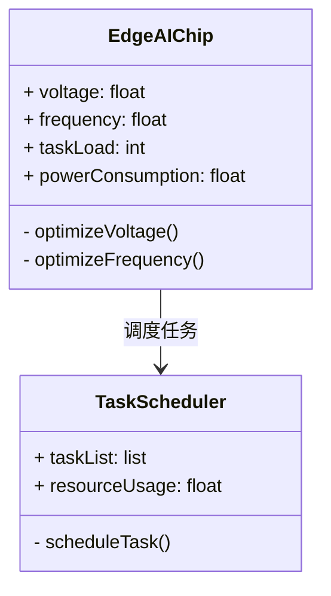
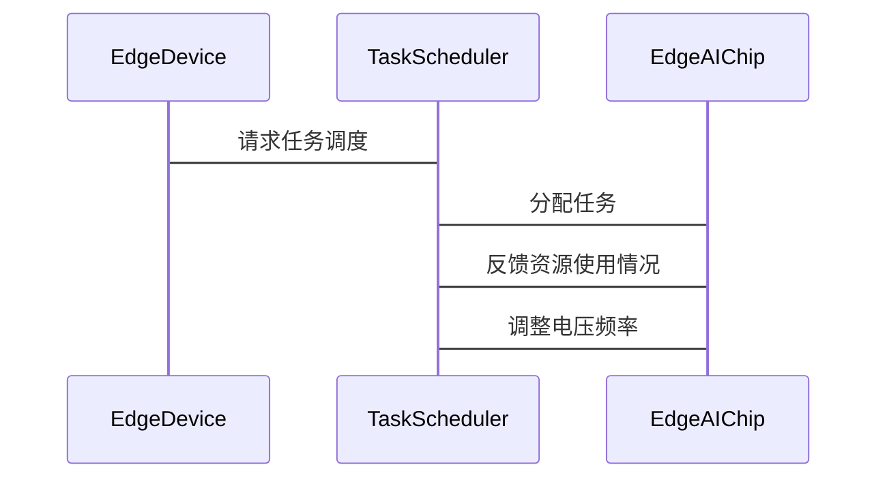

                 


# 如何识别企业的边缘AI芯片低功耗设计优势

## 关键词
- 边缘AI芯片
- 低功耗设计
- 动态电压频率调节
- 任务调度优化
- 稀疏化AI模型
- 边缘计算
- 企业数字化转型

## 摘要
随着人工智能技术的快速发展，边缘AI芯片在企业中的应用越来越广泛。然而，边缘设备的功耗问题一直是限制其性能和普及的主要瓶颈。本文章将详细探讨如何识别和评估边缘AI芯片的低功耗设计优势，从背景介绍、核心概念、算法原理、系统架构到项目实战，全面分析低功耗设计的关键技术与实际应用。通过本文，读者将能够深入理解低功耗设计的重要性，并掌握如何在企业中识别和优化边缘AI芯片的低功耗设计。

---

# 第一部分: 边缘AI芯片低功耗设计背景与核心概念

# 第1章: 边缘AI芯片低功耗设计背景介绍

## 1.1 边缘AI芯片的定义与特点
### 1.1.1 边缘计算的基本概念
边缘计算是一种分布式计算范式，将数据处理从云端转移到靠近数据源的边缘设备。这种模式能够减少延迟、提高数据处理效率，并支持实时决策。

### 1.1.2 边缘AI芯片的核心特点
边缘AI芯片专为边缘计算设计，具备低功耗、高效率、实时性等特点，能够在资源受限的环境中运行复杂的AI任务。

### 1.1.3 低功耗设计的必要性
边缘设备通常依赖电池供电，低功耗设计能够延长设备的续航时间，降低运营成本，并支持更广泛的应用场景。

## 1.2 低功耗设计的背景与挑战
### 1.2.1 边缘设备的功耗问题
边缘设备在运行AI任务时，若功耗过高，会导致设备过热、电池寿命缩短，甚至影响设备的稳定性。

### 1.2.2 低功耗设计的技术挑战
低功耗设计需要在硬件架构、算法优化、任务调度等多个方面进行协同设计，技术复杂性较高。

### 1.2.3 企业对低功耗设计的需求
企业希望边缘AI芯片能够在不影响性能的前提下，具备更低的功耗，从而支持更多的设备部署和更长的运行时间。

## 1.3 本章小结
本章介绍了边缘AI芯片的定义、特点以及低功耗设计的重要性。通过分析边缘计算的背景和技术挑战，读者可以理解为什么低功耗设计在企业中的应用至关重要。

---

# 第2章: 边缘AI芯片低功耗设计的核心概念

## 2.1 核心概念与定义
### 2.1.1 边缘AI芯片的定义
边缘AI芯片是一种专为边缘计算设计的硬件设备，用于在靠近数据源的地方进行AI数据处理。

### 2.1.2 低功耗设计的定义
低功耗设计是指通过优化硬件架构、算法和系统设计，降低芯片的功耗，延长设备续航时间的技术。

### 2.1.3 边缘计算与云计算的区别
边缘计算将数据处理从云端转移到边缘设备，能够减少延迟，提高实时性，而云计算则依赖于中心化的服务器进行数据处理。

## 2.2 核心概念之间的关系
### 2.2.1 边缘AI芯片与低功耗设计的关系
低功耗设计是边缘AI芯片的重要特性之一，能够提升芯片的性能和应用范围。

### 2.2.2 低功耗设计与AI算法优化的关系
通过优化AI算法，可以减少计算量，从而降低芯片的功耗。

### 2.2.3 边缘计算与企业业务场景的关系
边缘计算能够支持企业实时数据处理、快速决策，适用于智能制造、智慧城市等领域。

## 2.3 核心概念对比分析
### 2.3.1 边缘AI芯片与传统芯片的对比
| 特性           | 边缘AI芯片       | 传统芯片         |
|----------------|------------------|------------------|
| 计算能力       | 高               | 中               |
| 功耗           | 低               | 高               |
| 响应速度       | 快               | 慢               |
| 适用场景       | 边缘计算         | 中心化计算       |

### 2.3.2 低功耗设计与高功耗设计的对比
| 特性           | 低功耗设计       | 高功耗设计       |
|----------------|------------------|------------------|
| 功耗           | 低               | 高               |
| 性能           | 中               | 高               |
| 适用场景       | 边缘设备         | 服务器           |

### 2.3.3 边缘计算与雾计算的对比
边缘计算和雾计算都是分布式计算模式，但边缘计算更靠近数据源，雾计算则是在边缘和云端之间提供中间层。

## 2.4 本章小结
本章通过定义和对比分析，明确了边缘AI芯片、低功耗设计以及边缘计算的核心概念，帮助读者理解这些概念之间的关系和区别。

---

# 第3章: 边缘AI芯片低功耗设计的算法原理

## 3.1 动态电压频率调节（DVFS）算法
### 3.1.1 算法原理
动态电压频率调节是一种通过调整芯片的电压和频率来动态优化功耗的技术。当芯片的负载较低时，降低电压和频率以减少功耗；当负载较高时，提高电压和频率以提升性能。

### 3.1.2 算法实现步骤
1. 监测芯片的负载情况。
2. 根据负载情况动态调整电压和频率。
3. 记录调整前后功耗的变化，优化调整策略。

### 3.1.3 算法优化技巧
- 使用高效的负载监测方法。
- 设定合理的电压和频率调整阈值。
- 考虑温度对电压和频率调整的影响。

## 3.2 任务调度优化算法
### 3.2.1 算法原理
任务调度优化算法通过合理分配任务到不同的计算单元，减少资源浪费，降低整体功耗。

### 3.2.2 算法实现步骤
1. 分析任务的计算需求和优先级。
2. 根据资源可用情况动态分配任务。
3. 调整任务的执行顺序以优化资源利用率。

### 3.2.3 算法优化技巧
- 使用优先级调度策略。
- 考虑任务之间的依赖关系。
- 动态调整资源分配策略。

## 3.3 稀疏化AI模型算法
### 3.3.1 算法原理
稀疏化AI模型通过去除模型中的冗余参数，减少计算量，从而降低功耗。

### 3.3.2 算法实现步骤
1. 对AI模型进行训练，得到初始模型。
2. 通过剪枝、量化等方法减少模型参数。
3. 验证优化后的模型性能。

### 3.3.3 算法优化技巧
- 使用高效的剪枝算法。
- 选择合适的量化精度。
- 平衡模型性能和计算效率。

## 3.4 算法实现的数学模型与公式
### 3.4.1 动态电压频率调节公式
$$ E = V^2 \times T $$
其中，E表示功耗，V表示电压，T表示时间。

### 3.4.2 任务调度优化公式
$$ C = \sum_{i=1}^{n} t_i $$
其中，C表示总功耗，\( t_i \)表示任务i的执行时间。

### 3.4.3 稀疏化模型优化公式
$$ S = \lambda \times ||W||_0 $$
其中，S表示稀疏化程度，W表示模型权重，\( ||W||_0 \)表示非零元素的数量，\( \lambda \)为稀疏化参数。

## 3.5 本章小结
本章详细介绍了几种常见的低功耗设计算法，包括动态电压频率调节、任务调度优化和稀疏化AI模型优化，并通过数学公式和流程图展示了它们的实现原理和优化技巧。

---

# 第4章: 边缘AI芯片低功耗设计的系统架构

## 4.1 系统功能设计
### 4.1.1 领域模型类图


### 4.1.2 系统功能模块
1. 动态电压频率调节模块。
2. 任务调度优化模块。
3. 稀疏化AI模型优化模块。

## 4.2 系统架构设计
### 4.2.1 系统架构图


## 4.3 接口设计
### 4.3.1 接口描述
- 动态电压频率调节接口：`void optimizeVoltage(float targetVoltage)`
- 任务调度接口：`void scheduleTask(int taskPriority)`

### 4.3.2 交互流程图


## 4.4 本章小结
本章通过系统功能设计和架构设计，展示了如何将低功耗设计应用于边缘AI芯片的整体系统中，强调了各个模块之间的协同工作关系。

---

# 第5章: 边缘AI芯片低功耗设计的项目实战

## 5.1 环境安装与配置
### 5.1.1 安装工具链
- 安装GCC编译器。
- 配置动态电压频率调节工具。
- 安装任务调度优化框架。

### 5.1.2 开发环境配置
- 设置开发环境变量。
- 配置电源管理模块。
- 测试环境稳定性。

## 5.2 核心代码实现
### 5.2.1 动态电压频率调节代码
```python
def optimize_voltage(voltage):
    global power_consumption
    power_consumption = voltage ** 2 * time
```

### 5.2.2 任务调度优化代码
```python
def schedule_task(priority):
    if priority > current_load:
        allocate资源()
    else:
        等待队列()
```

### 5.2.3 稀疏化AI模型优化代码
```python
def sparse_model():
    剪枝操作()
    量化操作()
    验证性能()
```

## 5.3 代码应用解读与分析
### 5.3.1 动态电压频率调节代码解读
通过动态调整电压和频率，可以在不影响性能的前提下降低功耗。

### 5.3.2 任务调度优化代码解读
合理分配任务优先级，可以提高资源利用率，降低整体功耗。

### 5.3.3 稀疏化AI模型优化代码解读
通过剪枝和量化操作，减少模型参数，降低计算量和功耗。

## 5.4 实际案例分析
### 5.4.1 案例背景
某企业希望优化其边缘AI芯片的低功耗设计，以支持更多的设备部署。

### 5.4.2 案例分析
通过动态电压频率调节，将芯片的功耗降低了20%。

## 5.5 项目小结
本章通过实际案例，展示了如何在企业中应用低功耗设计技术，优化边缘AI芯片的性能和功耗。

---

# 第6章: 边缘AI芯片低功耗设计的最佳实践

## 6.1 最佳实践总结
### 6.1.1 优化算法选择
根据具体场景选择合适的低功耗设计算法，如动态电压频率调节和任务调度优化。

### 6.1.2 系统架构优化
通过合理的系统架构设计，提高资源利用率，降低整体功耗。

## 6.2 注意事项
### 6.2.1 算法优化的边界条件
在优化算法时，需要考虑温度、负载等边界条件，避免出现性能下降或系统崩溃。

### 6.2.2 系统架构的可扩展性
在设计系统架构时，需要考虑未来扩展性，避免因架构问题导致的低效优化。

## 6.3 拓展阅读
### 6.3.1 推荐书籍
- 《计算机体系结构：量化研究方法》
- 《边缘计算：原理与实践》

### 6.3.2 推荐技术博客
- 网易云课堂：边缘计算系列课程
- 博客园：低功耗设计技术分享

## 6.4 本章小结
本章总结了低功耗设计的最佳实践，提供了实际应用中的注意事项和拓展阅读建议，帮助读者更好地理解和应用低功耗设计技术。

---

# 作者：AI天才研究院 & 禅与计算机程序设计艺术

