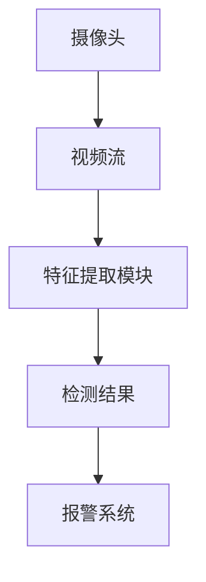
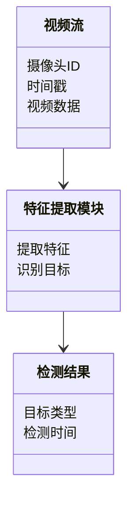
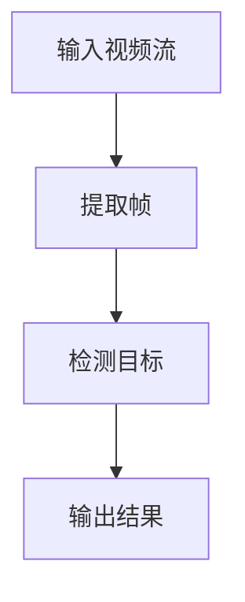
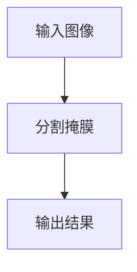
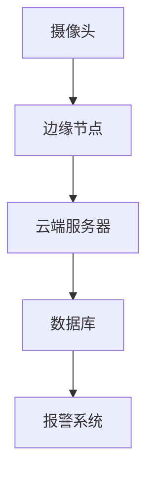

                 


# 如何识别企业的边缘AI视频分析优势

---

## 关键词：边缘AI、视频分析、边缘计算、实时性、数据隐私、工业应用

---

## 摘要：边缘AI视频分析是一种基于边缘计算的视频分析技术，通过在靠近数据源的地方进行实时数据处理，能够显著提升企业视频分析的效率和隐私保护能力。本文将从背景、原理、算法、系统架构、项目实战等多方面深入分析边缘AI视频分析的优势，帮助企业更好地识别和应用这一技术。

---

# 第1章: 背景介绍

## 1.1 边缘AI视频分析的定义与特点

### 1.1.1 定义
边缘AI视频分析是一种结合边缘计算和人工智能技术的视频分析方法。它通过在边缘设备（如摄像头、传感器等）上直接处理视频数据，实时提取有价值的信息，从而减少对云端计算的依赖。

### 1.1.2 核心特点
- **实时性**：边缘设备能够在数据生成时立即处理，减少延迟。
- **隐私保护**：数据无需传输到云端，降低隐私泄露风险。
- **网络依赖低**：即使在网络条件差的情况下，也能正常运行。

### 1.1.3 与传统视频分析的区别
| 特性          | 边缘AI视频分析                     | 传统视频分析                   |
|---------------|------------------------------------|--------------------------------|
| 数据处理位置  | 边缘设备                           | 云端                           |
| 延迟           | 极低                              | 较高                           |
| 隐私保护       | 高                                | 较低                           |

---

## 1.2 边缘AI视频分析的优势

### 1.2.1 实时性优势
边缘AI视频分析能够在数据生成的瞬间进行处理，适用于需要实时反馈的场景，如智能安防和工业自动化。

### 1.2.2 数据隐私保护优势
通过在边缘设备上处理数据，避免了将原始视频数据传输到云端，从而降低了数据泄露的风险。

### 1.2.3 网络依赖性降低的优势
边缘计算减少了对网络的依赖，即使在网络不稳定的情况下，也能保证视频分析的正常进行。

---

## 1.3 边缘AI视频分析的应用场景

### 1.3.1 智能安防监控
在智能安防中，边缘AI视频分析可以实时检测异常行为，如入侵检测和人脸识别。

### 1.3.2 工业自动化检测
在制造业中，边缘AI视频分析可以用于实时检测生产线上的缺陷产品。

### 1.3.3 零售业顾客行为分析
通过分析顾客的行为，帮助企业优化店铺布局和营销策略。

---

## 1.4 边缘AI视频分析的边界与外延

### 1.4.1 边界
边缘AI视频分析的边界主要集中在边缘设备上的数据处理，不涉及云端的存储和管理。

### 1.4.2 外延
边缘AI视频分析可以与其他边缘计算技术结合，如物联网和雾计算，形成更复杂的系统。

### 1.4.3 与其他技术的关系
- **边缘计算**：边缘AI视频分析是边缘计算的一种典型应用。
- **人工智能**：AI算法是边缘视频分析的核心。
- **物联网**：边缘AI视频分析可以与物联网设备无缝集成。

---

## 1.5 本章小结

本章介绍了边缘AI视频分析的定义、特点、优势和应用场景，并分析了其与其他技术的关系。通过这些内容，我们可以理解边缘AI视频分析在企业中的重要性。

---

# 第2章: 核心概念与联系

## 2.1 边缘AI视频分析的核心原理

### 2.1.1 数据采集与预处理
数据采集是通过摄像头等设备获取视频流，预处理包括去噪和调整分辨率。

### 2.1.2 特征提取与模型训练
使用深度学习模型（如CNN）提取视频中的特征，并在边缘设备上进行模型训练。

### 2.1.3 模型推理与结果输出
将预处理后的数据输入训练好的模型，进行推理并输出结果。

---

## 2.2 核心概念对比分析

### 2.2.1 边缘AI与云计算的对比

| 特性          | 边缘AI视频分析                     | 云计算视频分析                   |
|---------------|------------------------------------|--------------------------------|
| 计算位置       | 边缘设备                           | 云端                           |
| 延迟           | 极低                              | 较高                           |
| 隐私保护       | 高                                | 较低                           |

---

## 2.3 核心概念的ER实体关系图



---

## 2.4 核心概念的领域模型类图



---

# 第3章: 算法原理讲解

## 3.1 目标检测算法原理

### 3.1.1 算法流程



### 3.1.2 算法实现代码

```python
import tensorflow as tf
from tensorflow.keras import layers

# 定义模型
model = tf.keras.Sequential([
    layers.Conv2D(32, (3,3), activation='relu'),
    layers.MaxPooling2D((2,2)),
    layers.Conv2D(64, (3,3), activation='relu'),
    layers.MaxPooling2D((2,2)),
    layers.Flatten(),
    layers.Dense(128, activation='relu'),
    layers.Dense(1, activation='sigmoid')
])

# 编译模型
model.compile(optimizer='adam', loss='binary_crossentropy', metrics=['accuracy'])
```

### 3.1.3 数学模型

$$ \text{CNN} = \{ Conv \rightarrow Pool \rightarrow Conv \rightarrow Pool \rightarrow Flatten \rightarrow Dense \} $$

---

## 3.2 图像分割算法原理

### 3.2.1 算法流程



### 3.2.2 算法实现代码

```python
import tensorflow as tf
from tensorflow.keras import layers

# 定义模型
model = tf.keras.Sequential([
    layers.Conv2D(64, (3,3), activation='relu', padding='same'),
    layers.Conv2D(64, (3,3), activation='relu', padding='same'),
    layers.MaxPooling2D((2,2)),
    layers.Conv2D(128, (3,3), activation='relu', padding='same'),
    layers.Conv2D(128, (3,3), activation='relu', padding='same'),
    layers.MaxPooling2D((2,2)),
    layers.Conv2D(256, (3,3), activation='relu', padding='same'),
    layers.Conv2D(256, (3,3), activation='relu', padding='same'),
    layers.MaxPooling2D((2,2)),
    layers.Conv2D(512, (3,3), activation='relu', padding='same'),
    layers.Conv2D(512, (3,3), activation='relu', padding='same'),
    layers.MaxPooling2D((2,2)),
    layers.Flatten(),
    layers.Dense(1024, activation='relu'),
    layers.Dense(1, activation='sigmoid')
])

# 编译模型
model.compile(optimizer='adam', loss='binary_crossentropy', metrics=['accuracy'])
```

### 3.2.3 数学模型

$$ \text{UNet} = \{ Conv \rightarrow Conv \rightarrow Pool \rightarrow Conv \rightarrow Conv \rightarrow Pool \rightarrow ... \} $$

---

# 第4章: 系统分析与架构设计方案

## 4.1 系统功能设计

### 4.1.1 领域模型类图


---

## 4.2 系统架构设计

### 4.2.1 系统架构图



---

## 4.3 系统接口设计

### 4.3.1 接口描述
- **摄像头接口**：提供视频流输入接口。
- **边缘节点接口**：提供模型推理接口。
- **云端服务器接口**：提供数据存储和管理接口。

---

## 4.4 系统交互流程

### 4.4.1 交互流程图


---

# 第5章: 项目实战

## 5.1 环境配置

### 5.1.1 安装必要的库
```bash
pip install tensorflow==2.5.0
pip install opencv-python==4.5.5
pip install numpy==1.21.2
```

---

## 5.2 核心代码实现

### 5.2.1 视频流处理代码

```python
import cv2
import numpy as np

# 初始化摄像头
cap = cv2.VideoCapture(0)

while cap.isOpened():
    ret, frame = cap.read()
    if not ret:
        break

    # 处理帧
    gray = cv2.cvtColor(frame, cv2.COLOR_BGR2GRAY)
    cv2.imshow('Edge AI Video Analysis', gray)

    if cv2.waitKey(1) & 0xFF == ord('q'):
        break

cap.release()
cv2.destroyAllWindows()
```

### 5.2.2 目标检测代码

```python
import tensorflow as tf
from tensorflow.keras.models import load_model

# 加载模型
model = load_model('edge_ai_model.h5')

# 处理帧
while cap.isOpened():
    ret, frame = cap.read()
    if not ret:
        break

    # 预测
    prediction = model.predict(frame)
    cv2.imshow('Edge AI Video Analysis', prediction)

    if cv2.waitKey(1) & 0xFF == ord('q'):
        break

cap.release()
cv2.destroyAllWindows()
```

---

## 5.3 实际案例分析

### 5.3.1 智能安防监控

#### 案例背景
某公司需要实时监控工厂的生产线，防止未经授权的人员进入敏感区域。

#### 解决方案
部署边缘AI视频分析系统，实时检测异常行为并触发报警。

#### 实施步骤
1. 部署摄像头。
2. 配置边缘节点。
3. 集成报警系统。

---

## 5.4 项目小结

通过本章的项目实战，我们了解了边缘AI视频分析的实施过程，包括环境配置、代码实现和案例分析。

---

# 第6章: 最佳实践、小结与注意事项

## 6.1 最佳实践

### 6.1.1 硬件选择
选择性能稳定的边缘设备，确保视频分析的实时性。

### 6.1.2 模型优化
优化模型参数，减少计算量，提高推理速度。

### 6.1.3 数据隐私保护
确保数据在边缘设备上处理，避免隐私泄露。

---

## 6.2 小结

通过本文的分析，我们了解了边缘AI视频分析的优势和应用场景，并掌握了其实现原理和系统架构设计方法。

---

## 6.3 注意事项

- 确保边缘设备的稳定性。
- 定期更新模型以提高准确性。
- 注意数据隐私保护。

---

# 第7章: 拓展阅读

## 7.1 深度学习与边缘计算的结合

边缘计算与深度学习的结合进一步提升了视频分析的效率和准确性。

## 7.2 边缘AI在物联网中的应用

边缘AI在物联网中的应用前景广阔，可以帮助企业实现智能化转型。

## 7.3 未来发展趋势

随着技术的不断发展，边缘AI视频分析将在更多领域发挥重要作用。

---

# 作者：AI天才研究院 & 禅与计算机程序设计艺术

---

通过本文的系统介绍，我们全面了解了边缘AI视频分析的优势和实现方法，帮助企业更好地识别和应用这一技术。希望本文对您有所帮助！

