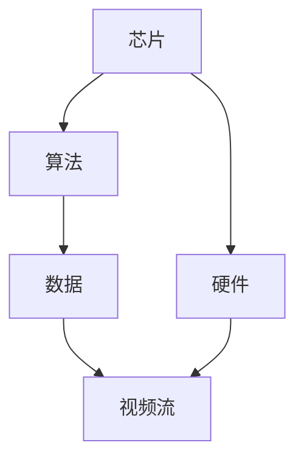
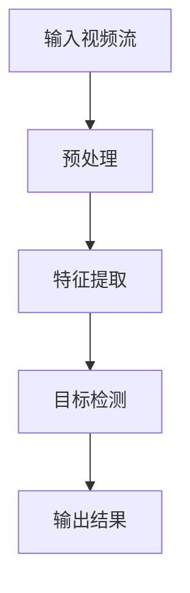
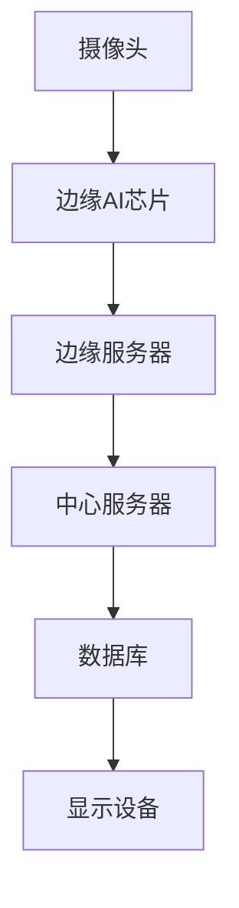

                 


# 如何识别企业的边缘AI视频分析芯片优势

> 关键词：边缘AI芯片，视频分析，企业监控，硬件选型，算法优化，系统架构

> 摘要：本文将详细探讨如何识别企业边缘AI视频分析芯片的优势，从背景介绍、核心概念、算法原理、系统架构到项目实战，层层深入，帮助读者全面理解边缘AI视频分析芯片的优势，并能够实际应用这些知识解决问题。

---

## 第1章: 背景介绍

### 1.1 问题背景
#### 1.1.1 边缘计算的兴起
边缘计算作为一种分布式计算范式，将数据处理能力从云端迁移到靠近数据源的边缘设备，减少了延迟和带宽消耗。随着5G和物联网技术的发展，边缘计算在视频分析领域的应用越来越广泛。

#### 1.1.2 AI视频分析的需求增长
随着企业对实时监控和智能分析的需求增加，AI视频分析成为企业视频监控系统的核心功能。边缘AI视频分析芯片通过在边缘设备上实时处理视频数据，满足企业对低延迟和高效处理的需求。

#### 1.1.3 企业视频监控的痛点与挑战
企业在视频监控方面面临以下痛点：
- **数据量大**：视频数据量庞大，传输和存储成本高。
- **延迟问题**：中心化处理会导致延迟，影响实时性。
- **隐私问题**：数据在传输过程中可能被截获，存在隐私风险。
- **计算资源不足**：边缘设备计算能力有限，难以处理复杂的AI任务。

### 1.2 问题描述
#### 1.2.1 边缘AI视频分析的定义
边缘AI视频分析是指在靠近数据源的边缘设备上，利用AI芯片实时处理视频数据，实现目标检测、图像识别等功能。

#### 1.2.2 企业视频分析的核心需求
企业对边缘AI视频分析的核心需求包括：
- **实时性**：快速响应视频中的异常情况。
- **准确性**：准确识别和分类视频中的目标。
- **可扩展性**：支持大规模部署和扩展。

#### 1.2.3 当前市场的主要问题与不足
当前市场主要存在以下问题：
- **芯片性能不足**：部分芯片计算能力有限，无法满足复杂算法的需求。
- **算法优化不足**：部分算法在边缘设备上运行效率低下。
- **系统架构不合理**：缺乏统一的架构设计，导致系统扩展性和维护性较差。

### 1.3 问题解决
#### 1.3.1 边缘AI芯片的优势
边缘AI芯片的优势体现在以下几个方面：
- **低延迟**：边缘计算减少了数据传输的距离，降低了延迟。
- **高效处理**：AI芯片通过硬件加速，提高了视频分析的效率。
- **隐私保护**：数据在边缘设备上处理，减少了数据传输过程中的隐私风险。

#### 1.3.2 企业视频分析的解决方案
企业可以通过部署边缘AI视频分析芯片，实现以下目标：
- **实时监控**：快速响应视频中的异常情况，如入侵检测、火灾报警等。
- **智能分析**：通过AI算法识别视频中的目标，如人脸识别、车辆识别等。
- **数据优化**：通过边缘设备处理数据，减少对中心服务器的压力。

#### 1.3.3 边缘AI芯片的应用场景
边缘AI芯片在以下场景中具有广泛应用：
- **智能安防**：企业可以通过边缘AI芯片实现智能安防监控。
- **智能制造**：在工厂中，边缘AI芯片可以用于设备监测和质量检测。
- **智能交通**：在交通监控中，边缘AI芯片可以用于实时检测交通违规行为。

### 1.4 边界与外延
#### 1.4.1 边缘AI芯片的边界
边缘AI芯片的边界主要体现在以下方面：
- **硬件限制**：边缘AI芯片的性能受到硬件资源的限制，无法处理过于复杂的任务。
- **应用场景**：边缘AI芯片主要适用于需要实时处理和低延迟的场景，不适合需要大规模数据存储和分析的场景。

#### 1.4.2 与中心化视频分析的区别
边缘AI视频分析与中心化视频分析的主要区别在于：
- **数据处理位置**：边缘AI视频分析在边缘设备上处理数据，而中心化视频分析在云端处理数据。
- **延迟**：边缘AI视频分析延迟低，而中心化视频分析延迟较高。
- **隐私保护**：边缘AI视频分析在本地处理数据，隐私保护更好。

#### 1.4.3 与其他边缘计算技术的关系
边缘AI视频分析芯片与其他边缘计算技术的关系：
- **互补性**：边缘AI视频分析芯片可以与其他边缘计算技术（如边缘存储、边缘计算平台）协同工作，形成完整的边缘计算解决方案。
- **依赖性**：边缘AI视频分析芯片依赖于边缘计算技术的支持，如边缘网络、边缘存储等。

### 1.5 核心要素组成
#### 1.5.1 芯片性能
芯片性能是边缘AI视频分析芯片的核心要素之一，包括：
- **计算能力**：芯片的计算能力决定了其处理视频数据的速度和效率。
- **功耗**：芯片的功耗影响其在边缘设备上的部署和运行成本。

#### 1.5.2 算法能力
算法能力是边缘AI视频分析芯片的另一个核心要素，包括：
- **算法类型**：芯片支持的算法类型，如目标检测、图像分割、人脸识别等。
- **算法优化**：算法在边缘设备上的优化程度，影响其运行效率和准确性。

#### 1.5.3 系统架构
系统架构决定了边缘AI视频分析芯片的部署和运行方式，包括：
- **硬件架构**：芯片的硬件架构设计，如SoC（系统级芯片）设计。
- **软件架构**：芯片的软件架构设计，如驱动程序、中间件等。

## 第2章: 核心概念与联系

### 2.1 核心概念原理
#### 2.1.1 边缘AI芯片的工作原理
边缘AI芯片通过硬件加速和AI算法，实现在边缘设备上对视频数据的实时处理。其工作流程如下：
1. **数据采集**：边缘设备采集视频数据。
2. **数据预处理**：对视频数据进行预处理，如去噪、调整亮度等。
3. **特征提取**：通过AI算法提取视频数据中的特征，如目标的形状、颜色等。
4. **目标检测**：通过目标检测算法，识别视频中的目标。
5. **结果输出**：将检测结果输出到显示设备或发送到云端。

#### 2.1.2 视频分析算法的实现机制
视频分析算法的实现机制包括：
- **目标检测算法**：如YOLO、Faster R-CNN等，用于检测视频中的目标。
- **图像分割算法**：如U-Net、FCN等，用于分割视频中的图像。
- **人脸识别算法**：如FaceNet、OpenFace等，用于识别视频中的人脸。

#### 2.1.3 边缘计算与AI的结合
边缘计算与AI的结合主要体现在以下几个方面：
- **实时性**：边缘计算通过在边缘设备上处理数据，减少了延迟，提高了实时性。
- **隐私保护**：边缘计算在本地处理数据，减少了数据传输过程中的隐私风险。
- **资源优化**：边缘计算通过分布式处理，优化了资源利用率，降低了中心服务器的负担。

### 2.2 概念属性特征对比
以下是边缘AI芯片与其他相关技术的概念属性特征对比：

| 比较维度 | 边缘AI芯片 | 中心化视频分析 | 边缘计算 |
|----------|------------|-----------------|----------|
| 数据处理位置 | 边缘设备 | 云端 | 边缘设备 |
| 延迟 | 低 | 高 | 低 |
| 隐私保护 | 好 | 较差 | 好 |
| 资源利用率 | 高 | 较低 | 高 |

### 2.3 ER实体关系图
以下是一个简单的ER实体关系图，展示了边缘AI视频分析芯片的核心要素之间的关系：



## 第3章: 算法原理讲解

### 3.1 算法原理
#### 3.1.1 目标检测算法
目标检测算法用于检测视频中的目标，如车辆、行人等。常用的目标检测算法有YOLO、Faster R-CNN等。

##### YOLO算法流程
1. **输入视频流**：将视频流输入YOLO模型。
2. **特征提取**：YOLO模型提取视频流的特征图。
3. **目标检测**：YOLO模型通过回归和分类，检测出视频中的目标。
4. **输出结果**：将检测结果输出，如目标的位置和类别。

##### YOLO算法的数学模型
YOLO算法的损失函数如下：
$$ \text{loss} = \lambda_{\text{xy}}(x-\hat{x})^2 + \lambda_{wh}(w-\hat{w})^2 + \lambda_{conf}(1-\hat{p})^2 $$

#### 3.1.2 图像分割算法
图像分割算法用于分割视频中的图像，如分割出视频中的车辆、行人等。常用图像分割算法有U-Net、FCN等。

##### U-Net算法流程
1. **输入图像**：将图像输入U-Net模型。
2. **下采样**：通过多次下采样操作，提取图像的深层特征。
3. **上采样**：通过上采样操作，恢复图像的分辨率。
4. **分割结果**：输出分割后的图像。

##### U-Net算法的数学模型
U-Net的跳跃连接如下：
$$ f(x) = g(x) + x $$

#### 3.1.3 人脸识别算法
人脸识别算法用于识别视频中的人脸，如识别人脸的性别、年龄等。常用人脸识别算法有FaceNet、OpenFace等。

##### FaceNet算法流程
1. **输入图像**：将图像输入FaceNet模型。
2. **特征提取**：FaceNet模型提取图像的特征向量。
3. **人脸匹配**：将特征向量与已有的特征向量进行匹配，识别人脸。
4. **输出结果**：输出识别结果，如人名。

##### FaceNet算法的数学模型
FaceNet的相似性计算如下：
$$ \text{similarity} = \frac{\mathbf{u}^T \mathbf{v}}{\|\mathbf{u}\| \|\mathbf{v}\|} $$

### 3.2 算法流程图
以下是一个目标检测算法的流程图：



### 3.3 数学模型与公式
#### 3.3.1 目标检测模型
目标检测模型的损失函数如下：
$$ \text{loss} = \lambda_{\text{xy}}(x-\hat{x})^2 + \lambda_{wh}(w-\hat{w})^2 + \lambda_{conf}(1-\hat{p})^2 $$

#### 3.3.2 图像分割模型
图像分割模型的跳跃连接如下：
$$ f(x) = g(x) + x $$

#### 3.3.3 人脸识别模型
人脸识别模型的相似性计算如下：
$$ \text{similarity} = \frac{\mathbf{u}^T \mathbf{v}}{\|\mathbf{u}\| \|\mathbf{v}\|} $$

## 第4章: 系统分析与架构设计

### 4.1 项目场景介绍
#### 4.1.1 企业视频监控系统
企业视频监控系统需要实时监控企业的生产和安全情况，如工厂生产线监控、办公室安全监控等。

#### 4.1.2 智能安防系统
智能安防系统需要实时监控公共场所的安全情况，如商场、车站等。

### 4.2 系统功能设计
系统功能设计包括以下几个方面：
- **数据采集**：通过摄像头采集视频数据。
- **数据预处理**：对视频数据进行预处理，如去噪、调整亮度等。
- **目标检测**：通过目标检测算法，检测视频中的目标。
- **图像分割**：通过图像分割算法，分割视频中的图像。
- **人脸识别**：通过人脸识别算法，识别人脸。
- **结果输出**：将检测结果输出到显示设备或发送到云端。

### 4.3 系统架构设计
系统架构设计包括以下几个部分：
- **边缘设备**：包括摄像头、边缘AI芯片等。
- **边缘计算平台**：包括边缘服务器、边缘计算平台软件等。
- **云端平台**：包括中心服务器、数据库等。

### 4.4 系统接口设计
系统接口设计包括以下几个方面：
- **摄像头接口**：摄像头与边缘AI芯片之间的接口。
- **边缘AI芯片与边缘服务器接口**：边缘AI芯片与边缘服务器之间的接口。
- **边缘服务器与中心服务器接口**：边缘服务器与中心服务器之间的接口。

### 4.5 系统交互序列图
系统交互序列图展示了系统中各组件之间的交互流程：



## 第5章: 项目实战

### 5.1 环境安装
#### 5.1.1 系统需求
- 操作系统：Linux或Windows
- CPU：Intel或AMD的高性能CPU
- GPU：NVIDIA的高性能GPU（如Tesla T4、V100等）
- 内存：至少8GB RAM

#### 5.1.2 安装依赖
- 安装Python和相关库：
  ```bash
  pip install numpy matplotlib tensorflow-cpu
  ```

### 5.2 系统核心实现源代码
以下是一个目标检测算法的Python实现代码：

```python
import numpy as np
import tensorflow as tf

def detect_object(image):
    # 图像预处理
    image = preprocess_image(image)
    # 特征提取
    features = extract_features(image)
    # 目标检测
    detection = detect(features)
    return detection

def preprocess_image(image):
    # 图像预处理代码
    pass

def extract_features(image):
    # 特征提取代码
    pass

def detect(features):
    # 目标检测代码
    pass
```

### 5.3 代码应用解读与分析
代码解读：
- `detect_object`函数：实现目标检测的主要逻辑。
- `preprocess_image`函数：对输入图像进行预处理。
- `extract_features`函数：从图像中提取特征。
- `detect`函数：基于特征进行目标检测。

### 5.4 实际案例分析和详细讲解
#### 5.4.1 案例背景
假设我们有一个工厂生产线监控系统，需要实时检测生产线上的异常情况，如设备故障、人员违规等。

#### 5.4.2 系统实现
- 部署边缘AI芯片在工厂的监控摄像头旁。
- 通过边缘AI芯片实时处理视频数据，检测生产线上的异常情况。
- 将检测结果发送到云端，进行进一步分析和处理。

#### 5.4.3 结果分析
- **实时性**：边缘AI芯片能够在几毫秒内处理视频数据，确保实时检测。
- **准确性**：通过优化算法和模型，提高了检测的准确性。
- **扩展性**：系统支持大规模部署，能够扩展到多个工厂。

### 5.5 项目小结
通过本项目实战，我们可以看到边缘AI视频分析芯片在企业监控中的巨大优势。通过合理设计系统架构和优化算法，可以实现高效的视频分析，满足企业对实时性和准确性的需求。

## 第6章: 总结

### 6.1 最佳实践 tips
- **硬件选型**：选择性能合适的边缘AI芯片，确保满足企业的实际需求。
- **算法优化**：根据企业的具体需求，优化视频分析算法，提高检测效率和准确性。
- **系统架构设计**：合理设计系统架构，确保系统的可扩展性和可维护性。

### 6.2 小结
通过本文的详细讲解，我们了解了如何识别企业的边缘AI视频分析芯片优势。从背景介绍到项目实战，我们逐步深入探讨了边缘AI视频分析芯片的核心概念、算法原理、系统架构和实际应用。

### 6.3 注意事项
- **数据隐私**：企业在使用边缘AI视频分析芯片时，需要注意数据隐私保护，确保数据不被非法使用。
- **系统维护**：企业需要定期维护边缘AI视频分析系统，确保系统的稳定运行。
- **技术更新**：随着技术的发展，企业需要及时更新算法和系统架构，保持系统的先进性。

### 6.4 拓展阅读
- **边缘计算**：深入学习边缘计算的相关知识，了解其在其他领域的应用。
- **AI芯片**：学习更多关于AI芯片的知识，了解不同芯片的性能和应用场景。
- **视频分析算法**：研究更多的视频分析算法，优化企业的视频分析系统。

---

## 作者：AI天才研究院/AI Genius Institute & 禅与计算机程序设计艺术 /Zen And The Art of Computer Programming

---

以上是《如何识别企业的边缘AI视频分析芯片优势》的完整目录大纲和文章内容，希望对您有所帮助！

