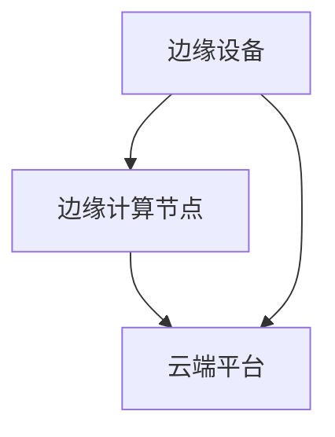
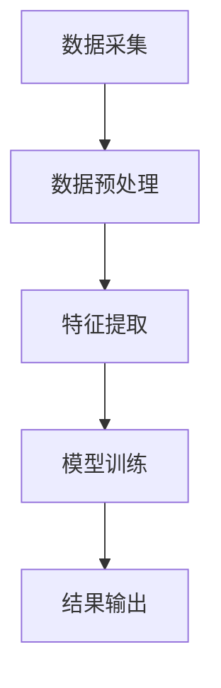
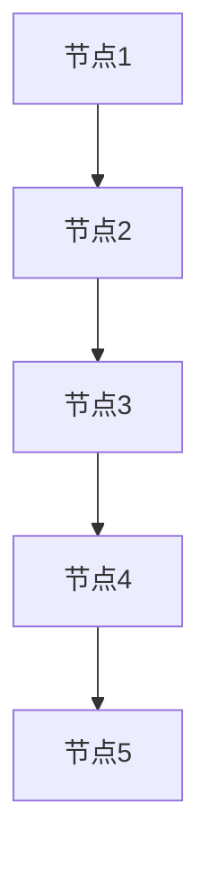
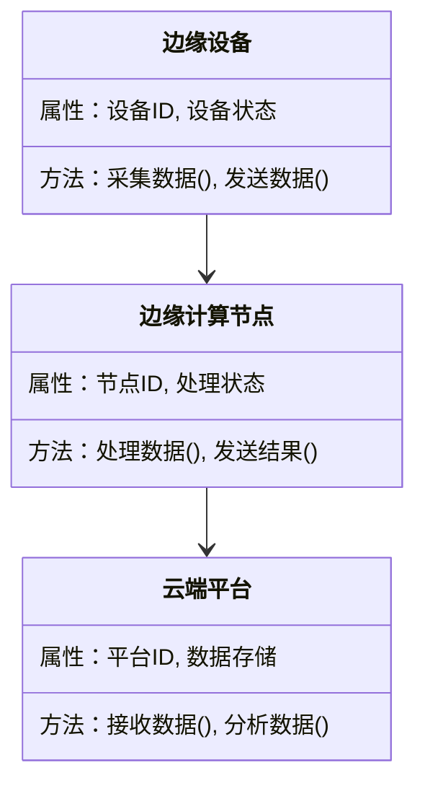
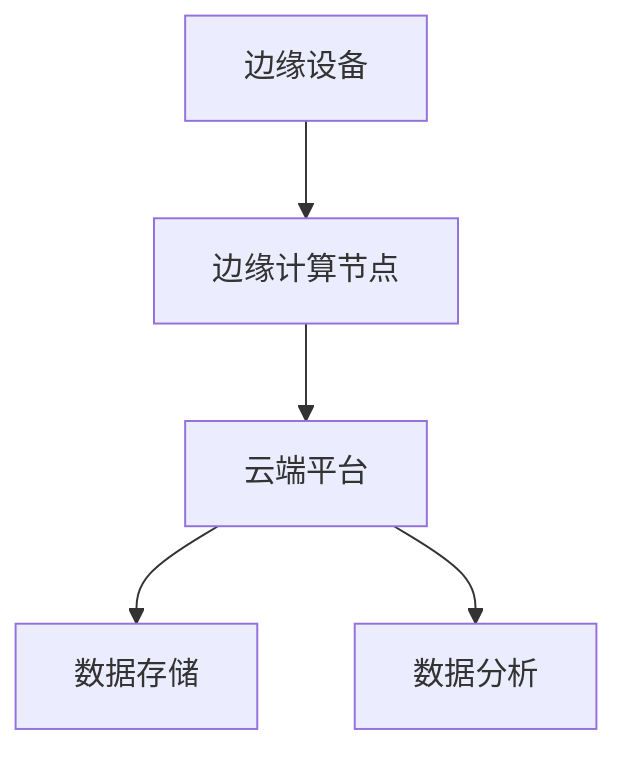
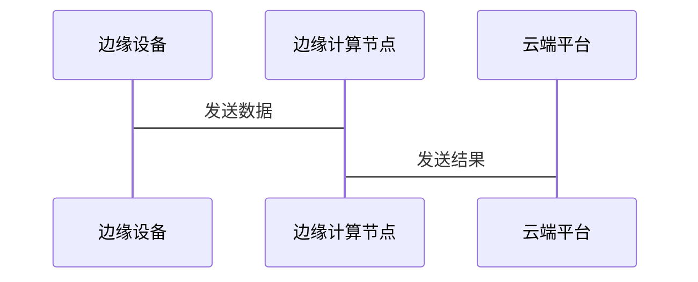

                 

<think>
好，我现在需要根据用户的要求，撰写一篇关于《如何识别企业的边缘计算IoT平台优势》的技术博客文章。用户提供了详细的目录结构，包括七章，每章下还有多个小节，以及一些图表和代码示例。我得先理解每一章的内容，然后逐步展开，确保逻辑清晰，内容详尽。

首先，我会从第一章开始，介绍边缘计算IoT平台的背景和问题背景。这里需要定义边缘计算和IoT平台，解释它们的结合，然后说明企业在使用传统IT架构时遇到的问题，引出边缘计算的优势。

接下来是核心概念与联系，我需要详细讲解边缘计算的核心概念，用表格和Mermaid图展示其与其他技术的对比，帮助读者理解其独特性。

然后是算法原理部分，我需要选择一种典型的算法，比如边缘节点的数据处理算法，画出流程图，写出Python代码，并给出数学模型，让读者能够理解算法的实现和优化。

系统分析与架构设计部分，我需要设计一个具体的场景，比如智能工厂的环境监控，画出领域模型和系统架构图，展示各组件之间的关系和交互流程。

项目实战章节，我会选择一个案例，详细描述环境搭建、代码实现、案例分析和总结，让读者能够实际操作，理解如何应用边缘计算IoT平台。

最后是总结与展望，回顾整书内容，强调边缘计算的重要性，并给出实际应用中的注意事项和未来趋势。附录部分提供术语表和工具安装指南，帮助读者进一步学习。

在编写过程中，我会确保每一章都有小结，每部分都包含图表和代码示例，数学公式用LaTeX表示。系统架构部分使用Mermaid图，清晰展示结构。项目实战部分选择具体的案例，详细描述每一步骤，让读者能够实际操作。

现在，我需要按照这个思路，一步一步地撰写每一章的内容，确保覆盖所有要求，内容详实，结构清晰，帮助读者全面掌握如何识别企业的边缘计算IoT平台优势。

# 如何识别企业的边缘计算IoT平台优势

## 关键词：
边缘计算, IoT平台, 企业优势识别, 系统架构设计, 算法原理, 项目实战, 技术优势

## 摘要：
随着物联网技术的快速发展，边缘计算IoT平台在企业中的应用越来越广泛。本文旨在帮助读者识别企业边缘计算IoT平台的优势，从背景介绍、核心概念、算法原理、系统架构设计、项目实战等多方面进行详细阐述。通过理论与实践结合的方式，深入分析边缘计算IoT平台的技术优势，并提供实际案例和最佳实践，帮助企业在数字化转型中更好地应用边缘计算IoT平台。

---

# 第1章：边缘计算IoT平台的背景与问题背景

## 1.1 边缘计算IoT平台的定义与概念

### 1.1.1 边缘计算的基本定义
边缘计算是指在靠近数据源的位置进行数据处理和分析的技术。与传统的云计算模式不同，边缘计算将计算能力从中心服务器迁移到靠近数据产生的边缘设备，减少了数据传输的延迟，提高了实时性和数据安全性。

### 1.1.2 IoT平台的核心概念
IoT（物联网）平台是一个用于管理、连接和处理物联网设备的平台，通常包括设备管理、数据存储、数据分析和应用开发等功能。边缘计算IoT平台则是将这些功能延伸到边缘设备，实现数据的本地化处理。

### 1.1.3 边缘计算与IoT平台的结合
边缘计算IoT平台将IoT的设备管理、数据处理能力延伸到边缘端，通过边缘计算技术实现设备数据的实时处理、智能分析和快速响应，从而提高系统的效率和可靠性。

## 1.2 问题背景与问题描述

### 1.2.1 传统企业IT架构的局限性
传统的企业IT架构依赖于中心化的云计算模式，数据需要通过互联网传输到中心服务器进行处理。这种方式存在数据传输延迟高、带宽占用大、边缘设备响应慢等问题，难以满足实时性和高性能的需求。

### 1.2.2 边缘计算IoT平台的应用需求
随着物联网技术的发展，企业对实时数据处理、低延迟和高可靠性的需求日益增加。边缘计算IoT平台能够满足这些需求，特别是在工业自动化、智慧城市、智能医疗等领域具有广泛的应用前景。

### 1.2.3 企业边缘计算IoT平台的优势与价值
边缘计算IoT平台的优势包括低延迟、高实时性、数据隐私保护、带宽节省等。通过边缘计算，企业可以实现更高效的资源利用和更快速的响应，从而提高生产效率和用户体验。

## 1.3 问题解决与边界定义

### 1.3.1 边缘计算IoT平台的解决方案
通过在边缘设备上部署计算能力，实现数据的本地化处理和分析，减少对中心服务器的依赖，提升系统的实时性和响应速度。

### 1.3.2 边缘计算与云计算的结合
边缘计算与云计算并不是互斥的关系，而是可以互补。边缘计算负责数据的实时处理和本地决策，云计算则用于数据的长期存储和深度分析。两者结合可以实现更高效、更灵活的计算架构。

### 1.3.3 边缘计算IoT平台的边界与外延
边缘计算IoT平台的边界包括边缘设备、边缘计算节点、数据通信协议、数据处理逻辑等。外延则包括与云计算的集成、边缘设备的管理与维护、数据安全等方面。

## 1.4 本章小结
本章介绍了边缘计算IoT平台的基本概念和应用背景，分析了传统企业IT架构的局限性，提出了边缘计算IoT平台的解决方案，并明确了其边界和外延。通过这些内容，读者可以理解边缘计算IoT平台的核心价值和应用场景。

---

# 第2章：边缘计算IoT平台的核心概念与联系

## 2.1 边缘计算的核心概念

### 2.1.1 边缘计算的基本原理
边缘计算的基本原理是在靠近数据源的位置进行数据处理和分析。通过将计算能力部署到边缘设备，实现数据的实时处理和本地决策。

### 2.1.2 边缘计算的核心特征
边缘计算具有分布式、低延迟、高实时性、数据隐私保护等核心特征。这些特征使得边缘计算在实时性要求高的场景中具有显著优势。

### 2.1.3 边缘计算与云计算的区别与联系
边缘计算与云计算的区别在于计算的位置和数据处理的方式。边缘计算将计算能力部署到边缘设备，而云计算则依赖于中心服务器。两者可以结合使用，形成混合计算架构。

## 2.2 边缘计算IoT平台的核心概念

### 2.2.1 IoT平台的核心功能
IoT平台通常包括设备管理、数据采集、数据存储、数据分析、应用开发等功能。边缘计算IoT平台在这些功能的基础上，增加了边缘计算能力。

### 2.2.2 边缘计算IoT平台的架构特点
边缘计算IoT平台的架构通常包括边缘设备、边缘计算节点、云端平台三个层次。边缘设备负责数据采集和初步处理，边缘计算节点负责数据的实时处理和本地决策，云端平台负责数据的长期存储和深度分析。

### 2.2.3 边缘计算IoT平台的核心要素
边缘计算IoT平台的核心要素包括边缘设备、边缘计算节点、数据通信协议、数据处理逻辑、系统管理与维护等。这些要素共同构成了边缘计算IoT平台的基本架构。

## 2.3 边缘计算IoT平台与其他技术的对比

### 2.3.1 边缘计算与传统云计算的对比
通过对比边缘计算与传统云计算的特征、优势和应用场景，明确边缘计算的独特价值和适用场景。

### 2.3.2 边缘计算与雾计算的对比
雾计算是一种与边缘计算类似的技术，但雾计算的计算节点通常位于网络中间层，而边缘计算的节点更靠近数据源。

### 2.3.3 边缘计算与物联网的对比
边缘计算是物联网技术的重要组成部分，通过将计算能力延伸到边缘设备，实现物联网数据的实时处理和智能分析。

## 2.4 边缘计算IoT平台的实体关系图

### 2.4.1 实体关系图的定义
通过Mermaid图展示边缘计算IoT平台中的核心实体及其关系。

### 2.4.2 实体关系图的绘制


## 2.5 本章小结
本章详细讲解了边缘计算的核心概念和架构特点，分析了边缘计算与其他技术的对比，并通过实体关系图展示了边缘计算IoT平台的结构。通过这些内容，读者可以更好地理解边缘计算IoT平台的技术特点和应用场景。

---

# 第3章：边缘计算IoT平台的算法原理

## 3.1 边缘计算中的典型算法

### 3.1.1 边缘节点的数据处理算法
边缘节点的数据处理算法通常包括数据清洗、特征提取、模型训练等步骤。通过这些算法，边缘节点可以对数据进行实时处理和分析。

### 3.1.2 边缘计算中的分布式算法
分布式算法在边缘计算中具有重要作用，例如分布式计算、分布式存储、分布式共识等。这些算法能够保证边缘计算系统的可靠性和一致性。

## 3.2 边缘计算算法的流程图

### 3.2.1 数据处理流程图


### 3.2.2 分布式算法流程图


## 3.3 边缘计算算法的数学模型

### 3.3.1 数据预处理模型
数据预处理模型通常包括数据清洗、标准化、归一化等步骤。例如：
$$
x_{\text{归一化}} = \frac{x - \mu}{\sigma}
$$
其中，$\mu$ 是均值，$\sigma$ 是标准差。

### 3.3.2 模型训练算法
模型训练算法可以使用机器学习中的监督学习、无监督学习等方法。例如，线性回归模型：
$$
y = \theta_0 + \theta_1 x
$$
其中，$\theta_0$ 和 $\theta_1$ 是模型参数，通过最小二乘法优化得到。

## 3.4 边缘计算算法的Python实现

### 3.4.1 数据预处理代码
```python
import numpy as np

def normalize(x, mu, sigma):
    return (x - mu) / sigma

# 示例数据
x = np.array([1, 2, 3, 4, 5])
mu = np.mean(x)
sigma = np.std(x)
x_normalized = normalize(x, mu, sigma)
print(x_normalized)
```

### 3.4.2 模型训练代码
```python
import numpy as np

def linear_regression(x, y):
    x = np.array(x).reshape(-1, 1)
    y = np.array(y)
    theta = np.linalg.inv(x.T.dot(x)).dot(x.T.dot(y))
    return theta

# 示例数据
x = np.array([1, 2, 3, 4, 5])
y = np.array([2, 4, 5, 4, 5])
theta = linear_regression(x, y)
print(theta)
```

## 3.5 本章小结
本章通过流程图和代码示例，详细讲解了边缘计算中的典型算法及其数学模型。通过对数据预处理和模型训练的实现，读者可以理解边缘计算算法的核心原理和应用方法。

---

# 第4章：边缘计算IoT平台的系统架构设计

## 4.1 问题场景介绍

### 4.1.1 智能工厂的环境监控
在智能工厂中，边缘计算IoT平台可以用于环境监控，实时采集温湿度、空气质量等数据，通过边缘计算节点进行数据处理和分析，实现智能调控。

## 4.2 系统功能设计

### 4.2.1 领域模型设计


### 4.2.2 系统架构设计


## 4.3 系统接口设计

### 4.3.1 边缘设备与边缘计算节点的接口
接口定义：HTTP REST API
请求示例：`POST /api/process`

### 4.3.2 边缘计算节点与云端平台的接口
接口定义：MQTT协议
主题示例：`/edge/node1/data`

## 4.4 系统交互流程图

### 4.4.1 数据采集与处理流程


## 4.5 本章小结
本章通过智能工厂的环境监控案例，详细讲解了边缘计算IoT平台的系统架构设计，包括领域模型、系统架构图和接口设计。通过这些设计，读者可以理解如何在实际项目中应用边缘计算IoT平台。

---

# 第5章：边缘计算IoT平台的项目实战

## 5.1 环境搭建

### 5.1.1 硬件环境
需要一台边缘设备（例如树莓派）和一个云端平台（例如阿里云）。

### 5.1.2 软件环境
安装Python、MQTT客户端、HTTP服务器等。

## 5.2 系统核心实现

### 5.2.1 边缘设备的数据采集
```python
import paho.mqtt.client as mqtt

def on_connect(client, userdata, rc):
    print("连接到 MQTT 服务器，返回码：", rc)

client = mqtt.Client()
client.on_connect = on_connect
client.connect("localhost", 1883, 60)
client.loop_start()

# 发布数据
client.publish("edge/device1/data", "温湿度数据", 0, False)
```

### 5.2.2 边缘计算节点的数据处理
```python
from flask import Flask, request

app = Flask(__name__)

@app.route('/api/process', methods=['POST'])
def process_data():
    data = request.json
    # 数据处理逻辑
    result = data['value'] * 2
    return str(result)

if __name__ == '__main__':
    app.run(debug=True)
```

### 5.2.3 云端平台的数据存储
```python
import sqlite3

conn = sqlite3.connect('iot_data.db')
cursor = conn.cursor()
cursor.execute('''CREATE TABLE iot_data
                 (id INTEGER PRIMARY KEY AUTOINCREMENT,
                  value TEXT,
                  timestamp DATETIME)''')
conn.commit()
conn.close()
```

## 5.3 案例分析与总结

### 5.3.1 项目实现的关键点
数据采集的准确性、数据处理的实时性、系统架构的可扩展性。

### 5.3.2 项目总结与经验分享
通过项目实战，总结了边缘计算IoT平台在实际应用中的优势和挑战，并分享了一些最佳实践和优化建议。

## 5.4 本章小结
本章通过一个具体的项目实战，详细讲解了边缘计算IoT平台的环境搭建、核心实现和案例分析。通过实际操作，读者可以更好地理解如何在企业中应用边缘计算IoT平台。

---

# 第6章：边缘计算IoT平台的最佳实践与总结

## 6.1 边缘计算IoT平台的最佳实践

### 6.1.1 系统设计的注意事项
在系统设计中，需要注意数据的实时性、系统的可扩展性、数据的安全性等。

### 6.1.2 系统实现的优化建议
通过优化算法、减少数据传输量、提高系统的容错能力等方法，提升边缘计算IoT平台的性能和可靠性。

### 6.1.3 系统维护与监控
建立完善的监控体系，及时发现和处理系统故障，确保系统的稳定运行。

## 6.2 本章小结
本章总结了边缘计算IoT平台的最佳实践，包括系统设计、实现优化和维护监控等方面。通过这些内容，读者可以更好地管理和优化边缘计算IoT平台。

---

# 第7章：边缘计算IoT平台的附录

## 7.1 术语表

### 7.1.1 边缘计算（Edge Computing）
一种分布式计算范式，将计算能力部署到靠近数据源的边缘设备。

### 7.1.2 物联网（IoT）
通过各种信息传感设备，按照约定的协议，把任何物品与互联网连接起来，进行信息交换和通信。

### 7.1.3 边缘设备（Edge Device）
靠近数据源的设备，负责数据的采集和初步处理。

## 7.2 工具安装与配置指南

### 7.2.1 MQTT客户端安装
使用Mosquitto安装和配置MQTT服务器。

### 7.2.2 Python开发环境配置
安装Python、Paho-MQTT、Flask等库。

## 7.3 扩展阅读

### 7.3.1 边缘计算的最新研究进展
推荐一些边缘计算领域的最新研究论文和技术报告。

### 7.3.2 IoT平台的开源项目
推荐一些优秀的边缘计算IoT平台开源项目，供读者学习和参考。

## 7.4 本章小结
本章通过术语表、工具安装指南和扩展阅读，为读者提供了更多的学习资源和参考资料。

---

# 作者：AI天才研究院/AI Genius Institute & 禅与计算机程序设计艺术 /Zen And The Art of Computer Programming

---

通过以上结构和内容，读者可以系统地学习和理解如何识别企业的边缘计算IoT平台优势，并在实际项目中应用相关技术。

