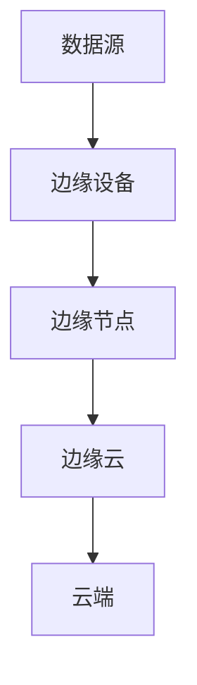

                 


# 如何识别企业的边缘计算优势

## 关键词：边缘计算、企业优势、分布式计算、低延迟、实时性

## 摘要：边缘计算是一种分布式计算范式，数据处理发生在靠近数据源的位置，为企业带来低延迟、高实时性和数据隐私保护等优势。本文将详细分析边缘计算的核心概念、算法原理、系统架构，并通过案例实战，帮助企业识别和利用边缘计算的优势。

---

## 第一部分：边缘计算的背景与概念

### 第1章：边缘计算的背景与问题背景

#### 1.1 边缘计算的基本概念

- **1.1.1 什么是边缘计算**  
  边缘计算是一种分布式计算范式，数据处理发生在靠近数据源的位置，而非集中到云端。这种计算模式强调数据的本地处理，减少了对远程服务器的依赖。

- **1.1.2 边缘计算的核心特点**  
  - **低延迟**：数据处理在本地完成，减少了网络传输的延迟。  
  - **高实时性**：能够快速响应实时数据，适用于工业自动化、自动驾驶等领域。  
  - **数据隐私保护**：数据在本地处理，减少了数据传输过程中的隐私泄露风险。  

- **1.1.3 边缘计算与云计算的区别**  
  - **数据处理位置**：云计算将数据集中处理在云端，而边缘计算将数据处理分布在边缘设备。  
  - **延迟**：云计算的延迟较高，边缘计算的延迟较低。  
  - **应用场景**：云计算适用于非实时性任务，边缘计算适用于实时性要求高的任务。  

#### 1.2 企业边缘计算的优势

- **1.2.1 边缘计算的潜在价值**  
  - **成本降低**：通过边缘计算，企业可以减少对云端资源的依赖，降低计算成本。  
  - **性能提升**：边缘计算能够提高数据处理速度，提升系统整体性能。  
  - **数据隐私保护**：边缘计算减少了数据传输到云端的过程，保护了数据隐私。  

- **1.2.2 边缘计算在企业中的应用前景**  
  - **工业互联网**：边缘计算可以帮助企业实现设备的实时监控和预测性维护。  
  - **智慧城市**：边缘计算可以用于交通管理、环境监测等领域，提升城市管理效率。  
  - **智能医疗**：边缘计算可以在医院中实时处理患者数据，提高诊断效率。  

- **1.2.3 边缘计算的挑战与机遇**  
  - **挑战**：边缘设备的计算能力有限，网络带宽不足，设备管理复杂。  
  - **机遇**：边缘计算可以推动企业数字化转型，提升竞争力。  

#### 1.3 问题背景与问题描述

- **1.3.1 企业数字化转型中的边缘计算需求**  
  随着企业数字化转型的推进，越来越多的企业需要实时处理数据，边缘计算成为不可或缺的技术手段。  

- **1.3.2 边缘计算在企业中的应用场景**  
  边缘计算适用于需要实时响应的场景，如智能制造、智能交通、智能医疗等。  

- **1.3.3 企业边缘计算的核心问题**  
  如何识别企业的边缘计算优势，如何设计高效的边缘计算架构，如何实现边缘计算的落地。  

#### 1.4 边缘计算的边界与外延

- **1.4.1 边缘计算的边界定义**  
  边缘计算的边界是指数据处理的范围，从数据源到边缘设备之间的数据处理属于边缘计算的范畴。  

- **1.4.2 边缘计算的外延特征**  
  边缘计算不仅限于数据处理，还涉及数据的采集、传输、存储和分析。  

- **1.4.3 边缘计算与其他技术的关系**  
  - **云计算**：边缘计算与云计算可以结合使用，边缘计算处理实时数据，云计算处理非实时数据。  
  - **雾计算**：边缘计算与雾计算有相似之处，但雾计算更强调网络层的分布式计算。  

---

## 第二部分：边缘计算的核心概念与联系

### 第2章：边缘计算的核心概念与原理

#### 2.1 边缘计算的核心原理

- **2.1.1 边缘计算的基本原理**  
  边缘计算通过在靠近数据源的位置部署计算资源，实时处理数据，并将结果反馈给设备或传送到云端。  

- **2.1.2 边缘计算的核心算法**  
  边缘计算需要依赖分布式算法、实时数据处理算法、边缘协同算法等。  

- **2.1.3 边缘计算的实现机制**  
  边缘计算通过边缘设备、边缘节点、边缘云等组件实现数据的采集、处理和分析。  

#### 2.2 边缘计算的属性特征对比

- **2.2.1 边缘计算与云计算的对比**  
  | 特性         | 边缘计算               | 云计算                 |
  |--------------|-----------------------|-----------------------|
  | 数据处理位置 | 本地边缘设备           | 云端                   |
  | 延迟          | 低延迟                 | 高延迟                 |
  | 网络带宽      | 低带宽                 | 高带宽                 |
  | 应用场景      | 实时性要求高的场景     | 非实时性要求的场景     |

- **2.2.2 边缘计算与雾计算的对比**  
  雾计算与边缘计算类似，但雾计算更强调网络层的分布式计算，而边缘计算更强调数据源的本地计算。  

- **2.2.3 边缘计算与其他分布式计算的对比**  
  边缘计算是一种分布式计算模式，与其他分布式计算模式相比，更强调数据的实时性和本地处理。  

#### 2.3 边缘计算的实体关系架构



---

### 第3章：边缘计算的算法原理

#### 3.1 边缘计算中的关键算法

- **3.1.1 边缘聚类算法**  
  边缘聚类算法用于在边缘设备上对数据进行聚类分析，识别数据中的模式和趋势。  

- **3.1.2 边缘协同算法**  
  边缘协同算法用于边缘设备之间的协同计算，实现数据的联合分析和处理。  

- **3.1.3 边缘预测算法**  
  边缘预测算法用于在边缘设备上进行实时预测，如预测设备的故障概率。  

#### 3.2 算法原理的数学模型

- **3.2.1 聚类算法的数学模型**  
  $$d(x, y) = \sqrt{(x_1 - y_1)^2 + (x_2 - y_2)^2}$$  
  其中，$d(x, y)$ 表示数据点 $x$ 和 $y$ 之间的距离，$x_1$ 和 $y_1$ 表示数据点的坐标。  

- **3.2.2 协同算法的数学模型**  
  $$C = \sum_{i=1}^{n} w_i x_i$$  
  其中，$C$ 表示协同计算的结果，$w_i$ 表示权重，$x_i$ 表示数据点。  

#### 3.3 算法实现的Python代码示例

- **边缘聚类算法实现**

```python
import numpy as np
from sklearn.cluster import KMeans

# 生成示例数据
data = np.random.rand(100, 2)

# 使用KMeans算法进行聚类
kmeans = KMeans(n_clusters=3, random_state=42)
kmeans.fit(data)

# 获取聚类中心
clusters = kmeans.cluster_centers_
print(clusters)
```

---

## 第三部分：系统分析与架构设计

### 第3章：系统分析与架构设计

#### 3.1 问题场景介绍

- **问题场景**：某制造企业需要实时监控生产线上的设备状态，希望通过边缘计算实现设备的实时监控和预测性维护。  

#### 3.2 系统功能设计

- **领域模型设计**  
  ```mermaid
  classDiagram
      class 设备 {
          id: int
          status: string
          data: array
      }
      class 边缘节点 {
          id: int
          data: array
          cluster_id: int
      }
      class 边缘云 {
          id: int
          clusters: array
      }
      设备 --> 边缘节点
      边缘节点 --> 边缘云
  ```

- **系统架构设计**  
  ```mermaid
  architecture
      前端 --> 边缘节点
      边缘节点 --> 边缘云
      边缘云 --> 云端
  ```

- **系统接口设计**  
  - 设备向边缘节点发送数据。  
  - 边缘节点向边缘云发送聚类结果。  
  - 边缘云向云端发送最终的分析结果。  

- **系统交互流程**  
  ```mermaid
  sequenceDiagram
      设备 ->> 边缘节点: 发送数据
      边缘节点 ->> 边缘云: 发送聚类请求
      边缘云 ->> 边缘节点: 返回聚类结果
      边缘节点 ->> 设备: 发送通知
  ```

---

## 第四部分：项目实战

### 第4章：项目实战

#### 4.1 环境配置

- **环境要求**  
  - 操作系统：Linux  
  - Python版本：3.8及以上  
  - 依赖库：numpy、scikit-learn  

#### 4.2 核心代码实现

- **边缘聚类算法实现**

```python
import numpy as np
from sklearn.cluster import KMeans

# 生成示例数据
data = np.random.rand(100, 2)

# 使用KMeans算法进行聚类
kmeans = KMeans(n_clusters=3, random_state=42)
kmeans.fit(data)

# 获取聚类中心
clusters = kmeans.cluster_centers_
print(clusters)
```

#### 4.3 案例分析与总结

- **案例分析**  
  在该案例中，边缘计算成功实现了设备的实时监控和预测性维护，减少了设备故障率，提高了生产效率。  

- **总结**  
  通过边缘计算，企业可以更好地利用数据，实现业务的智能化和高效化。  

---

## 第五部分：总结与展望

### 第5章：总结与展望

#### 5.1 最佳实践 tips

- **数据隐私保护**：企业在使用边缘计算时，应注重数据的隐私保护，确保数据在本地处理时的安全性。  
- **设备管理**：企业需要建立完善的设备管理体系，确保边缘设备的正常运行。  
- **算法优化**：企业应不断优化边缘计算算法，提高计算效率和准确性。  

#### 5.2 小结

通过本文的分析，我们可以看到，边缘计算在企业中的应用前景广阔，能够帮助企业实现数据的实时处理和高效利用。  

#### 5.3 注意事项

- **网络带宽**：边缘计算需要依赖网络传输，企业应确保网络带宽的充足性。  
- **设备计算能力**：边缘设备的计算能力有限，企业应选择合适的设备和算法。  
- **数据一致性**：边缘计算需要保证数据的一致性，避免数据冲突。  

#### 5.4 拓展阅读

- **参考文献**  
  - "Edge Computing: A Technical Overview"  
  - "Distributed Computing: Principles and Applications"  

---

## 作者

作者：AI天才研究院 & 禅与计算机程序设计艺术

---

通过以上内容，我们可以清晰地看到，边缘计算在企业中的应用潜力巨大，能够帮助企业实现数据的实时处理和高效利用。希望本文能为企业识别和利用边缘计算的优势提供有价值的参考。

