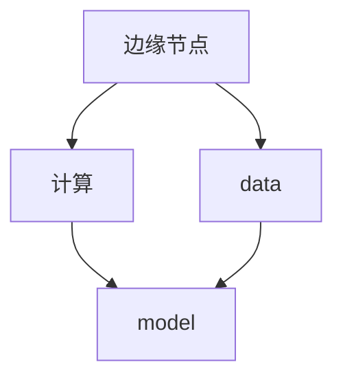
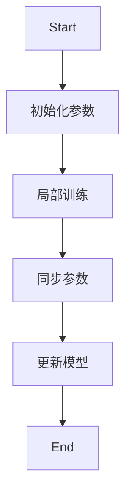
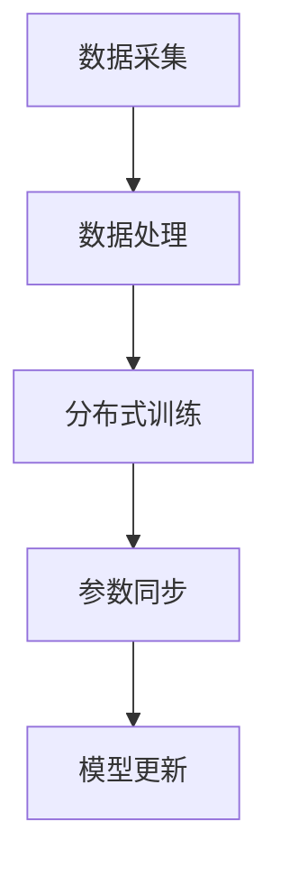
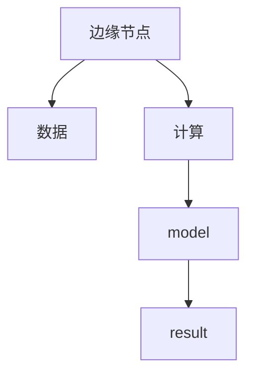

                 


# 如何识别企业的边缘计算分布式学习优势

> 关键词：边缘计算，分布式学习，企业优势，系统架构，算法原理

> 摘要：本文将深入探讨如何识别企业边缘计算分布式学习的优势，涵盖核心概念、算法原理、系统架构设计、项目实战与最佳实践，帮助读者全面理解并应用这些技术。

---

## 第1章: 边缘计算与分布式学习的背景与概念

### 1.1 边缘计算的定义与特点
- 1.1.1 边缘计算的定义
  - 边缘计算是指在数据源附近进行数据处理和计算的模式，减少对云端的依赖。
- 1.1.2 边缘计算的核心特点
  - 分布式架构：数据在边缘节点进行处理，减少数据传输延迟。
  - 去中心化：避免单点故障，提升系统稳定性。
  - 高效性：边缘计算能够实时处理数据，提高响应速度。

### 1.2 分布式学习的定义与特点
- 1.2.1 分布式学习的定义
  - 分布式学习是指在多个节点上分别进行模型训练，然后将各节点的模型参数汇总，形成最终的模型。
- 1.2.2 分布式学习的核心特点
  - 分布式训练：模型参数分布在多个节点上，每个节点独立进行训练。
  - 并行计算：多个节点同时进行训练，提高计算效率。
  - 数据隐私：数据分布在不同节点，保护数据隐私。

### 1.3 边缘计算与分布式学习的结合
- 1.3.1 边缘计算与分布式学习的协同关系
  - 边缘计算提供数据处理和存储的环境，分布式学习在边缘节点上进行模型训练。
- 1.3.2 边缘计算分布式学习的优势
  - 实时性：数据在边缘节点实时处理，减少延迟。
  - 高可用性：分布式架构避免单点故障，提升系统稳定性。
  - 数据隐私：数据在边缘节点处理，保护数据隐私。
- 1.3.3 边缘计算分布式学习的应用场景
  - 智能制造：工厂中的设备实时数据处理和预测。
  - 智慧城市：交通数据实时处理，优化交通流量。
  - 医疗健康：患者数据实时处理，辅助诊断。

---

## 第2章: 边缘计算分布式学习的核心概念与联系

### 2.1 核心概念原理
- 2.1.1 边缘计算的分布式架构
  - 边缘计算采用分布式架构，数据在边缘节点处理，避免数据传输到云端的延迟。
- 2.1.2 分布式学习的数学模型
  - 分布式学习通过数学模型将各节点的参数汇总，形成全局模型。
- 2.1.3 边缘计算与分布式学习的结合原理
  - 边缘计算提供数据处理环境，分布式学习在边缘节点上进行模型训练。

### 2.2 核心概念属性特征对比
- 2.2.1 边缘计算与分布式学习的对比表格

| 特性         | 边缘计算                     | 分布式学习                  |
|--------------|------------------------------|-----------------------------|
| 数据处理位置 | 边缘节点                     | 多个节点或边缘节点          |
| 响应时间     | 低延迟                       | 较低延迟                   |
| 数据隐私     | 高隐私                      | 高隐私                     |
| 计算资源     | 分布式资源                  | 分布式资源                 |

- 2.2.2 边缘计算与分布式学习的ER实体关系图


---

## 第3章: 边缘计算分布式学习的算法原理

### 3.1 分布式学习算法的流程图


### 3.2 分布式学习的数学模型
- 3.2.1 分布式学习的数学公式
$$y = f(x)$$
- 3.2.2 边缘计算中的数据分布
$$x_i \sim P(x)$$
- 3.2.3 参数同步的数学表达
$$\theta_{new} = \frac{1}{n}\sum_{i=1}^{n}\theta_i$$

### 3.3 分布式学习算法的实现
- 3.3.1 分布式梯度下降算法
```python
def distributed_gradient_descent():
    # 初始化参数
    theta = [0] * n
    # 参数同步
    for i in range(n):
        # 局部梯度计算
        gradient_i = compute_gradient(theta[i])
        # 更新参数
        theta[i] -= learning_rate * gradient_i
    # 同步参数
    theta_new = average(theta)
    return theta_new
```

---

## 第4章: 系统分析与架构设计

### 4.1 系统功能设计
- 4.1.1 系统功能模块
  - 数据采集模块：负责采集边缘节点的数据。
  - 数据处理模块：对数据进行清洗和预处理。
  - 分布式训练模块：在边缘节点上进行模型训练。
  - 参数同步模块：将各节点的参数同步到中心服务器。
- 4.1.2 系统功能流程图


### 4.2 系统架构设计
- 4.2.1 系统架构图


### 4.3 系统接口设计
- 4.3.1 系统接口
  - 数据采集接口：从边缘节点采集数据。
  - 数据处理接口：对数据进行清洗和预处理。
  - 分布式训练接口：在边缘节点上进行模型训练。
  - 参数同步接口：将各节点的参数同步到中心服务器。

---

## 第5章: 项目实战

### 5.1 环境安装
- 5.1.1 安装Python
  - 使用Anaconda安装Python 3.8及以上版本。
- 5.1.2 安装依赖库
  - 使用pip安装numpy、pandas、scikit-learn等库。

### 5.2 核心代码实现
- 5.2.1 分布式梯度下降算法实现
```python
def compute_gradient(theta, X, y):
    m, n = X.shape
    h = X.dot(theta)
    gradient = (1/m) * (h - y).T.dot(X)
    return gradient

def distributed_gradient_descent(X, y, theta_initial, learning_rate, num_epochs):
    theta = theta_initial
    for epoch in range(num_epochs):
        gradient = compute_gradient(theta, X, y)
        theta = theta - learning_rate * gradient
    return theta
```

### 5.3 实际案例分析
- 5.3.1 案例背景
  - 某制造企业需要实时监控生产线上的设备状态，预防设备故障。
- 5.3.2 数据处理
  - 数据采集：从生产线上的传感器采集设备状态数据。
  - 数据预处理：清洗和标准化数据。
- 5.3.3 模型训练
  - 使用分布式梯度下降算法在边缘节点上进行模型训练。
- 5.3.4 模型评估
  - 使用测试数据评估模型的准确率和召回率。

---

## 第6章: 最佳实践与小结

### 6.1 小结
- 边缘计算与分布式学习的结合能够提高系统的实时性和响应速度。
- 分布式学习在边缘节点上进行模型训练，保护数据隐私。
- 边缘计算分布式学习的应用场景广泛，如智能制造、智慧城市和医疗健康。

### 6.2 注意事项
- 数据隐私：在边缘节点上进行数据处理时，需要注意数据的隐私保护。
- 系统稳定性：分布式架构需要考虑节点的故障容错能力。
- 计算资源：需要合理分配计算资源，避免资源浪费。

### 6.3 拓展阅读
- 《分布式系统：原理与实现》
- 《边缘计算：原理与应用》

---

## 作者：AI天才研究院 & 禅与计算机程序设计艺术

---

以上是文章的完整目录结构，涵盖背景、核心概念、算法原理、系统架构、项目实战和最佳实践等内容，帮助读者全面理解如何识别企业的边缘计算分布式学习优势。

