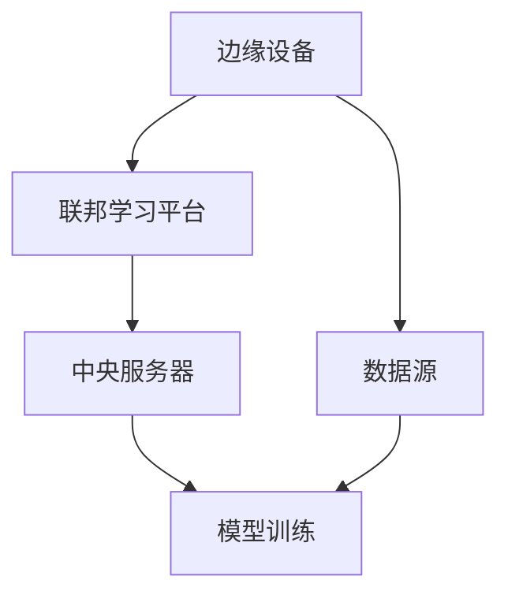
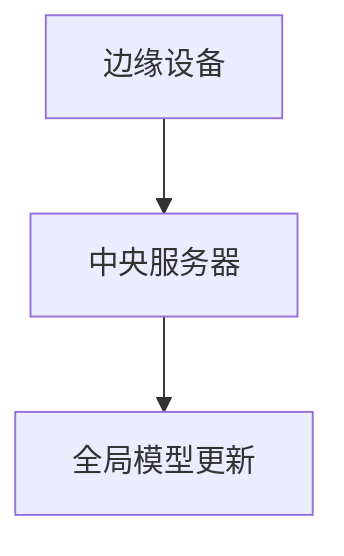
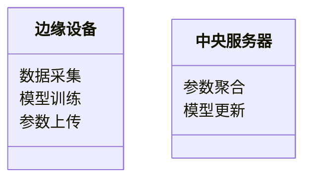

                 


# 如何识别企业的边缘计算联邦学习优势

## 关键词：
边缘计算，联邦学习，企业应用，数据隐私，模型同步，分布式系统，人工智能

## 摘要：
边缘计算与联邦学习的结合为企业带来了高效、安全的数据处理和模型训练能力。本文通过详细分析边缘计算联邦学习的核心概念、算法原理、系统架构及实际案例，帮助读者识别其在企业中的优势，并掌握如何在实际场景中应用这一技术。

---

## 第一部分: 边缘计算与联邦学习概述

### 第1章: 边缘计算与联邦学习的背景与概念

#### 1.1 边缘计算的定义与特点
边缘计算是一种分布式计算范式，数据在靠近数据源的边缘设备上进行处理，而非集中在云端。其特点包括低延迟、高实时性、本地化数据处理和资源高效利用。

#### 1.2 联邦学习的定义与特点
联邦学习是一种分布式机器学习方法，允许多个参与方在不共享原始数据的情况下共同训练模型。其特点包括数据隐私保护、模型协作更新和去中心化计算。

#### 1.3 边缘计算与联邦学习的结合
边缘计算与联邦学习的结合充分利用了边缘设备的计算能力和数据分布特性，解决了传统集中式计算在隐私、延迟和带宽上的问题，适用于物联网、智能制造等领域。

---

### 第2章: 企业边缘计算联邦学习的核心概念

#### 2.1 边缘计算联邦学习的背景介绍
在企业中，数据通常分布于多个部门或设备，集中式训练面临隐私和成本问题。边缘计算联邦学习通过在边缘设备上进行局部模型训练并同步全局模型，解决了这些问题。

#### 2.2 边缘计算联邦学习的核心要素
- 数据隐私与安全：通过加密和差分隐私保护数据。
- 模型训练与更新：使用联邦平均（FedAvg）等算法进行模型同步。
- 网络通信与资源分配：优化边缘设备间的通信效率。
- 跨邊緣設備的协同：通过协调机制确保各设备模型一致性。

#### 2.3 边缘计算联邦学习的概念结构
边缘设备负责本地数据处理和模型训练，中央服务器协调全局模型更新，形成一个去中心化的协作网络。

---

### 第3章: 边缘计算联邦学习的核心概念与联系

#### 3.1 边缘计算联邦学习的核心原理
边缘计算提供分布式计算环境，联邦学习在此环境中实现数据联邦化和模型联邦化，确保数据隐私和模型协作。

#### 3.2 边缘计算与联邦学习的对比分析
| 对比维度 | 边缘计算 | 联邦学习 |
|----------|----------|----------|
| 数据存储 | 分布式存储 | 分布式计算 |
| 计算模式 | 边缘设备处理 | 联合模型训练 |
| 安全性 | 属地安全 | 联合隐私保护 |

#### 3.3 边缘计算联邦学习的实体关系图


---

## 第4章: 边缘计算联邦学习的算法原理

### 4.1 联邦学习算法概述
联邦学习算法通过在边缘设备上进行局部模型训练，然后将模型参数上传至中央服务器进行全局更新。典型算法包括FedAvg、FedSGD等。

### 4.2 联邦学习的同步机制
模型同步是关键步骤，通过参数聚合实现全局模型更新。以下是FedAvg的同步机制：



### 4.3 联邦学习的数学模型
全局模型参数更新公式：
$$ w_{new} = \frac{1}{n}\sum_{i=1}^{n} w_i $$
其中，$n$为边缘设备数量，$w_i$为设备i的模型参数。

---

## 第5章: 系统分析与架构设计

### 5.1 系统功能设计
- 数据采集与处理：边缘设备采集数据并进行预处理。
- 模型训练：设备本地训练模型并上传参数。
- 模型同步：中央服务器聚合参数，更新全局模型。

### 5.2 系统架构设计


---

## 第6章: 项目实战

### 6.1 环境安装
安装必要的库：
```bash
pip install fedlearn
```

### 6.2 核心代码实现
```python
import fedlearn

# 初始化中央服务器
server = fedlearn.Server()

# 初始化边缘设备
edge1 = fedlearn.Device()
edge2 = fedlearn.Device()

# 同步模型参数
server.sync(edge1, edge2)
```

### 6.3 实际案例分析
以智能物流为例，边缘设备实时更新配送模型，中央服务器聚合全局优化，提升配送效率。

---

## 第7章: 最佳实践与小结

### 7.1 最佳实践
- 数据加密：使用同态加密保护数据隐私。
- 模型优化：采用异步联邦学习减少通信开销。
- 网络优化：使用边缘网关降低延迟。

### 7.2 小结
边缘计算联邦学习通过分布式计算和模型协作，为企业提供了高效、安全的数据处理能力，未来将在更多领域发挥重要作用。

---

## 作者：AI天才研究院 & 禅与计算机程序设计艺术

