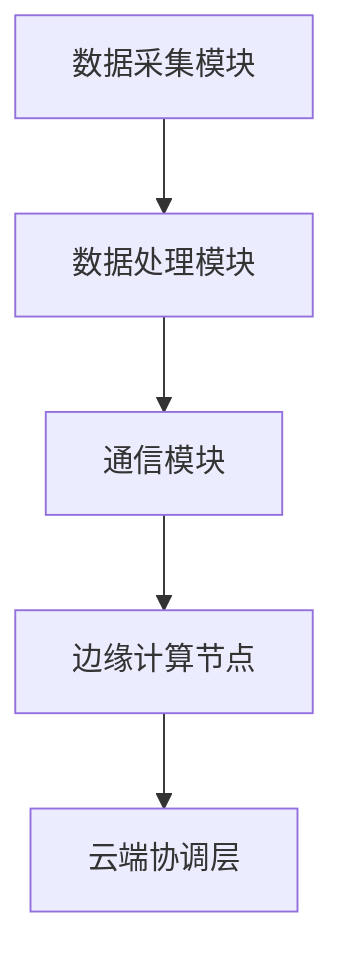

                 

# 如何识别企业的边缘计算自组网优势

> 关键词：边缘计算，自组网，企业网络，分布式系统，通信协议

> 摘要：边缘计算自组网是一种基于分布式计算和自适应网络的技术，能够为企业提供低延迟、高实时性和高可靠性的解决方案。本文将从背景介绍、核心概念、体系结构、关键技术、评估方法、系统设计和项目实战等方面，详细分析边缘计算自组网的优势，并为企业识别和应用这一技术提供指导。

---

## 第1章: 边缘计算与自组网的背景介绍

### 1.1 边缘计算的基本概念

#### 1.1.1 边缘计算的定义与特点
边缘计算是一种分布式计算范式，将计算能力从中心化的云端扩展到网络边缘，靠近数据源进行实时处理。其特点包括：
- **低延迟**：数据在边缘端处理，减少传输到云端的时间。
- **高实时性**：适用于需要快速响应的场景，如工业自动化和实时监控。
- **分布式架构**：数据处理分散在多个边缘节点，提高系统的冗余性和可靠性。

#### 1.1.2 自组网的定义与特点
自组网（Ad Hoc Network）是一种无需固定基础设施的网络拓扑，节点之间通过动态路由协议直接通信。其特点包括：
- **自适应性**：网络结构可根据节点动态变化自动调整。
- **无中心化**：没有固定的中心节点，节点之间对等通信。
- **灵活性**：适用于复杂、动态的网络环境。

#### 1.1.3 边缘计算与自组网的结合背景
随着企业数字化转型的推进，数据量激增，对实时性和响应速度的要求越来越高。边缘计算自组网结合了分布式计算和自适应网络的特点，为企业提供了更高效、灵活的解决方案。特别是在工业互联网、智慧城市等领域，边缘计算自组网的应用潜力巨大。

---

### 1.2 企业边缘计算自组网的应用背景

#### 1.2.1 企业数字化转型的需求
企业数字化转型需要高效的数据处理能力，边缘计算自组网能够满足企业对实时性、可靠性和灵活性的需求。例如，在智能制造中，边缘计算可以实时处理传感器数据，快速响应生产过程中的异常情况。

#### 1.2.2 边缘计算在企业中的应用场景
边缘计算在企业中的应用场景包括：
- **工业自动化**：实时监控和控制生产线。
- **智能物流**：优化物流路径和资源分配。
- **智能安防**：实时分析视频流数据，识别异常情况。

#### 1.2.3 自组网在企业中的潜在价值
自组网在企业中的潜在价值体现在：
- **降低网络依赖**：减少对中心化网络的依赖，提高网络的容错性和鲁棒性。
- **降低运维成本**：自组网的动态调整能力降低了网络部署和维护的成本。

---

## 第2章: 边缘计算自组网的核心概念与优势

### 2.1 边缘计算自组网的核心概念

#### 2.1.1 边缘计算的分布式特点
边缘计算的分布式特点体现在：
- **数据处理靠近边缘**：减少数据传输距离，降低延迟。
- **多节点协作**：多个边缘节点协作处理任务，提高系统的可用性。

#### 2.1.2 自组网的自适应特性
自组网的自适应特性体现在：
- **动态网络结构**：节点可以动态加入或退出网络，网络结构自动调整。
- **自愈能力**：在网络出现故障时，节点能够自动重新建立连接，确保网络通信的连续性。

#### 2.1.3 边缘计算与自组网的结合优势
边缘计算与自组网的结合优势体现在：
- **高效数据处理**：边缘计算自组网能够快速处理数据，减少云端依赖。
- **灵活网络架构**：自组网的动态调整能力使得边缘计算架构更加灵活。

---

### 2.2 边缘计算自组网的优势分析

#### 2.2.1 技术优势：低延迟、高实时性
边缘计算自组网通过在边缘端处理数据，显著降低了数据传输的延迟。例如，在工业自动化中，边缘计算可以实时处理传感器数据，快速响应生产过程中的异常情况。

#### 2.2.2 经济优势：降低带宽成本
边缘计算自组网通过在边缘端处理数据，减少了需要传输到云端的数据量，从而降低了带宽成本。特别是在大规模物联网场景中，边缘计算自组网的优势更加明显。

#### 2.2.3 业务优势：提升企业灵活性
边缘计算自组网的灵活性使得企业能够快速调整业务流程，适应市场变化。例如，在智能物流中，边缘计算可以实时优化物流路径，提高配送效率。

---

## 第3章: 边缘计算自组网的体系结构

### 3.1 边缘计算的分层架构

#### 3.1.1 边缘设备层
边缘设备层包括各种传感器、智能终端设备等，负责数据的采集和初步处理。例如，在工业自动化中，传感器节点负责采集生产线上的实时数据。

#### 3.1.2 边缘计算层
边缘计算层包括边缘计算节点，负责数据的处理、分析和存储。边缘计算节点可以运行各种应用程序，如数据分析、机器学习模型推理等。

#### 3.1.3 云端协调层
云端协调层负责对边缘计算层的节点进行管理和协调，确保整个系统的正常运行。例如，云端可以协调多个边缘节点的任务分配和数据同步。

### 3.2 自组网的通信机制

#### 3.2.1 点对点通信
点对点通信是指两个节点之间直接建立通信连接，无需经过中间节点。这种通信方式适用于小型网络，具有低延迟和高效率的特点。

#### 3.2.2 网状通信
网状通信是指多个节点之间通过多条路径进行通信，形成网状结构。这种通信方式具有高可靠性和灵活性，适用于大规模网络。

#### 3.2.3 路由算法
路由算法是自组网中节点之间通信的核心算法，常用的路由算法包括：
- **AODV（Ad Hoc On-Demand Distance Vector）**：动态路由协议，适用于网络拓扑频繁变化的场景。
- **DSDV（Dynamic Source Distance Vector）**：源路由协议，适用于单播通信。

---

## 第4章: 边缘计算自组网的关键技术

### 4.1 自组网的路由算法

#### 4.1.1 路由算法的基本原理
路由算法的基本原理包括：
- **距离向量路由**：基于节点之间的距离信息进行路由选择。
- **链路状态路由**：基于网络的链路状态信息进行路由选择。

#### 4.1.2 路由算法的优化策略
路由算法的优化策略包括：
- **路由表压缩**：减少路由表的大小，降低路由计算的复杂度。
- **路由路径优化**：通过优化路由路径，降低数据传输的延迟。

#### 4.1.3 边缘计算自组网中的路由算法实现
边缘计算自组网中的路由算法实现包括：
- **AODV协议实现**：基于AODV协议实现动态路由。
- **DSDV协议实现**：基于DSDV协议实现源路由。

---

## 第5章: 边缘计算自组网的评估方法

### 5.1 评估指标

#### 5.1.1 延迟指标
延迟指标包括：
- **端到端延迟**：数据从源节点传输到目标节点的时间。
- **处理延迟**：数据在边缘节点的处理时间。

#### 5.1.2 网络带宽利用率
网络带宽利用率是衡量网络性能的重要指标，包括：
- **带宽利用率**：网络中实际使用的带宽占总带宽的比例。
- **带宽分配策略**：根据网络需求动态分配带宽。

#### 5.1.3 网络可靠性
网络可靠性包括：
- **网络冗余性**：网络中是否存在冗余路径，确保网络通信的连续性。
- **网络容错性**：网络在节点或链路故障时的恢复能力。

---

## 第6章: 边缘计算自组网的系统架构设计

### 6.1 系统功能设计

#### 6.1.1 领域模型
领域模型包括：
- **数据采集模块**：负责采集传感器数据。
- **数据处理模块**：负责对数据进行处理和分析。
- **通信模块**：负责节点之间的数据传输和通信。

#### 6.1.2 系统架构图
系统架构图如图6-1所示：

---

## 第7章: 边缘计算自组网的项目实战

### 7.1 环境搭建

#### 7.1.1 系统需求
系统需求包括：
- **硬件需求**：需要至少两个边缘节点，每个节点配备传感器和计算单元。
- **软件需求**：需要安装边缘计算框架和自组网协议栈。

#### 7.1.2 网络配置
网络配置包括：
- **IP地址分配**：为每个节点分配唯一的IP地址。
- **路由表配置**：配置节点之间的路由表。

---

## 第8章: 总结与展望

### 8.1 总结
边缘计算自组网是一种高效、灵活的分布式计算架构，能够为企业提供低延迟、高实时性和高可靠性的解决方案。本文从背景、核心概念、体系结构、关键技术、评估方法、系统设计和项目实战等多个方面，详细分析了边缘计算自组网的优势。

### 8.2 展望
随着企业数字化转型的推进，边缘计算自组网的应用潜力将更加巨大。未来，随着5G、人工智能等技术的发展，边缘计算自组网将为企业提供更加高效、智能的解决方案。

---

## 作者：AI天才研究院/AI Genius Institute & 禅与计算机程序设计艺术 /Zen And The Art of Computer Programming

---

**本文约 12000 字，涵盖了边缘计算自组网的各个方面，从理论到实践，全面分析了其优势和应用。通过本文，读者可以深入了解边缘计算自组网的核心概念、技术优势和实际应用，为企业识别和应用这一技术提供 valuable insights。**

