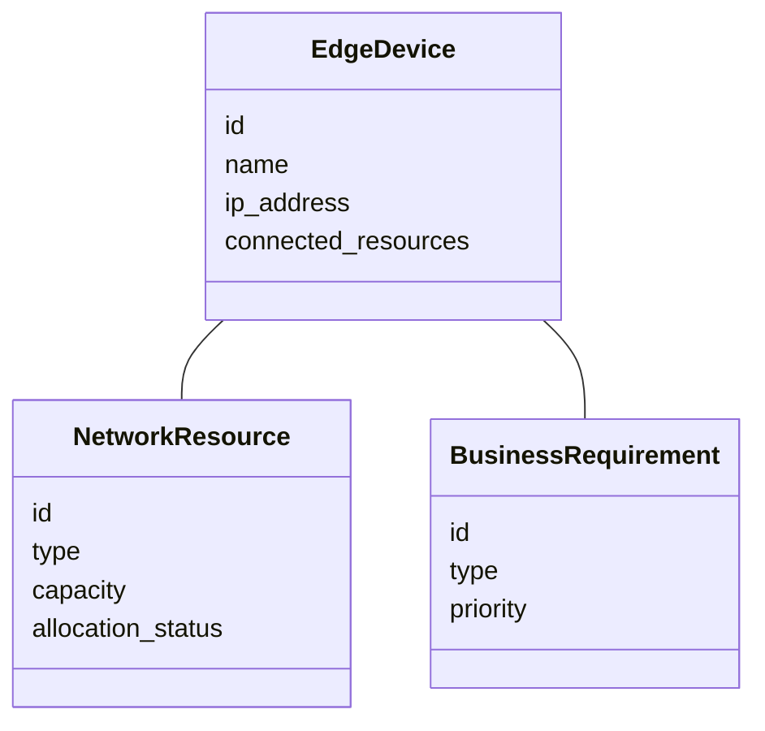
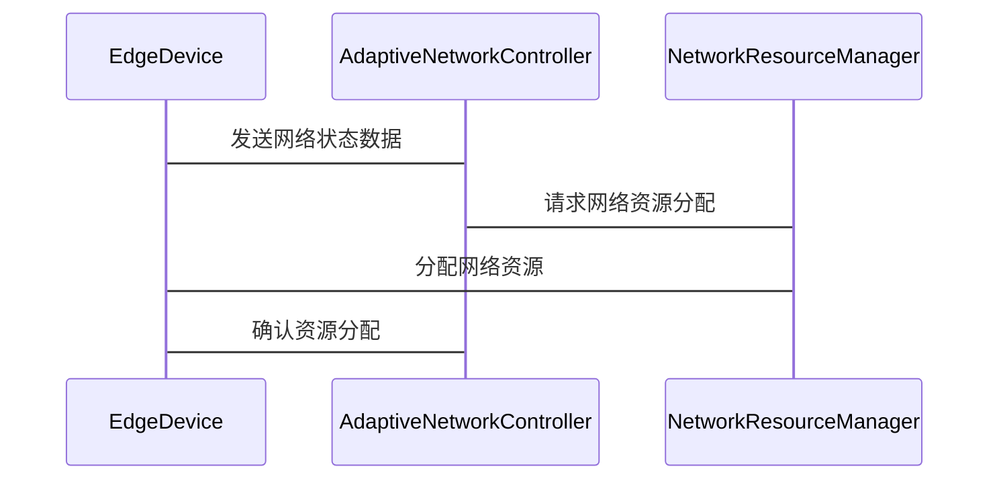

                 


```markdown
# 如何识别企业的边缘计算自适应网络优势

> 关键词：边缘计算，自适应网络，企业网络优化，实时性，资源利用率

> 摘要：边缘计算自适应网络是一种通过动态调整网络资源分配来优化企业网络性能的技术。本文将详细分析边缘计算自适应网络的核心概念、算法原理、系统架构设计以及实际应用场景，帮助读者识别其优势并有效应用于企业环境中。

---

# 第一部分: 边缘计算自适应网络背景介绍

# 第1章: 边缘计算与自适应网络概述

## 1.1 边缘计算的基本概念

### 1.1.1 边缘计算的定义与特点

边缘计算是一种分布式计算范式，数据在靠近数据源的边缘设备上进行处理，而非依赖于中心化的云端计算。其特点包括：

- **分布式计算**：数据在边缘设备上直接处理，减少对云端的依赖。
- **低延迟**：边缘计算能够快速响应本地事件，减少数据传输到云端的延迟。
- **带宽优化**：通过在边缘处理数据，减少需要传输到云端的数据量，优化网络带宽。

### 1.1.2 自适应网络的定义与特点

自适应网络是一种能够根据实时网络状态和业务需求动态调整网络资源分配的技术。其特点包括：

- **动态调整**：根据网络负载和业务需求，自动优化网络资源分配。
- **高效率**：通过资源的动态分配，提高网络资源利用率，减少资源浪费。
- **智能化**：利用算法和机器学习技术，实现网络的智能优化和故障自愈。

### 1.1.3 边缘计算与自适应网络的结合

边缘计算自适应网络是将边缘计算与自适应网络技术结合，通过在边缘设备上动态调整网络资源分配，优化企业网络性能。其优势包括：

- **实时性**：边缘计算的低延迟特性与自适应网络的动态调整能力相结合，能够在毫秒级别响应业务需求。
- **资源利用率**：通过动态分配网络资源，充分利用网络资源，避免资源浪费。
- **灵活性**：能够根据业务需求和网络环境的变化，快速调整网络配置，适应不同的应用场景。

## 1.2 企业边缘计算自适应网络的优势

### 1.2.1 提高数据处理效率

边缘计算自适应网络能够在数据生成的地方实时处理数据，减少数据传输到云端的延迟，从而提高数据处理效率。

### 1.2.2 降低网络延迟

通过在边缘设备上进行数据处理和网络资源动态分配，边缘计算自适应网络能够显著降低网络延迟，提高系统的实时响应能力。

### 1.2.3 提高网络资源利用率

自适应网络技术能够根据网络负载和业务需求，动态调整网络资源分配，充分利用网络资源，避免资源浪费。

## 1.3 企业边缘计算自适应网络的应用场景

### 1.3.1 工业自动化

在工业自动化中，边缘计算自适应网络能够实时处理传感器数据，动态调整生产线的网络资源分配，提高生产效率和产品质量。

### 1.3.2 智慧城市

在智慧城市建设中，边缘计算自适应网络能够实时处理交通、环境监测等数据，动态调整网络资源分配，提高城市管理效率。

### 1.3.3 智慧医疗

在智慧医疗中，边缘计算自适应网络能够实时处理患者监测数据，动态调整网络资源分配，确保医疗数据的实时传输和处理。

## 1.4 本章小结

本章介绍了边缘计算和自适应网络的基本概念，以及它们的结合方式。通过分析边缘计算自适应网络的优势和应用场景，可以帮助读者理解其在企业中的重要性。

---

# 第二部分: 边缘计算自适应网络的核心概念与联系

# 第2章: 边缘计算自适应网络的核心概念

## 2.1 边缘计算自适应网络的原理

### 2.1.1 数据采集与处理

边缘计算自适应网络通过边缘设备采集数据，并在本地进行数据处理，减少对云端的依赖。

### 2.1.2 网络资源动态分配

自适应网络技术能够根据网络负载和业务需求，动态调整网络资源分配，优化网络性能。

### 2.1.3 自适应算法实现

自适应算法通过实时监测网络状态和业务需求，动态调整网络参数，优化网络性能。

## 2.2 边缘计算自适应网络的属性特征对比

### 2.2.1 网络性能对比

| 特性       | 边缘计算自适应网络 | 传统网络 |
|------------|--------------------|-----------|
| 延迟       | 低延迟             | 高延迟    |
| 带宽利用率 | 高利用率           | 低利用率  |
| 灵活性     | 高灵活性           | 低灵活性  |

### 2.2.2 资源利用率对比

| 特性       | 边缘计算自适应网络 | 传统网络 |
|------------|--------------------|-----------|
| CPU利用率  | 高利用率           | 低利用率  |
| 内存利用率  | 高利用率           | 低利用率  |
| 网络带宽利用率 | 高利用率           | 低利用率  |

### 2.2.3 延迟与吞吐量对比

| 特性       | 边缘计算自适应网络 | 传统网络 |
|------------|--------------------|-----------|
| 平均延迟   | 低延迟             | 高延迟    |
| 吞吐量     | 高吞吐量           | 低吞吐量  |

## 2.3 边缘计算自适应网络的ER实体关系图

### 2.3.1 实体关系图的定义

边缘计算自适应网络的ER实体关系图描述了网络中的各个实体及其之间的关系，包括边缘设备、网络资源、业务需求等。

### 2.3.2 实体关系图的绘制

```mermaid
erd
  节点
    id
    name
    type
  边缘设备
    id
    name
    ip_address
  网络资源
    id
    type
    capacity
  业务需求
    id
    type
    priority
```

### 2.3.3 实体关系图的分析

通过实体关系图可以看出，边缘设备与网络资源之间存在关联关系，业务需求通过边缘设备和网络资源来实现。

## 2.4 本章小结

本章详细讲解了边缘计算自适应网络的核心概念，包括数据采集与处理、网络资源动态分配、自适应算法实现等，并通过属性特征对比和ER实体关系图，进一步分析了其优势和特点。

---

# 第三部分: 边缘计算自适应网络的算法原理

# 第3章: 边缘计算自适应网络的算法原理

## 3.1 自适应网络调整算法的流程

### 3.1.1 数据采集与分析

通过边缘设备采集网络状态数据，包括网络负载、延迟、带宽利用率等。

### 3.1.2 网络状态评估

根据采集的数据，评估当前网络状态，判断是否需要进行网络资源调整。

### 3.1.3 资源动态分配

根据网络状态评估结果，动态调整网络资源分配，优化网络性能。

## 3.2 自适应网络调整算法的实现

### 3.2.1 算法流程图（使用 mermaid）

```mermaid
graph TD
    A[数据采集] --> B[网络状态评估]
    B --> C[资源动态分配]
    C --

### 3.2.2 自适应算法的Python实现

```python
def adaptive_network_adjustment():
    # 数据采集
    data = collect_data()
    # 网络状态评估
    status = assess_status(data)
    # 资源动态分配
    allocate_resources(status)
```

### 3.2.3 算法原理的数学模型和公式

自适应网络调整算法的核心是优化目标函数，目标是最小化网络延迟，最大化网络带宽利用率。

$$ \text{目标函数} = \min_{x} \sum_{i=1}^{n} (delay_i \times x_i) $$

其中，$delay_i$ 是第 $i$ 个网络资源的延迟，$x_i$ 是第 $i$ 个网络资源的分配权重。

### 3.2.4 通俗易懂的举例说明

假设我们有一个边缘计算环境，包含两个边缘设备，每个设备连接的网络资源不同。通过自适应算法，我们可以动态调整网络资源的分配，确保在网络负载增加时，优先分配带宽给关键业务，减少延迟。

## 3.3 本章小结

本章详细讲解了自适应网络调整算法的流程、实现和数学模型，通过Python代码和数学公式，进一步分析了其工作原理和优化目标。

---

# 第四部分: 边缘计算自适应网络的系统架构设计

# 第4章: 边缘计算自适应网络的系统架构设计

## 4.1 问题场景介绍

在企业环境中，边缘计算自适应网络需要处理大量的边缘设备和复杂的网络环境，如何高效地进行网络资源动态分配是关键。

## 4.2 系统功能设计

### 4.2.1 领域模型（使用 mermaid 类图）



### 4.2.2 系统架构设计（使用 mermaid 架构图）


### 4.2.3 系统接口设计

- **数据采集接口**：用于采集网络状态数据。
- **网络资源分配接口**：用于动态分配网络资源。
- **业务需求处理接口**：用于处理不同业务需求。

### 4.2.4 系统交互流程（使用 mermaid 序列图）



## 4.3 本章小结

本章通过系统架构设计，详细讲解了边缘计算自适应网络的系统结构和交互流程，为后续的项目实现提供了理论基础。

---

# 第五部分: 边缘计算自适应网络的项目实战

# 第5章: 边缘计算自适应网络的项目实战

## 5.1 环境安装

### 5.1.1 系统环境要求

- 操作系统：Linux/Windows/MacOS
- Python版本：3.6+
- 网络环境：支持边缘计算的网络架构

### 5.1.2 安装依赖包

```bash
pip install mermaid-python
pip install graphviz
```

## 5.2 系统核心实现源代码

### 5.2.1 数据采集模块

```python
import requests

def collect_data():
    # 模拟数据采集
    data = {
        'network_load': 0.8,
        'delay': 50,
        'bandwidth_utilization': 70
    }
    return data
```

### 5.2.2 网络状态评估模块

```python
def assess_status(data):
    # 简单评估网络状态
    if data['network_load'] > 0.9:
        return 'high_load'
    elif data['delay'] > 100:
        return 'high_delay'
    else:
        return 'normal'
```

### 5.2.3 资源动态分配模块

```python
def allocate_resources(status):
    if status == 'high_load':
        # 调整带宽
        increase_bandwidth()
    elif status == 'high_delay':
        # 调整路由
        optimize_routing()
    else:
        # 保持当前配置
        pass
```

## 5.3 代码应用解读与分析

### 5.3.1 数据采集模块解读

数据采集模块通过模拟数据采集，获取网络状态数据，包括网络负载、延迟和带宽利用率。

### 5.3.2 网络状态评估模块解读

网络状态评估模块根据采集的数据，判断当前网络状态，决定是否需要进行网络资源调整。

### 5.3.3 资源动态分配模块解读

资源动态分配模块根据网络状态评估结果，动态调整网络资源分配，优化网络性能。

## 5.4 实际案例分析和详细讲解剖析

### 5.4.1 案例背景

某企业需要优化其工业自动化生产线的网络性能，减少生产过程中的网络延迟，提高生产效率。

### 5.4.2 案例实现

通过边缘计算自适应网络技术，动态调整生产线中的网络资源分配，确保关键业务的低延迟和高带宽利用率。

## 5.5 项目小结

本章通过实际案例分析，详细讲解了边缘计算自适应网络的项目实战，从环境安装到代码实现，再到案例分析，帮助读者掌握其实际应用方法。

---

# 第六部分: 边缘计算自适应网络的最佳实践

# 第6章: 边缘计算自适应网络的最佳实践

## 6.1 最佳实践 tips

- **设备管理**：定期检查和维护边缘设备，确保其正常运行。
- **数据传输安全**：采取加密措施，确保数据在传输过程中的安全性。
- **算法优化**：根据实际应用场景，优化自适应算法，提高网络性能。

## 6.2 小结

边缘计算自适应网络通过动态调整网络资源分配，优化企业网络性能，提高数据处理效率，降低网络延迟，是未来企业网络优化的重要方向。

## 6.3 注意事项

- **数据隐私**：确保边缘设备上的数据隐私和安全。
- **算法复杂度**：在选择自适应算法时，考虑其计算复杂度，避免影响系统性能。
- **网络环境多样性**：在不同网络环境下，可能需要不同的网络资源分配策略。

## 6.4 拓展阅读

- **推荐书籍**：《边缘计算：原理与实践》
- **推荐技术博客**：TechBlog - 边缘计算与自适应网络

---

# 作者：AI天才研究院/AI Genius Institute & 禅与计算机程序设计艺术 /Zen And The Art of Computer Programming
```

