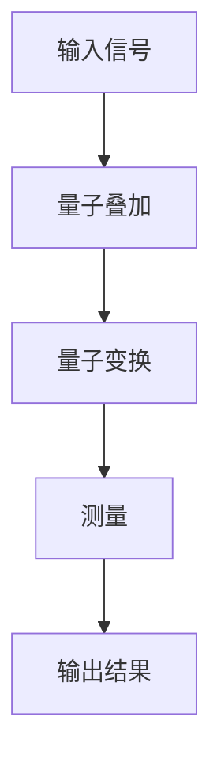
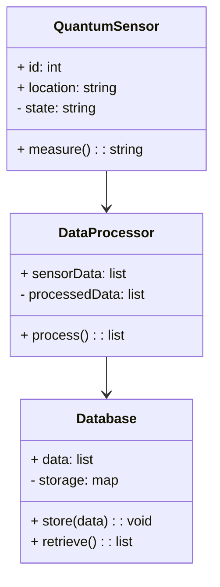
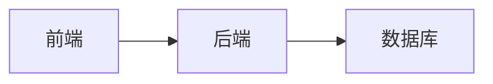
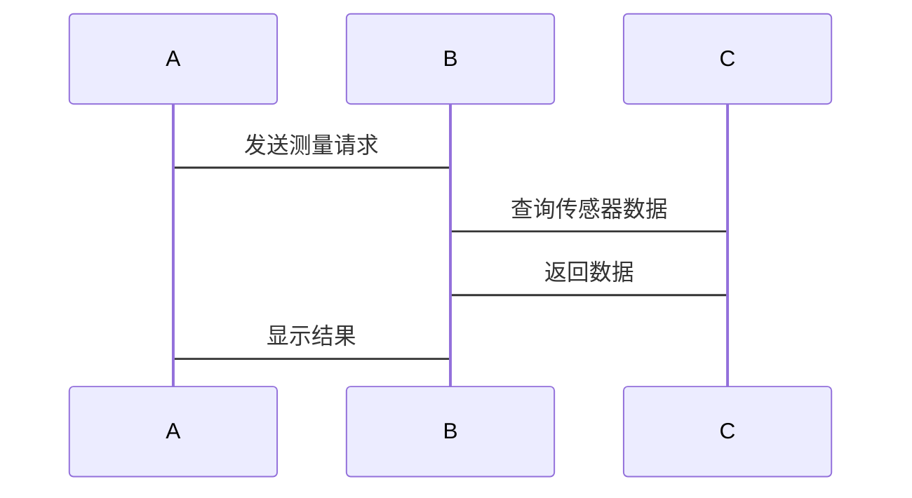

                 


# 如何识别企业的量子传感器应用优势

## 关键词

量子传感器、企业应用、技术优势、系统架构、算法原理

## 摘要

量子传感器作为新兴的量子技术之一，正在逐渐改变企业的数据采集和处理方式。本文从量子传感器的基本概念出发，详细分析其在企业中的应用优势，探讨其核心原理和算法实现，并通过实际案例展示如何识别和应用量子传感器的优势，帮助企业提升竞争力。

---

## 正文

### 第1章：量子传感器的基本概念与应用背景

#### 1.1 量子传感器的基本概念

量子传感器是一种基于量子力学原理设计的传感器，能够以极高的精度检测物理量，如磁场、重力、位置等。与传统传感器相比，量子传感器具有更高的灵敏度和更低的噪声，能够在复杂环境中提供更精确的数据。

#### 1.2 量子传感器的应用背景

随着技术的发展，企业对数据采集的精度和速度要求不断提高。量子传感器的应用为企业提供了更高的数据质量，适用于工业自动化、医疗健康、智慧城市等领域。

### 第2章：量子传感器的核心原理与技术特征

#### 2.1 量子传感器的核心原理

量子传感器利用量子纠缠和叠加原理，通过量子位（qubit）进行信息处理。其核心原理包括量子态的制备、测量和反馈。

#### 2.2 量子传感器的技术特征对比

下表展示了量子传感器与传统传感器在灵敏度、精度、功耗等方面的对比：

| 特性         | 量子传感器 | 传统传感器 |
|--------------|-------------|------------|
| 灵敏度       | 极高        | 较低       |
| 精度         | 高          | 一般       |
| 功耗         | 低          | 较高       |

#### 2.3 量子传感器的应用场景

量子传感器在多个领域展现出独特优势，例如：

- **工业自动化**：用于精确测量温度、压力等参数。
- **医疗健康**：用于高精度的医疗设备，如MRI。
- **智慧城市**：用于环境监测，如空气质量检测。

### 第3章：量子传感器的算法原理讲解

#### 3.1 量子传感器的数据处理算法

量子传感器的数据处理涉及量子算法，如量子傅里叶变换和量子增强算法。以下是量子增强算法的流程图：



#### 3.2 量子传感器的数学模型

量子传感器的数学模型基于量子力学的基本方程，例如：

$$ \psi(t) = e^{-iHt} \psi(0) $$

其中，H是哈密顿量，t是时间，ψ是量子态。

### 第4章：系统分析与架构设计方案

#### 4.1 系统功能设计

量子传感器系统功能包括数据采集、处理、存储和反馈。以下是系统功能的类图：



#### 4.2 系统架构设计

量子传感器系统的架构包括前端、后端和数据库。以下是系统架构图：



#### 4.3 系统交互流程

以下是系统交互的序列图：



### 第5章：项目实战

#### 5.1 环境搭建

安装必要的库和工具，例如Python的量子计算库Qiskit。

#### 5.2 核心代码实现

以下是量子传感器数据处理的Python代码示例：

```python
import qiskit

def quantum_sensor_measurement():
    circuit = qiskit.QuantumCircuit(1,1)
    circuit.h(0)
    circuit.measure(0,0)
    result = qiskit.execute(circuit, qiskit.Aer.get_backend('qasm_simulator')).result()
    return result.get_counts()

print(quantum_sensor_measurement())
```

#### 5.3 案例分析

通过实际案例分析量子传感器在工业自动化中的应用，展示其优势和效果。

### 第6章：总结与展望

量子传感器为企业提供了更高的数据精度和处理能力，未来随着技术的发展，其应用将更加广泛。

---

## 作者

作者：AI天才研究院 & 禅与计算机程序设计艺术

