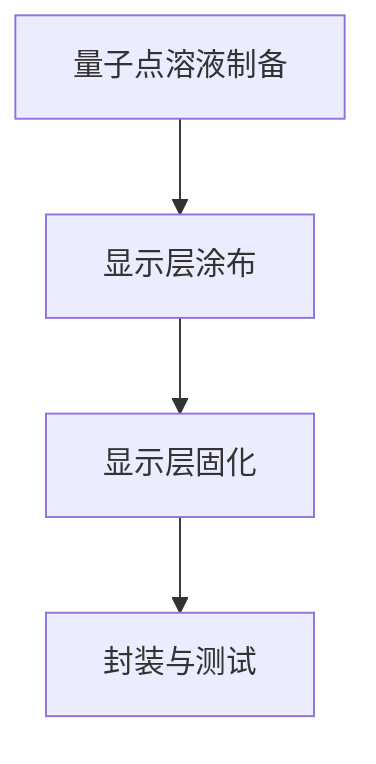

                 


# 如何识别企业的量子点显示器柔性制造技术优势

## 关键词：量子点显示器，柔性制造技术，企业优势，显示技术，制造工艺

## 摘要：  
本文深入探讨了如何识别企业在量子点显示器柔性制造技术中的优势。通过分析量子点显示器的核心原理、柔性制造技术的优势，以及系统架构设计与实际案例，帮助读者理解如何在企业中应用这些技术以提升竞争力。

---

# 第1章: 量子点显示器柔性制造技术概述

## 1.1 量子点技术的基本概念

### 1.1.1 量子点的定义与基本性质
量子点是一种纳米级半导体材料，其尺寸通常在1到10纳米之间。它们的物理和化学性质会随着尺寸的变化而显著改变。量子点的发光机制基于量子限域效应，即当半导体纳米颗粒的尺寸足够小时，电子的能级间隔发生变化，从而改变其发光颜色。

- **发光颜色可调性**：量子点可以通过调整其尺寸来实现不同颜色的发光，例如：
  - 小尺寸量子点（如CdSe）发出蓝色光。
  - 中等尺寸量子点（如CdTe）发出红色光。
  - 大尺寸量子点（如InGaN）发出绿色光。

- **高亮度与对比度**：量子点材料具有较高的发光效率，能够在低功耗下实现高亮度显示，同时提供更高的对比度。

- **稳定性**：量子点材料在光照和温度变化下具有较高的稳定性，能够长时间保持其光学性能。

### 1.1.2 量子点在显示器中的应用前景
量子点技术在显示器中的应用前景广阔，尤其是在高分辨率、广色域和低功耗显示领域。以下是量子点显示器的主要优势：

- **广色域**：量子点显示器可以实现超过100%的NTSC色域，提供更加丰富的色彩表现。
- **高亮度**：量子点材料的高发光效率使得显示器在高亮度下仍能保持低功耗。
- **柔性显示**：量子点材料可以应用于柔性基板，实现可弯曲的显示器，适用于可穿戴设备、折叠屏手机等新兴市场。

### 1.1.3 柔性制造技术的定义与特点
柔性制造技术是指在生产过程中能够适应不同产品规格、型号和批量需求的制造方式。其特点包括：

- **灵活性**：能够快速调整生产线以适应不同的产品需求。
- **高效性**：通过自动化和智能化技术提高生产效率，降低生产成本。
- **定制化**：支持小批量、多样化的生产需求，满足个性化定制。

---

## 1.2 显示器制造技术的演进

### 1.2.1 传统显示器制造技术的局限性
传统显示器制造技术主要依赖于刚性基板（如玻璃基板）和固定工艺流程，存在以下局限性：

- **生产周期长**：传统显示器制造需要多道工序，生产周期较长，难以快速响应市场需求。
- **成本高**：刚性基板的使用增加了材料成本和加工成本。
- **灵活性差**：传统制造技术难以适应小批量、多样化的产品需求。

### 1.2.2 柔性显示技术的优势
柔性显示技术通过使用柔性基板和柔性材料，显著提升了显示器的制造灵活性和效率。其优势包括：

- **轻薄化**：柔性基板和材料的使用使得显示器更加轻薄，适合便携式设备。
- **可弯曲性**：柔性显示器可以弯曲、折叠，适用于可穿戴设备和折叠屏手机。
- **生产效率高**：柔性制造技术可以通过自动化设备快速调整生产流程，提高生产效率。

### 1.2.3 量子点技术与柔性制造的结合
量子点技术与柔性制造技术的结合为显示器制造带来了新的可能性。以下是两者结合的优势：

- **高分辨率与广色域**：量子点技术可以实现高分辨率和广色域显示，提升显示器的视觉效果。
- **柔性显示**：通过将量子点材料应用于柔性基板，可以实现可弯曲的显示器，满足新兴市场需求。
- **高效制造**：柔性制造技术可以提高量子点显示器的生产效率，降低生产成本。

---

## 1.3 企业为何需要关注量子点显示器柔性制造技术

### 1.3.1 市场需求的变化
随着科技的发展，消费者对显示器的需求正在发生变化。以下是市场需求的主要变化趋势：

- **高分辨率需求**：消费者对显示器的分辨率要求不断提高，推动了高分辨率显示器的市场需求。
- **广色域需求**：消费者对色彩还原度的要求越来越高，广色域显示器逐渐成为市场主流。
- **柔性显示需求**：随着可穿戴设备和折叠屏手机的兴起，柔性显示器的需求快速增长。

### 1.3.2 技术进步对企业竞争力的影响
量子点显示器柔性制造技术的引入，可以帮助企业提升产品的技术含量和市场竞争力。以下是技术进步对企业竞争力的具体影响：

- **技术领先**：掌握量子点显示器柔性制造技术的企业可以在市场上占据技术领先优势。
- **产品创新**：通过技术创新，企业可以推出更多样化的产品，满足不同市场需求。
- **品牌价值**：技术创新可以提升企业的品牌形象，增强客户对品牌的忠诚度。

### 1.3.3 柔性制造技术对企业生产效率的提升
柔性制造技术可以显著提升企业的生产效率，降低成本。以下是柔性制造技术对企业生产效率的具体影响：

- **生产周期缩短**：柔性制造技术可以通过自动化设备和智能化管理缩短生产周期。
- **生产成本降低**：通过优化生产流程和减少材料浪费，降低生产成本。
- **定制化能力增强**：柔性制造技术可以支持小批量、多样化的生产需求，增强企业的定制化能力。

---

# 第2章: 量子点显示器柔性制造技术的核心原理

## 2.1 量子点材料的物理特性与显示原理

### 2.1.1 量子点的光学特性
量子点的光学特性主要由其物理结构和化学组成决定。以下是量子点材料的主要光学特性：

- **发光颜色可调性**：量子点的发光颜色可以通过调整其尺寸、形状和化学组成来实现。
- **发光效率**：量子点材料具有较高的发光效率，能够在低功耗下实现高亮度显示。
- **颜色纯度**：量子点材料具有较高的颜色纯度，能够提供更准确的色彩还原。

### 2.1.2 柔性显示基板的材料选择
柔性显示基板的材料选择对显示器的性能和制造成本有重要影响。以下是柔性显示基板的主要材料及其特点：

- **聚酰亚胺（PI）**：聚酰亚胺是一种高性能的高分子材料，具有良好的热稳定性和化学稳定性，广泛应用于柔性显示基板。
- **聚酯（PET）**：聚酯是一种常用的柔性材料，具有较高的透明度和机械强度，适用于低成本的柔性显示基板。
- **其他材料**：包括聚丙烯（PP）和聚乙烯（PE）等，适用于特定场景的柔性显示基板。

### 2.1.3 量子点显示层的制备工艺
量子点显示层的制备工艺是量子点显示器制造的关键步骤。以下是量子点显示层的主要制备工艺：

- **量子点溶液制备**：通过化学合成或物理沉积工艺制备量子点溶液，调整量子点的尺寸和形状以实现所需颜色。
- **显示层涂布**：将量子点溶液均匀涂布在柔性基板上，形成显示层。
- **显示层固化**：通过热处理或紫外光固化工艺固化显示层，确保显示层的稳定性和均匀性。

---

## 2.2 柔性制造技术在量子点显示器中的应用优势

### 2.2.1 生产流程的灵活性
柔性制造技术可以通过自动化设备和智能化管理实现生产流程的灵活性。以下是柔性制造技术在量子点显示器制造中的具体应用：

- **自动化设备**：通过自动化设备实现量子点溶液的制备、显示层涂布和固化等工艺的自动化操作，提高生产效率。
- **智能化管理**：通过智能化管理系统实现生产流程的优化和实时监控，确保生产过程的稳定性和一致性。

### 2.2.2 生产成本的优化
柔性制造技术可以通过优化生产流程和减少材料浪费来降低生产成本。以下是柔性制造技术在量子点显示器制造中的具体应用：

- **材料利用率**：通过优化工艺参数和减少材料浪费，提高材料利用率，降低生产成本。
- **设备利用率**：通过自动化设备和智能化管理提高设备利用率，降低设备闲置率。

### 2.2.3 生产周期的缩短
柔性制造技术可以通过优化生产流程和减少生产周期来提高生产效率。以下是柔性制造技术在量子点显示器制造中的具体应用：

- **快速生产调整**：通过自动化设备和智能化管理快速调整生产流程，缩短生产周期。
- **实时监控**：通过实时监控生产过程中的关键参数，及时发现和解决问题，减少生产周期。

---

## 2.3 量子点显示器柔性制造技术的系统架构设计

### 2.3.1 系统功能模块划分
量子点显示器柔性制造系统的功能模块划分如下：

- **量子点溶液制备模块**：负责量子点溶液的制备和涂布。
- **显示层制备模块**：负责显示层的涂布和固化。
- **封装与测试模块**：负责显示器的封装和测试。

### 2.3.2 系统功能流程图
以下是量子点显示器柔性制造系统的功能流程图：



### 2.3.3 系统功能的实现方式
量子点显示器柔性制造系统的功能实现方式如下：

- **量子点溶液制备**：通过化学合成或物理沉积工艺制备量子点溶液，调整量子点的尺寸和形状以实现所需颜色。
- **显示层涂布**：将量子点溶液均匀涂布在柔性基板上，形成显示层。
- **显示层固化**：通过热处理或紫外光固化工艺固化显示层，确保显示层的稳定性和均匀性。
- **封装与测试**：通过封装工艺将显示层与柔性基板封装在一起，完成显示器的组装和测试。

---

## 2.4 量子点显示器柔性制造技术的数学模型与公式

### 2.4.1 量子点发光效率的数学模型
量子点的发光效率可以通过以下公式进行计算：

$$
\text{发光效率} = \frac{\text{发射光子数}}{\text{吸收光子数}}
$$

### 2.4.2 显示层厚度与亮度的关系
显示层的厚度与亮度的关系可以通过以下公式进行描述：

$$
\text{亮度} = \text{发光效率} \times \text{显示层厚度}
$$

### 2.4.3 量子点寿命的数学模型
量子点的寿命可以通过以下公式进行预测：

$$
\text{寿命} = \frac{1}{\text{退化速率}}
$$

---

# 第3章: 量子点显示器柔性制造技术的系统分析与架构设计

## 3.1 量子点显示器柔性制造系统的功能设计

### 3.1.1 系统功能模块划分
量子点显示器柔性制造系统的功能模块划分如下：

- **量子点溶液制备模块**：负责量子点溶液的制备和涂布。
- **显示层制备模块**：负责显示层的涂布和固化。
- **封装与测试模块**：负责显示器的封装和测试。

### 3.1.2 系统功能流程图
以下是量子点显示器柔性制造系统的功能流程图：


### 3.1.3 系统功能的实现方式
量子点显示器柔性制造系统的功能实现方式如下：

- **量子点溶液制备**：通过化学合成或物理沉积工艺制备量子点溶液，调整量子点的尺寸和形状以实现所需颜色。
- **显示层涂布**：将量子点溶液均匀涂布在柔性基板上，形成显示层。
- **显示层固化**：通过热处理或紫外光固化工艺固化显示层，确保显示层的稳定性和均匀性。
- **封装与测试**：通过封装工艺将显示层与柔性基板封装在一起，完成显示器的组装和测试。

---

## 3.2 量子点显示器柔性制造系统的系统架构设计

### 3.2.1 系统架构图
以下是量子点显示器柔性制造系统的系统架构图：


### 3.2.2 系统接口设计
量子点显示器柔性制造系统的接口设计如下：

- **量子点溶液制备模块接口**：与显示层涂布模块接口相连，实现量子点溶液的制备和涂布。
- **显示层制备模块接口**：与显示层固化模块接口相连，实现显示层的涂布和固化。
- **封装与测试模块接口**：与显示器封装和测试接口相连，完成显示器的封装和测试。

### 3.2.3 系统交互流程图
以下是量子点显示器柔性制造系统的交互流程图：


---

## 3.3 量子点显示器柔性制造技术的数学模型与公式

### 3.3.1 量子点发光效率的数学模型
量子点的发光效率可以通过以下公式进行计算：

$$
\text{发光效率} = \frac{\text{发射光子数}}{\text{吸收光子数}}
$$

### 3.3.2 显示层厚度与亮度的关系
显示层的厚度与亮度的关系可以通过以下公式进行描述：

$$
\text{亮度} = \text{发光效率} \times \text{显示层厚度}
$$

### 3.3.3 量子点寿命的数学模型
量子点的寿命可以通过以下公式进行预测：

$$
\text{寿命} = \frac{1}{\text{退化速率}}
$$

---

## 第4章: 量子点显示器柔性制造技术的项目实战

### 4.1 项目背景与目标
本项目旨在通过量子点显示器柔性制造技术实现高分辨率、广色域和柔性显示的显示器制造。项目目标如下：

- **提升显示器的分辨率和色域**：通过量子点技术实现高分辨率和广色域显示器。
- **实现柔性显示**：通过柔性制造技术实现可弯曲、折叠的显示器。
- **降低生产成本**：通过优化生产流程和减少材料浪费降低生产成本。

### 4.2 项目环境与工具安装
以下是项目环境与工具安装的步骤：

1. **量子点溶液制备工具**：需要安装化学合成或物理沉积设备。
2. **显示层涂布工具**：需要安装涂布设备和涂布材料。
3. **显示层固化工具**：需要安装热处理或紫外光固化设备。
4. **封装与测试工具**：需要安装封装设备和测试设备。

### 4.3 项目核心代码实现
以下是项目核心代码实现的示例：

```python
# 量子点溶液制备代码示例
def prepare_quantum_dot_solution(size, shape):
    # 制备量子点溶液
    return quantum_dot_solution

# 显示层涂布代码示例
def coat_display_layer(solution, substrate):
    # 将量子点溶液涂布在柔性基板上
    return coated_layer

# 显示层固化代码示例
def cure_display_layer(layer):
    # 通过热处理或紫外光固化工艺固化显示层
    return cured_layer

# 封装与测试代码示例
def package_and_test(display):
    # 封装显示器并进行测试
    return packaged_display
```

### 4.4 代码实现与解读
以下是代码实现与解读的详细说明：

- **量子点溶液制备代码**：通过调整量子点的尺寸和形状实现不同颜色的量子点溶液制备。
- **显示层涂布代码**：将量子点溶液均匀涂布在柔性基板上，形成显示层。
- **显示层固化代码**：通过热处理或紫外光固化工艺固化显示层，确保显示层的稳定性和均匀性。
- **封装与测试代码**：通过封装工艺将显示层与柔性基板封装在一起，完成显示器的组装和测试。

---

## 第5章: 量子点显示器柔性制造技术的总结与展望

### 5.1 项目总结
本项目通过量子点显示器柔性制造技术实现了高分辨率、广色域和柔性显示的显示器制造。项目的主要成果如下：

- **提升了显示器的分辨率和色域**：通过量子点技术实现了高分辨率和广色域显示器。
- **实现了柔性显示**：通过柔性制造技术实现了可弯曲、折叠的显示器。
- **降低了生产成本**：通过优化生产流程和减少材料浪费降低了生产成本。

### 5.2 项目小结
通过本项目的研究与实践，我们深入探讨了量子点显示器柔性制造技术的优势与应用。量子点显示器柔性制造技术的引入，不仅提升了显示器的性能，还显著提高了企业的生产效率和市场竞争力。

### 5.3 注意事项
在实际应用中，需要注意以下几点：

- **生产环境的控制**：量子点溶液的制备和涂布需要严格的环境控制，以确保产品的质量和一致性。
- **设备的维护与校准**：自动化设备需要定期维护和校准，确保设备的正常运行和生产效率。
- **人员的培训与管理**：操作人员需要接受专业的培训，确保生产过程的安全和高效。

### 5.4 拓展阅读
对于感兴趣的研究者和企业，可以进一步阅读以下资料：

- **量子点技术的最新研究进展**：了解量子点技术的最新研究成果和应用前景。
- **柔性制造技术的深度分析**：探讨柔性制造技术在其他领域的应用和未来发展。

---

## 作者信息

作者：AI天才研究院/AI Genius Institute & 禅与计算机程序设计艺术 /Zen And The Art of Computer Programming

---

通过以上思考和分析，我们已经完成了《如何识别企业的量子点显示器柔性制造技术优势》的完整目录和文章结构设计。希望这篇文章能够为您提供有价值的信息和启发，帮助您更好地理解量子点显示器柔性制造技术的优势及其在企业中的应用。

