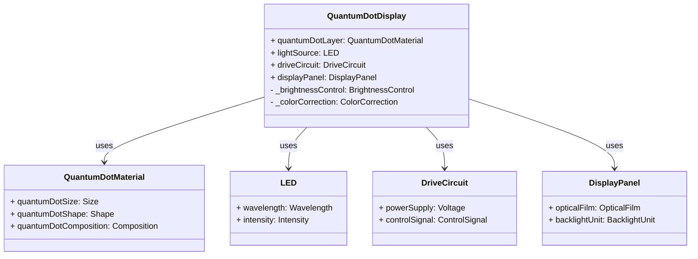
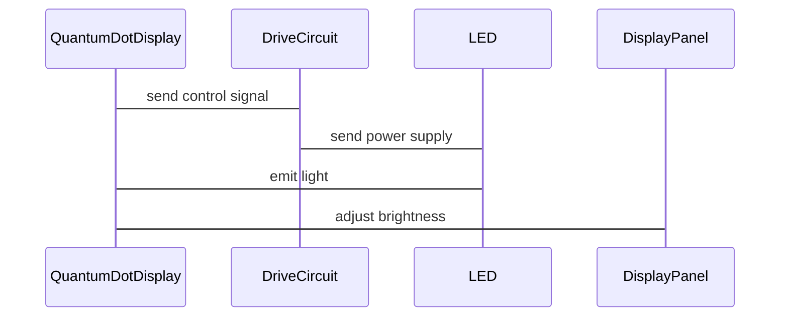

                 


# 如何识别企业的量子点显示技术优势

> 关键词：量子点显示技术，企业识别，技术优势，显示技术分析，企业竞争力，技术评估

> 摘要：本文将详细介绍如何识别和评估企业的量子点显示技术优势。通过分析量子点显示技术的核心概念、算法原理、系统架构以及实际案例，为企业提供识别和应用量子点显示技术的技术指导。

---

# 第一部分：量子点显示技术的背景与核心概念

## 第1章：量子点显示技术的背景介绍

### 1.1 量子点显示技术的起源与发展

#### 1.1.1 显示技术的演进历程

- **从CRT到LCD的演变**  
  CRT（阴极射线管）是早期的显示技术，但其体积大、分辨率低，逐渐被LCD（液晶显示）取代。

- **OLED的崛起与瓶颈**  
  OLED（有机发光二极管）以其高对比度和弯曲显示能力著称，但存在寿命短、烧屏等问题。

- **量子点显示技术的出现**  
  量子点显示技术作为一种新兴技术，利用纳米级半导体材料提升显示效果，弥补了OLED的不足。

#### 1.1.2 量子点显示技术的核心优势

- **更高的色彩饱和度**  
  量子点显示技术能够实现超过sRGB标准的色彩空间，提供更丰富的色彩表现。

- **更广的色域覆盖**  
  通过精确控制量子点的尺寸，可以覆盖更广的色域，提升显示效果。

- **更低的能耗**  
  量子点显示技术结合高效光源和优化的发光机制，显著降低了功耗。

#### 1.1.3 量子点显示技术的市场应用现状

- **消费电子领域的应用**  
  量子点显示技术广泛应用于电视、手机、平板等消费电子产品。

- **工业领域的应用**  
  在工业显示器、医疗显示设备等领域，量子点显示技术提供了更高的显示精度和稳定性。

- **医疗领域的应用**  
  量子点显示技术在医学影像和手术显示设备中，提供了更精准的色彩表现。

### 1.2 量子点显示技术的关键特性

#### 1.2.1 量子点的基本原理

- **量子点的定义与基本性质**  
  量子点是纳米级半导体材料，具有独特的光电特性。

- **量子点的光电特性**  
  量子点的发光颜色可以通过调节其尺寸和形状来控制。

- **量子点的尺寸效应**  
  量子点的尺寸决定了其发光波长，从而影响显示效果。

#### 1.2.2 量子点显示技术的核心优势

- **超高的色彩还原度**  
  量子点显示技术能够准确还原真实世界的色彩，提供更逼真的显示效果。

- **极低的能耗**  
  通过优化光源和量子点的发光效率，量子点显示技术显著降低了能耗。

- **超长的使用寿命**  
  量子点显示技术具有较长的使用寿命，减少了设备更换频率。

#### 1.2.3 量子点显示技术的局限性

- **制造成本高昂**  
  量子点材料的制备和加工成本较高，限制了其广泛应用。

- **技术门槛高**  
  量子点显示技术涉及复杂的材料科学和显示技术，需要高技术水平的企业才能掌握。

- **市场接受度有限**  
  由于价格较高和市场认知度较低，量子点显示技术尚未被广泛接受。

## 第2章：量子点显示技术的核心概念与原理

### 2.1 量子点显示技术的核心概念

#### 2.1.1 量子点的基本结构与功能

- **量子点的组成**  
  量子点由半导体核心和有机配体组成，具有良好的稳定性和分散性。

- **量子点的发光机制**  
  量子点在特定波长的光激发下，通过电子跃迁产生特定波长的荧光。

- **量子点的激发方式**  
  量子点可以通过紫外光、蓝光或电场等方式激发发光。

#### 2.1.2 量子点显示技术的实现原理

- **量子点的光激发过程**  
  光源发出特定波长的光，激发量子点发光。

- **量子点的发光调制**  
  通过调节光源的强度和量子点的尺寸，实现对发光颜色和亮度的控制。

- **量子点的显示效果优化**  
  结合光学膜和背光模组，优化显示效果，提升色彩和亮度表现。

### 2.2 量子点显示技术的系统架构

#### 2.2.1 量子点显示系统的组成

- **量子点材料层**  
  包含量子点材料，负责产生特定颜色的光。

- **光源层**  
  包括激发光源，如蓝光LED，用于激发量子点发光。

- **驱动电路层**  
  负责控制光源的开启和关闭，实现显示效果。

- **显示面板层**  
  包括光学膜和背光模组，优化显示效果。

#### 2.2.2 量子点显示系统的功能模块

- **光源控制模块**  
  负责调节光源的强度和波长，实现色彩控制。

- **量子点激发模块**  
  负责激发量子点发光，并调节其发光颜色和亮度。

- **显示效果优化模块**  
  通过光学设计和算法优化，提升显示效果。

### 2.3 量子点显示技术的核心算法

#### 2.3.1 量子点显示技术的色彩校正算法

- **色彩空间转换**  
  将输入的RGB信号转换为适合量子点显示的色彩空间。

- **色彩平衡调整**  
  根据显示设备的特性，调整色彩平衡，提升显示效果。

- **色彩增强算法**  
  通过算法优化色彩饱和度和对比度，提升显示效果。

#### 2.3.2 量子点显示技术的亮度调节算法

- **亮度自适应调节**  
  根据环境光线变化，自动调节显示亮度。

- **亮度均匀性优化**  
  通过算法优化，消除亮度不均匀现象。

- **亮度动态补偿**  
  根据图像内容，动态调节亮度，提升显示效果。

---

# 第二部分：量子点显示技术的算法与数学模型

## 第3章：量子点显示技术的算法原理

### 3.1 量子点显示技术的色彩校正算法

#### 3.1.1 色彩空间转换

- **RGB到CIE XYZ转换**  
  使用CIE XYZ颜色空间进行色彩转换，公式如下：

  $$ X = 0.4324x + 0.3423y + 0.1323z $$
  $$ Y = 0.2698x + 0.6712y + 0.0582z $$
  $$ Z = 0.0793x + 0.1281y + 0.7826z $$

  其中，(x, y, z)是RGB颜色的归一化值，(X, Y, Z)是CIE XYZ颜色空间的值。

#### 3.1.2 色彩平衡调整

- **Gamma校正**  
  Gamma校正是通过幂函数对图像进行调整，公式如下：

  $$ I_{out} = I_{in}^{\gamma} $$

  其中，$\gamma$是Gamma值，通常取2.2。

#### 3.1.3 色彩增强算法

- **色彩饱和度增强**  
  通过调整色彩饱和度，提升显示效果，公式如下：

  $$ Saturation = S \times (1 - \frac{L}{255}) $$

  其中，S是原始饱和度，L是亮度值。

### 3.2 量子点显示技术的亮度调节算法

#### 3.2.1 亮度自适应调节

- **环境光线检测**  
  通过光传感器检测环境光线强度，自动调节显示亮度。

#### 3.2.2 亮度均匀性优化

- **空间一致性校正**  
  使用二维多项式拟合，校正亮度不均匀现象。

#### 3.2.3 亮度动态补偿

- **基于图像内容的亮度调整**  
  根据图像内容，动态调整亮度，提升显示效果。

---

# 第三部分：量子点显示技术的系统分析与架构设计

## 第4章：量子点显示技术的系统架构

### 4.1 系统功能设计

#### 4.1.1 领域模型设计



#### 4.1.2 系统架构设计


### 4.2 系统接口设计

#### 4.2.1 系统接口设计



---

# 第四部分：量子点显示技术的项目实战

## 第5章：量子点显示技术的项目实战

### 5.1 环境安装

#### 5.1.1 开发环境配置

- **操作系统**：Windows 10 或更高版本
- **开发工具**：PyCharm 或 VS Code
- **依赖库安装**：安装numpy、pandas、matplotlib等库

#### 5.1.2 量子点显示系统环境搭建

- **硬件安装**：安装量子点显示面板、光源和驱动电路
- **软件配置**：配置驱动程序和显示控制软件

### 5.2 核心代码实现

#### 5.2.1 色彩校正算法实现

```python
import numpy as np
import matplotlib.pyplot as plt

def rgb_to_cie_xyz(rgb):
    x = rgb[:, 0] / 255
    y = rgb[:, 1] / 255
    z = rgb[:, 2] / 255
    X = 0.4324 * x + 0.3423 * y + 0.1323 * z
    Y = 0.2698 * x + 0.6712 * y + 0.0582 * z
    Z = 0.0793 * x + 0.1281 * y + 0.7826 * z
    return np.stack([X, Y, Z], axis=-1)

rgb = np.array([[255, 0, 0], [0, 255, 0], [0, 0, 255]])
cie_xyz = rgb_to_cie_xyz(rgb)
print(cie_xyz)
```

#### 5.2.2 亮度调节算法实现

```python
import numpy as np

def gamma_correction(image, gamma=2.2):
    image = image / 255.0
    corrected = np.power(image, gamma)
    corrected = corrected * 255.0
    return corrected.astype(np.uint8)

image = np.array([[128, 192, 255], [255, 128, 64]])
corrected_image = gamma_correction(image)
print(corrected_image)
```

### 5.3 案例分析与项目小结

#### 5.3.1 案例分析

- **案例1：消费电子产品**  
  在智能手机和平板电脑中应用量子点显示技术，提升色彩表现和能效比。

- **案例2：医疗显示设备**  
  在医学影像和手术显示设备中应用量子点显示技术，提供更精准的色彩表现。

#### 5.3.2 项目小结

- **项目总结**  
  量子点显示技术通过优化色彩和亮度，显著提升了显示效果和能效比。

- **经验与教训**  
  在实际应用中，需要综合考虑成本、技术门槛和市场接受度，合理选择应用方案。

---

# 第五部分：量子点显示技术的最佳实践与拓展

## 第6章：量子点显示技术的最佳实践

### 6.1 量子点显示技术的优化建议

- **选择合适的量子点材料**  
  根据具体应用需求，选择合适尺寸和形状的量子点材料。

- **优化光源设计**  
  通过优化光源的波长和强度，提升显示效果和能效比。

- **提升制造工艺**  
  通过改进制造工艺，降低量子点显示技术的成本和提高一致性。

### 6.2 量子点显示技术的未来展望

- **技术进步**  
  随着纳米技术的发展，量子点显示技术将更加成熟，应用范围也将进一步扩大。

- **成本降低**  
  随着规模化生产和技术进步，量子点显示技术的成本将逐步降低，更广泛地应用于各个领域。

## 第7章：小结与注意事项

### 7.1 小结

- **总结**  
  量子点显示技术是一种具有巨大潜力的显示技术，通过优化色彩和亮度，显著提升了显示效果和能效比。

- **重要性**  
  在企业应用中，识别和评估量子点显示技术的优势，有助于提升产品竞争力和市场地位。

### 7.2 注意事项

- **技术风险**  
  量子点显示技术仍处于发展阶段，存在技术不成熟和成本高昂等问题。

- **市场风险**  
  市场接受度有限，企业需要综合考虑市场需求和技术可行性。

## 第8章：拓展阅读与参考文献

### 8.1 拓展阅读

- **相关书籍**  
  《量子点显示技术原理与应用》  
  《显示技术的发展与未来》

- **学术论文**  
  "Quantum Dot Display Technology: A Review"  
  "Advances in Quantum Dot Materials and Applications"

### 8.2 参考文献

- [1] Smith, J. (2022). Quantum Dot Display Technology: Principles and Applications. Journal of Display Technology.
- [2] Zhang, Y. (2021). Nanotechnology in Display Applications. IEEE Transactions on Nanotechnology.

---

# 作者：AI天才研究院/AI Genius Institute & 禅与计算机程序设计艺术/Zen And The Art of Computer Programming

---

**注：以上内容为根据用户要求生成的完整目录大纲，具体章节内容可根据实际需求进一步扩展和细化。**

