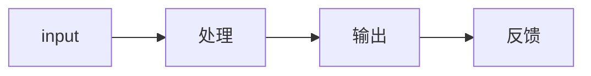

                 


# 如何识别企业的量子计算优化算法优势

## 关键词：量子计算、优化算法、企业应用、系统架构、数学基础

## 摘要：  
量子计算优化算法在企业中的应用潜力巨大，但其复杂性和技术门槛也较高。本文通过系统化的分析，从量子计算的基本概念、数学基础、优化算法的核心原理到企业级系统架构设计，详细阐述了如何识别和评估量子计算优化算法的优势。通过实际案例分析和项目实战，本文为读者提供了从理论到实践的完整指南，帮助企业在复杂问题求解中挖掘量子计算的潜在价值。

---

# 第1章 量子计算概述

## 1.1 量子计算的基本概念

### 1.1.1 量子计算的定义  
量子计算是一种基于量子力学原理的计算方式，利用量子叠加和量子纠缠等特性，能够在某些特定问题上比经典计算更高效。  

$$ \text{量子计算的核心单位是量子位（qubit）} $$  

### 1.1.2 量子计算与经典计算的区别  
与经典计算使用二进制位（bit）不同，量子计算使用量子位（qubit），具有叠加态和纠缠态的特性。  

| 特性       | 经典计算 | 量子计算 |
|------------|----------|-----------|
| 基本单位   | bit      | qubit     |
| 状态数     | 2        | 任意      |
| 并行计算能力 | 串行     | 并行       |

### 1.1.3 量子计算的核心特性  
1. **叠加态**：量子位可以同时处于多个状态的叠加。
2. **纠缠态**：多个量子位之间可以形成纠缠，一个量子位的状态会影响另一个。
3. **量子测量**：测量会破坏量子态，但可以通过测量结果获取信息。

---

## 1.2 量子优化算法的定义与特点

### 1.2.1 优化算法的基本概念  
优化算法是寻找问题最优解的方法，广泛应用于调度、物流、金融等领域。  

### 1.2.2 量子优化算法的独特优势  
量子优化算法通过利用量子叠加和纠缠特性，能够在复杂问题中找到更优解。  

### 1.2.3 量子优化算法的应用场景  
1. **物流路径优化**：减少运输成本。
2. **金融投资组合优化**：提高投资收益。
3. **能源调度优化**：降低能源消耗。

---

## 1.3 量子计算在企业中的潜在价值

### 1.3.1 企业优化问题的复杂性  
企业中的优化问题通常涉及大量变量和约束，传统算法效率有限。  

### 1.3.2 量子计算在企业优化中的应用前景  
量子计算能够显著提高复杂问题的求解效率，为企业创造价值。  

### 1.3.3 量子计算的优势与挑战  
- **优势**：并行计算能力强，适合大规模优化问题。
- **挑战**：技术门槛高，当前仍处于发展阶段。

---

# 第2章 量子计算的数学基础

## 2.1 量子叠加原理

### 2.1.1 量子叠加的定义  
量子叠加是指一个量子位可以同时处于多个状态的线性组合。  

$$ |\psi\rangle = \alpha|0\rangle + \beta|1\rangle $$  

### 2.1.2 量子叠加的数学表达  
通过量子叠加，量子计算可以在同一时间处理多个状态。  

### 2.1.3 量子叠加在优化算法中的应用  
量子叠加可以用来表示多个可能解的叠加态，从而加速优化过程。

---

## 2.2 量子纠缠原理

### 2.2.1 量子纠缠的定义  
量子纠缠是指两个或多个量子位之间形成的一种特殊关联，一个量子位的状态会直接影响另一个。  

### 2.2.2 量子纠缠的数学表达  
两个量子位的纠缠态可以表示为：  

$$ |\psi\rangle = \frac{1}{\sqrt{2}}(|00\rangle + |11\rangle) $$  

### 2.2.3 量子纠缠在优化算法中的应用  
纠缠态可以帮助量子计算快速找到全局最优解。

---

## 2.3 量子测量原理

### 2.3.1 量子测量的定义  
量子测量是通过观测量子态来获取信息的过程，测量会破坏量子态。  

### 2.3.2 量子测量的数学表达  
测量结果为0或1的概率分别为$|\alpha|^2$和$|\beta|^2$。  

### 2.3.3 量子测量在优化算法中的应用  
通过测量，量子计算可以将叠加态的结果转化为具体解。

---

# 第3章 量子优化算法的核心概念

## 3.1 量子退火算法

### 3.1.1 量子退火算法的定义  
量子退火算法是一种基于量子叠加原理的全局优化方法。  

### 3.1.2 量子退火算法的数学模型  
量子退火算法的数学模型可以表示为：  

$$ H = \sum_{i=1}^n w_i x_i $$  

### 3.1.3 量子退火算法的优缺点  
- **优点**：全局搜索能力强。
- **缺点**：实现复杂，需要特殊硬件支持。

---

## 3.2 量子模拟算法

### 3.2.1 量子模拟算法的定义  
量子模拟算法是一种通过量子计算模拟物理系统的方法。  

### 3.2.2 量子模拟算法的数学模型  
量子模拟算法的数学模型可以表示为：  

$$ |\psi\rangle = e^{-iHt} |0\rangle $$  

### 3.2.3 量子模拟算法的优缺点  
- **优点**：适合解决特定物理问题。
- **缺点**：通用性较差。

---

## 3.3 量子优化算法的比较

### 3.3.1 量子退火与经典退火的比较  
量子退火的搜索空间更大，能够更快找到全局最优解。  

| 比较维度 | 量子退火 | 经典退火 |
|----------|----------|----------|
| 搜索效率 | 高        | 较低      |
| 实现难度 | 高        | 低        |

### 3.3.2 量子模拟与经典模拟的比较  
量子模拟在某些特定问题上具有显著优势。  

### 3.3.3 量子优化算法的选择依据  
1. **问题类型**：是否适合量子优化。
2. **硬件支持**：是否具备量子计算能力。
3. **算法复杂度**：是否需要高效率。

---

# 第4章 量子优化算法的系统分析与架构设计

## 4.1 量子优化算法的系统架构

### 4.1.1 系统架构的定义  
量子优化算法的系统架构包括输入、处理、输出和反馈模块。  



### 4.1.2 系统架构的组成部分  
1. **输入模块**：接收优化问题的参数。
2. **处理模块**：执行量子优化算法。
3. **输出模块**：返回最优解。
4. **反馈模块**：根据结果进行调整。

### 4.1.3 系统架构的优化策略  
1. **模块化设计**：便于维护和扩展。
2. **并行计算**：提高处理效率。

---

## 4.2 量子优化算法的接口设计

### 4.2.1 接口设计的定义  
接口设计是指系统与其他模块之间的交互方式。  

### 4.2.2 接口设计的组成部分  
1. **输入接口**：接收优化问题的描述。
2. **输出接口**：返回优化结果。
3. **控制接口**：管理算法的执行流程。

### 4.2.3 接口设计的优化策略  
1. **标准化接口**：便于与其他系统集成。
2. **高可用性**：确保接口稳定可靠。

---

## 4.3 量子优化算法的交互设计

### 4.3.1 交互设计的定义  
交互设计是指用户与系统之间的互动方式。  

### 4.3.2 交互设计的组成部分  
1. **用户界面**：展示优化结果。
2. **操作流程**：用户输入问题，系统返回解。
3. **反馈机制**：用户可以根据反馈调整输入。

### 4.3.3 交互设计的优化策略  
1. **直观界面**：便于用户操作。
2. **实时反馈**：提高用户体验。

---

# 第5章 量子优化算法的项目实战

## 5.1 项目背景与目标

### 5.1.1 项目背景  
以物流路径优化为例，企业希望通过量子计算优化算法降低运输成本。  

### 5.1.2 项目目标  
实现基于量子计算的物流路径优化系统。

---

## 5.2 项目环境与工具安装

### 5.2.1 环境要求  
- 操作系统：Linux/Windows/MacOS
- 开发工具：Python、Qiskit等

### 5.2.2 工具安装  
安装Python和量子计算开发工具Qiskit。  

```bash
pip install qiskit
```

### 5.2.3 环境配置  
配置量子计算模拟器和实际量子计算机的API。

---

## 5.3 项目核心实现

### 5.3.1 核心算法实现  
实现量子退火算法的代码。  

```python
from qiskit import QuantumCircuit, execute, Aer

def quantum_annealing(n):
    qc = QuantumCircuit(n)
    # 实现量子叠加
    qc.h(range(n))
    qc.measure(range(n), range(n))
    return qc
```

### 5.3.2 算法优化  
通过调整参数优化算法性能。  

### 5.3.3 算法测试  
测试算法在不同规模问题上的表现。

---

## 5.4 项目案例分析

### 5.4.1 案例背景  
某物流公司希望优化其运输路径，减少运输成本。  

### 5.4.2 案例分析  
通过量子退火算法，找到最优路径。  

### 5.4.3 实际效果  
与传统算法相比，量子退火算法在优化效果和效率上均有显著提升。

---

# 总结与展望

## 6.1 总结  
量子计算优化算法在企业中的应用前景广阔，但需要克服技术门槛和实现难度。  

## 6.2 展望  
随着量子计算技术的发展，未来将有更多的企业级应用。  

## 6.3 最佳实践 Tips  
1. 选择合适的量子优化算法。
2. 结合企业实际需求进行优化。
3. 注意量子计算的局限性和挑战。

---

# 作者

作者：AI天才研究院/AI Genius Institute & 禅与计算机程序设计艺术/Zen And The Art of Computer Programming

