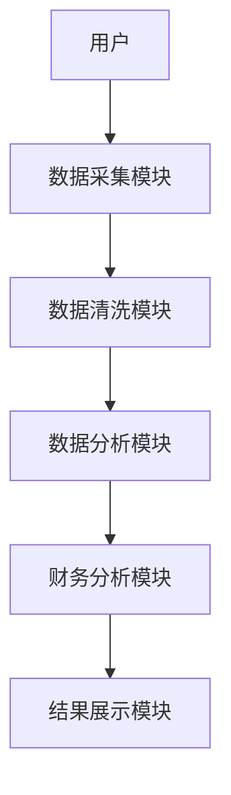

                 


# 如何识别企业的隐藏价值

## 关键词：企业价值，隐藏价值，数据分析，财务分析，战略分析

## 摘要：  
识别企业的隐藏价值是提升企业竞争力和实现可持续发展的关键。本文从定义、重要性、识别方法等方面展开，深入探讨隐藏价值的概念，结合数据分析、财务分析和战略分析等多种方法，帮助企业发现和挖掘潜在价值，优化资源配置，提升企业整体价值。

---

# 如何识别企业的隐藏价值

## 第一部分：背景介绍

### 第1章：企业的隐藏价值概述

#### 1.1 什么是企业的隐藏价值
企业隐藏价值是指企业在经营活动中未被完全显现或被忽视的潜在价值。这些价值可能存在于企业内部资源、市场机会、管理效率、创新潜力等方面，通常需要通过系统的方法和工具进行识别和评估。

#### 1.2 识别隐藏价值的重要性
在竞争激烈的市场环境中，企业需要不断优化资源配置、提升效率、创新产品和服务，以应对市场变化。隐藏价值的识别能够帮助企业发现潜在的增长点，优化管理，提升竞争力，实现可持续发展。

#### 1.3 企业隐藏价值的识别方法
- **数据分析法**：通过分析企业内部数据，如销售数据、成本数据、客户数据等，发现隐藏的价值点。
- **财务分析法**：通过财务报表分析，识别财务数据中的潜在价值。
- **战略分析法**：从企业战略角度出发，分析市场趋势、竞争对手情况，发现隐藏的市场机会。
- **行为分析法**：通过分析员工行为、客户行为，发现内部管理中的潜在改进空间。

#### 1.4 识别企业隐藏价值的边界与外延
- **边界**：隐藏价值的识别应聚焦于企业内部资源和外部市场机会，避免过度扩展到与企业无关的领域。
- **外延**：隐藏价值的识别可以延伸到企业供应链、合作伙伴、客户关系等方面，形成企业生态系统中的潜在价值。

---

## 第二部分：核心概念与联系

### 第2章：企业隐藏价值的核心要素

#### 2.1 核心概念原理
企业隐藏价值的形成机制涉及多个因素，包括企业内部资源的优化配置、外部市场机会的把握、创新能力和管理效率的提升。这些因素共同作用，形成企业的潜在价值。

#### 2.2 核心概念属性特征对比

| **属性**       | **显性价值**         | **隐藏价值**         |
|----------------|----------------------|----------------------|
| **可见性**     | 高                   | 低                   |
| **影响力**     | 明显                 | 潜在                 |
| **识别难度**   | 低                   | 高                   |
| **可持续性**   | 稳定                 | 可变                 |

#### 2.3 ER实体关系图

```mermaid
er
  entity(企业) {
    id: string
    name: string
    industry: string
  }
  entity(隐藏价值) {
    id: string
    value: float
    description: string
  }
  entity(识别过程) {
    id: string
    method: string
    result: boolean
  }
  relationship(企业 - 隐藏价值) {
    企业 -> 隐藏价值: 拥有
  }
  relationship(隐藏价值 - 识别过程) {
    隐藏价值 -> 识别过程: 通过
  }
```

---

## 第三部分：算法原理讲解

### 第3章：隐藏价值识别的算法原理

#### 3.1 数据分析法
数据分析法是识别企业隐藏价值的重要方法之一。通过分析企业的销售数据、成本数据、客户数据等，发现潜在的价值点。

**步骤：**
1. 数据采集：收集企业的销售数据、成本数据、客户数据等。
2. 数据清洗：对数据进行预处理，去除异常值和缺失值。
3. 数据分析：使用统计分析、机器学习等方法，发现数据中的潜在价值。

**代码示例：**

```python
import pandas as pd
import numpy as np

# 数据采集
data = pd.read_csv('企业数据.csv')

# 数据清洗
data.dropna(inplace=True)
data = data[~data['销售额'].isin([np.nan, np.inf])]

# 数据分析：计算利润
data['利润'] = data['销售额'] - data['成本']
print(data['利润'].mean())
```

#### 3.2 财务分析法
财务分析法是通过分析企业的财务报表，识别隐藏的价值点。常见的财务指标包括净利润率、资产负债率、流动比率等。

**数学公式：**

$$
\text{净利润率} = \frac{\text{净利润}}{\text{营业收入}} \times 100\%
$$

$$
\text{资产负债率} = \frac{\text{总负债}}{\text{总资产}} \times 100\%
$$

---

## 第四部分：系统分析与架构设计方案

### 第4章：企业隐藏价值识别系统

#### 4.1 系统功能设计
- **数据采集模块**：负责采集企业的销售数据、成本数据、客户数据等。
- **数据分析模块**：对数据进行清洗、分析，发现潜在价值点。
- **财务分析模块**：对企业的财务报表进行分析，计算相关财务指标。

#### 4.2 系统架构设计



---

## 第五部分：项目实战

### 第5章：隐藏价值识别的实战应用

#### 5.1 项目背景
某制造企业希望通过对内部数据的分析，识别出隐藏的价值点，优化资源配置，提升企业利润。

#### 5.2 核心实现代码

```python
import pandas as pd

# 数据采集
data = pd.read_csv('企业数据.csv')

# 数据清洗
data.dropna(inplace=True)

# 数据分析：计算利润
data['利润'] = data['销售额'] - data['成本']
print(data['利润'].mean())
```

#### 5.3 实际案例分析
通过分析企业的销售数据和成本数据，发现某些产品的利润率较低，但市场需求较高。企业可以进一步优化生产流程，降低成本，提升利润率。

---

## 第六部分：最佳实践

### 第6章：隐藏价值识别的最佳实践

#### 6.1 关键成功要素
- **数据的准确性**：确保数据的准确性和完整性。
- **方法的多样性**：结合多种方法进行分析，避免单一方法的局限性。
- **持续改进**：定期进行分析和评估，及时调整策略。

#### 6.2 注意事项
- 避免过度依赖数据分析，忽略企业实际业务需求。
- 数据分析结果应与企业实际情况相结合，避免理论与实践脱节。

---

## 第七部分：小结与展望

### 7.1 小结
本文详细探讨了企业隐藏价值的识别方法，包括数据分析法、财务分析法、战略分析法等。通过案例分析和系统设计，展示了如何帮助企业发现潜在价值，优化资源配置，提升企业竞争力。

### 7.2 未来展望
随着大数据和人工智能技术的发展，企业隐藏价值的识别将更加精准和高效。未来的研究可以结合更多的新兴技术，如机器学习、区块链等，进一步提升企业价值识别的效率和准确性。

---

## 作者：AI天才研究院/AI Genius Institute & 禅与计算机程序设计艺术/Zen And The Art of Computer Programming

