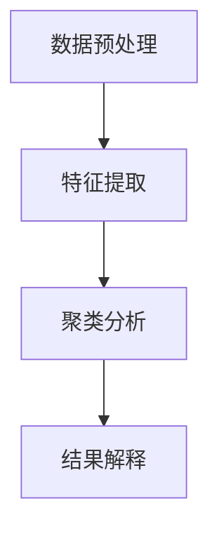
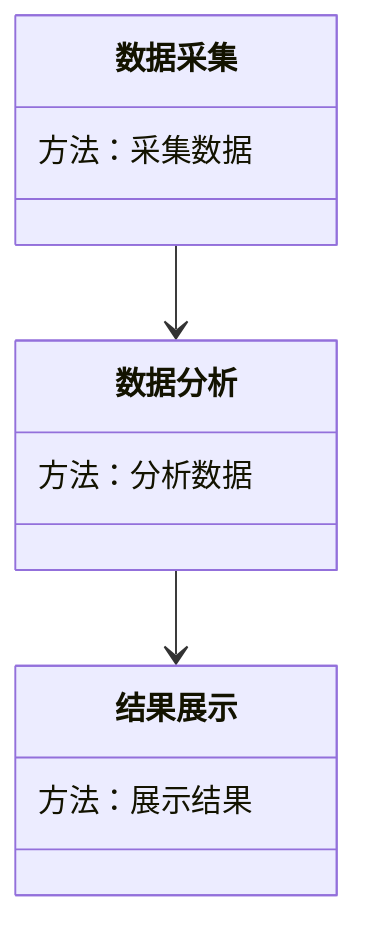
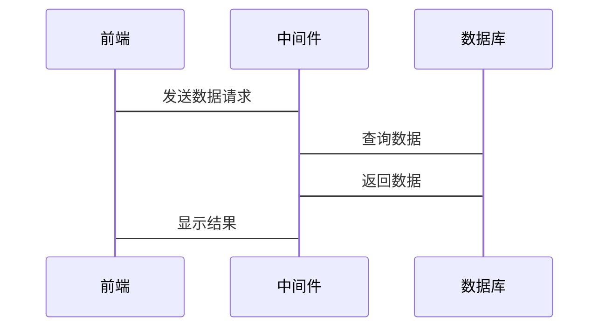

                 


# 如何识别企业的隐藏成长动力

## 关键词：企业成长，隐藏动力，数据分析，系统架构，算法原理

## 摘要： 
本文将探讨如何识别企业的隐藏成长动力，通过系统性分析、数据分析和算法原理，结合实际案例，详细讲解如何识别和应用这些隐藏动力，以推动企业持续成长。

---

## 第一部分：企业的隐藏成长动力概述

### 第1章：企业的隐藏成长动力背景

#### 1.1 问题背景
- **企业成长的核心动力**：企业的成长不仅依赖于显性的资源，如资金、人才和市场，还隐藏着一些难以察觉但至关重要的因素，如组织结构、团队协作和创新文化。
- **隐藏成长动力的定义**：指那些不易被察觉但对企业成长有深远影响的因素，如内部流程优化、企业文化凝聚力等。
- **隐藏成长动力的重要性**：这些因素通常在企业危机时刻显得尤为重要，能够决定企业的生存和长远发展。

#### 1.2 问题描述
- **企业成长的常见问题**：企业可能在快速发展中忽视内部管理问题，导致效率低下或内部矛盾。
- **隐藏成长动力的常见表现**：例如，团队士气低落可能影响产品质量，但这种影响不易被直接测量。
- **问题解决的必要性**：识别这些隐藏因素，可以帮助企业提前采取措施，避免潜在危机。

#### 1.3 问题解决方法
- **系统性分析方法**：通过系统性分析，识别影响企业成长的关键因素。
- **数据驱动的分析方法**：利用数据分析技术，提取隐藏动力的特征。
- **综合性解决方案**：结合定量和定性分析，制定全面的改进策略。

---

## 第二部分：隐藏成长动力的核心概念与联系

### 第2章：核心概念与联系

#### 2.1 核心概念原理
- **隐藏成长动力的构成要素**：包括内部管理、团队协作、企业文化等。
- **核心概念的数学模型**：可以建立一个模型，将这些因素量化，如使用模糊数学方法评估团队凝聚力。

#### 2.2 概念属性特征对比
- **隐藏成长动力与其他动力的对比**：
  | 动力类型 | 显性特征 | 隐藏特征 | 影响程度 |
  |----------|----------|----------|----------|
  | 资金 | 易测量 | 不影响 | 高 |
  | 人才 | 中等 | 中等 | 高 |
  | 组织结构 | 中等 | 难测量 | 高 |

- **ER实体关系图**：通过ER图展示企业各实体之间的关系，如员工、部门、项目之间的关联。

```mermaid
er
    entity 员工 {
        id
        名称
        职位
    }
    entity 部门 {
        id
        名称
        经理
    }
    entity 项目 {
        id
        名称
        状态
    }
    员工 --> 管理：在项目中担任角色
    部门 --> 包含：包含员工
```

---

## 第三部分：隐藏成长动力的算法原理

### 第3章：算法原理讲解

#### 3.1 隐藏成长动力识别算法
- **算法概述**：使用聚类分析识别隐藏因素。
- **mermaid流程图**：展示算法的步骤。



#### 3.2 数学模型和公式
- **公式一**：计算团队凝聚力指数。
  $$凝聚力指数 = \frac{\sum_{i=1}^{n} \text{员工满意度}_i}{n}$$

- **公式二**：计算组织效率。
  $$效率 = \frac{\text{项目完成率}}{\text{资源消耗}}$$

#### 3.3 代码实现
- **Python代码示例**：
  ```python
  import pandas as pd
  from sklearn.cluster import KMeans

  # 数据预处理
  data = pd.read_csv('employee_satisfaction.csv')
  features = data[['满意度', '效率', '参与度']]
  
  # 聚类分析
  model = KMeans(n_clusters=3, random_state=0)
  model.fit(features)
  
  # 结果解释
  print(model.labels_)
  ```

---

## 第四部分：系统分析与架构设计

### 第4章：系统分析与架构设计

#### 4.1 系统功能设计
- **功能模块**：数据采集、分析、结果展示。
- **领域模型**：使用mermaid类图展示模块关系。



#### 4.2 系统架构设计
- **架构图**：展示系统的分层结构。


#### 4.3 接口设计和交互
- **序列图**：展示系统交互流程。



---

## 第五部分：项目实战

### 第5章：项目实战

#### 5.1 项目环境安装
- **工具安装**：安装Python、pandas、scikit-learn等库。
  ```bash
  pip install numpy pandas scikit-learn
  ```

#### 5.2 核心代码实现
- **数据处理**：
  ```python
  import pandas as pd
  from sklearn.cluster import KMeans

  data = pd.read_csv('employee_data.csv')
  features = data[['满意度', '效率', '参与度']]
  model = KMeans(n_clusters=3, random_state=0).fit(features)
  print("簇的中心点：", model.cluster_centers_)
  ```

#### 5.3 实际案例分析
- **案例分析**：以某公司为例，分析其隐藏动力，如员工满意度和项目完成率的关系。
- **结果解读**：识别出哪些部门存在潜在问题，并提出改进建议。

---

## 第六部分：最佳实践与小结

### 第6章：最佳实践

#### 6.1 小结
- 总结识别隐藏动力的关键步骤和方法。
- 强调系统性分析和数据驱动的重要性。

#### 6.2 注意事项
- 数据收集的全面性。
- 算法选择的合理性。
- 结果解读的准确性。

#### 6.3 拓展阅读
- 推荐相关书籍和论文，如《系统动力学》、《数据挖掘技术》。

---

## 作者：AI天才研究院/AI Genius Institute & 禅与计算机程序设计艺术 /Zen And The Art of Computer Programming

---

通过以上结构，您可以系统地识别和应用企业的隐藏成长动力，推动企业的持续发展。

