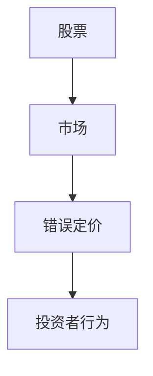
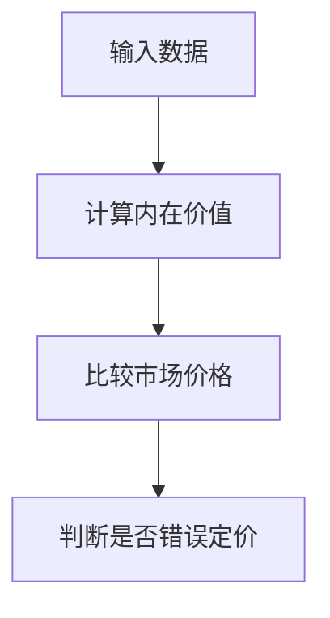
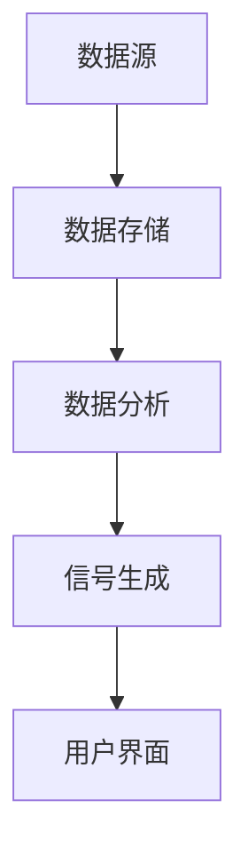

                 


# 如何识别并利用市场对特价股票的错误定价

## 关键词：特价股票、错误定价、市场机制、投资者行为、量化分析、系统设计、投资策略

## 摘要：本文系统地探讨了如何识别和利用市场中特价股票的错误定价。首先，我们分析了错误定价的成因和类型，然后详细讲解了量化分析的方法，包括算法原理和数学模型。接着，我们从系统设计的角度，构建了一个错误定价检测系统，并通过实际案例展示了如何在投资中应用这些方法。最后，我们总结了最佳实践和注意事项，帮助读者在实际操作中避免常见错误。

## 第一部分：背景与概述

### 第1章：特价股票与错误定价概述

#### 1.1 特价股票的定义与特点

1.1.1 特价股票的定义  
特价股票是指在特定时间点，市场定价低于其真实价值的股票。这种定价错误通常发生在市场参与者对股票的内在价值评估不准确或市场信息不对称的情况下。

1.1.2 特价股票的特点  
- 价格低估：市场定价低于股票的内在价值。  
- 潜在收益：投资者在低价时买入，高价时卖出，可以获得超额收益。  
- 稀缺性：特价股票通常数量有限，一旦被发现，会被迅速抢购一空。  

1.1.3 特价股票的分类  
- 价值型特价股票：市场定价远低于其内在价值。  
- 成长型特价股票：市场定价低于其未来成长潜力的价值。  
- 周期性特价股票：受市场周期影响，价格被暂时压低的股票。  

#### 1.2 市场错误定价的背景

1.2.1 市场定价机制的局限性  
市场定价受多种因素影响，包括信息不对称、市场情绪和交易成本等。这些因素可能导致股票价格偏离其真实价值。

1.2.2 投资者行为与市场错定价  
投资者的非理性行为，如羊群效应和认知偏差，常常导致市场出现错误定价。

1.2.3 特价股票出现的常见原因  
- 市场恐慌：如金融危机期间，投资者抛售股票导致价格暴跌。  
- 信息延迟：市场未能及时反映公司的好转。  
- 市场操纵：某些机构或个人故意压低股价。  

#### 1.3 错误定价识别的重要性

1.3.1 投资机会的发现  
识别错误定价股票可以帮助投资者发现潜在的投资机会，获取超额收益。

1.3.2 风险控制的重要性  
及时识别错误定价可以帮助投资者避免因价格波动带来的损失。

1.3.3 市场周期的影响  
在市场周期低谷时，错误定价的机会较多，投资者可以利用这些机会进行抄底。

---

## 第二部分：错误定价的成因与机制

### 第2章：市场机制与错误定价

#### 2.1 市场定价机制的分析

2.1.1 市场供需关系  
股票价格由市场供需决定，但供需关系可能因信息不对称和市场情绪而扭曲。

2.1.2 机构投资者的行为  
机构投资者的交易行为对市场定价有重要影响，但有时也可能导致错误定价。

2.1.3 市场情绪的影响  
市场情绪波动会影响投资者决策，进而影响股票价格，导致错误定价。

#### 2.2 投资者行为分析

2.2.1 羊群效应  
投资者往往跟随市场趋势，导致价格泡沫或崩盘。

2.2.2 信息不对称  
市场中信息分布不均，导致部分投资者能够利用信息优势获利，而另一部分则可能被误导。

2.2.3 认知偏差  
投资者的决策常受认知偏差影响，如过度自信和从众心理，导致错误定价。

#### 2.3 错误定价的类型

2.3.1 价值低估  
市场定价低于股票的内在价值，投资者可以以低价买入，待价格回升时卖出获利。

2.3.2 情绪驱动的错误定价  
市场情绪过度波动导致股票价格偏离其真实价值。

2.3.3 市场结构的错配  
市场参与者结构不合理，导致某些股票被错误定价。

---

## 第三部分：错误定价识别的核心概念

### 第3章：错误定价的原理与模型

#### 3.1 错误定价的定义与属性

3.1.1 错误定价的定义  
错误定价是指股票的市场定价与其真实价值不符的情况。

3.1.2 错误定价的属性对比  

| 属性         | 正确定价       | 错误定价         |
|--------------|----------------|------------------|
| 市场价格     | 接近真实价值    | 偏离真实价值     |
| 投资者行为   | 理性决策       | 非理性决策       |
| 时间周期     | 短期波动       | 长期偏差         |

3.1.3 错误定价的特征  
- 价格波动性大  
- 市场反应滞后  
- 信息不对称  

#### 3.2 错误定价的分类与特征

3.2.1 价值型错误定价  
股票的市场定价低于其内在价值，投资者可以通过基本面分析发现机会。

3.2.2 情绪型错误定价  
市场情绪过度波动导致股票价格偏离真实价值，通常出现在市场恐慌或过度乐观时。

3.2.3 周期型错误定价  
受市场周期影响，股票价格在特定阶段被低估或高估。

#### 3.3 错误定价的ER实体关系图



---

## 第四部分：错误定价识别的量化分析

### 第4章：量化错误定价的核心算法

#### 4.1 错误定价识别的算法原理

4.1.1 算法目标  
通过量化分析，识别市场定价与股票真实价值之间的差异。

4.1.2 算法步骤  



#### 4.2 错误定价的数学模型

4.2.1 市场价格与内在价值的对比  

$$ \text{错误定价指数} = \frac{\text{市场价格}}{\text{内在价值}} $$

4.2.2 内在价值计算模型  

$$ V = \frac{CF}{r - g} $$  

其中，\( V \) 是内在价值，\( CF \) 是现金流，\( r \) 是贴现率，\( g \) 是增长率。

#### 4.3 算法实现

```python
def calculate_intrinsic_value(cash_flows, discount_rate, growth_rate):
    return cash_flows / (discount_rate - growth_rate)

def is_value_cheap(stock_price, intrinsic_value):
    return stock_price < intrinsic_value * 0.9

# 示例
cf = 100
r = 0.05
g = 0.02
iv = calculate_intrinsic_value(cf, r, g)
stock_price = 80
if is_value_cheap(stock_price, iv):
    print("股票价格被低估")
else:
    print("股票价格合理")
```

---

## 第五部分：系统设计与实现

### 第5章：错误定价检测系统设计

#### 5.1 系统功能设计

5.1.1 数据收集模块  
从多个数据源收集股票的市场数据和基本面数据。

5.1.2 数据分析模块  
使用量化模型计算股票的内在价值，并与市场价格进行对比。

5.1.3 信号生成模块  
根据错误定价指数生成投资信号，提示投资者买入或卖出。

#### 5.2 系统架构设计



---

## 第六部分：项目实战

### 第6章：错误定价识别的项目实践

#### 6.1 项目环境与数据准备

6.1.1 环境安装  
安装必要的金融分析库，如Pandas、NumPy和Matplotlib。

#### 6.2 核心代码实现

```python
import pandas as pd
import numpy as np

def calculate_intrinsic_value(df, discount_rate, growth_rate):
    cf = df['现金流'].values
    iv = cf / (discount_rate - growth_rate)
    return iv

# 示例数据
data = {'现金流': [100, 150, 200], '市场价格': [80, 120, 150]}
df = pd.DataFrame(data)
r = 0.05
g = 0.02
iv = calculate_intrinsic_value(df, r, g)
df['内在价值'] = iv
df['错误定价指数'] = df['市场价格'] / df['内在价值']

print(df)
```

#### 6.3 实际案例分析

以某公司为例，分析其股价是否被低估：

$$ \text{错误定价指数} = \frac{\text{市场价格}}{\text{内在价值}} = \frac{80}{100} = 0.8 $$

由于错误定价指数小于1，说明股票价格被低估，存在投资机会。

---

## 第七部分：最佳实践与注意事项

### 第7章：最佳实践与投资策略

#### 7.1 小结

- 错误定价识别是投资成功的关键。
- 结合基本面分析和量化模型，可以提高识别准确率。

#### 7.2 注意事项

- 错误定价识别具有风险，需谨慎操作。
- 结合其他分析方法，避免单一依赖模型。

#### 7.3 拓展阅读

- 《价值投资》：深入理解股票的内在价值。
- 《金融数据分析》：掌握金融数据的处理方法。

---

## 作者：AI天才研究院 & 禅与计算机程序设计艺术

---

本文系统地探讨了如何识别和利用市场对特价股票的错误定价，从理论到实践，为投资者提供了全面的指导。

