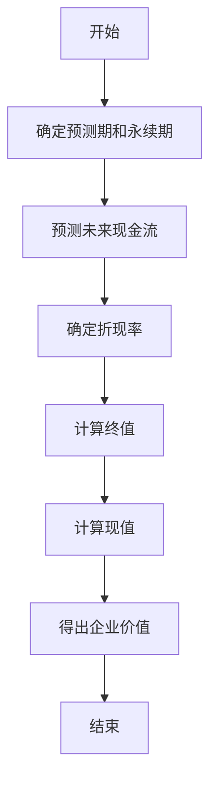
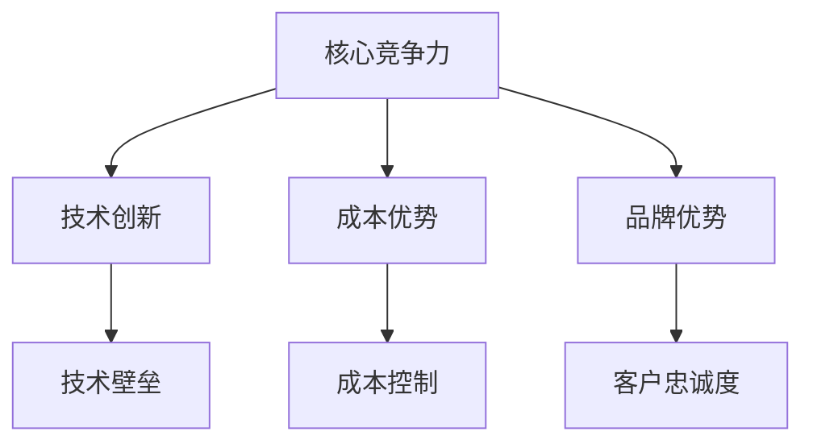
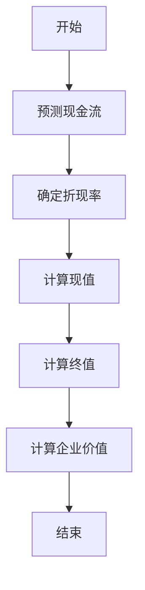
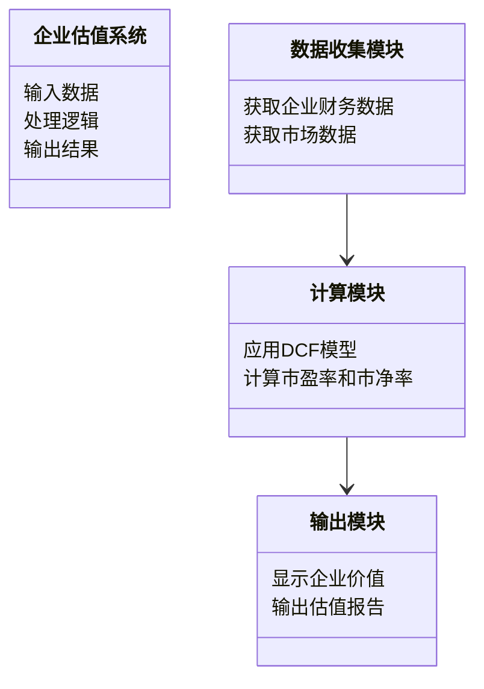

                 


# 如何识别被低估的优质企业

> 关键词：企业估值、现金流贴现模型、市盈率、市净率、企业竞争优势、财务报表分析、企业护城河

> 摘要：本文将详细介绍如何识别被低估的优质企业。首先，我们将定义企业低估和优质企业的概念，并分析其核心特征。接着，我们将介绍企业价值评估的核心模型，包括现金流贴现模型（DCF模型）和市盈率、市净率分析。然后，我们将详细讲解企业财务报表分析与估值的关键指标，并通过实例分析企业竞争优势与护城河。最后，我们将通过系统分析与项目实战，结合具体案例，展示如何识别被低估的优质企业。

---

# 第一部分: 识别被低估的优质企业的背景与核心概念

## 第1章: 企业低估与优质企业的定义

### 1.1 企业低估的背景与问题背景

#### 1.1.1 企业低估的定义与概念
企业低估是指一家企业在市场上的实际价值低于其内在价值的情况。这种低估可能是由于市场参与者对企业价值的认知偏差、信息不对称或市场情绪波动等因素导致的。

#### 1.1.2 企业低估的常见原因
- 市场认知偏差：投资者对企业未来增长潜力的低估。
- 信息不对称：企业内部信息未充分披露，导致市场对其价值的误判。
- 市场情绪波动：市场恐慌或过度乐观导致企业估值偏离实际价值。

#### 1.1.3 企业低估与市场认知的偏差
企业低估通常与市场认知偏差密切相关。当市场对企业的未来增长潜力或盈利能力存在误解时，企业的实际价值可能被低估。

### 1.2 优质企业的核心特征

#### 1.2.1 优质企业的定义与标准
优质企业通常具有稳定的盈利能力、强大的竞争优势、良好的财务状况和持续的增长潜力。

#### 1.2.2 优质企业的核心要素对比表
| 核心要素         | 具体标准                          |
|------------------|----------------------------------|
| 盈利能力         | 净利润稳定增长，ROE（净资产收益率）高 |
| 竞争优势         | 具备独特的竞争优势，如技术壁垒、品牌优势等 |
| 财务状况         | 资产负债表健康，现金流稳定        |
| 市场地位         | 市场占有率高，行业龙头地位        |

#### 1.2.3 优质企业的ER实体关系图
```mermaid
erDiagram
    company {
        id
        name
        industry
        revenue
        profit
        market_share
    }
    competitor {
        id
        name
        revenue
        profit
        market_share
    }
    company o- competitor : "竞争关系"
```

---

## 第2章: 企业价值评估的核心模型

### 2.1 现金流贴现模型（DCF模型）

#### 2.1.1 DCF模型的基本原理
DCF模型通过将未来现金流贴现到现在，以评估企业的内在价值。其基本公式为：

$$
\text{企业价值} = \sum_{t=1}^{n} \frac{\text{现金流}}{(1 + r)^t}
$$

其中，\( r \) 是折现率，\( n \) 是预测的年数。

#### 2.1.2 DCF模型的数学公式
现金流贴现模型的终值计算公式为：

$$
\text{终值} = \text{最后一年的现金流} \times (1 + g)^{-1}
$$

其中，\( g \) 是永续增长率为零的假设。

#### 2.1.3 DCF模型的mermaid流程图


#### 2.1.4 DCF模型的Python代码实现
```python
def dcf_model(fcf_fye, wacc,永续增长率,预测年数):
    # 计算终值
    tv = fcf_fye * (1 + 永续增长率) ** -1
    # 计算现值
    pv = 0
    for year in range(1, 预测年数 + 1):
        pv += fcf_fye * (1 + 永续增长率) ** (year - 1) / (1 + wacc) ** year
    return pv + tv

# 示例数据
fcf_fye = 100000000  # 最后一年的自由现金流
wacc = 0.10          # 加权平均资本成本
永续增长率 = 0         # 永续期增长率为0
预测年数 = 5          # 预测年数

企业价值 = dcf_model(fcf_fye, wacc, 永续增长率, 预测年数)
print("企业价值为：", 企业价值)
```

---

### 2.2 市盈率与市净率分析

#### 2.2.1 市盈率的计算与应用
市盈率（P/E）= 股价 / 每股收益（EPS）。市盈率反映了市场对企业盈利能力的估值。

#### 2.2.2 市净率的计算与应用
市净率（P/B）= 股价 / 每股净资产（BPS）。市净率反映了市场对企业资产质量的估值。

#### 2.2.3 市盈率与市净率对比分析表
| 指标   | 定义                     | 适用场景                     |
|--------|--------------------------|------------------------------|
| 市盈率 | 股价/每股收益           | 适用于盈利稳定的公司         |
| 市净率 | 股价/每股净资产         | 适用于资产密集型企业         |

---

## 第3章: 企业财务报表分析与估值

### 3.1 财务报表的核心指标

#### 3.1.1 收入与利润分析
收入分析包括主营业务收入、其他业务收入等。利润分析包括净利润、营业利润等。

#### 3.1.2 资产负债表分析
主要关注流动资产、非流动资产、流动负债、非流动负债等。

#### 3.1.3 现金流量表分析
分析经营活动、投资活动和筹资活动的现金流情况。

### 3.2 企业估值的关键公式

#### 3.2.1 企业价值的计算公式
$$
\text{企业价值} = \text{息税折旧及摊销前利润} \times \text{EV/EBITDA倍数}
$$

#### 3.2.2 股东权益的计算公式
$$
\text{股东权益} = \text{资产总额} - \text{负债总额}
$$

#### 3.2.3 市场价值与内在价值的对比
市场价值由股价决定，内在价值由企业未来现金流决定。

---

## 第4章: 企业竞争优势与护城河分析

### 4.1 企业竞争优势的定义

#### 4.1.1 核心竞争力的识别
核心竞争力包括技术创新、成本优势、品牌优势等。

#### 4.1.2 企业护城河的类型
护城河包括技术壁垒、网络效应、成本优势等。

#### 4.1.3 竞争优势的评估标准
竞争力强的企业通常具有稳定的市场份额和较高的客户忠诚度。

### 4.2 企业竞争优势的mermaid分析图



---

# 第二部分: 识别被低估优质企业的算法与系统分析

## 第5章: 企业估值的算法原理

### 5.1 现金流贴现模型的实现

#### 5.1.1 DCF模型的mermaid流程图


#### 5.1.2 DCF模型的Python代码实现
```python
def calculate_dcf(fcf, discount_rate, years):
    present_value = 0
    for i in range(years):
        present_value += fcf / (1 + discount_rate) ** (i + 1)
    return present_value

# 示例数据
fcf = 1000000  # 每年的自由现金流
discount_rate = 0.10  # 折现率
years = 5              # 年数

企业价值 = calculate_dcf(fcf, discount_rate, years)
print("企业价值为：", 企业价值)
```

---

## 第6章: 企业估值系统的架构设计

### 6.1 问题场景介绍

#### 6.1.1 问题背景
识别被低估的优质企业需要一个系统化的解决方案，包括数据收集、模型计算和结果分析。

#### 6.1.2 项目介绍
本项目旨在开发一个企业估值系统，通过分析企业的财务数据和市场数据，识别被低估的企业。

### 6.2 系统功能设计

#### 6.2.1 领域模型mermaid类图


### 6.3 系统架构设计

#### 6.3.1 系统架构mermaid架构图


---

## 第7章: 项目实战与案例分析

### 7.1 环境安装

#### 7.1.1 安装Python
需要安装Python 3.8或更高版本。

#### 7.1.2 安装相关库
安装Pandas、NumPy、Matplotlib等库用于数据处理和可视化。

### 7.2 系统核心实现源代码

#### 7.2.1 数据收集模块
```python
import pandas as pd

def collect_data(ticker):
    # 示例：从CSV文件读取数据
    df = pd.read_csv(f'{ticker}.csv')
    return df
```

#### 7.2.2 计算模块
```python
def calculate_intrinsic_value(df, discount_rate):
    # 示例：计算DCF模型的现值
    present_value = 0
    for year in range(len(df)):
        present_value += df['现金流'][year] / (1 + discount_rate) ** (year + 1)
    return present_value
```

#### 7.2.3 输出模块
```python
def generate_report(ticker, intrinsic_value):
    print(f"企业的内在价值为：{intrinsic_value}")
    print(f"企业的市场价格为：{df.loc[0, '股价']}")
    print(f"企业是否被低估：{intrinsic_value > df.loc[0, '股价']}")
```

### 7.3 代码应用解读与分析

#### 7.3.1 代码实现
```python
# 示例代码
import pandas as pd

def main():
    ticker = 'AAPL'
    df = collect_data(ticker)
    intrinsic_value = calculate_intrinsic_value(df, 0.10)
    generate_report(ticker, intrinsic_value)

if __name__ == "__main__":
    main()
```

### 7.4 实际案例分析

#### 7.4.1 案例分析
以苹果公司为例，通过DCF模型计算其内在价值，并与市场价格进行对比。

#### 7.4.2 详细讲解剖析
分析苹果公司的财务数据，计算其现金流贴现模型的现值，并与市场价格进行对比。

---

## 第8章: 最佳实践 tips、小结、注意事项、拓展阅读

### 8.1 最佳实践 tips

#### 8.1.1 关注财务报表的准确性
确保财务数据的准确性和完整性。

#### 8.1.2 考虑宏观经济因素
宏观经济环境对企业估值有重要影响。

#### 8.1.3 多模型结合使用
结合DCF模型、市盈率、市净率等多种方法进行综合分析。

### 8.2 小结

识别被低估的优质企业需要综合运用多种方法，包括现金流贴现模型、市盈率、市净率分析等。同时，需要结合企业的财务状况和竞争优势进行综合评估。

### 8.3 注意事项

- 数据的准确性和完整性
- 模型的假设和限制
- 市场环境的变化对企业估值的影响

### 8.4 拓展阅读

- 《企业价值评估》
- 《投资学原理》
- 《财务报表分析》

---

# 作者：AI天才研究院/AI Genius Institute & 禅与计算机程序设计艺术 /Zen And The Art of Computer Programming

---

以上是《如何识别被低估的优质企业》的技术博客文章的详细目录和内容概要。

