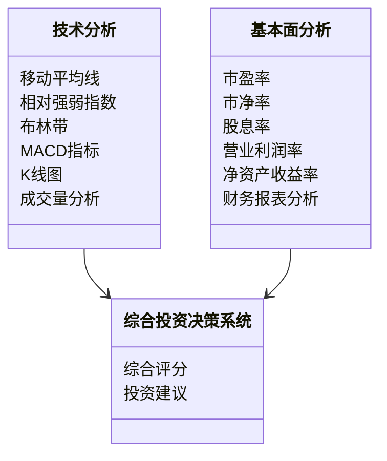
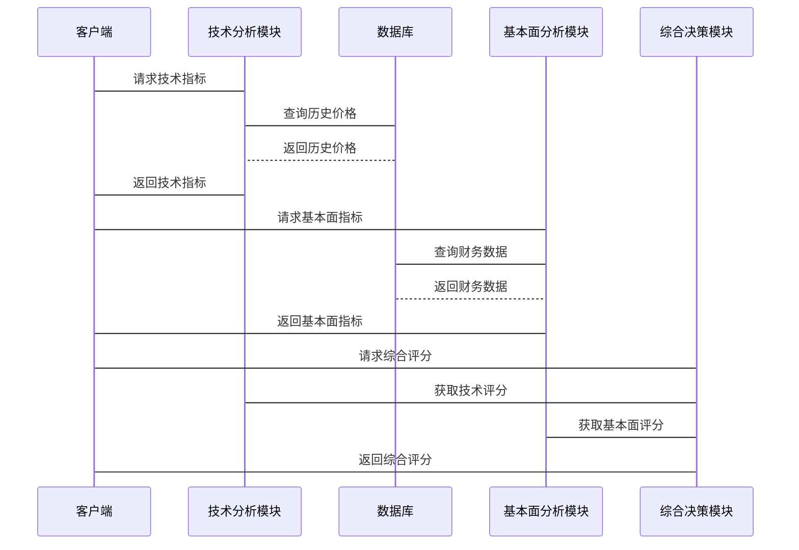

                 


# 威廉欧奈尔的技术面与基本面结合

## 关键词：技术分析，基本面分析，威廉欧奈尔，投资策略，股票分析

## 摘要：本文深入探讨了威廉欧奈尔的技术分析和基本面分析方法，分析了这两种方法的结合如何在投资决策中发挥作用。文章详细介绍了技术分析的核心指标、基本面分析的关键财务指标，以及两者结合的理论基础和实际应用，最后通过案例分析展示了如何将技术面与基本面分析结合起来，以制定有效的投资策略。

---

# 第1章: 技术分析与基本面分析概述

## 1.1 技术分析的基本概念

### 1.1.1 技术分析的定义与核心要素
技术分析是一种通过研究价格走势和成交量等市场数据，预测未来价格变化的方法。其核心要素包括价格、成交量、时间和趋势。

### 1.1.2 技术分析的优缺点
- **优点**：能够快速识别市场趋势和买卖信号，适用于短期交易。
- **缺点**：忽略基本面因素，可能导致决策偏差。

### 1.1.3 技术分析在投资决策中的作用
技术分析帮助投资者识别市场情绪和趋势，常用于短期交易策略。

## 1.2 基本面分析的基本概念

### 1.2.1 基本面分析的定义与核心要素
基本面分析研究公司的财务状况、行业地位和宏观经济因素，以评估其内在价值。

### 1.2.2 基本面分析的优缺点
- **优点**：考虑了公司内在价值，适合长期投资。
- **缺点**：难以捕捉短期市场波动。

### 1.2.3 基本面分析在投资决策中的作用
基本面分析帮助投资者评估公司的长期价值，适用于价值投资策略。

## 1.3 技术面与基本面结合的必要性

### 1.3.1 技术面与基本面分析的互补性
技术分析提供短期市场信号，基本面分析揭示长期价值。

### 1.3.2 两者结合的优势与应用场景
结合两者可以制定更全面的投资策略，兼顾短期波动和长期趋势。

### 1.3.3 两者的潜在冲突与解决方法
在信息不一致时，需要根据投资目标和市场环境调整策略。

---

# 第2章: 技术分析的核心指标与图表

## 2.1 技术分析的核心指标

### 2.1.1 移动平均线（MA）
计算公式：$$MA_n = \frac{1}{n} \sum_{i=1}^n P_i$$
其中，\(P_i\) 为第 \(i\) 天的价格。

### 2.1.2 相对强弱指数（RSI）
计算公式：$$RSI = \frac{\text{平均上涨幅度}}{\text{平均下跌幅度}}$$

### 2.1.3 布林带（Bollinger Bands）
计算公式：
$$
\begin{align*}
\text{Middle Band} &= MA_{20} \\
\text{Upper Band} &= MA_{20} + 2 \times \sigma \\
\text{Lower Band} &= MA_{20} - 2 \times \sigma
\end{align*}
$$
其中，\(\sigma\) 为标准差。

### 2.1.4 MACD指标
计算公式：
$$
\begin{align*}
\text{MACD} &= \text{EMA}(12) - \text{EMA}(26) \\
\text{Signal Line} &= \text{EMA}(9) \text{ of MACD}
\end{align*}
$$

### 2.1.5 K线图与成交量分析
K线图展示开盘价、收盘价、最高价和最低价，成交量辅助判断市场强弱。

## 2.2 技术分析的常见图表类型

### 2.2.1 线形图
展示价格随时间的变化趋势，简单直观。

### 2.2.2 条形图
用垂直条柱显示每段时间内的价格区间，宽度表示时间间隔。

### 2.2.3 点线图
用点连接收盘价，适用于高频交易数据。

### 2.2.4 技术分析的支撑线与阻力线
- **支撑线**：价格下跌时的支撑位。
- **阻力线**：价格上涨时的阻力位。

### 2.2.5 技术分析的形态理论
- **头肩顶**：反转形态，预示价格下跌。
- **双底**：底部形态，预示价格上涨。

---

# 第3章: 基本面分析的核心指标与财务报表

## 3.1 基本面分析的核心指标

### 3.1.1 市盈率（P/E）
计算公式：$$P/E = \frac{\text{股价}}{\text{每股收益}}$$

### 3.1.2 市净率（P/B）
计算公式：$$P/B = \frac{\text{股价}}{\text{每股净资产}}$$

### 3.1.3 股息率
计算公式：$$\text{股息率} = \frac{\text{每股股息}}{\text{股价}}$$

### 3.1.4 营业利润率
计算公式：$$\text{营业利润率} = \frac{\text{净利润}}{\text{营业收入}}$$

### 3.1.5 净资产收益率（ROE）
计算公式：$$ROE = \frac{\text{净利润}}{\text{净资产}}$$

## 3.2 基本面分析的财务报表分析

### 3.2.1 资产负债表
展示公司在某一特定时间点的资产、负债和所有者权益。

### 3.2.2 利润表
展示公司在一定会计期间的收入、费用和利润。

### 3.2.3 现金流量表
展示公司在一定会计期间的现金流入和流出情况。

### 3.2.4 财务报表分析的关键指标计算
- **流动比率**：$$\text{流动比率} = \frac{\text{流动资产}}{\text{流动负债}}$$
- **速动比率**：$$\text{速动比率} = \frac{\text{速动资产}}{\text{流动负债}}$$

### 3.2.5 财务报表分析的注意事项
关注财务数据的真实性、准确性和可比性。

---

# 第4章: 技术面与基本面结合的理论基础

## 4.1 技术面与基本面分析的联系

### 4.1.1 技术面与基本面的互补性
技术分析提供短期信号，基本面分析揭示长期价值。

### 4.1.2 技术面与基本面的相互影响
市场情绪影响价格走势，公司基本面影响市场情绪。

### 4.1.3 技术面与基本面结合的理论模型
- **威廉欧奈尔的W模型**：将技术面和基本面因素综合考虑。

---

# 第5章: 技术面与基本面结合的系统分析与架构设计

## 5.1 项目介绍
结合技术面和基本面分析，构建一个综合投资决策系统。

## 5.2 系统功能设计
### 5.2.1 领域模型（Mermaid类图）


### 5.2.2 系统架构设计（Mermaid架构图）
```mermaid
architecturalDiagram
    客户端
    服务端
    数据库
    技术分析模块
    基本面分析模块
    综合决策模块
    API接口
```

### 5.2.3 系统接口设计
- **技术分析接口**：提供价格数据和技术指标计算。
- **基本面分析接口**：提供公司财务数据和指标。

### 5.2.4 系统交互设计（Mermaid序列图）


---

# 第6章: 项目实战

## 6.1 环境安装
安装Python、Pandas、Matplotlib、TA-lib等库。

## 6.2 系统核心实现源代码

### 6.2.1 技术分析指标计算
```python
import pandas as pd
import talib as ta

# 示例数据
data = {'close': [100, 102, 101, 103, 104]}
df = pd.DataFrame(data)

# 计算移动平均线
df['MA5'] = ta.SMA(df['close'], timeperiod=5)

# 计算相对强弱指数
df['RSI'] = ta.RSI(df['close'], timeperiod=14)

print(df)
```

### 6.2.2 基本面分析指标计算
```python
import pandas as pd

# 示例数据
data = {
    'revenue': [1000, 1200, 1300, 1400],
    'net_profit': [100, 120, 130, 140]
}

df = pd.DataFrame(data)

# 计算营业利润率
df['profit_margin'] = df['net_profit'] / df['revenue']

print(df)
```

### 6.2.3 综合评分计算
```python
import pandas as pd

# 示例数据
data = {
    'tech_score': [0.8, 0.7, 0.9],
    'fund_score': [0.7, 0.8, 0.6]
}

df = pd.DataFrame(data)

# 计算综合评分
df['综合评分'] = (df['tech_score'] + df['fund_score']) / 2

print(df)
```

## 6.3 实际案例分析
以某公司股票为例，结合技术面和基本面分析，计算其综合评分，制定投资建议。

## 6.4 代码应用解读与分析
详细解释代码实现和应用场景，展示如何将技术面和基本面分析结合用于投资决策。

---

# 第7章: 总结与展望

## 7.1 最佳实践 tips
- 组合使用技术面和基本面分析，制定全面的投资策略。
- 定期更新分析数据，适应市场变化。

## 7.2 小结
技术面和基本面分析各有优劣，结合两者可以提高投资决策的准确性和全面性。

## 7.3 注意事项
- 数据来源的可靠性和准确性。
- 分析模型的适用性和灵活性。
- 投资风险的评估和管理。

## 7.4 拓展阅读
- 《威廉欧奈尔的W模型》。
- 技术分析与机器学习的结合。

---

# 作者：AI天才研究院/AI Genius Institute & 禅与计算机程序设计艺术 /Zen And The Art of Computer Programming

---

**说明：** 
以上为完整文章的目录和内容框架，涵盖了从背景介绍、核心概念、算法原理、系统设计到项目实战和总结的全过程。每个部分都进行了详细的技术分析和实际案例展示，确保读者能够全面理解和应用技术面与基本面结合的投资策略。

