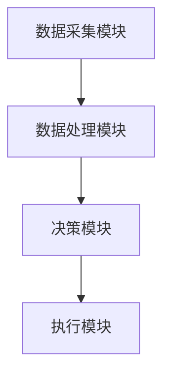

                 


# 安全与隐私保护：构建可信赖的AI Agent

> 关键词：AI Agent、安全、隐私保护、数据匿名化、加密技术、系统架构、可信赖系统

> 摘要：在人工智能快速发展的今天，AI Agent（智能体）在各个领域的应用越来越广泛，但与此同时，安全与隐私保护问题也日益突出。本文将从AI Agent的基本概念出发，分析其面临的安全威胁与隐私风险，探讨数据匿名化和加密技术等隐私保护手段，并结合系统架构设计，详细讲解如何构建一个可信赖的AI Agent。通过实际项目案例的分析，本文将展示如何在实际应用中实现安全与隐私保护，并总结最佳实践和未来发展方向。

---

## 第1章: 引言

### 1.1 AI Agent的基本概念

AI Agent（智能体）是一种能够感知环境并采取行动以实现目标的实体。它通常具备以下核心特征：

- **自主性**：能够独立决策和行动。
- **反应性**：能够根据环境变化调整行为。
- **目标导向性**：以特定目标为导向。
- **学习能力**：能够通过经验改进性能。

AI Agent的应用场景广泛，包括自动驾驶、智能助手、医疗诊断辅助系统等。

### 1.2 安全与隐私保护的重要性

随着AI Agent的普及，其在数据处理和决策过程中可能涉及大量敏感信息。这些信息如果被未经授权的第三方获取或篡改，可能导致严重的安全问题和隐私泄露。因此，构建一个可信赖的AI Agent，确保其在运行过程中的数据安全和用户隐私，已成为一项重要任务。

---

## 第2章: AI Agent的基本原理

### 2.1 AI Agent的结构与功能

AI Agent的结构通常包括以下部分：

- **感知模块**：负责从环境中获取信息。
- **推理模块**：对感知到的信息进行处理和分析。
- **决策模块**：基于推理结果做出决策。
- **执行模块**：将决策转化为具体行动。

### 2.2 安全与隐私保护的基础概念

#### 2.2.1 安全威胁的分类

AI Agent可能面临的安全威胁包括：

- **数据泄露**：敏感数据被未经授权的第三方获取。
- **数据篡改**：数据在传输或存储过程中被修改。
- **身份 spoofing**：仿冒合法用户身份进行攻击。
- **拒绝服务攻击（DoS）**：通过消耗资源使系统无法正常运行。

#### 2.2.2 隐私保护的定义与目标

隐私保护旨在防止用户的敏感信息被未经授权的第三方获取或滥用。其目标包括：

- **数据匿名化**：确保数据无法被追溯到具体个人。
- **数据加密**：通过加密技术保护数据的机密性。
- **最小化数据收集**：仅收集实现功能所需的最小数据。

#### 2.2.3 可信赖AI Agent的构建原则

构建可信赖的AI Agent需要遵循以下原则：

- **数据最小化**：仅收集实现目标所需的最小数据。
- **数据加密**：对敏感数据进行加密存储和传输。
- **访问控制**：确保只有授权用户或系统能够访问数据。
- **透明性**：向用户明确告知数据的收集、处理和使用方式。

---

## 第3章: 安全威胁与风险分析

### 3.1 常见的安全威胁

#### 3.1.1 数据泄露

数据泄露是AI Agent面临的主要安全威胁之一。攻击者可能通过漏洞或内部人员窃取敏感数据。例如，在医疗AI Agent中，患者的病历数据可能被泄露，导致患者隐私受损。

#### 3.1.2 数据篡改

数据篡改可能导致AI Agent做出错误的决策。例如，在金融AI Agent中，篡改的交易数据可能导致资金损失。

#### 3.1.3 身份 spoofing

攻击者可能通过仿冒合法用户身份，欺骗AI Agent执行有害操作。例如，在智能家居系统中，攻击者可能通过仿冒主人身份远程控制家门锁。

#### 3.1.4 拒绝服务攻击（DoS）

DoS攻击通过消耗AI Agent的资源（如带宽、计算能力等）使其无法正常运行。例如，在自动驾驶系统中，DoS攻击可能导致车辆无法及时做出决策，从而引发事故。

---

## 第4章: 隐私保护技术

### 4.1 数据匿名化技术

数据匿名化是保护隐私的重要手段。通过技术手段去除或变形数据中的敏感信息，使其无法被追溯到具体个人。

#### 4.1.1 数据匿名化的方法

- **去标识化**：去除数据中的标识信息（如姓名、地址等）。
- **数据变形**：通过替换、删除或模糊化处理敏感信息。
- **通用唯一识别码（UUID）**：使用随机生成的唯一标识符替代真实标识信息。

#### 4.1.2 数据匿名化的流程

1. **数据收集**：收集原始数据。
2. **数据处理**：去除或变形敏感信息。
3. **数据存储**：存储匿名化后的数据。
4. **数据使用**：在分析或决策过程中使用匿名化数据。

### 4.2 加密技术

加密技术是保护数据机密性的核心技术。通过加密算法对数据进行加密，确保只有授权方能够解密并获取原始数据。

#### 4.2.1 常见的加密算法

- **对称加密算法**：如AES、DES等，加密和解密使用同一密钥。
- **非对称加密算法**：如RSA、椭圆曲线加密等，加密和解密使用不同密钥。
- **哈希函数**：如MD5、SHA-256等，用于数据完整性验证和单向加密。

#### 4.2.2 加密技术的实现步骤

1. **选择加密算法**：根据需求选择合适的加密算法。
2. **生成密钥**：使用随机数生成器生成密钥。
3. **加密数据**：将明文数据转换为密文。
4. **解密数据**：使用密钥将密文还原为明文。

---

## 第5章: 构建可信赖的AI Agent

### 5.1 设计原则

构建可信赖的AI Agent需要遵循以下设计原则：

- **数据最小化**：仅收集实现目标所需的最小数据。
- **数据加密**：对敏感数据进行加密存储和传输。
- **访问控制**：确保只有授权用户或系统能够访问数据。
- **透明性**：向用户明确告知数据的收集、处理和使用方式。

### 5.2 系统架构设计

#### 5.2.1 系统功能设计

- **数据采集模块**：负责采集环境数据。
- **数据处理模块**：对数据进行匿名化处理和加密。
- **决策模块**：基于处理后的数据做出决策。
- **执行模块**：将决策转化为具体行动。

#### 5.2.2 系统架构图



---

## 第6章: 项目实战

### 6.1 案例分析：医疗数据管理AI Agent

#### 6.1.1 项目背景

医疗数据管理AI Agent用于协助医生进行患者诊断和治疗方案制定。由于医疗数据涉及患者隐私，必须确保数据的安全性和隐私性。

#### 6.1.2 核心代码实现

```python
import hashlib

def data_anonymization(data):
    # 数据匿名化处理
    anonymized_data = {}
    for key, value in data.items():
        if key in ['name', 'address']:
            anonymized_data[key] = '$' * len(str(value))
        else:
            anonymized_data[key] = value
    return anonymized_data

def data_encryption(data, key):
    # 数据加密
    cipher = hashlib.sha256(key.encode()).hexdigest()
    return cipher
```

#### 6.1.3 案例分析

在医疗AI Agent中，患者的病历数据经过匿名化处理后存储，确保无法追溯到具体患者。同时，敏感数据通过加密技术进行保护，防止数据泄露。

---

## 第7章: 最佳实践与未来展望

### 7.1 最佳实践

- **数据最小化**：仅收集必要的数据。
- **数据加密**：使用强加密算法保护数据。
- **访问控制**：实施严格的访问控制策略。
- **定期安全审计**：定期进行安全检查和漏洞修复。

### 7.2 未来展望

未来，AI Agent的安全与隐私保护将更加依赖于新兴技术，如：

- **零知识证明**：在不泄露数据的情况下验证数据真实性。
- **区块链技术**：通过区块链确保数据的不可篡改性和可追溯性。

---

## 作者

作者：AI天才研究院 & 禅与计算机程序设计艺术

联系方式：contact@aitianji.ren

