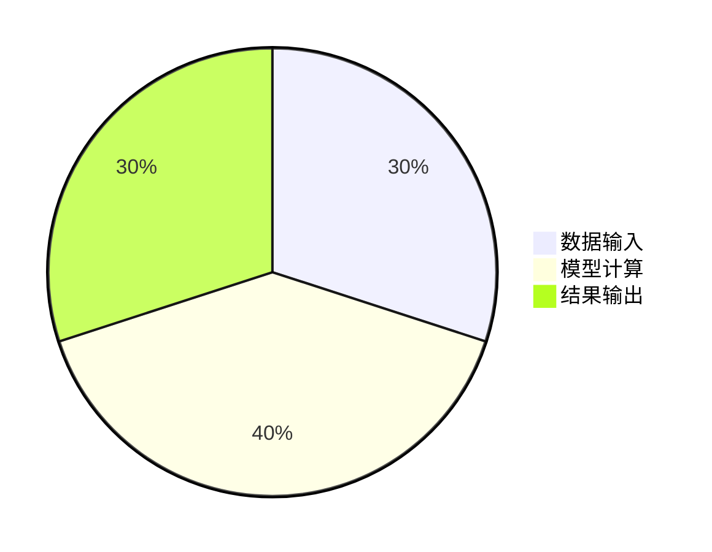

                 


# 实例演示：如何计算企业价值

> 关键词：企业价值、财务估值、投资分析、DCF模型、相对估值法、资本成本、企业并购

> 摘要：本文将详细介绍企业价值的计算方法，通过背景分析、核心概念、算法原理、系统架构、项目实战等多维度展开，结合实际案例，深入浅出地讲解企业价值计算的全过程，帮助读者掌握企业价值评估的核心技巧和实际应用。

---

## 第一部分: 企业价值计算的背景与概述

### 第1章: 企业价值计算的背景与目的

#### 1.1 企业价值的重要性
企业价值（Enterprise Value，EV）是企业在市场上的整体价值，是评估企业资产、负债、股权价值的重要指标。企业价值不仅仅反映了企业的财务状况，还体现了其市场竞争力和未来发展潜力。

#### 1.2 企业价值计算的目的
企业价值计算的主要目的是为了评估企业的整体价值，帮助投资者、管理者做出合理的决策，如并购、投资、融资等。

#### 1.3 企业价值在企业决策中的作用
企业价值是企业并购、资产重组、股权定价的重要参考，同时也是企业战略规划和风险管理的重要依据。

---

### 第2章: 企业价值计算的基本概念与特点

#### 2.1 企业价值的构成
企业价值由资产、负债和所有者权益三部分构成，其中资产包括流动资产和非流动资产，负债包括流动负债和非流动负债，所有者权益包括股本、资本公积、盈余公积等。

#### 2.2 企业价值计算的特点
- **动态性**：企业价值会随着市场环境、财务状况的变化而变化。
- **主观性**：企业价值的评估需要结合市场、行业、企业自身等多种因素，具有一定的主观性。
- **复杂性**：企业价值计算涉及多种方法和模型，需要综合考虑多个因素。

---

## 第二部分: 企业价值计算的核心概念与理论基础

### 第3章: 企业价值的核心概念与联系

#### 3.1 企业价值的核心概念
- **资产价值**：资产的市场价值，包括流动资产和非流动资产。
- **股东权益价值**：股东对企业净资产的所有权价值。
- **企业整体价值**：企业在市场上的整体价值，包括资产、负债和所有者权益的综合评估。

#### 3.2 核心概念之间的关系
- 资产与负债：资产是企业的资源，负债是企业的债务，二者共同影响企业的财务状况。
- 利润与价值：利润是企业的经营成果，与企业价值密切相关。
- 现金流与价值：现金流是企业价值的重要指标，反映了企业的盈利能力和流动性。

#### 3.3 核心概念的属性特征对比
| 概念         | 特性                     |
|--------------|--------------------------|
| 资产价值     | 客观性、流动性           |
| 股东权益     | 主观性、稳定性           |
| 企业整体价值 | 综合性、动态性           |

---

### 第4章: 企业价值计算的理论基础

#### 4.1 资本资产定价模型（CAPM）
CAPM用于计算资产的预期回报率，公式为：
$$ r = r_f + \beta (r_m - r_f) $$
其中，$r_f$ 是无风险利率，$\beta$ 是资产的贝塔系数，$r_m$ 是市场预期回报率。

#### 4.2 投资组合理论
投资组合理论通过分散投资降低风险，公式为：
$$ \text{总风险} = \sqrt{\text{方差}} $$

#### 4.3 股权资本成本的计算
股权资本成本是企业价值计算的重要组成部分，常用CAPM模型计算。

---

## 第三部分: 企业价值计算的算法与数学模型

### 第5章: 企业价值计算的算法原理

#### 5.1 现金流贴现法（DCF模型）
DCF模型是企业价值计算的核心方法，公式为：
$$ \text{企业价值} = \sum_{t=1}^{n} \frac{\text{自由现金流}}{(1 + r)^t} + \frac{\text{终值}}{(1 + r)^n} $$
其中，$r$ 是折现率，$n$ 是预测期数。

#### 5.2 算法流程图
```mermaid
graph TD
    A[开始] -> B[输入财务数据]
    B -> C[计算自由现金流]
    C -> D[确定折现率]
    D -> E[计算现值]
    E -> F[计算终值]
    F -> G[计算企业价值]
    G -> H[输出结果]
    H -> A[结束]
```

---

## 第四部分: 系统分析与架构设计

### 第6章: 系统分析与架构设计方案

#### 6.1 问题场景介绍
企业价值计算系统需要处理复杂的财务数据和模型，因此需要设计高效的系统架构。

#### 6.2 系统功能设计
- 数据输入模块：输入企业财务数据
- 模型计算模块：计算企业价值
- 结果输出模块：输出计算结果

#### 6.3 系统架构设计


---

## 第五部分: 项目实战

### 第7章: 项目实战

#### 7.1 环境安装
- 安装Python和相关库（如pandas、numpy）

#### 7.2 核心代码实现
```python
import pandas as pd
import numpy as np

def calculate_enterprise_value(free_cash_flow, discount_rate, terminal_value):
    present_value = 0
    for cash in free_cash_flow:
        present_value += cash / (1 + discount_rate)
    total_value = present_value + terminal_value / (1 + discount_rate)
    return total_value

# 示例数据
free_cash_flow = [100, 150, 200]
discount_rate = 0.1
terminal_value = 500

enterprise_value = calculate_enterprise_value(free_cash_flow, discount_rate, terminal_value)
print("企业价值：", enterprise_value)
```

#### 7.3 案例分析
以某科技公司为例，计算其企业价值。

---

## 第六部分: 最佳实践、小结与注意事项

### 第8章: 最佳实践与注意事项

#### 8.1 小结
企业价值计算是一个复杂的过程，需要结合多种方法和模型，同时要考虑市场环境和企业自身的财务状况。

#### 8.2 注意事项
- 数据质量：确保输入数据的准确性和完整性。
- 模型选择：根据实际情况选择合适的估值方法。
- 风险管理：合理评估模型的局限性，避免过度依赖单一方法。

---

作者：AI天才研究院/AI Genius Institute & 禅与计算机程序设计艺术 /Zen And The Art of Computer Programming

