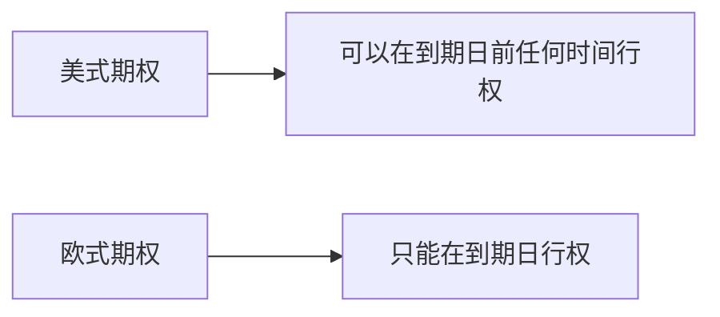
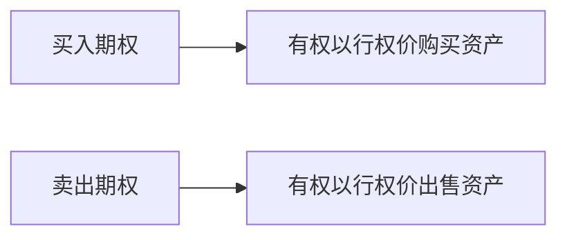
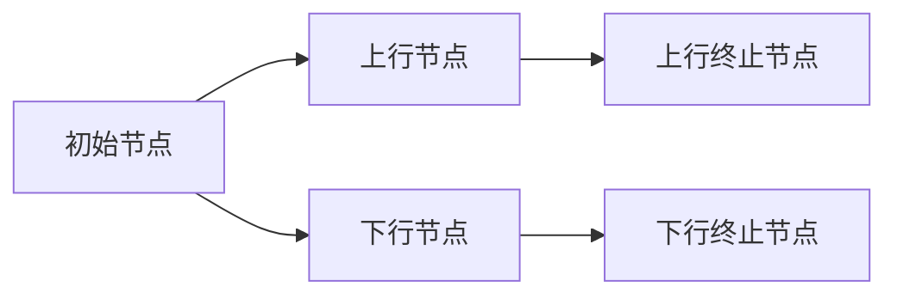
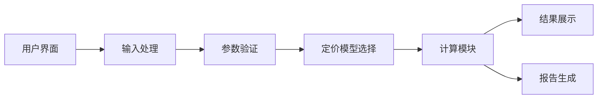

                 


# 实物期权估值：灵活性和不确定性的价值量化

> 关键词：实物期权，期权定价，Black-Scholes模型，蒙特卡罗模拟，金融投资

> 摘要：本文深入探讨了实物期权在金融投资中的应用，重点介绍了实物期权的基本概念、定价模型、数学公式以及系统架构设计。通过实际案例分析，展示了如何利用实物期权量化资产的灵活性和不确定性价值。文章还详细讲解了Black-Scholes模型、二叉树模型和蒙特卡罗模拟等主要定价算法，并通过Python代码实现和系统架构设计，帮助读者全面理解和应用实物期权估值方法。

---

## 第1章: 实物期权的基本概念

### 1.1 实物期权的定义与特点

#### 1.1.1 实物期权的定义
实物期权是一种基于实物资产的投资选择权，允许持有者在特定条件下以预定价格购买或出售资产。与金融期权不同，实物期权通常涉及实物资产（如房地产、能源项目等），其价值受到市场波动、时间因素和决策灵活性的影响。

#### 1.1.2 实物期权与金融期权的对比

| 属性       | 实物期权          | 金融期权          |
|------------|-------------------|-------------------|
| 标的资产    | 实物资产（如房地产）| 金融资产（如股票）|
| 行权方式    | 可以选择行权或不行权 | 可以选择行权或不行权 |
| 价值计算    | 考虑未来现金流和市场波动 | 考虑股价波动和利率因素 |
| 应用场景    | 投资决策、资产配置 | 金融投资、风险管理 |

#### 1.1.3 实物期权的核心属性
1. **灵活性**：持有者可以根据市场变化调整决策。
2. **不确定性**：资产未来价值受多种因素影响。
3. **时间价值**：期权价值随时间的推移而变化。

### 1.2 实物期权的类型

#### 1.2.1 美式期权与欧式期权



美式期权允许持有者在期权有效期内的任何时间行权，而欧式期权只能在到期日行权。美式期权的灵活性更强，但其价值计算也更为复杂。

#### 1.2.2 买入期权与卖出期权



买入期权赋予持有者购买资产的权利，而卖出期权则赋予出售资产的权利。

#### 1.2.3 实物期权的灵活性分析
灵活性是实物期权的核心价值之一，它使持有者能够在不确定的市场环境中做出最优决策。例如，一个房地产开发项目可能具有美式期权的灵活性，允许在市场有利时提前行权。

---

## 第2章: 实物期权的定价模型

### 2.1 Black-Scholes模型

#### 2.1.1 Black-Scholes模型的假设条件

1. 资产价格遵循几何布朗运动。
2. 市场无套利机会。
3. 利率和波动率保持不变。

#### 2.1.2 Black-Scholes公式的推导

$$C = S_0 \cdot N(d_1) - K \cdot e^{-rT} \cdot N(d_2)$$

其中：
- \( S_0 \)：当前资产价格
- \( K \)：行权价
- \( r \)：无风险利率
- \( T \)：到期时间
- \( N(d) \)：标准正态分布的累积分布函数
- \( d_1 = \frac{\ln(S_0/K) + (r + \sigma^2/2)T}{\sigma \sqrt{T}} \)
- \( d_2 = d_1 - \sigma \sqrt{T} \)

#### 2.1.3 公式中的变量与参数

| 变量       | 意义                     |
|------------|--------------------------|
| \( S_0 \)  | 当前资产价格             |
| \( K \)    | 行权价                   |
| \( r \)    | 无风险利率               |
| \( T \)    | 到期时间（年）           |
| \( \sigma \) | 资产价格波动率           |

### 2.2 二叉树模型

#### 2.2.1 二叉树模型的基本原理



二叉树模型通过构建资产价格的上行和下行路径，计算期权在每个节点的值，并最终推导出期权的当前价值。

#### 2.2.2 二叉树模型的构建步骤

1. 确定资产价格的上行和下行因子。
2. 计算每个节点的资产价格。
3. 计算期权在每个终止节点的值。
4. 使用无套利原则，逆向推导期权在各个中间节点的值。

#### 2.2.3 二叉树模型与Black-Scholes模型的对比

| 特性          | 二叉树模型              | Black-Scholes模型        |
|---------------|-------------------------|---------------------------|
| 计算复杂度      | 较高，适合小时间跨度      | 较低，适合大时间跨度      |
| 精度           | 高，尤其适用于美式期权    | 高，适用于欧式期权         |
| 适用场景       | 美式期权定价             | 欧式期权定价              |

### 2.3蒙特卡罗模拟

#### 2.3.1蒙特卡罗模拟的基本原理

蒙特卡罗模拟通过生成大量随机资产价格路径，计算期权的期望值，从而估计其价值。其核心步骤如下：

1. 确定模拟的次数和时间跨度。
2. 生成随机数，模拟资产价格路径。
3. 计算每条路径下的期权价值。
4. 求平均值，得到期权的估计价值。

#### 2.3.2蒙特卡罗模拟在实物期权定价中的应用

```python
import numpy as np

def monte_carlo_option pricing(S0, K, T, r, sigma, iterations):
    np.random.seed(42)
    paths = np.zeros(iterations)
    paths[0] = S0
    for i in range(1, iterations):
        # 生成随机数
        random_factor = np.random.normal(0, 1)
        # 计算资产价格
        paths[i] = paths[i-1] * np.exp((r - 0.5*sigma**2)*T + sigma*random_factor*np.sqrt(T))
    # 计算期权价值
    payoff = np.maximum(0, paths[-1] - K)
    # 计算期望值
    option_price = np.mean(payoff) * np.exp(-r*T)
    return option_price

# 示例计算
S0 = 100
K = 105
T = 1
r = 0.05
sigma = 0.2
iterations = 100000

price = monte_carlo_option pricing(S0, K, T, r, sigma, iterations)
print(f"期权价格估计为：{price:.2f}")
```

#### 2.3.3模拟结果的统计分析

通过蒙特卡罗模拟，我们可以计算期权价格的平均值、标准差和置信区间，从而评估定价的不确定性。

---

## 第3章: 实物期权的数学模型与公式

### 3.1 Black-Scholes公式

#### 3.1.1 Black-Scholes公式的数学表达

$$C = S_0 \cdot N(d_1) - K \cdot e^{-rT} \cdot N(d_2)$$

其中：
- \( N(d) \) 是标准正态分布的累积分布函数。
- \( d_1 = \frac{\ln(S_0/K) + (r + \sigma^2/2)T}{\sigma \sqrt{T}} \)
- \( d_2 = d_1 - \sigma \sqrt{T} \)

#### 3.1.2 公式中的变量解释

| 变量       | 意义                     |
|------------|--------------------------|
| \( S_0 \)  | 当前资产价格             |
| \( K \)    | 行权价                   |
| \( r \)    | 无风险利率               |
| \( T \)    | 到期时间（年）           |
| \( \sigma \) | 资产价格波动率           |

### 3.2 二叉树模型的数学推导

#### 3.2.1 二叉树模型的构建过程

假设资产价格在上行和下行两种情况下变动：

- 上行因子：\( u = e^{\sigma \sqrt{T}} \)
- 下行因子：\( d = e^{-\sigma \sqrt{T}} \)

期权的终止价值为：

$$ C_u = \max(0, S_0 \cdot u - K) $$
$$ C_d = \max(0, S_0 \cdot d - K) $$

期权的当前价值为：

$$ C_0 = \frac{C_u + C_d}{e^{rT}} \cdot \frac{1}{u - d} $$ (这是基于无套利定价的原理推导出的公式)

### 3.3蒙特卡罗模拟的数学基础

#### 3.3.1 随机变量的生成

蒙特卡罗模拟通常使用随机数生成器来模拟资产价格的波动。假设资产价格服从几何布朗运动：

$$ S(t) = S_0 \cdot e^{(\mu - 0.5\sigma^2)t + \sigma \cdot W(t)} $$

其中，\( W(t) \) 是标准布朗运动。

#### 3.3.2 期权价格的模拟过程

通过多次模拟资产价格路径，计算每条路径下的期权 payoff，然后求其期望值作为期权价格的估计值。

#### 3.3.3 结果的统计分析方法

计算模拟结果的平均值、标准差和置信区间，以评估期权价格的不确定性。

---

## 第4章: 实物期权的系统架构设计

### 4.1 系统功能设计

#### 4.1.1 系统输入与输出

- **输入**：资产价格、行权价、时间跨度、波动率、无风险利率。
- **输出**：期权价格、波动性分析、敏感性分析。

#### 4.1.2 系统功能模块划分


#### 4.1.3 系统功能模块描述

1. **用户界面**：提供输入参数和选择定价模型的界面。
2. **输入处理**：接收用户输入并解析参数。
3. **参数验证**：检查输入参数的有效性。
4. **定价模型选择**：根据需求选择Black-Scholes、二叉树或蒙特卡罗模拟。
5. **计算模块**：执行定价算法并返回结果。
6. **结果展示**：以图形或表格形式展示期权价格和相关分析。

### 4.2 系统架构设计

#### 4.2.1 系统架构图



#### 4.2.2 系统模块之间的交互

1. **用户界面**接收用户的输入参数并传递给输入处理模块。
2. **输入处理模块**解析参数后，传递给参数验证模块。
3. **参数验证模块**检查参数的有效性后，传递给定价模型选择模块。
4. **定价模型选择模块**根据用户选择或系统推荐选择合适的定价模型。
5. **计算模块**执行定价算法，返回结果。
6. **结果展示模块**以图形或表格形式展示期权价格。
7. **报告生成模块**生成包含详细分析的报告。

---

## 第5章: 项目实战

### 5.1 项目背景与目标

#### 5.1.1 项目背景

假设我们是一家能源公司，需要评估一个天然气项目的实物期权价值。项目投资成本为1000万美元，行权价为1.5美元/百万英热单位（MMBtu），假设未来三年内天然气价格波动较大，我们需要量化项目的灵活性价值。

#### 5.1.2 项目目标

通过实物期权定价模型，评估项目在不同价格波动情况下的价值，以支持投资决策。

### 5.2 环境安装与配置

#### 5.2.1 环境要求

- Python 3.8+
- NumPy
- Matplotlib
- Scipy

#### 5.2.2 安装步骤

```bash
pip install numpy matplotlib scipy
```

### 5.3 核心实现与代码示例

#### 5.3.1 Black-Scholes模型实现

```python
import numpy as np
from scipy.stats import norm

def black_scholes(S0, K, T, r, sigma):
    d1 = (np.log(S0/K) + (r + 0.5*sigma**2)*T) / (sigma*np.sqrt(T))
    d2 = d1 - sigma*np.sqrt(T)
    C = S0 * norm.cdf(d1) - K * np.exp(-r*T) * norm.cdf(d2)
    return C

# 示例计算
S0 = 100
K = 105
T = 1
r = 0.05
sigma = 0.2

price = black_scholes(S0, K, T, r, sigma)
print(f"Black-Scholes期权价格：{price:.2f}")
```

#### 5.3.2 二叉树模型实现

```python
import numpy as np

def binomial_tree(S0, K, T, r, sigma, steps):
    n = steps
    dt = T / n
    u = np.exp(sigma * np.sqrt(dt))
    d = 1 / u
    pu = (np.exp(r*dt) - d) / (u - d)
    price_tree = np.zeros((n+1, n+1))
    for i in range(n+1):
        for j in range(n+1 - i):
            if j == 0:
                price_tree[i][j] = S0 * (u ** i) * (d ** (n - i))
            else:
                price_tree[i][j] = price_tree[i][j-1] * u
    for i in range(n, -1, -1):
        for j in range(i+1):
            if i == n:
                payoff = max(0, price_tree[i][j] - K)
                price_tree[i][j] = payoff
            else:
                price_tree[i][j] = pu * price_tree[i+1][j] * np.exp(-r*dt) + (1 - pu) * price_tree[i+1][j+1] * np.exp(-r*dt)
    return price_tree[0][0]

# 示例计算
S0 = 100
K = 105
T = 1
r = 0.05
sigma = 0.2
steps = 100

price = binomial_tree(S0, K, T, r, sigma, steps)
print(f"二叉树模型期权价格：{price:.2f}")
```

#### 5.3.3 蒙特卡罗模拟实现

```python
import numpy as np
import matplotlib.pyplot as plt

def monte_carlo(S0, K, T, r, sigma, iterations):
    np.random.seed(42)
    paths = np.zeros(iterations)
    paths[0] = S0
    for i in range(1, iterations):
        random_factor = np.random.normal(0, 1)
        paths[i] = paths[i-1] * np.exp((r - 0.5*sigma**2)*T + sigma*random_factor*np.sqrt(T))
    payoff = np.maximum(0, paths - K)
    option_price = np.mean(payoff) * np.exp(-r*T)
    return option_price

# 示例计算
S0 = 100
K = 105
T = 1
r = 0.05
sigma = 0.2
iterations = 100000

price = monte_carlo(S0, K, T, r, sigma, iterations)
print(f"蒙特卡罗模拟期权价格：{price:.2f}")
```

### 5.4 项目小结

通过以上代码实现，我们可以看到不同定价模型在实际应用中的表现。Black-Scholes模型适用于欧式期权，而二叉树模型和蒙特卡罗模拟更适合美式期权和复杂场景。在实际项目中，应根据具体需求选择合适的模型。

---

## 第6章: 最佳实践与注意事项

### 6.1 关键点总结

1. **模型选择**：根据期权类型和场景选择合适的定价模型。
2. **数据质量**：确保输入参数的准确性和合理性。
3. **风险管理**：考虑模型的局限性和市场环境的变化。

### 6.2 小结

实物期权估值是金融投资中的重要工具，能够有效量化资产的灵活性和不确定性价值。通过本文的讲解和代码示例，读者可以深入理解各种定价模型的原理和应用。

### 6.3 注意事项

- **模型假设**：不同模型有其特定的假设条件，使用时需注意其适用性。
- **数据敏感性**：期权价格对波动率和时间因素高度敏感，需谨慎处理。
- **计算精度**：蒙特卡罗模拟的精度依赖于模拟次数，需根据需求调整。

### 6.4 拓展阅读

- 《Options, Futures, and Other Derivatives》 by John C. Hull
- 《The Concepts and Practice of Mathematical Finance》 by Mark S. Joshi

---

## 作者

**作者：AI天才研究院/AI Genius Institute & 禅与计算机程序设计艺术 /Zen And The Art of Computer Programming**

---

### 总结

通过本文的详细讲解，读者可以掌握实物期权的基本概念、定价模型和系统架构设计。结合实际项目案例和代码实现，能够更好地理解和应用实物期权估值方法。

