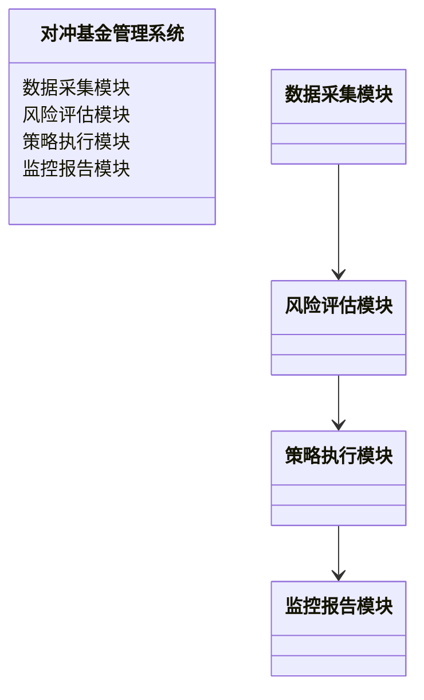
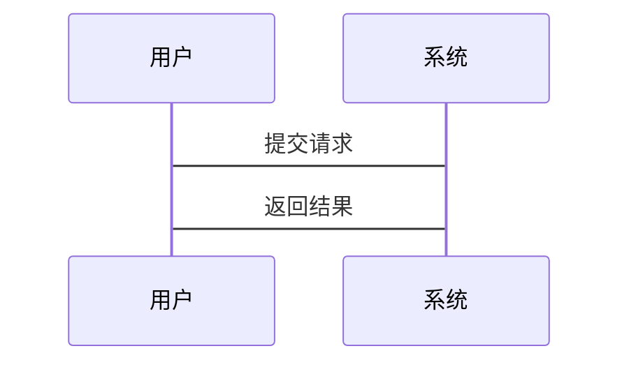

                 


# 对冲基金策略：专业投资者的风险管理方法

> 关键词：对冲基金，风险管理，投资策略，VaR，套利，多空策略

> 摘要：本文详细探讨了对冲基金的策略及其风险管理方法，通过分析对冲基金的运作模式、常见策略以及风险管理的核心概念，结合实际案例和数学模型，帮助投资者理解如何在对冲基金中有效管理风险，实现稳健投资回报。

---

# 第1章: 对冲基金概述

## 1.1 对冲基金的起源与发展
### 1.1.1 对冲基金的起源
对冲基金起源于20世纪50年代，由阿尔弗雷德·韦尔首次提出，旨在通过做多和做空来对冲市场风险，追求绝对收益。  

### 1.1.2 对冲基金的发展历程
从早期的简单套利策略到现代的复杂量化交易，对冲基金经历了多个发展阶段，逐步成为金融市场的核心参与者。

### 1.1.3 对冲基金的现状与趋势
当前，对冲基金行业规模庞大，策略多样化，同时面临日益严格的监管和竞争压力。

## 1.2 对冲基金的运作模式
### 1.2.1 对冲基金的基本运作方式
对冲基金通过杠杆、多空策略、套利等方式，追求绝对收益，与市场走势无关。

### 1.2.2 对冲基金的主要参与者
包括基金经理、投资者、托管银行、经纪商等，各参与者在基金运作中扮演不同的角色。

### 1.2.3 对冲基金的收益与风险特征
对冲基金通常追求稳定的收益，但其复杂性较高，风险主要集中在信用风险、市场风险和流动性风险等方面。

## 1.3 对冲基金与传统投资的区别
### 1.3.1 对冲基金的灵活性
对冲基金可以同时做多和做空，能够在不同市场环境下灵活调整策略。

### 1.3.2 传统投资的局限性
传统投资通常只能通过做多来获得收益，受市场波动影响较大。

### 1.3.3 对冲基金的优势与劣势
优势：收益稳定，风险可控；劣势：复杂性高，费用较高。

## 1.4 本章小结
本章介绍了对冲基金的基本概念、运作模式及其与传统投资的区别，为后续风险管理内容奠定基础。

---

# 第2章: 风险管理的核心概念

## 2.1 风险管理的基本原理
### 2.1.1 风险的定义与分类
风险是指未来收益的不确定性，通常分为市场风险、信用风险、流动性风险等。

### 2.1.2 风险管理的目标与原则
风险管理的目标是通过分散、对冲等方法降低风险，原则包括全面性、流动性、成本效益等。

### 2.1.3 风险管理的流程
包括风险识别、测量、评估、控制和监控五个步骤。

## 2.2 风险度量的数学模型
### 2.2.1 方差与标准差
方差衡量资产收益的波动性，标准差是方差的平方根，常用于风险度量。

$$ \text{方差} = \sigma^2 = E[(r - E[r])^2] $$
$$ \text{标准差} = \sigma = \sqrt{\sigma^2} $$

### 2.2.2 VaR（在险价值）
VaR是在一定置信水平下，可能遭受的最大损失。

### 2.2.3 CVaR（条件在险价值）
CVaR是VaR的条件期望损失，考虑了尾部风险。

## 2.3 风险管理中的关键指标
### 2.3.1 Sharpe比率
衡量收益与风险的关系。

$$ \text{Sharpe比率} = \frac{E[r - r_f]}{\sigma} $$

### 2.3.2 Sortino比率
专门衡量下行风险的指标。

### 2.3.3 最大回撤
衡量投资组合在某段时间内的最大亏损。

## 2.4 本章小结
本章介绍了风险管理的基本原理、数学模型和关键指标，为后续的对冲基金策略风险管理奠定基础。

---

# 第3章: 对冲基金的主要策略

## 3.1 套利策略
### 3.1.1 套利的定义与原理
通过利用资产价格差异，同时在两个市场进行买卖操作，锁定无风险收益。

### 3.1.2 常见的套利类型
包括跨市场套利、跨期套利、套利等。

### 3.1.3 套利的风险与挑战
市场风险、流动性风险和操作风险是套利的主要风险。

## 3.2 多空策略
### 3.2.1 多空策略的基本原理
通过同时做多和做空，对冲市场风险，获取相对收益。

### 3.2.2 多空策略的应用场景
适用于市场趋势不明确或波动性较大的情况。

### 3.2.3 多空策略的风险管理
通过调整头寸比例和设置止损来控制风险。

## 3.3 股票市场中性策略
### 3.3.1 市场中性策略的定义
通过做多和做空股票，使整体市场风险为零。

### 3.3.2 市场中性策略的实现方法
包括配对交易、统计套利等。

### 3.3.3 市场中性策略的风险控制
关注个股风险、交易成本和流动性风险。

## 3.4 其他策略简介
### 3.4.1 商品套利策略
利用商品市场的价格差异进行套利。

### 3.4.2 固定收益套利策略
通过债券市场的定价差异进行套利。

### 3.4.3 事件驱动策略
利用公司并购、重组等事件带来的价格波动获利。

## 3.5 本章小结
本章详细介绍了对冲基金的主要策略及其风险管理方法，帮助投资者理解不同策略的特点和风险。

---

# 第4章: 风险管理的系统化方法

## 4.1 风险管理的系统化框架
### 4.1.1 风险管理的层次结构
包括个体风险、组合风险和系统性风险三个层次。

### 4.1.2 风险管理的模块划分
包括风险识别、风险评估、风险控制和风险监控。

### 4.1.3 风险管理的流程优化
通过自动化系统和实时监控提高风险管理效率。

## 4.2 风险管理的数学模型
### 4.2.1 风险价值模型（VaR）
$$ \text{VaR} = \mu + z \cdot \sigma $$
其中，$\mu$为均值，$z$为标准正态分布的分位数，$\sigma$为标准差。

### 4.2.2 风险调整后收益模型（RAROC）
$$ \text{RAROC} = \frac{\text{净利润}}{\text{监管资本}} \times 100\% $$

### 4.2.3 风险中性定价模型
通过调整风险溢价，确定风险中性下的资产定价。

## 4.3 风险管理的工具与技术
### 4.3.1 风险对冲工具
包括期权、期货等衍生品。

### 4.3.2 风险分散技术
通过多元化投资降低组合风险。

### 4.3.3 风险监控系统
利用实时监控和预警系统，及时发现和应对风险。

## 4.4 本章小结
本章探讨了风险管理的系统化方法，强调通过数学模型和工具实现有效的风险管理。

---

# 第5章: 对冲基金的风险管理实践

## 5.1 风险管理的系统化框架
### 5.1.1 系统功能设计
包括数据采集、风险评估、策略执行和监控报告四个模块。



### 5.1.2 系统架构设计
采用分层架构，包括数据层、业务逻辑层和用户界面层。


### 5.1.3 系统交互设计
通过用户请求、数据处理和结果反馈实现系统的交互流程。



## 5.2 项目实战
### 5.2.1 环境安装
需要安装Python、Pandas、NumPy等工具。

### 5.2.2 系统核心实现源代码
实现一个简单的VaR计算模型：

```python
import numpy as np

def calculate_var(returns, confidence_level=95):
    sorted_returns = np.sort(returns)
    alpha_index = int(len(sorted_returns) * (1 - confidence_level / 100))
    var = sorted_returns[alpha_index]
    return var

# 示例数据
returns = [0.02, 0.01, -0.01, 0.03, -0.02]
var = calculate_var(returns)
print(f"VaR at {confidence_level}% confidence level: {var}")
```

### 5.2.3 代码应用解读与分析
解释代码实现的逻辑，以及如何应用到实际的对冲基金风险管理中。

### 5.2.4 实际案例分析
通过具体案例分析如何应用风险管理策略，包括数据收集、模型选择和结果解读。

## 5.3 本章小结
本章通过系统设计和实际案例，展示了如何在对冲基金中实践风险管理方法。

---

# 第6章: 风险管理技术的未来发展

## 6.1 风险管理技术的发展趋势
### 6.1.1 人工智能与风险管理
AI技术的应用将提高风险管理的效率和准确性。

### 6.1.2 大数据在风险管理中的应用
通过大数据分析，发现更多的风险因素和优化风险管理模型。

### 6.1.3 区块链技术的潜在应用
区块链技术可以提高风险管理的透明度和安全性。

## 6.2 对冲基金风险管理的创新
### 6.2.1 新型风险管理模型
如机器学习算法的应用。

### 6.2.2 数字化工具的创新
如智能合约、自动化交易系统等。

## 6.3 风险管理技术的挑战
### 6.3.1 数据隐私问题
如何保护数据隐私，防止数据泄露。

### 6.3.2 技术本身的不确定性
如算法黑箱问题和模型过拟合风险。

## 6.4 本章小结
本章展望了未来风险管理技术的发展方向和挑战，强调创新与技术应用的重要性。

---

# 附录

## 附录A: 风险管理相关术语表
包括VaR、CVaR、Sharpe比率等术语的解释。

## 附录B: 常用风险管理工具
如Excel、Python、R等工具的应用介绍。

## 附录C: 数据来源与处理方法
包括数据清洗、特征选择等常用数据处理方法。

## 附录D: 案例分析与数据集
提供具体的案例分析和相关数据集，供读者实践参考。

---

# 作者：AI天才研究院 & 禅与计算机程序设计艺术

希望这篇文章能够帮助读者全面理解对冲基金策略及其风险管理方法，为投资者在复杂多变的金融市场中提供有力的指导。

