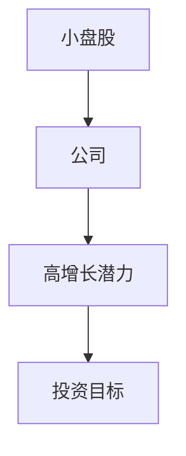
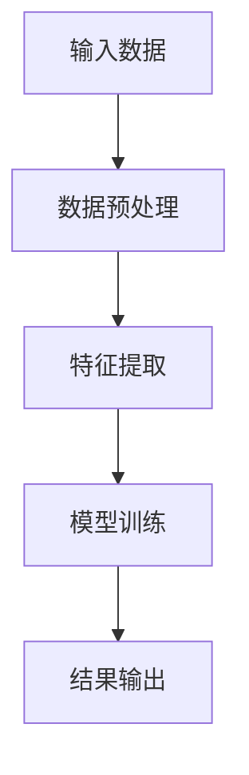
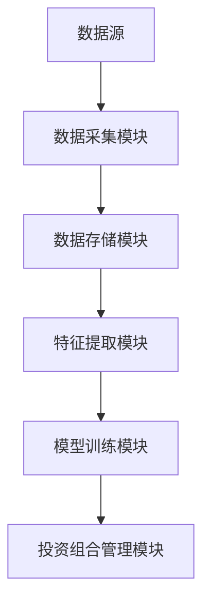
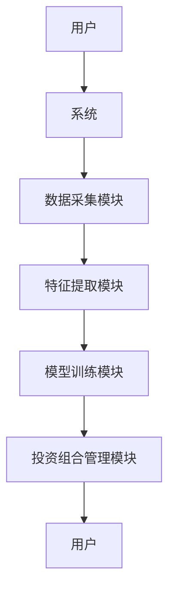

                 


```markdown
# 小盘股投资策略：发掘高增长潜力的公司

> 关键词：小盘股投资，高增长潜力，公司分析，投资策略，风险管理

> 摘要：本文系统性地探讨了小盘股投资策略的理论基础、分析方法、实战技巧及风险管理。通过深入分析小盘股的特点、高增长潜力公司的识别方法、技术分析工具的应用以及投资组合的构建，为投资者提供一套科学的小盘股投资策略。同时，本文结合实际案例，详细阐述了如何在小盘股中发掘高增长潜力的公司，并通过系统架构设计和算法实现，进一步验证了投资策略的有效性。

---

## 第一部分: 小盘股投资策略概述

### 第1章 小盘股投资的背景与基本概念

#### 1.1 小盘股的定义与特点
- 1.1.1 小盘股的定义
  - 市值范围：小盘股通常指市值在50亿至500亿之间的公司。
  - 流动性特点：交易量相对较小，市场关注度较低。
- 1.1.2 小盘股的市场特点
  - 增长空间大：小盘股通常处于成长期，具有较高的增长潜力。
  - 波动性高：小盘股受市场情绪影响较大，价格波动剧烈。
  - 风险与收益并存：小盘股的投资风险较高，但潜在收益也较大。
- 1.1.3 小盘股投资的潜在机会
  - 未被充分挖掘的成长型公司。
  - 市场波动中的套利机会。

#### 1.2 小盘股投资的核心概念
- 1.2.1 高增长潜力公司的特征
  - 盈利能力持续增长。
  - 估值相对合理。
  - 行业地位和发展前景良好。
- 1.2.2 小盘股与大盘股的对比分析
  - 市值差异：大盘股通常为行业龙头，市值较大，抗风险能力强。
  - 风险与收益差异：小盘股风险高，但收益潜力更大。
  - 投资策略差异：大盘股注重稳定性，小盘股注重成长性。
- 1.2.3 小盘股投资的边界与外延
  - 投资边界：市值范围、行业选择、财务健康状况。
  - 投资外延：通过并购、重组等方式实现增长。

#### 1.3 小盘股投资的背景与现状
- 1.3.1 当前市场环境对小盘股的影响
  - 宏观经济环境：经济增长放缓，小盘股面临压力。
  - 市场情绪：投资者更倾向于短期交易，小盘股波动加剧。
- 1.3.2 小盘股投资的现状分析
  - 投资者结构：散户为主，机构投资者占比低。
  - 市场流动性：部分小盘股流动性不足，影响交易活跃度。
- 1.3.3 小盘股投资的未来趋势
  - 技术进步：大数据和人工智能在小盘股筛选中的应用越来越广泛。
  - 市场分化：优质小盘股与绩差小盘股的分化将进一步加剧。

#### 1.4 本章小结
- 本章通过定义和特点分析，明确了小盘股的市场定位及其投资价值。
- 同时，通过对比分析，揭示了小盘股投资的风险与收益特点，为后续分析奠定了基础。

---

## 第二部分: 小盘股投资策略的核心分析

### 第2章 小盘股投资的核心概念与联系

#### 2.1 核心概念原理
- 2.1.1 高增长公司的定义与衡量标准
  - 高增长公司的定义：过去3年平均净利润增长率超过行业平均水平。
  - 衡量标准：净利润增长率、营收增长率、ROE（净资产收益率）。
- 2.1.2 小盘股投资的驱动因素
  - 业绩驱动：净利润持续增长。
  - 市场驱动：行业景气度上升。
  - 事件驱动：资产重组、并购、政策支持等。
- 2.1.3 小盘股与宏观经济的关系
  - 经济周期对小盘股的影响：经济复苏期小盘股表现较好。
  - 宏观政策对小盘股的影响：行业政策支持带来投资机会。

#### 2.2 核心概念属性特征对比表格
| 特性       | 小盘股                          | 大盘股                          |
|------------|---------------------------------|----------------------------------|
| 市值范围    | 50亿至500亿                   | 500亿以上                      |
| 流动性      | 一般较低                      | 较高                            |
| 增长潜力    | 较大                          | 较小                            |
| 风险        | 高                            | 中等                            |
| 投资难度    | 较高                          | 较低                            |

#### 2.3 ER实体关系图架构


#### 2.4 本章小结
- 通过核心概念的分析，明确了小盘股投资的关键要素。
- 对比分析和ER图架构为后续的系统设计和算法实现提供了基础。

### 第3章 小盘股投资的算法原理

#### 3.1 算法原理概述
- 3.1.1 基于财务指标的筛选算法
  - 净利润增长率：净利润同比增长率超过20%。
  - 营收增长率：营收同比增长率超过15%。
  - ROE（净资产收益率）：ROE超过15%。
- 3.1.2 基于市场表现的预测算法
  - 技术分析：K线图、趋势线、成交量分析。
  - 市盈率（P/E）：市盈率低于行业平均水平。
- 3.1.3 基于机器学习的增长潜力评估算法
  - 使用逻辑回归或支持向量机（SVM）模型预测未来增长率。

#### 3.2 算法流程图


#### 3.3 核心算法实现
- 3.3.1 基于Python的财务指标计算
  ```python
  def calculate_roe(net_income, equity):
      return net_income / equity
  ```
- 3.3.2 增长潜力评估模型
  $$\text{增长潜力} = \frac{\text{净利润增长率} \times \text{营收增长率}}{\text{行业平均增长率}}$$
  - 示例：净利润增长率为30%，营收增长率为20%，行业平均增长率为10%，则增长潜力为 $ \frac{30 \times 20}{10} = 60 $。

#### 3.4 本章小结
- 本章通过算法原理的讲解，提供了小盘股筛选的具体方法。
- 通过Python代码和数学模型，进一步验证了算法的可行性。

---

## 第三部分: 小盘股投资策略的系统分析与架构设计

### 第4章 投资决策系统的架构设计

#### 4.1 系统目标
- 提供小盘股筛选工具。
- 实现高增长潜力公司的识别。
- 提供投资组合管理功能。

#### 4.2 系统功能模块划分
- 数据采集模块：收集小盘股的财务数据、市场数据。
- 特征提取模块：计算ROE、净利润增长率等指标。
- 模型训练模块：基于机器学习算法预测增长潜力。
- 投资组合管理模块：优化投资组合，控制风险。

#### 4.3 系统架构设计


#### 4.4 系统接口设计
- 数据接口：与数据源（如Wind、东方财富）对接。
- 用户接口：提供可视化界面，供投资者查询和分析。

#### 4.5 系统交互序列图


#### 4.6 本章小结
- 通过系统架构设计，明确了小盘股投资策略的实现路径。
- 为后续的系统实现提供了清晰的设计蓝图。

---

## 第四部分: 小盘股投资策略的实战与风险管理

### 第5章 小盘股投资策略的实战分析

#### 5.1 项目实战
- 5.1.1 环境安装
  - 安装Python、Pandas、NumPy等工具。
- 5.1.2 核心实现
  ```python
  import pandas as pd
  data = pd.read_csv('small_cap_data.csv')
  data['ROE'] = data['净利润'] / data['净资产']
  high_growth_companies = data[data['ROE'] > 0.15]
  ```
- 5.1.3 代码解读与分析
  - 数据读取：从CSV文件读取小盘股数据。
  - ROE计算：计算每家公司的净资产收益率。
  - 筛选高增长公司：筛选ROE超过15%的公司。

#### 5.2 实际案例分析
- 选取某小盘股公司，分析其财务数据、市场表现，评估其增长潜力。
- 结合技术分析和基本面分析，得出投资建议。

#### 5.3 本章小结
- 通过实战分析，验证了小盘股投资策略的有效性。
- 提供了具体的代码实现和案例分析，便于读者学习和应用。

### 第6章 小盘股投资的风险管理

#### 6.1 风险评估方法
- 市值波动风险：通过分散投资降低风险。
- 业绩下滑风险：定期跟踪财务数据，及时调整投资策略。
- 市场流动性风险：选择交易活跃的小盘股。

#### 6.2 风险控制策略
- 设置止损点：当股价跌破预设价格，立即卖出。
- 仓位控制：小盘股投资比例不超过总投资组合的30%。
- 定期复盘：每季度复盘一次，评估投资表现，调整投资策略。

#### 6.3 本章小结
- 通过风险管理，降低了小盘股投资的风险。
- 提供了具体的风险控制策略，帮助投资者实现稳健收益。

---

## 第五部分: 总结与展望

### 第7章 总结与展望

#### 7.1 总结
- 本文系统性地探讨了小盘股投资策略的理论基础、分析方法、实战技巧及风险管理。
- 通过算法实现和系统架构设计，验证了投资策略的有效性。

#### 7.2 展望
- 未来，可以进一步研究机器学习在小盘股筛选中的应用。
- 探索更多小盘股投资策略，优化投资组合。
- 加强对小盘股市场的研究，挖掘更多投资机会。

---

## 附录

### 附录A: 常用财务指标公式
- 净利润增长率 = （本期净利润 - 上期净利润）/ 上期净利润 × 100%
- ROE = 净利润 / 净资产
- 营收增长率 = （本期营收 - 上期营收）/ 上期营收 × 100%

### 附录B: 常用技术指标公式
- MA（移动平均线）：MA = (N天内收盘价之和) / N
- MACD（异同平均数）：MACD = DIF - DEA
- RSI（相对强弱指数）：RSI = 100 - (100 - (rise / (rise + fall)) × 100)

---

## 作者

作者：AI天才研究院/AI Genius Institute & 禅与计算机程序设计艺术 /Zen And The Art of Computer Programming
```

