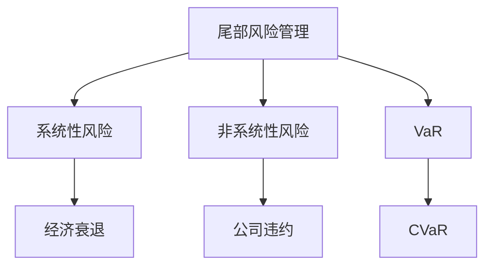
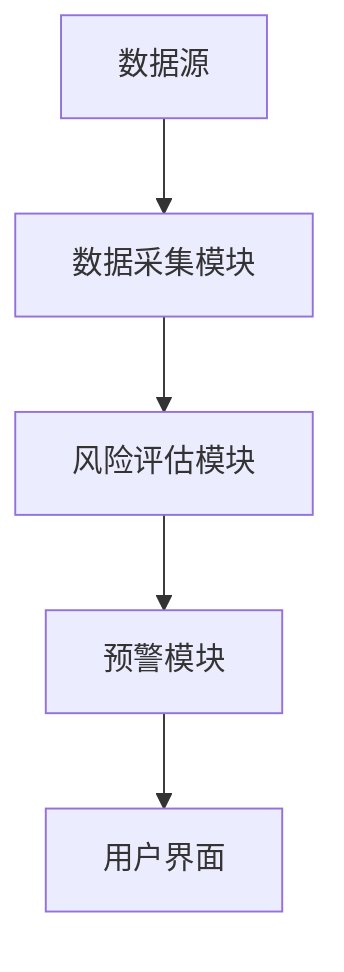

                 


# 尾部风险管理：防范极端市场事件的策略

> 关键词：尾部风险管理，极端市场事件，风险管理策略，VaR，CVaR，系统性风险，非系统性风险

> 摘要：本文系统地探讨了尾部风险管理的核心概念、算法原理、系统架构设计以及项目实战案例，旨在为投资者和机构提供防范极端市场事件的有效策略。

---

## 第一部分：尾部风险管理概述

### 第1章：尾部风险管理的背景与概念

#### 1.1 尾部风险管理的背景

- **1.1.1 什么是尾部风险**
  尾部风险是指在低概率但高影响的极端市场事件中，资产或投资组合可能遭受重大损失的风险。这类事件往往超出正常市场波动的预期范围，被称为“黑天鹅”事件。

- **1.1.2 尾部事件的特点**
  尾部事件具有低概率、高影响、难以预测的特点。例如，2008年的全球金融危机和2020年新冠疫情引发的市场崩盘。

- **1.1.3 尾部风险管理的重要性**
  尾部风险管理对于保护投资者和金融机构的资产至关重要。通过识别和评估潜在的极端事件，可以制定有效的策略以减少损失。

#### 1.2 尾部风险管理的目标与意义

- **1.2.1 尾部风险管理的目标**
  确保资产在极端市场条件下的安全，限制潜在损失，维持投资组合的稳定性。

- **1.2.2 尾部风险管理的意义**
  通过尾部风险管理，投资者可以更好地应对不可预测的市场冲击，避免重大损失。

- **1.2.3 尾部风险管理与其他风险管理的联系**
  尾部风险管理是整体风险管理的一部分，与其他风险类型（如系统性风险和非系统性风险）密切相关。

---

### 第2章：尾部风险管理的核心概念与联系

#### 2.1 尾部风险管理的核心原理

- **概率与统计学视角**
  尾部风险管理依赖于概率论和统计学，通过分析历史数据和模拟极端情况来预测潜在损失。

- **金融市场中的尾部事件**
  尾部事件在金融市场中尤为常见，例如市场崩盘、流动性危机等。

- **风险度量方法**
  使用VaR（在险价值）和CVaR（条件在险价值）等方法来量化尾部风险。

#### 2.2 尾部风险管理的核心要素对比

| **风险类型**       | **特点**                                                                 |
|--------------------|--------------------------------------------------------------------------|
| 系统性风险         | 影响整个市场的风险，如经济衰退、货币危机等。                                  |
| 非系统性风险       | 影响特定资产或行业的风险，如公司违约、行业政策变化等。                        |
| 尾部风险           | 低概率、高影响的极端事件，超出正常市场波动的范围。                            |

#### 2.3 尾部风险管理的系统架构



---

## 第三部分：尾部风险管理的算法原理

### 第3章：尾部风险管理的算法原理

#### 3.1 蒙特卡洛模拟

- **蒙特卡洛模拟的原理**
  蒙特卡洛模拟是一种通过随机采样来估计复杂系统行为的数值方法，常用于模拟极端市场情况。

- **蒙特卡洛模拟的流程**

```mermaid
graph TD
    Start --> Initialize Parameters
    Initialize Parameters --> Generate Random Samples
    Generate Random Samples --> Calculate Outcomes
    Calculate Outcomes --> Analyze Results
    Analyze Results --> End
```

- **Python代码实现**

```python
import numpy as np

def monte_carlo_simulation(n_samples, model):
    outcomes = []
    for _ in range(n_samples):
        outcome = model.simulate()
        outcomes.append(outcome)
    return outcomes

# 示例模型
class MarketModel:
    def simulate(self):
        # 简单的示例，返回随机数
        return np.random.normal(0, 1)
```

- **结果分析**
  通过蒙特卡洛模拟，可以生成大量可能的市场情景，识别潜在的极端事件。

#### 3.2 VaR（在险价值）与CVaR（条件在险价值）

- **VaR的定义**
  VaR是在给定置信水平下，投资组合在正常市场条件下可能遭受的最大损失。

- **VaR的计算公式**
  $$ VaR = \text{quantile}(p) $$
  其中，p是置信水平，例如95%。

- **CVaR的定义**
  CVaR是在VaR的基础上，考虑超过VaR的平均损失。

- **CVaR的计算公式**
  $$ CVaR = \mathbb{E}[L | L > VaR] $$

- **Python代码实现**

```python
import numpy as np
from scipy.stats import norm

def calculate VaR(data, confidence_level=0.95):
    data_sorted = np.sort(data)
    index = int(len(data_sorted) * confidence_level)
    return data_sorted[index]

# 示例数据
data = norm.rvs(0, 1, size=1000)
VaR_95 = calculate_VaR(data, 0.95)
print("VaR at 95% confidence:", VaR_95)
```

---

## 第四部分：尾部风险管理的系统分析

### 第4章：尾部风险管理的系统架构设计

#### 4.1 系统功能设计

- **数据采集模块**
  采集市场数据，包括股票价格、指数、汇率等。

- **风险评估模块**
  使用VaR和CVaR等方法评估尾部风险。

- **预警模块**
  设置阈值，当风险指标超过阈值时触发预警。

#### 4.2 系统架构设计



---

## 第五部分：尾部风险管理的项目实战

### 第5章：尾部风险管理系统的实现

#### 5.1 项目环境安装

- 安装Python、Pandas、NumPy、Scipy等库。

#### 5.2 核心功能实现

- **数据采集**
  ```python
  import pandas as pd
  data = pd.read_csv('market_data.csv')
  ```

- **风险评估**
  ```python
  from scipy.stats import norm
  def calculate_VaR(data, confidence_level=0.95):
      data_sorted = np.sort(data)
      index = int(len(data_sorted) * confidence_level)
      return data_sorted[index]
  VaR_95 = calculate_VaR(data['returns'], 0.95)
  ```

- **预警机制**
  ```python
  if VaR_95 > threshold:
      send_alert()
  ```

#### 5.3 案例分析

- 分析2008年金融危机数据，识别尾部风险，并评估模型的有效性。

---

## 第六部分：尾部风险管理的总结与展望

### 第6章：尾部风险管理总结

#### 6.1 最佳实践

- 定期更新模型，结合多种方法，培训相关人员。

#### 6.2 小结

尾部风险管理是防范极端市场事件的关键，通过科学的方法和系统架构设计，可以有效降低潜在损失。

#### 6.3 注意事项

- 数据质量至关重要，需确保数据的准确性和完整性。
- 模型具有局限性，需结合实际情况进行调整。

#### 6.4 拓展阅读

推荐书籍：《风险管理与VaR》、《金融工程中的蒙特卡洛方法》。

---

## 作者

作者：AI天才研究院/AI Genius Institute & 禅与计算机程序设计艺术 /Zen And The Art of Computer Programming

---

通过以上详细结构，本文系统地介绍了尾部风险管理的核心概念、算法原理、系统架构设计以及项目实战案例，为读者提供了防范极端市场事件的有效策略。

