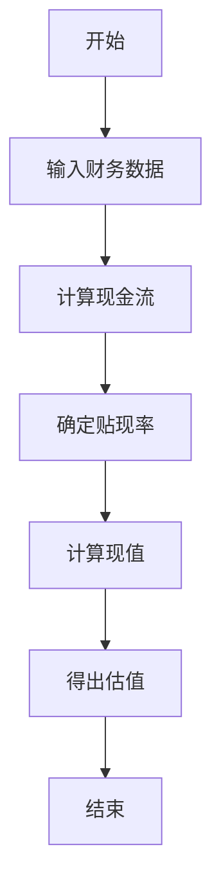
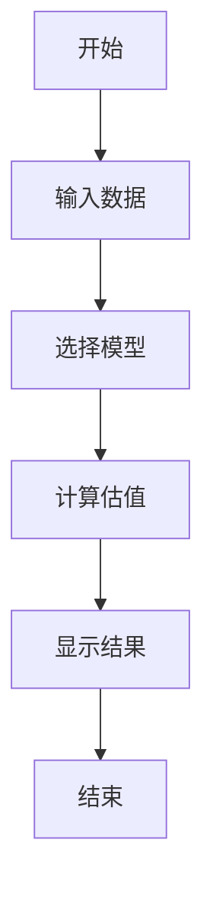

                 


# 巴基斯坦股市估值:南亚新兴市场的机遇与挑战

> 关键词：巴基斯坦股市，南亚新兴市场，股市估值，DCF模型，Python代码实现

> 摘要：本文将详细介绍巴基斯坦股市的估值方法，探讨南亚新兴市场的机遇与挑战。通过分析巴基斯坦股市的特点，结合数学模型和算法原理，帮助投资者更好地理解市场动态。文章从背景介绍、核心概念、算法原理、系统分析到项目实战，层层深入，为读者提供全面的估值指南。

---

## 第一部分：巴基斯坦股市估值的背景与现状

### 第1章：巴基斯坦股市的背景与现状

#### 1.1 巴基斯坦股市的定义与特点
##### 1.1.1 巴基斯坦股市的定义
巴基斯坦股市是指巴基斯坦证券交易所（PSX）的股票交易市场，是南亚地区的重要股市之一。

##### 1.1.2 巴基斯坦股市的核心特点
- **市场规模**：巴基斯坦股市的市场规模相对较小，但近年来发展迅速。
- **行业分布**：主要涵盖金融、能源、科技和制造等行业。
- **投资者结构**：以散户为主，机构投资者占比相对较低。

##### 1.1.3 巴基斯坦股市与南亚其他市场的对比
与印度、孟加拉国等市场相比，巴基斯坦股市波动性较大，但增长潜力显著。

#### 1.2 南亚新兴市场的特点
##### 1.2.1 南亚新兴市场的定义
南亚新兴市场包括印度、巴基斯坦、孟加拉国、尼泊尔等国家的股市。

##### 1.2.2 南亚新兴市场的经济特征
- 经济增长快
- 人口红利显著
- 基础设施投资需求大

##### 1.2.3 南亚新兴市场的投资机遇
- 高增长潜力
- 估值相对较低
- 多样化的投资机会

#### 1.3 巴基斯坦股市的机遇与挑战
##### 1.3.1 巴基斯坦股市的机遇
- 经济复苏带来的投资机会
- 政府政策的支持
- 科技行业的快速发展

##### 1.3.2 巴基斯坦股市的挑战
- 市场波动性大
- 机构投资者占比低
- 政治经济风险

##### 1.3.3 机遇与挑战的平衡点
通过合理的估值模型和风险管理，可以在机遇与挑战中找到平衡。

---

## 第二部分：巴基斯坦股市估值的核心概念与联系

### 第2章：巴基斯坦股市估值的核心概念与联系

#### 2.1 估值的基本原理
##### 2.1.1 估值的定义
估值是通过对公司财务数据和市场情况的分析，确定其股票的合理价格。

##### 2.1.2 估值的核心要素
- 财务数据（收入、利润、现金流）
- 市场因素（利率、通货膨胀）
- 行业趋势

##### 2.1.3 估值的基本方法
- 相对估值法（P/E、P/B）
- 绝对估值法（DCF）

#### 2.2 估值模型的构建
##### 2.2.1 常用估值模型的对比
| 模型名称 | 核心指标 | 适用场景 |
|----------|----------|----------|
| DCF      | 现金流   | 成熟企业 |
| P/E      | 盈利能力 | 周期性行业 |
| P/B      | 资产价值 | 银行、地产 |

##### 2.2.2 巴基斯坦股市估值模型的特殊性
- 市场波动较大，需考虑情绪因素
- 数据获取难度较高

##### 2.2.3 估值模型的构建步骤
1. 收集数据
2. 选择模型
3. 计算估值
4. 调整修正

#### 2.3 估值与市场波动的关系
##### 2.3.1 市场波动对估值的影响
波动性较大的市场中，估值需动态调整。

##### 2.3.2 巴基斯坦股市的波动性分析
- 历史波动率分析
- 当前市场情绪分析

##### 2.3.3 如何在波动中把握估值机会
- 灵活调整估值模型
- 结合技术分析

---

## 第三部分：巴基斯坦股市估值的算法原理

### 第3章：巴基斯坦股市估值的算法原理

#### 3.1 常用估值方法的数学模型
##### 3.1.1 市盈率（P/E）模型
$$ P/E = \frac{Stock Price}{Earnings Per Share} $$

##### 3.1.2 市净率（P/B）模型
$$ P/B = \frac{Stock Price}{Book Value Per Share} $$

##### 3.1.3 现金流折现模型（DCF）
$$ V = \sum_{t=1}^{n} \frac{CF_t}{(1 + r)^t} + \frac{TV}{(1 + r)^n} $$

#### 3.2 算法原理的详细讲解
##### 3.2.1 算法原理的数学公式
使用DCF模型计算企业价值：
$$ V = \frac{CF_1}{1 + r} + \frac{CF_2}{(1 + r)^2} + \ldots + \frac{CF_n}{(1 + r)^n} $$

##### 3.2.2 算法原理的流程图


##### 3.2.3 算法原理的代码实现
```python
def dcf_valuation(cash_flows, discount_rate):
    present_value = 0
    for t, cf in enumerate(cash_flows, 1):
        present_value += cf / (1 + discount_rate) ** t
    return present_value

# 示例
cash_flows = [100, 150, 200]
discount_rate = 0.1
print(dcf_valuation(cash_flows, discount_rate))
```

#### 3.3 算法原理的代码实现
##### 3.3.1 代码实现的详细步骤
1. 定义DCF函数
2. 输入现金流和贴现率
3. 计算现值
4. 返回结果

##### 3.3.2 代码实现的注意事项
- 确保数据准确
- 合理选择贴现率
- 考虑模型的适用性

---

## 第四部分：巴基斯坦股市估值的系统分析与架构设计

### 第4章：巴基斯坦股市估值的系统分析与架构设计

#### 4.1 系统分析
##### 4.1.1 系统目标
实现巴基斯坦股市的估值分析。

##### 4.1.2 系统功能需求
- 数据采集
- 模型计算
- 结果展示

##### 4.1.3 系统性能需求
- 处理速度
- 稳定性

#### 4.2 系统架构设计
##### 4.2.1 系统架构图


##### 4.2.2 模块划分
- 数据采集模块
- 模型计算模块
- 结果展示模块

##### 4.2.3 接口设计
- 数据接口
- 计算接口
- 展示接口

#### 4.3 系统交互设计
##### 4.3.1 用户界面设计
- 简洁直观
- 易用性高

##### 4.3.2 系统流程图


##### 4.3.3 交互设计的实现
- 用户友好的界面
- 实时反馈

---

## 第五部分：巴基斯坦股市估值的项目实战

### 第5章：巴基斯坦股市估值的项目实战

#### 5.1 环境安装与配置
##### 5.1.1 Python环境的安装
安装Python 3.9及以上版本。

##### 5.1.2 数据分析库的安装
安装Pandas、NumPy和Matplotlib。

##### 5.1.3 估值模型的安装
安装Scipy和Plotly。

#### 5.2 核心实现
##### 5.2.1 代码实现
```python
import pandas as pd
import numpy as np

def calculate_pe_ratio(stock_price, earnings_per_share):
    return stock_price / earnings_per_share

# 示例数据
stock_price = 100
earnings_per_share = 20
print(calculate_pe_ratio(stock_price, earnings_per_share))
```

##### 5.2.2 代码实现的解读
- 计算P/E比率
- 分析市场表现

#### 5.3 案例分析
##### 5.3.1 案例背景
选择巴基斯坦某银行股票进行分析。

##### 5.3.2 数据分析
计算其P/E和P/B比率，得出估值。

#### 5.4 项目小结
- 代码实现的关键点
- 案例分析的启示

---

## 第六部分：总结与展望

### 第6章：总结与展望

#### 6.1 总结
通过本文的学习，读者可以掌握巴基斯坦股市估值的核心方法，了解其在南亚新兴市场中的独特地位。

#### 6.2 最佳实践 tips
- 结合市场动态调整模型
- 多关注行业趋势
- 合理分散投资风险

#### 6.3 小结
估值不仅仅是技术问题，更需要对市场有深刻的理解。

#### 6.4 注意事项
- 数据来源的可靠性
- 模型的适用性
- 风险管理

#### 6.5 拓展阅读
推荐相关书籍和资源，帮助读者深入学习。

---

作者：AI天才研究院/AI Genius Institute & 禅与计算机程序设计艺术 /Zen And The Art of Computer Programming

---

通过以上目录和内容，文章详细讲解了巴基斯坦股市估值的各个方面，从理论到实践，为投资者提供了全面的指导。

