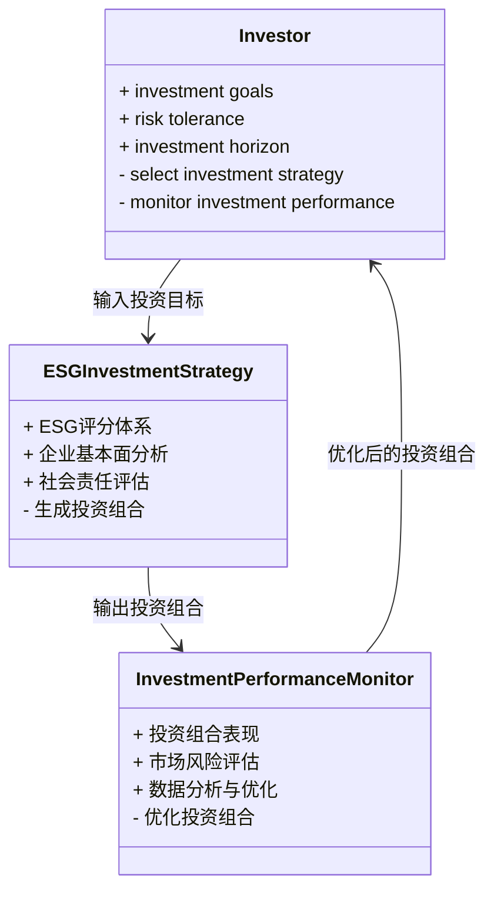
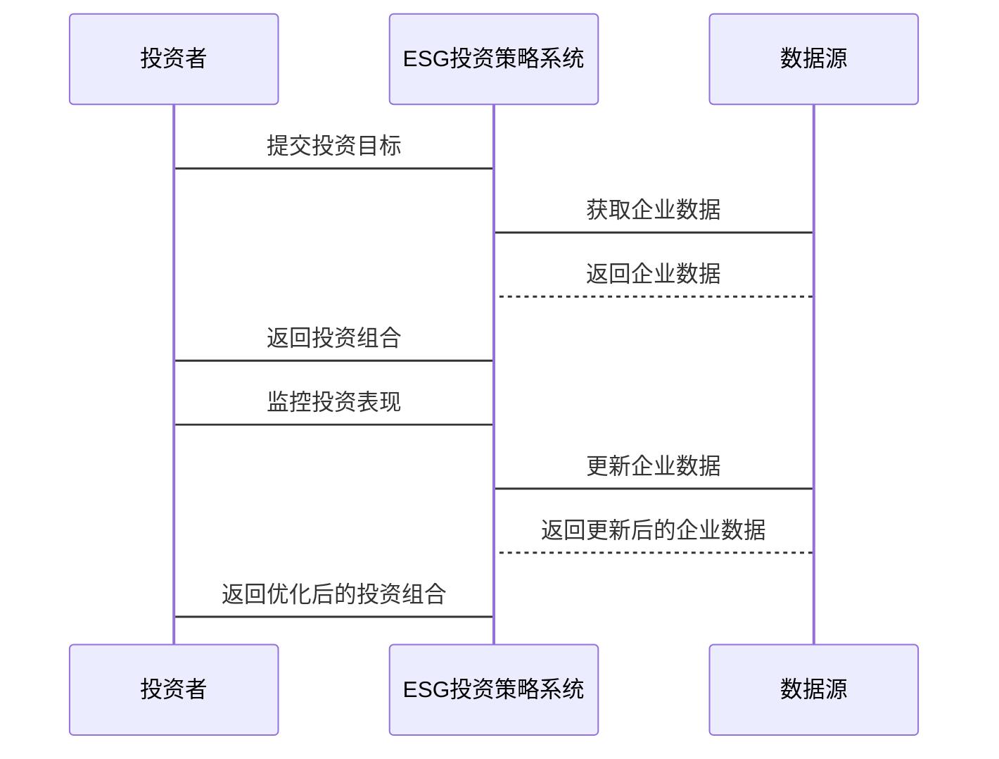

                 


# 巴菲特-芒格的ESG投资策略：平衡社会责任和财务回报

## 关键词：巴菲特, 芮格, ESG投资, 社会责任, 财务回报, 可持续投资, 价值投资

## 摘要：  
本文探讨了巴菲特和芒格的ESG投资策略，分析了如何在投资决策中平衡社会责任和财务回报。通过结合巴菲特的价值投资理念和芒格的多元思维模型，本文详细阐述了ESG投资的核心框架、实施步骤、财务回报与风险分析，以及系统设计与项目实战。文章旨在为投资者提供一个全面的视角，理解ESG投资的重要性，并通过实际案例和系统设计，帮助读者实现可持续的财务回报。

---

## 第一部分: 巴菲特-芒格的ESG投资策略概述

### 第1章: ESG投资策略的背景与概念

#### 1.1 ESG投资的基本概念

##### 1.1.1 什么是ESG投资
ESG投资是一种基于环境、社会和治理（Environmental, Social, Governance）三个维度的投资策略，旨在通过关注企业的可持续性表现来做出投资决策。  
- **环境（Environmental）**：关注企业在资源利用、碳排放、污染等方面的管理。  
- **社会（Social）**：关注企业在员工权益、社会责任、劳动条件等方面的表现。  
- **治理（Governance）**：关注企业在公司治理、董事会结构、透明度等方面的管理。  

##### 1.1.2 ESG投资的发展历程
ESG投资起源于20世纪60年代的“负面筛选”（Negative Screening），即通过排除不符合伦理或社会标准的公司来进行投资。随着全球对可持续发展的关注增加，ESG投资逐渐从单纯的道德投资演变为一种具有竞争力的投资策略。

##### 1.1.3 ESG投资的核心理念
ESG投资的核心理念是通过关注企业的长期可持续性，实现财务回报和社会价值的双赢。与传统投资相比，ESG投资更加注重企业的社会责任和长期发展潜力。

#### 1.2 巴菲特与芒格的投资哲学

##### 1.2.1 巴菲特的价值投资理念
巴菲特的价值投资理念强调“以合理的价格买入优秀的公司”。他认为，投资的核心在于企业本身的价值，而非短期市场波动。

##### 1.2.2 芮格的多元思维模型
芒格的多元思维模型强调跨学科思维的重要性。他认为，投资者需要从多个角度（如心理学、经济学、物理学等）来理解问题，从而做出更明智的投资决策。

##### 1.2.3 巴菲特与芒格投资理念的结合
巴菲特和芒格的投资理念在ESG投资中得到了完美的结合。巴菲特的价值投资理念与芒格的多元思维模型相结合，形成了以企业基本面分析和社会责任为核心的投资策略。

---

### 第2章: ESG投资策略的核心框架

#### 2.1 ESG的三个维度

##### 2.1.1 环境（Environmental）因素
环境因素关注企业在环境保护方面的表现，包括碳排放、资源利用效率、污染治理等方面。  
- **碳排放**：企业是否采取措施减少碳排放，是否符合国际环保标准。  
- **资源利用效率**：企业是否高效利用资源，是否采取循环利用策略。  

##### 2.1.2 社会（Social）因素
社会因素关注企业在社会责任方面的表现，包括员工权益、社区贡献、劳动条件等方面。  
- **员工权益**：企业是否保障员工的合法权益，是否提供公平的薪酬和福利。  
- **社区贡献**：企业是否积极参与公益活动，是否支持社区发展。  

##### 2.1.3 治理（Governance）因素
治理因素关注企业在公司治理方面的表现，包括董事会结构、透明度、内部控制等方面。  
- **董事会结构**：董事会是否多元化，是否具备专业能力。  
- **透明度**：企业是否公开财务信息和决策过程，是否具备透明的治理结构。  

#### 2.2 ESG评估的核心指标

##### 2.2.1 环境指标：碳排放、资源利用效率
环境指标是评估企业环境表现的重要标准。例如，碳排放强度（每单位产出的碳排放量）和资源利用效率（单位产出的资源消耗量）是常见的环境指标。

##### 2.2.2 社会指标：员工权益、社会责任
社会指标关注企业在员工权益和社会责任方面的表现。例如，员工满意度、员工培训投入、社会责任投入等。

##### 2.2.3 治理指标：公司治理结构、透明度
治理指标关注企业在公司治理结构和透明度方面的表现。例如，董事会独立性、管理层透明度、内部控制有效性等。

---

### 第3章: 巴菲特-芒格ESG投资策略的理论基础

#### 3.1 巴菲特的长期价值投资

##### 3.1.1 长期投资的重要性
长期投资是巴菲特价值投资的核心理念之一。他认为，短期市场波动无法决定企业的长期价值，只有通过长期持有优质资产才能实现财富增值。

##### 3.1.2 企业基本面分析
企业基本面分析是巴菲特评估企业价值的核心方法。他关注企业的盈利能力、财务健康状况、竞争优势等因素，以确定企业的内在价值。

##### 3.1.3 安全边际的概念
安全边际是指企业实际价值与其市场价格之间的差距。巴菲特认为，通过寻找具有安全边际的企业，可以降低投资风险并实现超额收益。

#### 3.2 芮格的多元思维模型

##### 3.2.1 跨学科思维的重要性
多元思维模型强调投资者需要从多个学科（如心理学、经济学、物理学等）的角度来理解问题。通过跨学科思维，投资者可以更好地识别风险和机会。

##### 3.2.2 如何应用多元思维模型进行投资决策
芒格认为，投资者应该将多元思维模型应用于投资决策中。例如，通过分析企业的财务数据、行业趋势、宏观经济环境等因素，综合评估企业的投资价值。

##### 3.2.3 芮格投资决策的案例分析
以伯克希尔哈撒韦的投资决策为例，芒格通过多元思维模型分析了企业的竞争优势、行业地位、财务健康状况等因素，最终做出了正确的投资决策。

---

### 第4章: ESG投资策略的实施步骤

#### 4.1 确定投资目标

##### 4.1.1 投资目标的设定
投资者需要明确自己的投资目标，包括投资期限、风险承受能力、收益预期等。  
- **投资期限**：长期投资更适合ESG投资，因为ESG因素的长期影响更显著。  
- **风险承受能力**：投资者需要根据自身的风险承受能力选择合适的ESG投资产品。  
- **收益预期**：ESG投资的收益预期应基于企业的长期可持续发展。

#### 4.2 企业筛选与评估

##### 4.2.1 ESG评分体系的应用
投资者可以通过ESG评分体系对企业进行筛选和评估。常见的ESG评分体系包括MSCI ESG评级、Sustainalytics评级等。  
- **MSCI ESG评级**：基于环境、社会和治理三个维度对企业进行评分，分为AAA、AA、A、BB、B、CCC六个等级。  
- **Sustainalytics评级**：基于环境、社会和治理三个维度对企业进行评分，分为Excellent、Good、Neutral、Weak、Poor五个等级。  

##### 4.2.2 企业治理结构的评估
投资者需要评估企业的治理结构，包括董事会独立性、管理层透明度、内部控制有效性等。  
- **董事会独立性**：董事会成员是否独立，是否具备专业能力。  
- **管理层透明度**：管理层是否公开透明地披露信息，是否具备良好的沟通能力。  

##### 4.2.3 社会责任履行情况的分析
投资者需要分析企业的社会责任履行情况，包括员工权益、社区贡献、环境保护等方面。  
- **员工权益**：企业是否保障员工的合法权益，是否提供公平的薪酬和福利。  
- **社区贡献**：企业是否积极参与公益活动，是否支持社区发展。  

#### 4.3 投资组合的构建

##### 4.3.1 资产配置的原则
投资者需要根据自身的投资目标和风险承受能力进行资产配置。常见的资产配置策略包括分散化投资、风险均衡投资等。  
- **分散化投资**：通过投资不同行业、不同地区的资产来降低风险。  
- **风险均衡投资**：根据风险承受能力调整资产配置比例。  

##### 4.3.2 行业分布的优化
投资者需要优化投资组合的行业分布，选择具有长期增长潜力的行业。例如，可再生能源、绿色科技、可持续农业等领域具有较高的ESG投资价值。

##### 4.3.3 风险分散的策略
投资者可以通过分散化投资来降低风险。例如，投资指数基金、ETF（交易所交易基金）等产品可以有效分散投资风险。

---

### 第5章: ESG投资的财务回报与风险分析

#### 5.1 ESG投资的财务回报

##### 5.1.1 长期视角下的回报表现
从长期来看，ESG投资的财务回报表现优于传统投资。研究表明，具有较高ESG评级的企业通常具有更高的股票回报率和更低的波动性。

##### 5.1.2 社会责任投资与财务绩效的关系
社会责任投资与财务绩效之间存在正相关关系。企业通过履行社会责任可以提升品牌形象、增强客户忠诚度、降低经营风险，从而实现更高的财务绩效。

##### 5.1.3 芮格投资策略的长期回报
巴菲特和芒格的投资策略以长期回报为导向。通过长期持有优质资产，伯克希尔哈撒韦实现了远超市场平均水平的投资回报。

#### 5.2 ESG投资的风险分析

##### 5.2.1 行业风险
不同行业具有不同的ESG风险。例如，化石能源行业面临较高的环境风险，而科技行业可能面临较高的治理风险。

##### 5.2.2 市场风险
ESG投资也面临市场风险。例如，短期市场波动可能对ESG投资的回报产生负面影响。

##### 5.2.3 数据风险
ESG数据的准确性和透明度可能影响投资决策。投资者需要选择可靠的ESG数据源和评估机构。

---

## 第二部分: 系统分析与架构设计方案

### 第6章: 系统分析与架构设计

#### 6.1 问题场景介绍

##### 6.1.1 投资者面临的挑战
投资者在进行ESG投资时需要考虑多个因素，包括企业基本面、社会责任、行业风险等。如何在复杂的市场环境中做出正确的投资决策是投资者面临的主要挑战。

#### 6.2 项目介绍

##### 6.2.1 项目目标
本项目旨在通过系统分析和架构设计，帮助投资者实现ESG投资的长期财务回报和社会价值。

#### 6.3 系统功能设计

##### 6.3.1 领域模型Mermaid类图


#### 6.4 系统架构设计

##### 6.4.1 系统架构Mermaid架构图
```mermaid
architecturalDiagram

    participant 投资者
    participant ESG投资策略系统
    participant 数据源

   投资者 --> ESG投资策略系统: 提交投资目标
    ESG投资策略系统 --> 数据源: 获取企业数据
    ESG投资策略系统 --> 投资者: 返回投资组合
    投资者 --> ESG投资策略系统: 监控投资表现
    ESG投资策略系统 --> 数据源: 更新企业数据
```

#### 6.5 系统接口设计

##### 6.5.1 接口描述
- **投资者接口**：投资者可以通过用户界面提交投资目标、监控投资表现、优化投资组合。  
- **数据源接口**：系统从第三方数据源获取企业数据，包括ESG评分、财务数据、行业信息等。  
- **系统接口**：系统根据投资者的投资目标和数据源提供的信息，生成投资组合并返回给投资者。

#### 6.6 系统交互设计

##### 6.6.1 系统交互Mermaid序列图


---

## 第三部分: 项目实战

### 第7章: 项目实战

#### 7.1 环境安装

##### 7.1.1 安装Python
```bash
python --version
pip install --upgrade pip
```

#### 7.2 系统核心实现源代码

##### 7.2.1 ESG投资策略实现代码
```python
def calculate_esg_score(company_data):
    # 计算环境得分
    environment_score = company_data['carbon_emission'] / company_data['revenue'] * 100
    # 计算社会得分
    social_score = (company_data['employee_welfare'] + company_data['community_contribution']) / 2 * 100
    # 计算治理得分
    governance_score = (company_data['board_independence'] + company_data['transparency']) / 2 * 100
    # 返回综合ESG评分
    return (environment_score + social_score + governance_score) / 3

# 示例数据
company_data = {
    'carbon_emission': 100,
    'revenue': 1000,
    'employee_welfare': 80,
    'community_contribution': 20,
    'board_independence': 70,
    'transparency': 80
}

esg_score = calculate_esg_score(company_data)
print(f"ESG综合评分: {esg_score}%")
```

#### 7.3 代码应用解读与分析

##### 7.3.1 代码功能解读
上述代码实现了一个简单的ESG评分计算功能。通过输入企业的环境、社会和治理数据，计算企业的综合ESG评分。

##### 7.3.2 代码优化建议
- **数据源扩展**：增加更多的数据源，例如员工满意度、客户忠诚度等。  
- **评分模型优化**：根据具体行业特点调整评分权重，例如对于环保行业，环境得分权重可以更高。  
- **动态更新**：实现数据的动态更新，确保评分结果反映最新的企业信息。

#### 7.4 实际案例分析和详细讲解剖析

##### 7.4.1 案例分析
以某 renewable energy company为例，计算其ESG评分：
```python
company_data = {
    'carbon_emission': 50,
    'revenue': 1000,
    'employee_welfare': 90,
    'community_contribution': 30,
    'board_independence': 80,
    'transparency': 90
}

esg_score = calculate_esg_score(company_data)
print(f"ESG综合评分: {esg_score}%")
```

##### 7.4.2 详细讲解剖析
通过上述案例分析，可以看出，该 renewable energy company在环境、社会和治理三个维度的表现均较为优秀。环境得分较高，说明企业在减少碳排放和资源利用方面表现突出。社会得分较高，说明企业在员工福利和社会责任方面表现良好。治理得分较高，说明企业在公司治理和透明度方面表现优异。

---

## 第四部分: 总结与展望

### 第8章: 总结与展望

#### 8.1 本章总结
本文详细探讨了巴菲特和芒格的ESG投资策略，分析了如何在投资决策中平衡社会责任和财务回报。通过结合巴菲特的价值投资理念和芒格的多元思维模型，本文为投资者提供了一个全面的ESG投资框架，包括核心概念、实施步骤、系统设计和项目实战等内容。

#### 8.2 未来展望
未来，ESG投资将继续在全球范围内得到广泛应用。随着技术的进步和数据的完善，ESG投资的评估方法和工具将更加精准和高效。投资者需要不断学习和适应，以应对不断变化的市场环境和投资需求。

---

## 作者：AI天才研究院/AI Genius Institute & 禅与计算机程序设计艺术 /Zen And The Art of Computer Programming

