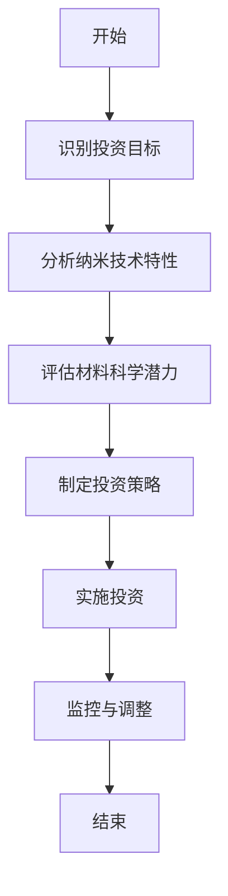
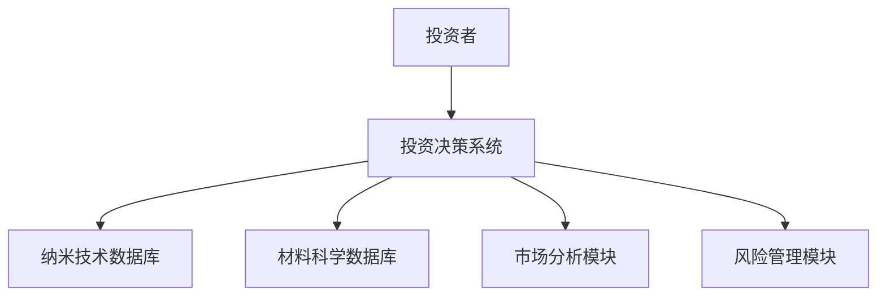

                 

# 巴菲特-芒格的可编程物质投资：纳米技术与材料科学的融合

---

## 关键词：
- 巴菲特，芒格，可编程物质，纳米技术，材料科学，价值投资，投资策略，技术融合，风险管理

---

## 摘要：
本文探讨了巴菲特和芒格的价值投资理念与新兴的可编程物质技术的结合。通过分析纳米技术与材料科学的融合，文章揭示了可编程物质在投资领域的潜力及其应用场景。文章从背景介绍、核心概念、算法原理、系统架构、项目实战等多方面展开，结合实际案例，深入剖析了可编程物质在投资决策中的优势与挑战，并提出了相应的风险管理策略和最佳实践建议。

---

### 目录大纲

---

# 巴菲特-芒格的可编程物质投资：纳米技术与材料科学的融合

---

## 第一章：巴菲特与芒格的投资哲学

### 1.1 巴菲特的价值投资理念
- 巴菲特的投资哲学概述
- 股价与内在价值的定义
- 安全边际的概念

### 1.2 芒格的多元思维模型
- 多元思维模型的核心思想
- 跨学科的思考方式
- 芒格的决策框架

### 1.3 可编程物质的定义与潜力
- 可编程物质的基本概念
- 纳米技术与材料科学的融合
- 可编程物质在投资中的应用前景

---

## 第二章：可编程物质的核心概念与属性

### 2.1 可编程物质的基本定义
- 可编程物质的定义
- 可编程物质的关键属性
- 可编程物质与传统材料的对比

### 2.2 纳米技术与材料科学的融合
- 纳米技术的基本原理
- 材料科学的核心概念
- 纳米技术与材料科学的交叉领域

### 2.3 可编程物质的属性与特征
- 可编程物质的可定制性
- 可编程物质的多功能性
- 可编程物质的可持续性

### 2.4 核心概念对比表
| 比较维度 | 传统材料 | 可编程物质 |
|----------|----------|------------|
| 结构     | 均质     | 多层次     |
| 功能     | 单一     | 多功能     |
| 可调性   | 低       | 高         |

### 2.5 本章小结

---

## 第三章：可编程物质的投资策略

### 3.1 价值投资与可编程物质的结合
- 价值投资的核心原则
- 可编程物质的市场定位
- 投资机会的识别

### 3.2 纳米技术与材料科学的商业应用
- 纳米材料在制造业中的应用
- 可编程物质在电子设备中的应用
- 纳米技术在医疗领域的潜力

### 3.3 投资策略的制定与实施
- 投资组合的构建
- 风险管理的策略
- 长期投资的规划

---

## 第四章：可编程物质的技术与算法原理

### 4.1 可编程物质的算法模型
- 算法模型的构建
- 算法的实现步骤
- 算法的优化与改进

### 4.2 纳米技术的数学建模
- 数学模型的建立
- 数学模型的求解
- 数学模型的应用

### 4.3 可编程物质的流程图设计

### 4.4 本章小结

---

## 第五章：可编程物质的系统架构与设计

### 5.1 系统功能设计
- 系统功能模块划分
- 功能模块的实现
- 功能模块的交互

### 5.2 系统架构设计

### 5.3 系统接口设计
- 系统接口的定义
- 接口的实现方式
- 接口的测试与优化

### 5.4 本章小结

---

## 第六章：可编程物质的项目实战

### 6.1 项目背景与目标
- 项目背景介绍
- 项目目标设定
- 项目范围界定

### 6.2 项目环境安装
- 系统环境要求
- 软件工具安装
- 数据库配置

### 6.3 项目核心实现
- 算法实现代码
- 系统功能实现
- 测试用例编写

### 6.4 项目案例分析
- 实际案例介绍
- 案例分析与解读
- 案例总结与反思

### 6.5 本章小结

---

## 第七章：可编程物质的投资风险管理

### 7.1 风险管理的必要性
- 风险管理的重要性
- 风险管理的目标
- 风险管理的策略

### 7.2 可编程物质的风险分析
- 技术风险
- 市场风险
- 经济风险

### 7.3 风险管理的具体措施
- 风险评估与控制
- 风险分散与对冲
- 风险监控与反馈

### 7.4 本章小结

---

## 第八章：总结与展望

### 8.1 全文总结
- 本文的核心内容
- 本文的主要结论
- 本文的创新点

### 8.2 未来展望
- 可编程物质的未来发展
- 纳米技术与材料科学的进一步融合
- 价值投资的新方向

### 8.3 注意事项
- 投资者需要注意的风险
- 投资者需要具备的技能
- 投资者需要关注的市场动态

### 8.4 拓展阅读
- 推荐阅读的书籍与文章
- 推荐学习的课程与培训
- 推荐关注的行业动态与趋势

---

## 作者：AI天才研究院/AI Genius Institute & 禅与计算机程序设计艺术 /Zen And The Art of Computer Programming

