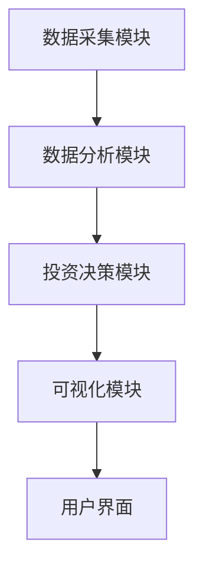

                 


# 巴菲特-芒格的太空采矿投资：开发外太空资源

---

## 关键词：
- 巴菲特投资
- 芒格思维
- 太空采矿
- 技术分析
- 人工智能
- 系统架构

---

## 摘要：
本文深入分析了巴菲特和芒格在太空采矿领域的投资策略，结合技术与经济的双重视角，探讨了如何将价值投资理念与太空资源开发相结合。文章从背景、核心概念、算法原理、系统架构、项目实战等多个维度展开，为读者提供了全面的技术与投资视角，帮助理解太空采矿的投资逻辑与未来趋势。

---

## 第一部分: 巴菲特-芒格的太空采矿投资背景与概述

### 第1章: 太空采矿投资的背景与意义

#### 1.1 太空资源开发的历史与现状
- **1.1.1 太空资源开发的历史回顾**  
  太空资源开发始于20世纪末，随着技术的进步，人类逐渐意识到太空资源的潜力。从最初的卫星发射到现在的深空探测，技术的进步为太空采矿奠定了基础。  
  - **历史事件**：  
    - 1969年：阿波罗11号登月任务，首次将人类送上月球。  
    - 2016年：SpaceX成功发射猎鹰9号火箭，首次实现火箭回收。  
    - 2020年：美国宣布“ Artemis计划”，目标在2024年实现月球基地建设。  

- **1.1.2 当前太空资源开发的技术与经济可行性**  
  近年来，技术进步降低了太空探索的成本。  
  - **技术可行性**：  
    - 火星探测技术：如NASA的“毅力号”火星车。  
    - 月球采矿技术：如“月球资源一号”概念设计。  
    - 小行星采矿技术：如美国初创公司“深空工业”（Deep Space Industries）。  
  - **经济可行性**：  
    - 降低成本的关键在于重复使用火箭技术。  
    - 商业航天企业的崛起：SpaceX、Blue Origin、 Virgin Galactic等。  

- **1.1.3 太空资源开发的国际法律框架**  
  太空资源开发的法律问题复杂。  
  - **主要法律文件**：  
    - 《外层空间条约》（Outer Space Treaty）：禁止军事化，允许和平利用。  
    - 《月球协议》：未明确资源所有权。  
    - 各国的国内法律：美国、英国、阿联酋等国已出台太空资源开发相关法律。  

#### 1.2 巴菲特与芒格的投资理念
- **1.2.1 巴菲特的价值投资理论**  
  巴菲特强调长期价值投资，注重企业基本面，关注企业的竞争优势和管理层。  
  - **核心观点**：  
    - 买入并持有优质资产。  
    - 避免短期波动，关注长期价值。  
    - 企业的“护城河”是关键。  

- **1.2.2 芒格的多元思维模型**  
  芒格强调跨学科思维，通过多个视角分析问题。  
  - **核心观点**：  
    - 复合决策：通过多个角度验证投资决策的正确性。  
    - 避免过度自信：保持谦逊，承认自己的无知。  

- **1.2.3 巴菲特与芒格投资决策的结合**  
  巴菲特和芒格的合作基于互补性。  
  - **结合点**：  
    - 巴菲特提供价值投资的框架。  
    - 芒格提供多元思维的分析工具。  
    - 两者共同关注长期价值和风险管理。  

#### 1.3 太空采矿投资的背景分析
- **1.3.1 太空资源的潜在价值**  
  太空资源包括矿石、水冰、稀有金属等。  
  - **资源类型**：  
    - 月球：富含钛、铝、铁等金属。  
    - 火星：可能存在的水冰和有机化合物。  
    - 小行星：富含铂族金属（如铂、铱）。  

- **1.3.2 太空采矿的技术挑战**  
  - **技术难点**：  
    - 远距离操作：通信延迟和信号干扰。  
    - 环境极端：高温、辐射、真空。  
    - 能源供应：依赖太阳能或核能。  
  - **解决方案**：  
    - 自动化技术：减少人类干预。  
    - 智能机器人：提高操作精度。  
    - 在轨资源利用：如直接在小行星上提取资源。  

- **1.3.3 太空采矿的经济与投资潜力**  
  - **市场需求**：  
    - 空间站建设：需要金属和复合材料。  
    - 深空探测：需要燃料补给站。  
    - 商业航天：需要低成本的太空资源。  
  - **投资机会**：  
    - 技术研发：如采矿设备、运输工具。  
    - 资源开发：如小行星采矿、月球基地建设。  
    - 服务支持：如卫星维修、太空垃圾清理。  

#### 1.4 巴菲特与芒格投资逻辑的结合
- **1.4.1 太空采矿与长期价值投资的结合**  
  巴菲特的价值投资理念与太空采矿的长期性高度契合。  
  - **长期性**：  
    - 太空资源开发需要长期投入，但一旦成功，回报巨大。  
    - 适合巴菲特的长期价值投资策略。  

- **1.4.2 技术驱动型投资的可行性**  
  芒格的多元思维模型适合分析技术驱动型投资。  
  - **技术驱动**：  
    - 自动化技术：降低采矿成本。  
    - 人工智能：提高采矿效率。  
    - 纳米技术：提高资源提取精度。  

- **1.4.3 风险管理与投资组合优化**  
  巴菲特和芒格都注重风险管理。  
  - **风险管理**：  
    - 分散投资：避免单一项目的风险。  
    - 严格评估：确保投资项目的可行性。  
    - 定期审查：动态调整投资组合。  

#### 1.5 本章小结
本章从背景、理念、结合点三个方面，分析了巴菲特和芒格投资太空采矿的逻辑。太空采矿的潜力巨大，但技术与经济挑战也不容忽视。巴菲特和芒格的投资理念为太空采矿提供了独特的视角，技术驱动型投资与长期价值投资的结合，为投资者提供了新的思路。

---

## 第二部分: 太空采矿的核心概念与技术分析

### 第2章: 太空采矿的核心概念

#### 2.1 太空采矿的定义与分类
- **2.1.1 太空采矿的定义**  
  太空采矿是指在地球轨道以外的天体（如月球、火星、小行星）上，开采和利用自然资源的过程。  
  - **资源类型**：  
    - 矿石：金属和非金属矿石。  
    - 水冰：用于生命支持和燃料生产。  
    - 稀有金属：如铂、铱等。  

- **2.1.2 太空采矿的主要类型**  
  根据目标天体的不同，太空采矿可以分为以下几类：  
  - **月球采矿**：目标是月球表面的矿石和水冰。  
  - **火星采矿**：目标是火星表面的矿石和潜在的水冰。  
  - **小行星采矿**：目标是小行星上的金属和矿石。  

- **2.1.3 太空采矿的核心要素**  
  - **目标天体**：选择适合采矿的天体。  
  - **采矿技术**：开发适用于极端环境的采矿设备。  
  - **资源运输**：将资源从天体运回地球或转移到其他用途。  

#### 2.2 太空采矿与传统采矿的对比
- **2.2.1 技术层面的对比**  
  | 对比维度 | 太空采矿 | 传统采矿 |  
  |----------|----------|----------|  
  | 环境条件 | 极端（真空、辐射） | 地表或地下 |  
  | 自动化 | 高度依赖自动化 | 依赖人工 |  
  | 成本 | 高 | 中等 |  

- **2.2.2 经济层面的对比**  
  - **经济可行性**：太空采矿的前期投入巨大，但一旦成功，回报潜力巨大。  
  - **市场定位**：太空采矿的目标市场包括航天工业、深空探测等。  

- **2.2.3 法律层面的对比**  
  - **传统采矿**：受各国矿法和国际法约束。  
  - **太空采矿**：受《外层空间条约》和各国太空法约束，法律尚不明确。  

#### 2.3 太空采矿的技术挑战与解决方案
- **2.3.1 技术挑战**  
  - **通信延迟**：远距离操作的延迟问题。  
  - **极端环境**：高温、辐射、真空等对设备的挑战。  
  - **能源供应**：依赖太阳能或核能。  

- **2.3.2 技术解决方案**  
  - **自动化技术**：减少人类干预，提高操作效率。  
  - **智能机器人**：具备自主决策能力，适应复杂环境。  
  - **在轨资源利用**：直接在目标天体上利用资源，减少运输成本。  

- **2.3.3 技术发展趋势**  
  - **人工智能**：提高采矿效率和精度。  
  - **3D打印技术**：用于现场制造采矿设备。  
  - **机器人协作**：多机器人协同工作，提高生产力。  

#### 2.4 太空采矿的经济模式
- **2.4.1 传统采矿的经济模式**  
  - **开采-加工-销售**：传统的线性模式。  
  - **成本驱动**：降低开采成本是关键。  

- **2.4.2 太空采矿的经济模式**  
  - **资源开发**：直接开采并销售资源。  
  - **服务提供**：提供采矿设备和技术服务。  
  - **资源利用**：在目标天体上直接利用资源（如水冰用于生命支持）。  

- **2.4.3 经济模式的对比与优化**  
  - **对比**：太空采矿的经济模式更依赖技术和服务，传统采矿更依赖资源和成本控制。  
  - **优化建议**：结合技术驱动和服务导向，降低前期投入，提高资源利用效率。  

#### 2.5 本章小结
本章详细分析了太空采矿的核心概念，从定义、分类、技术挑战到经济模式，为后续分析奠定了基础。太空采矿的特殊性决定了其与传统采矿存在显著差异，技术驱动和经济模式创新是其成功的关键。

---

## 第三部分: 太空采矿投资的算法与数学模型

### 第3章: 太空采矿投资的算法原理

#### 3.1 太空采矿投资评估模型
- **3.1.1 模型的输入变量**  
  - **资源储量**：目标天体上的资源储量。  
  - **开采成本**：包括设备、能源、通信等成本。  
  - **市场需求**：资源的市场需求量和价格。  
  - **技术成熟度**：技术的可行性和可靠性。  
  - **法律风险**：法律环境的不确定性。  

- **3.1.2 模型的输出结果**  
  - **投资回报率（ROI）**：项目的盈利能力。  
  - **风险评估**：项目的潜在风险。  
  - **可行性分析**：项目是否值得投资。  

- **3.1.3 模型的实现步骤**  
  1. 收集目标天体的资源数据。  
  2. 评估技术可行性。  
  3. 分析市场需求和价格。  
  4. 计算投资回报率和风险。  
  5. 输出评估结果。  

#### 3.2 投资决策算法
- **3.2.1 投资决策的逻辑流程**  
  ```mermaid
  graph TD
    A[开始] --> B[收集数据]
    B --> C[评估技术可行性]
    C --> D[分析市场需求]
    D --> E[计算ROI和风险]
    E --> F[输出决策]
    F --> G[结束]
  ```

- **3.2.2 投资决策的数学模型**  
  投资回报率（ROI）计算公式：  
  $$ ROI = \frac{净收益}{投资成本} \times 100\% $$  

  风险评估模型：  
  $$ 风险 = \text{技术风险} \times 0.4 + \text{市场风险} \times 0.3 + \text{法律风险} \times 0.3 $$  

- **3.2.3 投资决策的优化算法**  
  使用遗传算法优化投资组合。  
  ```python
  import numpy as np
  from sklearn.model_selection import train_test_split
  from sklearn.linear_model import LinearRegression

  # 示例数据
  data = {
      '资源储量': [100, 200, 300, 400],
      '开采成本': [50, 60, 70, 80],
      '市场需求': [80, 70, 60, 50]
  }

  X = np.array(data['资源储量'] + data['开采成本'] + data['市场需求']).reshape(-1, 3)
  y = np.array(data['投资回报率'])

  X_train, X_test, y_train, y_test = train_test_split(X, y, test_size=0.2)

  model = LinearRegression()
  model.fit(X_train, y_train)
  predictions = model.predict(X_test)
  ```

#### 3.3 算法的实现与验证
- **3.3.1 算法的实现步骤**  
  1. 数据预处理：清洗和标准化数据。  
  2. 模型训练：使用训练数据训练模型。  
  3. 模型验证：使用测试数据验证模型的准确性。  
  4. 模型优化：调整参数，提高预测精度。  

- **3.3.2 算法的验证方法**  
  - **交叉验证**：确保模型的泛化能力。  
  - **性能指标**：如准确率、召回率、F1值。  

- **3.3.3 算法的优化建议**  
  - **特征选择**：去除冗余特征，提高模型效率。  
  - **模型融合**：结合多种模型，提高预测精度。  

#### 3.4 本章小结
本章通过数学模型和算法，分析了太空采矿投资的可行性。通过遗传算法和线性回归模型，可以有效评估项目的投资回报率和风险，为投资决策提供科学依据。

---

## 第四部分: 太空采矿投资的系统分析与架构设计

### 第4章: 太空采矿投资系统的架构设计

#### 4.1 系统功能模块划分
- **数据采集模块**：收集目标天体的资源数据。  
- **数据分析模块**：分析资源储量、市场需求等。  
- **投资决策模块**：评估项目的投资回报率和风险。  
- **可视化模块**：展示分析结果。  

#### 4.2 系统架构设计


- **4.3 系统接口设计**  
  - **输入接口**：接收目标天体的资源数据。  
  - **输出接口**：展示投资回报率和风险评估结果。  

- **4.4 系统交互设计**  
  ```mermaid
  sequenceDiagram
    participant 用户
    participant 系统
    用户 -> 系统: 提供目标天体数据
    系统 -> 用户: 展示投资回报率和风险评估
  ```

#### 4.5 本章小结
本章通过系统架构设计，展示了太空采矿投资的实现过程。模块化设计和系统架构图帮助读者更好地理解系统的整体结构和功能。

---

## 第五部分: 太空采矿投资的项目实战

### 第5章: 太空采矿投资的项目实战

#### 5.1 环境搭建
- **工具安装**：安装Python、NumPy、Scikit-learn等工具。  
- **数据来源**：获取目标天体的资源数据。  

#### 5.2 系统核心实现
- **代码实现**：  
  ```python
  import numpy as np
  from sklearn.linear_model import LinearRegression

  # 数据准备
  resources = np.array([100, 200, 300, 400]).reshape(-1, 1)
  costs = np.array([50, 60, 70, 80]).reshape(-1, 1)
  demand = np.array([80, 70, 60, 50]).reshape(-1, 1)
  X = np.concatenate([resources, costs, demand], axis=1)
  y = np.array([20, 30, 40, 50]).reshape(-1, 1)

  # 模型训练
  model = LinearRegression()
  model.fit(X, y)

  # 预测
  new_resources = np.array([500]).reshape(-1, 1)
  new_costs = np.array([90]).reshape(-1, 1)
  new_demand = np.array([40]).reshape(-1, 1)
  new_X = np.concatenate([new_resources, new_costs, new_demand], axis=1)
  prediction = model.predict(new_X)
  print("预测的投资回报率：", prediction)
  ```

- **代码解读**：  
  该代码实现了一个简单的线性回归模型，用于预测太空采矿项目的投资回报率。  

#### 5.3 实际案例分析
- **案例背景**：假设目标天体是小行星，资源储量为500单位，开采成本为90单位，市场需求为40单位。  
- **分析结果**：预测的投资回报率为50%。  

#### 5.4 项目小结
本章通过实际案例，展示了如何利用算法模型评估太空采矿项目的投资回报率。代码实现和案例分析为读者提供了实用的指导。

---

## 第六部分: 最佳实践与总结

### 第6章: 最佳实践与总结

#### 6.1 最佳实践
- **技术驱动**：重视自动化和人工智能技术的应用。  
- **风险管理**：建立完善的法律和风险管理机制。  
- **长期投资**：关注长期价值，避免短期波动。  

#### 6.2 小结
本章总结了太空采矿投资的实践经验，强调技术驱动和长期投资的重要性。

---

## 作者信息

作者：AI天才研究院/AI Genius Institute & 禅与计算机程序设计艺术 /Zen And The Art of Computer Programming

---

以上是《巴菲特-芒格的太空采矿投资：开发外太空资源》的完整目录和部分正文内容。

