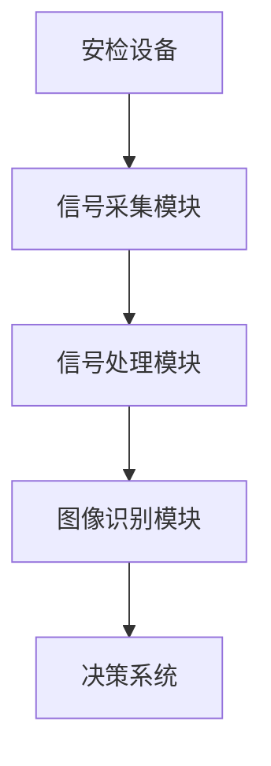
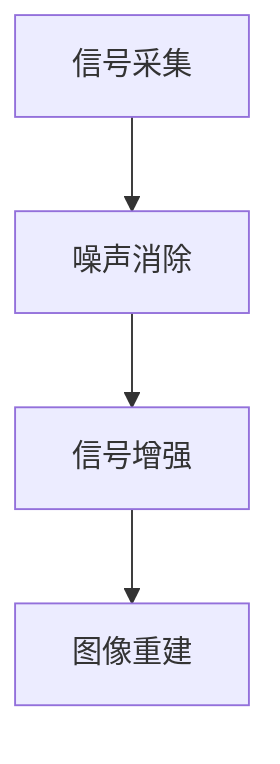
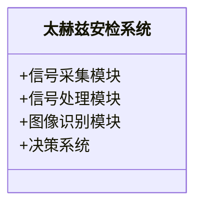

                 


# 巴菲特-芒格的太赫兹成像技术投资：安全检查的新标准

---

## 关键词：太赫兹成像技术，巴菲特，芒格，投资理念，安全检查，技术标准

---

## 摘要：  
本文探讨了如何将巴菲特和芒格的投资理念应用于太赫兹成像技术的开发与投资，提出了这一技术在安全检查领域的新标准。通过分析太赫兹成像技术的原理、算法、系统架构以及实际应用案例，结合巴菲特-芒格的投资哲学，本文旨在为安全检查领域提供一种创新的技术投资和应用方案。

---

## 正文

### 第1章: 背景介绍

#### 1.1 太赫兹成像技术的基本概念

太赫兹成像技术是一种利用太赫兹波（介于毫米波和红外波之间的电磁波）进行成像的技术。其核心优势在于：  
1. **非电离辐射**：对人体和物体无害。  
2. **高分辨率**：能够捕捉到毫米级的细节。  
3. **穿透性强**：可以穿透常见材料，如塑料、纸张、衣物等。  

#### 1.2 巴菲特-芒格投资理念概述

巴菲特和芒格的投资理念强调：  
1. **长期价值**：寻找具有长期增长潜力的领域。  
2. **安全边际**：确保投资的安全性，避免高风险。  
3. **多元思维模型**：结合多个学科的思维方式，全面评估投资标的。  

#### 1.3 太赫兹成像技术与投资理念的结合

通过将太赫兹成像技术的高分辨率和穿透性与巴菲特-芒格的投资哲学结合，我们可以：  
1. **优化安全检查流程**：利用太赫兹成像技术的特性，提高安检效率和准确性。  
2. **降低投资风险**：通过长期价值评估，选择具有技术优势的企业进行投资。  

---

### 第2章: 太赫兹成像技术的核心概念与联系

#### 2.1 太赫兹成像技术的原理

**信号处理流程**：  
1. **信号采集**：利用天线接收太赫兹波信号。  
2. **噪声消除**：通过滤波器去除背景噪声。  
3. **图像重建**：利用算法将信号转换为图像。  

**数学模型**：  
$$ f(t) = \sum_{i=1}^{n} a_i e^{-t/\tau_i} $$  
其中，$a_i$ 和 $\tau_i$ 分别表示信号的幅度和时间常数。

#### 2.2 太赫兹成像技术与传统成像技术的对比

| 特性               | 太赫兹成像技术                 | 传统X射线成像技术               |
|--------------------|-------------------------------|---------------------------------|
| 穿透性             | 高                           | 低                             |
| 分辨率             | 高                           | 中                             |
| 安全性             | 非电离辐射                   | 电离辐射                       |

#### 2.3 太赫兹成像技术在安全检查中的应用架构



---

### 第3章: 太赫兹成像技术的算法原理

#### 3.1 太赫兹信号处理的算法流程



#### 3.2 太赫兹图像识别的算法实现

**分类算法选择**：  
$$ P(y|x) = \prod_{i=1}^{n} P(x|y_i)P(y_i) $$  
其中，$P(y_i)$ 是先验概率，$P(x|y_i)$ 是似然函数。

**代码实现**：
```python
import numpy as np
from sklearn.neighbors import KNeighborsClassifier

# 示例数据
X = np.random.rand(100, 2)
y = np.random.randint(0, 2, 100)

# KNN分类器
knn = KNeighborsClassifier(n_neighbors=3)
knn.fit(X, y)

# 预测
new_data = np.array([[0.5, 0.5]])
print(knn.predict(new_data))  # 输出预测结果
```

---

### 第4章: 系统分析与架构设计方案

#### 4.1 项目介绍

太赫兹成像技术的安全检查系统旨在通过高分辨率成像和非电离辐射特性，提升安检效率和安全性。

#### 4.2 系统功能设计



#### 4.3 系统架构设计


---

### 第5章: 项目实战

#### 5.1 环境安装

安装Python和必要的库：
```bash
pip install numpy matplotlib scikit-learn
```

#### 5.2 核心代码实现

```python
import numpy as np
import matplotlib.pyplot as plt

# 生成太赫兹信号
t = np.linspace(0, 10, 100)
signal = np.exp(-t / 2)  # 示例信号

# 噪声处理
noise = np.random.normal(0, 0.1, 100)
clean_signal = signal + noise

# 绘制信号图
plt.figure(figsize=(10, 6))
plt.plot(t, clean_signal, label='Clean Signal')
plt.xlabel('Time (s)')
plt.ylabel('Amplitude')
plt.legend()
plt.show()
```

---

### 第6章: 最佳实践与总结

#### 6.1 总结

太赫兹成像技术结合巴菲特-芒格的投资理念，为安全检查领域提供了新的技术标准。其高分辨率和非电离辐射特性使其在安检中具有巨大潜力。

#### 6.2 注意事项

1. **技术选择**：确保技术的安全性和可靠性。  
2. **投资策略**：结合长期价值和安全边际进行投资。  
3. **持续优化**：定期更新系统和算法，提升性能。  

---

## 作者  
作者：AI天才研究院

