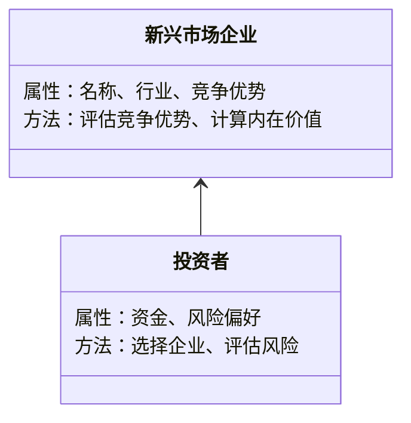
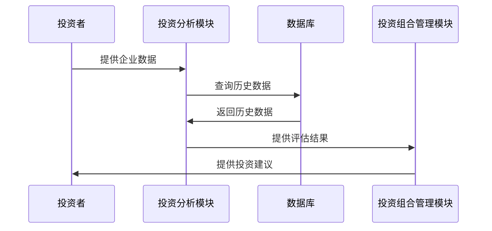

                 


# 巴菲特-芒格的新兴市场投资策略：机遇与风险的平衡

## 关键词：
- 巴菲特，芒格，新兴市场，投资策略，风险平衡，价值投资，竞争优势，财务分析，风险管理

## 摘要：
本文深入探讨了巴菲特和芒格的投资理念在新兴市场中的应用，重点分析了如何在新兴市场中平衡机遇与风险。通过系统的理论分析、案例研究和实际操作指南，本文为投资者提供了在新兴市场中运用巴菲特-芒格策略的详细指导。

---

# 第一部分：巴菲特与芒格的投资理念

## 第1章：巴菲特与芒格的背景与投资哲学

### 1.1 巴菲特的投资理念概述

#### 1.1.1 巴菲特的投资理念定义
巴菲特的投资理念以价值投资为核心，强调以合理价格投资于具备持续竞争优势的企业。他相信长期投资和复利效应的重要性。

#### 1.1.2 巴菲特的价值投资三要素
1. **价格合理**：买入价格低于内在价值。
2. **竞争优势明显**：企业具备持久的竞争优势。
3. **管理团队可靠**：管理层诚信且有能力。

### 1.2 芮格的多元思维模型

#### 1.2.1 多元思维模型的定义
芒格提倡通过多个学科的视角来分析问题，避免单一思维的局限性。

#### 1.2.2 多元思维模型的应用
1. **跨学科分析**：结合经济学、心理学、物理学等多学科知识。
2. **决策优化**：通过多角度思考，提高决策的准确性。

### 1.3 巴菲特与芒格投资理念的异同

| 方面       | 巴菲特                          | 芮格                          |
|------------|--------------------------------|--------------------------------|
| 核心理念   | 价值投资，注重企业内在价值     | 多元思维模型，注重全局分析     |
| 投资策略   | 买入并持有，长期投资           | 逆向思维，寻找市场错误定价     |
| 风险管理   | 以安全边际为核心               | 通过多元思维识别潜在风险       |

---

## 第2章：新兴市场的特点与投资机遇

### 2.1 新兴市场的定义与分类

#### 2.1.1 新兴市场的定义
新兴市场指经济快速发展、市场机制逐步完善但尚未完全成熟的国家或地区，如中国、印度等。

#### 2.1.2 新兴市场的分类
1. **按经济规模**：分为大型新兴市场（如中国）和小型新兴市场（如越南）。
2. **按行业特点**：分为制造业驱动型和服务业驱动型。

### 2.2 新兴市场的投资机遇

#### 2.2.1 高增长潜力
新兴市场的GDP增长率通常高于发达市场，为企业提供了快速扩张的机会。

#### 2.2.2 未被充分挖掘的市场潜力
新兴市场中许多行业尚未饱和，具备较大的增长空间。

#### 2.2.3 新兴市场的独特投资机会
1. **技术创新**：新兴市场企业在技术上的追赶和创新提供了投资机会。
2. **消费升级**：随着中产阶级的扩大，消费市场潜力巨大。

### 2.3 新兴市场的风险与挑战

#### 2.3.1 政治风险
新兴市场国家的政策变化和政治稳定性可能对企业投资产生重大影响。

#### 2.3.2 经济波动风险
新兴市场的经济波动较大，容易受到外部冲击（如全球经济衰退）的影响。

#### 2.3.3 市场流动性风险
新兴市场中的某些行业或企业可能面临流动性不足的问题。

---

## 第3章：新兴市场的竞争优势分析

### 3.1 企业竞争优势的定义与评估标准

#### 3.1.1 企业竞争优势的定义
竞争优势指企业在市场上相对于竞争对手的独特优势，包括技术、成本、品牌等方面。

#### 3.1.2 评估竞争优势的关键指标
1. **市场份额**：企业在市场中的占有率。
2. **利润率**：企业的盈利能力。
3. **研发投入**：技术创新能力的体现。

### 3.2 新兴市场中的竞争优势案例

#### 3.2.1 技术创新型企业
例如，中国的科技企业在人工智能、5G等领域的竞争优势。

#### 3.2.2 规模经济型企业
例如，印度的大型制造业企业通过规模化生产降低成本。

#### 3.2.3 品牌影响力型企业
例如，新兴市场的本土品牌在本地市场的强大影响力。

---

## 第4章：巴菲特-芒格策略在新兴市场的应用

### 4.1 投资策略的定义与分类

#### 4.1.1 投资策略的定义
投资策略是投资者在不同市场环境下采取的具体方法和步骤。

#### 4.1.2 主流投资策略的分类
1. **价值投资**：寻找被市场低估的企业。
2. **成长投资**：投资于高增长潜力的企业。
3. **指数投资**：通过投资指数基金分散风险。

### 4.2 巴菲特-芒格策略的核心要素

#### 4.2.1 企业竞争优势分析
巴菲特和芒格强调投资于具备持续竞争优势的企业。

#### 4.2.2 企业财务健康状况评估
关注企业的财务状况，确保其具备稳健的财务基础。

#### 4.2.3 管理团队的质量与稳定性
优秀的管理团队是企业长期成功的关键因素。

---

## 第5章：新兴市场的风险管理

### 5.1 新兴市场的风险因素

#### 5.1.1 政治风险
新兴市场国家的政治稳定性可能影响投资。

#### 5.1.2 经济波动风险
经济周期波动对新兴市场的影响较大。

#### 5.1.3 市场流动性风险
部分新兴市场的流动性不足可能增加投资风险。

### 5.2 新兴市场的投资风险控制

#### 5.2.1 风险评估与分散投资
通过多元化投资降低单一市场的风险。

#### 5.2.2 风险对冲策略
利用金融工具（如期货、期权）进行风险对冲。

#### 5.2.3 风险管理的心理因素
投资者需保持理性，避免情绪化决策。

---

## 第6章：新兴市场的案例分析

### 6.1 中国市场的巴菲特-芒格策略

#### 6.1.1 中国的经济增长潜力
中国作为世界第二大经济体，具备巨大的增长潜力。

#### 6.1.2 中国企业竞争优势
例如，阿里巴巴在电子商务领域的竞争优势。

### 6.2 印度市场的投资机会

#### 6.2.1 印度的高增长行业
信息技术、制药等行业的投资潜力。

#### 6.2.2 印度市场的风险管理
关注印度的政治和经济政策变化。

---

## 第7章：系统分析与架构设计

### 7.1 系统功能设计

#### 7.1.1 领域模型（mermaid类图）


#### 7.1.2 系统架构设计（mermaid架构图）


### 7.2 系统接口设计

#### 7.2.1 投资分析模块接口
1. 输入：企业财务数据、市场数据。
2. 输出：企业价值评估、风险评估。

#### 7.2.2 投资组合管理模块接口
1. 输入：投资者风险偏好。
2. 输出：投资组合建议。

### 7.3 系统交互设计（mermaid序列图）


---

## 第8章：项目实战

### 8.1 环境安装

```bash
# 安装Python和相关库
pip install numpy pandas matplotlib
```

### 8.2 核心实现代码

```python
import numpy as np
import pandas as pd

# 定义财务指标计算函数
def calculate_finance_ratios(financial_data):
    # 计算市盈率
    pe_ratio = financial_data['市盈率']
    # 计算市净率
    pb_ratio = financial_data['市净率']
    # 返回结果
    return {'市盈率': pe_ratio, '市净率': pb_ratio}

# 示例数据
financial_data = {
    '市盈率': 15,
    '市净率': 2
}

# 调用函数计算财务指标
result = calculate_finance_ratios(financial_data)
print(result)
```

### 8.3 代码解读

1. **函数定义**：`calculate_finance_ratios`函数接收财务数据并计算市盈率和市净率。
2. **示例数据**：定义了一个包含市盈率和市净率的字典。
3. **函数调用**：调用函数并打印结果。

### 8.4 实际案例分析

假设我们投资于一家新兴市场的科技公司，其财务数据如下：
- 市盈率：20
- 市净率：3

通过上述代码计算，我们可以得出该公司的市盈率为20，市净率为3，表明其估值相对合理。

---

## 第9章：总结与展望

### 9.1 总结

本文详细探讨了巴菲特和芒格的投资理念在新兴市场中的应用，强调了竞争优势分析和风险管理的重要性。通过系统分析和实际案例，为投资者提供了在新兴市场中平衡机遇与风险的策略。

### 9.2 展望

未来，随着新兴市场的进一步发展，巴菲特-芒格策略的应用将更加广泛。投资者需持续关注市场变化，灵活调整投资策略，以应对新兴市场的复杂挑战。

---

## 作者信息

作者：AI天才研究院 & 禅与计算机程序设计艺术

---

以上是完整的文章内容，涵盖了从理论到实践的各个方面，确保读者能够全面理解巴菲特-芒格新兴市场投资策略的核心思想和实际应用。

