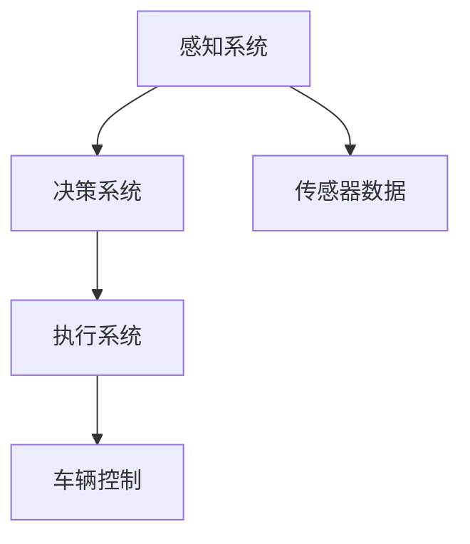

                 


# 巴菲特-芒格的无人驾驶技术投资：交通革命的前夜

---

## 关键词
无人驾驶技术、巴菲特、芒格、投资分析、交通革命、人工智能

---

## 摘要
无人驾驶技术正在改变全球交通行业，巴菲特和芒格的投资策略为这一技术的商业化提供了重要视角。本文从投资哲学、技术原理、市场前景、企业影响等多维度分析无人驾驶技术的投资价值，探讨巴菲特和芒格如何通过长期主义和多元思维模型，捕捉这一交通革命的机遇。文章结合技术细节与商业分析，为投资者和技术创新者提供深度见解。

---

## 第一部分：投资哲学与无人驾驶技术的结合

### 第1章：巴菲特与芒格的投资哲学

#### 1.1 巴菲特的价值投资理念
巴菲特的“价值投资”强调以合理价格买入具有持续竞争优势的企业。他关注企业的长期盈利能力、财务健康状况和管理团队的质量。在无人驾驶技术领域，巴菲特的投资逻辑是寻找那些能够持续创新、在行业中占据领先地位的企业。

#### 1.2 芒格的多元思维模型
芒格提倡“多元思维模型”，即通过跨学科的视角分析问题。他认为，任何单一领域的知识都是片面的，必须将多个领域的知识结合起来才能做出明智决策。在无人驾驶技术投资中，芒格会从技术、法律、经济等多个角度评估企业的潜力。

#### 1.3 巴菲特与芒格的合作模式
巴菲特和芒格的合作基于长期的信任和互补性。巴菲特注重企业的基本面分析，而芒格则注重企业的创新能力和潜在风险。两人通过相互补充，构建了一个稳健的投资策略。

---

### 第2章：无人驾驶技术的背景与发展

#### 2.1 无人驾驶技术的定义与发展
无人驾驶技术（Autonomous Driving）是指通过先进的传感器、人工智能算法和车辆控制系统，使车辆能够在不需要人类干预的情况下完成行驶任务。从20世纪初的概念提出，到21世纪的技术突破，无人驾驶技术经历了漫长的发展历程。

#### 2.2 无人驾驶技术的核心技术
无人驾驶技术的核心包括：
- **传感器技术**：如激光雷达（LiDAR）、摄像头、雷达等，用于感知周围环境。
- **车载计算平台**：高性能计算单元，用于处理传感器数据和执行决策。
- **人工智能算法**：如深度学习、强化学习，用于处理复杂场景和做出驾驶决策。

#### 2.3 无人驾驶技术的市场前景
根据市场研究机构预测，到2030年，全球无人驾驶市场的规模将达到数万亿美元。各国政府也在积极推动无人驾驶技术的商业化，相关政策和法规不断完善。

---

### 第3章：无人驾驶技术的投资价值分析

#### 3.1 技术成熟度与市场潜力
无人驾驶技术的成熟度直接影响其投资价值。当前，技术仍处于发展初期，但其潜在市场巨大。投资者需要关注技术的商业化进程和企业的技术优势。

#### 3.2 投资风险与风险管理
无人驾驶技术的投资风险包括技术风险、政策风险和市场风险。投资者需要通过多元化投资、严格的风险评估和长期跟踪，降低投资风险。

#### 3.3 巴菲特与芒格的投资策略
巴菲特和芒格在无人驾驶技术投资中，注重企业的长期价值和竞争优势。他们倾向于投资那些在技术、市场和管理方面具有显著优势的企业。

---

## 第二部分：无人驾驶技术的系统分析与架构设计

### 第4章：无人驾驶技术的核心算法

#### 4.1 无人驾驶算法的分类
无人驾驶算法主要分为：
- **路径规划算法**：如A*算法、RRT算法，用于规划车辆行驶路径。
- **目标识别算法**：如YOLO、Faster R-CNN，用于识别道路中的障碍物和目标。
- **决策控制算法**：如模糊控制、强化学习，用于做出驾驶决策。

#### 4.2 无人驾驶算法的数学模型
以路径规划算法为例，A*算法的目标是最小化路径长度和路径风险。其数学模型如下：

$$
f(n) = g(n) + h(n)
$$

其中，$g(n)$表示从起点到节点n的已知成本，$h(n)$表示从节点n到目标的估计成本。

#### 4.3 算法实现的代码示例
以下是一个简单的路径规划算法（A*）的Python实现：

```python
import heapq

def a_star_algorithm(start, goal, grid):
    open_heap = []
    heapq.heappush(open_heap, (0, start))
    came_from = {}
    g_cost = {start: 0}
    f_cost = {start: 0}

    while open_heap:
        current = heapq.heappop(open_heap)
        current_cost = current[0]
        if current[1] == goal:
            break
        for neighbor in grid[current[1]]:
            tentative_g_cost = g_cost.get(neighbor, float('inf'))
            new_g_cost = current_cost + 1
            if new_g_cost < tentative_g_cost:
                came_from[neighbor] = current[1]
                g_cost[neighbor] = new_g_cost
                f_cost[neighbor] = new_g_cost + heuristic(neighbor, goal)
                heapq.heappush(open_heap, (f_cost[neighbor], neighbor))
    return came_from
```

---

### 第5章：无人驾驶技术的系统架构设计

#### 5.1 系统功能设计
无人驾驶系统主要包括：
- **感知系统**：通过传感器感知周围环境。
- **决策系统**：基于感知数据做出驾驶决策。
- **执行系统**：执行决策指令，控制车辆行驶。

#### 5.2 系统架构设计
以下是一个无人驾驶系统的架构图：



#### 5.3 系统接口设计
无人驾驶系统需要与车辆、道路基础设施和其他交通参与者进行交互。主要接口包括：
- **车辆接口**：控制方向盘、油门和刹车。
- **道路接口**：获取道路信息和交通信号。
- **网络接口**：与其他车辆和交通系统通信。

---

## 第三部分：无人驾驶技术的商业应用与投资机会

### 第6章：无人驾驶技术的商业应用

#### 6.1 自动驾驶出租车
无人驾驶技术的应用之一是自动驾驶出租车（Robotaxis）。通过共享出行平台，企业可以提供高效的出行服务，降低运营成本。

#### 6.2 物流配送
无人驾驶技术在物流配送领域的应用也非常广泛，如亚马逊的无人配送车和美团的无人配送小车。

#### 6.3 智能交通系统
无人驾驶技术可以与智能交通系统结合，优化交通流量，减少拥堵和事故发生。

---

### 第7章：无人驾驶技术的投资机会与风险

#### 7.1 投资机会
无人驾驶技术的商业化前景广阔，投资者可以关注以下领域：
- **技术供应商**：如芯片制造商、传感器制造商。
- **服务提供商**：如自动驾驶出租车公司。
- **软件开发商**：如自动驾驶算法公司。

#### 7.2 投资风险
无人驾驶技术的投资风险包括：
- **技术风险**：技术尚未完全成熟，可能面临技术瓶颈。
- **政策风险**：政策法规的不确定性可能影响商业化进程。
- **市场风险**：市场竞争激烈，可能导致收益下降。

---

## 第四部分：总结与展望

### 第8章：无人驾驶技术的未来展望

#### 8.1 技术进步
未来，无人驾驶技术将更加智能化和普及化。人工智能算法的不断优化和传感器技术的提升，将推动无人驾驶技术的发展。

#### 8.2 投资策略
投资者需要根据市场变化和技术进步，调整投资策略。长期来看，无人驾驶技术的投资价值巨大，但需要谨慎评估风险。

---

## 作者
作者：AI天才研究院/AI Genius Institute  
合著者：禅与计算机程序设计艺术/Zen And The Art of Computer Programming

---

# 结语
无人驾驶技术正在引领一场交通革命，巴菲特和芒格的投资哲学为这一技术的商业化提供了重要视角。通过技术分析和商业分析，投资者可以更好地把握无人驾驶技术的投资机会，实现长期稳健的投资回报。

