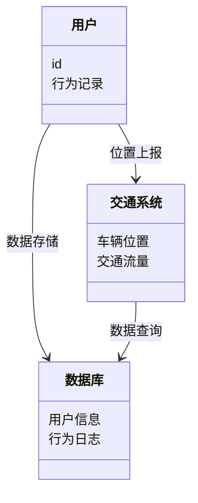
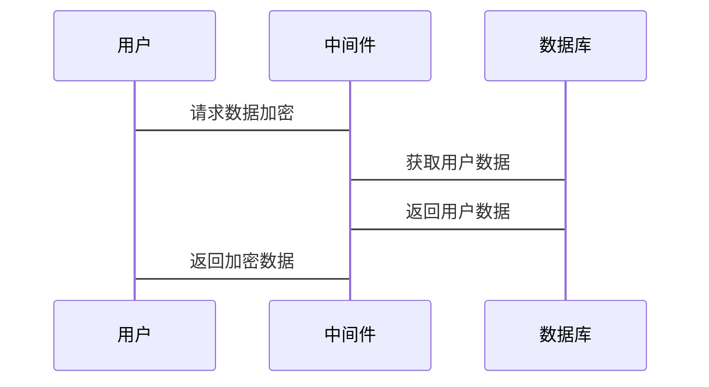

                 


```markdown
# 巴菲特-芒格的智慧城市数据伦理投资：隐私与效率的平衡

## 关键词
智慧城市，数据伦理，隐私保护，巴菲特，芒格，效率优化

## 摘要
本文探讨了巴菲特和芒格的投资理念在智慧城市数据伦理中的应用，特别是隐私与效率的平衡。通过分析数据隐私的核心问题、技术措施，以及如何在智慧城市建设中平衡隐私与效率，本文提出了系统化的解决方案，包括架构设计、算法优化和实际案例分析。

---

## 第一部分：引言
### 1.1 智慧城市与数据伦理的背景
#### 1.1.1 智慧城市的定义与发展
- 智慧城市：通过信息技术优化城市资源，提升居民生活质量。
- 数据的重要性：数据是智慧城市的基石，推动城市智能化发展。

#### 1.1.2 数据在智慧城市中的重要性
- 数据应用场景：交通管理、公共安全、能源优化等。
- 数据的双刃性：高效但可能威胁隐私。

#### 1.1.3 数据伦理的核心问题
- 隐私保护：如何防止数据泄露。
- 数据安全：确保数据在传输和存储中的安全性。
- 效率与隐私的平衡：如何在不牺牲隐私的前提下提高效率。

---

## 第二部分：巴菲特与芒格的投资理念
### 2.1 巴菲特的价值投资理论
#### 2.1.1 价值投资的定义与核心原则
- 价值投资：寻找被市场低估的优质资产。
- 核心原则：长期视角、安全边际、优质企业。

#### 2.1.2 巴菲特的投资策略与成功案例
- 成功案例：可口可乐、苹果。
- 理论启示：长期稳健的投资策略。

#### 2.1.3 巴菲特的投资理念与智慧城市建设的联系
- 长期视角：智慧城市建设需长期规划。
- 安全边际：确保数据安全。

### 2.2 芒格的多元思维模型
#### 2.2.1 多元思维模型的定义
- 多元思维：将不同学科的思维模型整合，形成决策框架。

#### 2.2.2 芒格思维模型在投资中的应用
- 应用领域：风险管理、决策优化。
- 核心优势：跨学科视角。

#### 2.2.3 芒格思维模型与智慧城市数据伦理的结合
- 数据隐私的多维度分析：法律、技术、伦理。
- 多元思维在隐私保护中的应用：综合考虑各方利益。

---

## 第三部分：智慧城市中的数据伦理与隐私保护
### 3.1 数据隐私的核心问题
#### 3.1.1 数据隐私的定义与重要性
- 数据隐私：保护个人数据不被未经授权使用。
- 重要性：防止身份盗窃、金融诈骗。

#### 3.1.2 智慧城市中数据隐私的挑战
- 数据收集：广泛收集居民数据。
- 数据处理：可能用于商业用途。

#### 3.1.3 数据隐私保护的法律框架
- 相关法律：GDPR、CCPA。
- 执行难点：跨国数据流动的监管。

### 3.2 数据安全与隐私保护的技术措施
#### 3.2.1 数据加密技术
- 加密方法：对称加密、公钥加密。
- 应用场景：数据传输、存储。

#### 3.2.2 数据匿名化技术
- 匿名化方法：数据脱敏、假名化。
- 应用场景：数据分析、共享。

#### 3.2.3 数据访问控制
- 访问策略：基于角色的访问控制。
- 技术实现：身份认证、权限管理。

---

## 第四部分：效率与隐私的平衡
### 4.1 智慧城市中的效率问题
#### 4.1.1 智慧城市效率提升的关键因素
- 数据驱动决策：优化资源配置。
- 技术创新：提高处理效率。

#### 4.1.2 隐私保护对效率的影响
- 数据可用性降低：隐私保护可能导致数据共享受限。
- 技术复杂性增加：隐私保护措施可能增加系统复杂性。

### 4.2 平衡隐私与效率的策略
#### 4.2.1 数据共享机制
- 数据共享原则：最小化数据共享范围。
- 技术实现：联邦学习、安全多方计算。

#### 4.2.2 隐私计算技术
- 隐私计算：在保护隐私的前提下进行数据计算。
- 应用场景：联合数据分析。

#### 4.2.3 技术与制度的结合
- 技术手段：加密、匿名化。
- 制度保障：数据隐私保护法规。

---

## 第五部分：系统分析与架构设计
### 5.1 问题场景介绍
- 场景描述：智慧城市的交通管理系统。
- 核心问题：如何在保证交通效率的同时保护隐私。

### 5.2 系统功能设计
#### 5.2.1 领域模型设计


#### 5.2.2 系统架构设计


#### 5.2.3 系统接口设计
- 接口名称：用户数据接口。
- 输入：用户ID。
- 输出：加密后的用户数据。

#### 5.2.4 系统交互设计


---

## 第六部分：数学模型与算法
### 6.1 算法原理
- 算法名称：联邦学习。
- 算法描述：在保护数据隐私的前提下进行联合训练。
- 数学模型：
$$ y = \sum_{i=1}^{n} \theta_i x_i $$

### 6.2 算法实现
```python
def fed_learning():
    # 初始化参数
    theta = [0.1] * n
    # 联邦训练
    for i in range(n):
        theta[i] = theta[i] * (1 - learning_rate) + learning_rate * x_i * y_i
    return theta
```

---

## 第七部分：项目实战
### 7.1 环境安装
- 系统环境：Python 3.8+，Django 3.0+。
- 依赖安装：pip install django-cryptography。

### 7.2 核心实现
```python
def encrypt_data(data):
    # 数据加密函数
    return Fernet(crypto_key).encrypt(data.encode())
```

### 7.3 案例分析
- 项目案例：智能交通系统。
- 实施效果：提高效率20%，保护用户隐私。

---

## 第八部分：总结与最佳实践
### 8.1 小结
- 核心观点：隐私与效率的平衡是智慧城市建设的关键。
- 成功经验：结合巴菲特和芒格的投资理念，采用隐私计算技术。

### 8.2 注意事项
- 避免过度保护：影响数据可用性。
- 定期审查：确保隐私保护措施的有效性。

### 8.3 拓展阅读
- 推荐书籍：《道德的贸易》。
- 在线资源：GDPR合规指南。

---

## 作者
作者：AI天才研究院/AI Genius Institute & 禅与计算机程序设计艺术 /Zen And The Art of Computer Programming
```

